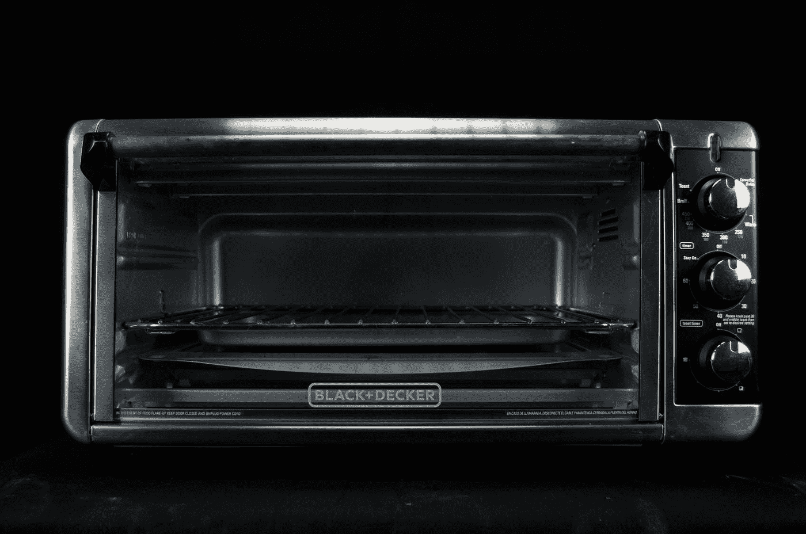
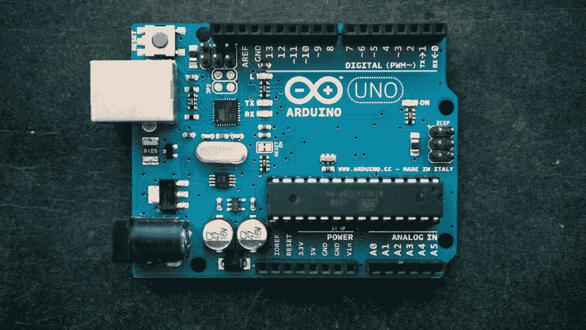
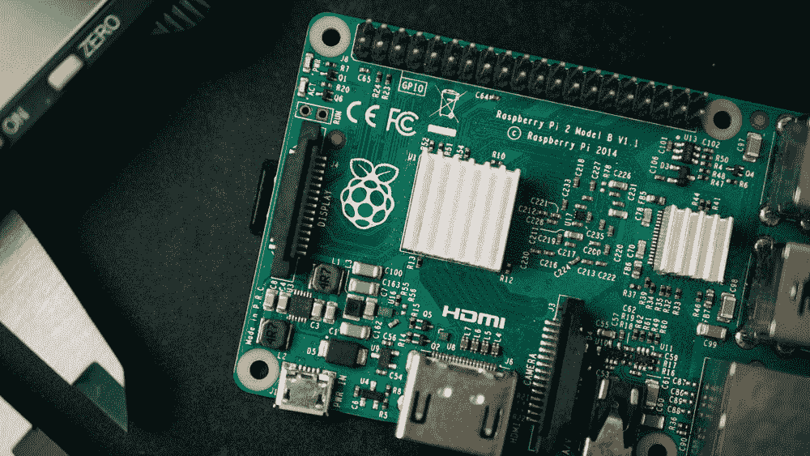
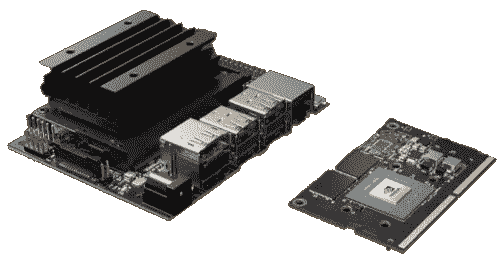
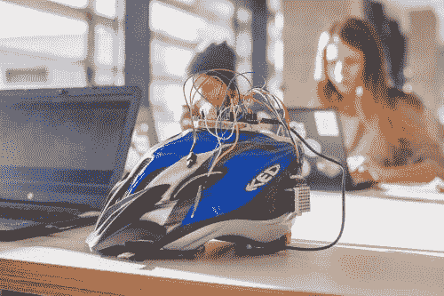
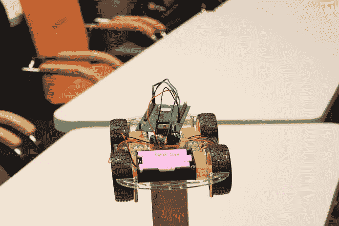
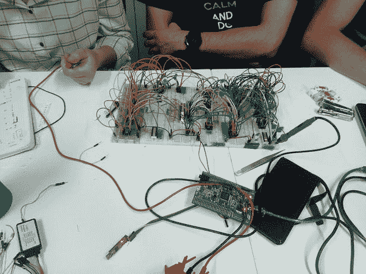
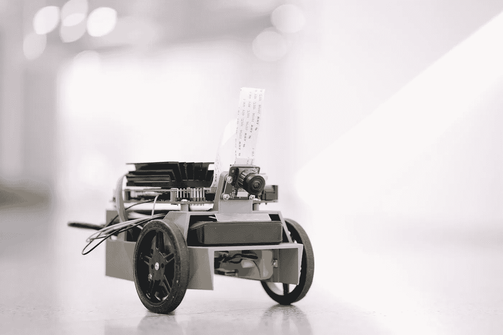

# 机器学习在嵌入式系统上是失败的。原因如下

> 原文：<https://towardsdatascience.com/machine-learning-fails-when-it-comes-to-embedded-system-9ce6def9ba75?source=collection_archive---------6----------------------->

## 思考不同

## 深入了解嵌入式世界以及 ML 行业目前还不能解决的问题

丹尼尔·威德罗在 [Unsplash](https://unsplash.com?utm_source=medium&utm_medium=referral) 上的照片

今天，中文学习达到了顶峰，最终被广泛使用。你可以在机场看到人脸识别系统，在脸书看到个性化的广告。

虽然，当我们谈到**将 ML 与嵌入式设备**相结合时，仍然有**相当大的差距**。

# 1.我们不明白嵌入式世界是什么

使用 ML，我们曾经拥有巨大的计算能力。

> AlexNet 需要 727 MegaFlops 和 235Mb 内存来处理一个 227x227px 的小图像。例如，谷歌 Nexus S 上的 ARM Cortex-A8 每秒可以产生 66 兆次浮点运算。所以，你要等~11 秒才能推断。太多了！
> 
> **FLOP —浮点运算*

***查看更多信息*** : [对各种 CNN](https://github.com/albanie/convnet-burden)和[ARM 内核浮点性能及其效率](https://iopscience.iop.org/article/10.1088/1742-6596/681/1/012049/pdf)的内存消耗和 FLOP 计数的估计。

我在大学里学过几门与 ML 相关的课程。我们做了很多很酷的作业。但即使在那里，我的 4GB GTX1050 **也不足以**训练所有的模型。

理解问题是制造正确产品的关键

一般 ML 工程师**很少考虑计算资源**。而且，他/她**很少关心内存使用**。为什么？因为它很便宜，甚至你的手机有很好的 CPU 和很大的内存。

提到上次聚会的照片，你还会觉得手机内存不足吗？假设您使用具有 256KB 闪存的 TrueTouch 感应控制器。是的，256KB。由于现有的固件，你不能使用所有这些。大约 100KB。看看你最后的型号。可能要大得多。

变得有趣了吗？我们继续:)

> 听到“嵌入式设备”你会怎么想？想象这幅画，并把它记在心里。

## 1.它是任何电动机械。甚至我的微波炉和洗衣机

马科斯·拉米雷斯在 [Unsplash](https://unsplash.com?utm_source=medium&utm_medium=referral) 上的照片

*是的，你是对的！*

**如今，几乎所有的电子设备都是嵌入式设备。它内部可能有一个或几个控制器，负责每个确切的功能:触摸感应、发动机状态监控等。**

## 2.Arduino 或/和树莓派

哈里森·布罗德本特在 Unsplash 上拍摄的照片

恭喜你，你又答对了！

它们是 DIY 项目中最受欢迎和广泛使用的工具包之一。是的，它们是嵌入式设备。

## 3.杰特森纳米和类似产品

英伟达照片

*又对了。*

这是一个特殊的开发工具包“又名迷你电脑”，专为在其上运行 ML 模型而开发。它非常强大，说实话，超级性感。

# 但是这里遗漏了一些东西

我有许多朋友正在做令人难以置信的硬件宠物项目。他们那里一般用 Arduino 或者 STM32(又名硬核 Arduino)。

智能头盔、机器人汽车和 ALU

我认识几个人工智能工程师，他们对 Jetson Nano 和类似的设备感到兴奋。他们认为这是嵌入式人工智能的未来。

英伟达照片

> 而现在。请想一想“这样的设备有多少是用在生产层面的？”

# 答案是——微小

想想你家里有多少电器设备。然后在你的车里增加大量的控制器。你工作中的安全系统。我可以列出一个很长的清单。

且每个设备都有一些控制器。通常，它是微型的，而且超级便宜。不能和杰特森或者树莓的资源和能力相比。

> 想象你有一个微控制器。它的主要任务是处理你在屏幕上的手指触摸。它有 ARM Cortex-M0 处理器，256KB 内存(其中只有 80–120 可供您使用)。这是一个实时系统，所以你有很少的时间来为你的模型做出推断，比如说 100 微秒。你的目标是改进或替换那里的一些算法。
> 
> 祝你好运，欢迎来到“嵌入式人工智能”的世界。

## ***嵌入式世界”由 1-2 美元的芯片组成，资源有限。这是在生产层面上使用的***

# 2.纯基础设施

我一直在做我上面描述的项目。一切都很好。我开发了一个小型网络，它有可能适合那个微控制器。

马蒂·林恩·巴恩斯在 [Unsplash](https://unsplash.com?utm_source=medium&utm_medium=referral) 上拍摄的照片

**将模型从我的电脑转移到设备的时间已经开始了！**

1.  **量化。**

那个处理器不能处理浮点数。即使可以，我们也不会使用它，因为这是一个相当复杂的操作，需要很多时间。

所以，我做了模型权重**量化**——将连续范围的值转换成有限范围的离散值。

你猜怎么着？PyTorch 和 TensorflowLite 都不完全支持。它们不支持所有激活功能(虽然我使用了非常简单的 HardTanh)。PyTorch 甚至无法将量化模型保存到文件中。

所以，我只能用手来做。

**2。推理代码生成**

您希望在该控制器上运行您的模型。对吗？所以，你需要 *C 代码*进行模型推断。

很悲哀，但你必须用手去做。为什么？PyTorch 没有推理代码生成的功能。相比之下，TFLite 有，但是它非常有限，也不支持常见的激活功能。

所以，我又用手做了一次。

我在工作中遇到过很多这样的情况。不是往 PyTorch 或者 TF 这边一拳，而是“呼救”。

## * * *社区还有另外一面，那就是在找“*嵌入式 AI”的专业工具，*却找不到。***

# 有什么好消息吗？

我看到大型半导体公司对人工智能有巨大的兴趣，他们正在做非常有价值和重要的事情。它们值得再写一篇文章，所以我列出了几个，以免这篇文章太长。

*   CMS is-NN——面向 Arm Cortex-M 处理器的高效神经网络内核
*   编译器可以产生高效的推理代码，并根据您所拥有的硬件进行优化
*   还有很多其他很酷的东西

照片由[艾哈迈德·哈桑](https://unsplash.com/@carsive?utm_source=medium&utm_medium=referral)在 [Unsplash](https://unsplash.com?utm_source=medium&utm_medium=referral) 上拍摄

觉得这篇文章有用？看看下面另一篇有趣的文章

 [## 我们需要数学吗？想象一下我们没有它的生活

### 没有数学的世界之旅，以及为什么抽象是一切的关键

medium.com](https://medium.com/swlh/do-we-need-math-imagine-our-life-without-it-c458fda152b3)