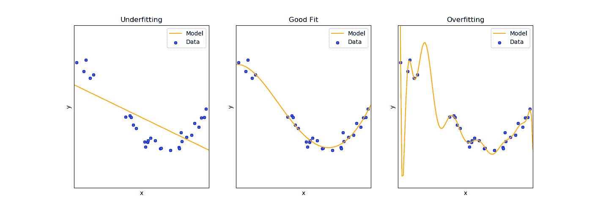

# 机器学习领域指南

> 原文：<https://towardsdatascience.com/machine-learning-field-guide-726989c928a1?source=collection_archive---------66----------------------->

## 没有 BS 指南和概述机器学习(真相)，从开始到结束，垃圾到黄金

我们都必须处理数据，我们试图了解机器学习并将其应用到我们的项目中。但是大家好像都忘了一件事…远非完美，还有*那么多要经历*！别担心，我们会从头到尾讨论每一个小步骤👀。

你所需要的就是[这些基础知识](https://www.kamwithk.com/the-complete-coding-practitioners-handbook-ck9u1vmgv03kg7bs1e5zwit2z)


*照片由* [*国立癌症研究所*](https://unsplash.com/photos/pCqzMe04s8g) *上传于 Unsplash*

# 这一切背后的故事

我们都是从一个数据集或一个目标开始的。一旦[我们发现、收集或搜集了我们的数据](https://www.kamwithk.com/zero-to-hero-data-collection-through-web-scraping-ck78o0bmg08ktd9s1bi7znd19)，我们就把它拉起来，目睹无情的数字细胞、更多的数字、类别，也许还有一些单词的压倒性景象😨！一个天真的想法闪过我们的脑海，用我们的机器学习能力来处理这一团乱麻…但是快速搜索揭示了我们在训练模型之前需要考虑的大量任务😱！

一旦我们克服了难以控制的数据带来的冲击，我们就会想方设法与强大的对手作战🤔。我们从尝试将数据导入 Python 开始。理论上是比较简单的，但是过程可以稍微……*涉及*。然而，只需要一点点努力(幸运的我们)。

没有浪费任何时间，我们开始*数据清理*去伪存真。我们的方法从简单开始——观察并移除。它工作了几次，但后来我们意识到…它真的对我们不公平！为了处理这些混乱，我们找到了一个强大的工具来补充我们的武器库:图表！通过我们的图表，我们可以对我们的数据、数据中的模式以及缺失的地方有所了解。我们可以*内插*(填充)或删除缺失的数据。

最后，我们接近我们高度期待的😎挑战，数据建模！稍加研究，我们就能发现哪些战术和模型是常用的。这是一个有点困难的破译，我们应该使用哪个，但我们仍然设法通过它，并把它都搞清楚了！

但是，如果不做一些令人印象深刻的事情，我们就无法完成一个项目。所以，一个最终的产品，一个网站，一个 app，甚至一个报告，都会带我们走很远！我们知道第一印象很重要，所以我们修复了 GitHub 库，并确保一切都有很好的记录和解释。现在，我们终于能够向世界展示我们的辛勤工作了😎！

# 时代

## 第 1 章—导入数据

数据有各种各样的形状和大小，所以我们用来把所有东西编码的过程经常是不同的。

> 说实在的，导入数据看起来很容易，但是有时候……有点讨厌。

数据清理最难的部分不是编码或理论，而是我们的准备工作！当我们第一次开始一个新项目并下载我们的数据集时，打开一个代码编辑器并开始输入是很诱人的…但是这不会给我们带来任何好处。如果我们想领先一步，我们需要为数据中最好和最差的部分做好准备。要做到这一点，我们需要从 basic 开始，通过手动检查我们的电子表格。一旦我们理解了数据的基本格式(文件类型以及任何细节)，我们就可以将它们全部导入 Python。

如果我们运气好，只有一个电子表格，我们可以使用 Pandas `[read_csv](https://pandas.pydata.org/pandas-docs/stable/reference/api/pandas.read_csv.html)`函数(让它知道我们的数据在哪里):

```
pd.read_csv("file_path.csv")
```

事实上，我们会遇到更复杂的情况，所以请注意:

*   包含不需要的信息的文件(我们需要跳过)
*   我们只想导入几列
*   我们想重命名我们的列
*   数据包括日期
*   我们希望将来自多个来源的数据合并到一个地方
*   数据可以分组在一起

> 尽管我们在讨论一系列场景，但我们通常一次只处理几个。

我们的前几个问题(导入数据的特定部分/重命名列)很容易处理，只需使用几个参数，如要跳过的行数、要导入的特定列以及我们的列名:

```
pd.read_csv("file_path.csv", skiprows=5, usecols=[0, 1], names=["Column1", "Column2"])
```

每当我们的数据分布在多个文件中时，我们可以使用 Pandas `[concat](https://pandas.pydata.org/pandas-docs/stable/reference/api/pandas.concat.html)`函数将它们组合起来。`[concat](https://pandas.pydata.org/pandas-docs/stable/reference/api/pandas.concat.html)`函数将一系列`[DataFrame](https://pandas.pydata.org/pandas-docs/stable/reference/api/pandas.DataFrame.html)`组合在一起:

```
my_spreadsheets = [pd.read_csv("first_spreadsheet.csv"), pd.read_csv("second_spreadsheet.csv")]
pd.concat(my_spreadsheets, ignore_index=True)
```

我们解析到`[concat](https://pandas.pydata.org/pandas-docs/stable/reference/api/pandas.concat.html)`一个电子表格列表(就像之前一样导入)。当然，列表可以通过任何方式获得(所以一个奇特的列表理解或者每个文件的随意列表都可以)，但是请记住**我们需要的是数据帧，而不是文件名/路径**！

如果我们没有 CSV 文件，熊猫仍然工作！我们可以用*把* `[read_csv](https://pandas.pydata.org/pandas-docs/stable/reference/api/pandas.read_csv.html)`换成`[read_excel](https://pandas.pydata.org/pandas-docs/stable/reference/api/pandas.read_excel.html)`、`[read_sql](https://pandas.pydata.org/pandas-docs/stable/reference/api/pandas.read_sql.html)`或者另一个[选项](https://pandas.pydata.org/pandas-docs/stable/user_guide/io.html)。

在所有数据都在 Pandas 数据框架中之后，我们需要再次检查数据的格式是否正确。实际上，这意味着检查每个 series 数据类型，并确保它们不是通用对象。我们这样做是为了确保我们可以利用 Pandas 内置的数字、分类和日期/时间值功能。来看看这刚刚运行的`DataFrame.dtypes`。如果输出看起来合理(例如，数字是数字，类别是分类的，等等)，那么我们应该可以继续。然而，通常情况并非如此，因为我们需要改变我们的数据类型！熊猫`[DataFrame.astype](https://pandas.pydata.org/pandas-docs/stable/reference/api/pandas.DataFrame.astype.html)`可以做到这一点。如果这不起作用，应该有另一个熊猫函数用于特定的转换:

```
data["Rating"] = data["Rating"].as_type("category")
data["Number"] = pd.to_numeric(data["Number"])
data["Date"] = pd.to_datetime(data["Date"])
data["Date"] = pd.to_datetime(data[["Year", "Month", "Day", "Hour", "Minute"]])
```

如果我们需要分析不同的数据组(例如，我们的数据可能是按国家划分的)，我们可以使用 Pandas `groupby`。我们可以使用`groupby`来选择特定的数据，并分别对每个组运行函数:

```
data.groupby("Country").get_group("Australia")
data.groupby("Country").mean()
```

*其他更适合的技巧，如多重/分层索引，在特定场景中也有帮助，但是理解和使用起来更棘手。*

## 第 2 章—数据清理

数据是有用的，数据是必要的，但是，它*需要干净并且切中要害*！如果我们的数据无处不在，那么它对我们的机器学习模型根本没有任何用处。

> 每个人都会被丢失的数据逼疯，但隧道的尽头总会有一线光明。

完成数据清理最简单快捷的方法是问我们自己:

> 我们数据中的哪些特征会影响我们的最终目标？

所谓最终目标，我们指的是我们正在努力预测、分类或分析的任何变量。这一点是为了缩小我们的范围，而不是陷入无用的信息。


*照片由* [*亚当·诺瓦克斯基*](https://unsplash.com/photos/D4LDw5eXhgg) *在 Unsplash* 上拍摄

一旦我们知道我们的主要目标特征是什么，我们就可以尝试找到模式、关系、缺失数据等等。一个简单而直观的方法就是绘图！快速使用 Pandas 勾画出数据集中的每个变量，并尝试查看每个变量的位置。

一旦我们发现了潜在的问题，或者数据中的趋势，我们就可以尝试解决它们。一般来说，我们有以下选择:

*   删除丢失的条目
*   删除整列数据
*   填写缺失的数据条目
*   对数据进行重新采样(即改变分辨率)
*   收集更多信息

从识别丢失的数据到选择如何处理它，我们需要考虑它如何影响我们的最终目标。对于缺失的数据，我们删除任何似乎对最终结果没有重大影响的数据(即，我们找不到有意义的模式)，或者似乎*缺失太多而无法得出值*。有时，我们还决定删除非常少量的缺失数据(因为这比填充数据更容易)。

如果我们决定摆脱信息，熊猫`[DataFrame.drop](https://pandas.pydata.org/pandas-docs/stable/reference/api/pandas.DataFrame.drop.html)`可以被使用。它从数据帧中删除列或行。这很容易使用，但是记住默认情况下 **Pandas 不会修改/删除源数据帧中的数据**，所以必须指定`inplace=True`。注意到`axis`参数指定是否移除行或列可能是有用的。

当不删除一整列时，或者特别针对丢失的数据时，依靠一些漂亮的 Pandas 函数通常是有用的。为了删除空值，可以使用`DataFrame.dropna`。请记住，默认情况下，`dropna`会完全删除所有丢失的值。然而，将参数`how`设置为`all`或者设置阈值(`thresh`，表示需要删除多少空值)可以对此进行补偿。

如果我们有少量的不规则缺失值，我们可以用几种方法来填充它们。最简单的是`DataFrame.fillna`，它将缺失值设置为某个预设值。更复杂但灵活的选择是使用`DataFrame.interpolate`进行插值。插值本质上允许任何人简单地设置他们想要用来替换每个空值的*方法*。这些包括上一个/下一个值、线性值和时间值(后两个值根据数据进行推断)。无论何时与时间打交道，时间都是一个自然的选择，否则就要根据插值的数据量及其复杂程度做出合理的选择。

```
data["Column"].fillna(0, inplace=True)
data[["Column"]] = data[["Column"]].interpolate(method="linear")
```

*如上所述，需要在一个只包含丢失数据的列的数据帧中传递插值*(否则将抛出错误)。

每当我们看到定期丢失的数据或使用不同时标的多个数据源时(如确保可以合并以分钟和小时为单位的测量值)，重采样就非常有用。直观地理解重采样可能有点困难，但当您对特定时间范围内的测量值进行平均时，这是非常重要的。例如，我们可以通过指定要获取每月值的平均值来获取每月值:

```
data.resample("M").mean()
```

`"M"`代表月份，可以替换为`"Y"`代表年份和其他选项。

尽管数据清理过程可能相当具有挑战性，但是如果我们记住我们最初的意图，它将成为一个更加合理和直接的任务！如果我们仍然没有所需的数据，我们可能需要回到第一阶段，收集更多的数据。*请注意，丢失数据表明数据收集存在问题，因此仔细考虑并记下出现问题的位置非常有用。*

*为了完成，熊猫* `[*unique*](https://pandas.pydata.org/pandas-docs/stable/reference/api/pandas.Series.unique.html)` *和* `[*value_counts*](https://pandas.pydata.org/pandas-docs/stable/reference/api/pandas.Series.value_counts.html)` *函数有助于决定直接移除哪些特征以及绘制/研究哪些特征。*

## 第 3 章——视觉化

观想听起来很简单，事实也确实如此，但是很难做到……*不过分复杂*。对我们来说，把情节看作是创造的苦差事实在是太容易了。然而，这些坏男孩做了一件非常非常好的事情——直观地展示了我们数据的内部工作原理！请记住:

> 我们用图表数据来发现和解释一切是如何工作的。

因此，当陷入想法，或不太确定该做什么时，我们基本可以总是依靠**识别有用的模式和有意义的关系**。这可能看起来玄乎🥶，但它确实是有用的。

> 我们的目标不是绘制花哨的六边形图，而是描绘正在发生的事情，所以*绝对任何人*都可以简单地解读一个复杂的系统！

一些技巧无疑是有用的:

*   当我们*有太多数据时进行重采样*
*   绘图具有不同比例时的次坐标轴
*   当我们的数据可以分类拆分时进行分组

要开始绘图，只需在任何系列或数据帧上使用熊猫`.plot()`！当我们需要更多时，我们可以深入研究 MatPlotLib、Seaborn 或一个交互式绘图库。

```
data.plot(x="column 1 name", y="column 2 name", kind="bar", figsize=(10, 10))
data.plot(x="column 1 name", y="column 3 name", secondary_y=True)
data.hist()
data.groupby("group").boxplot()
```

90%的情况下，这个基本功能就足够了(更多信息，请点击)，如果没有，搜索应该会显示如何*绘制特别奇特的图形*😏。


Luke Chesser 在 Unsplash 上拍摄的照片

## 第 4 章——建模

## 简要概述

现在终于到了有趣的事情——得出结果。训练一个 scikit 学习模型看起来很简单，但是没有人去研究细节！所以，让我们诚实地说，不是每个数据集和模型都是平等的。

基于我们的数据，我们的建模方法会有很大的不同。有三个特别重要的因素:

*   **问题类型**
*   **数据量**
*   **数据的复杂性**

我们的问题归结为我们是否试图预测一个类/标签(称为*分类*)、一个值(称为*回归*)或者一组数据(称为*聚类*)。如果我们试图在数据集上训练一个模型，其中我们已经有了我们试图预测的例子，我们称我们的模型*有监督*，如果没有，称*无监督*。可用数据的数量及其复杂程度预示着一个模型有多简单就足够了。*具有更多特征(即列)的数据往往更复杂*。

> 解释复杂性的要点是理解哪些模型对我们的数据来说太好或太差

模型*拟合优度*告诉我们这一点！如果一个模型难以解释我们的数据(太简单)，我们可以说它*欠拟合*，如果它完全矫枉过正(太复杂)，我们说它*过拟合*。我们可以把它想象成一个从什么都没学到到什么都记住的光谱。我们需要*取得平衡*，以确保我们的模型**能够*将*我们的结论**推广到新的信息。这通常被称为偏差-方差权衡。*请注意，复杂性也会影响模型的可解释性。*



修改了来自[文档](https://scikit-learn.org/stable/auto_examples/model_selection/plot_underfitting_overfitting.html)的 Scikit 学习图

**复杂的模型需要更多的时间来训练**，尤其是大型数据集。所以，升级电脑，运行一夜模型，冷静一段时间😁！

## 准备工作

## 分割数据

在训练一个模型之前，需要注意的是我们需要一些数据集来测试它(这样我们就知道它的表现如何)。因此，我们经常将数据集分成**个独立的训练和测试集**。这让我们可以测试*我们的模型对新的未知数据的概括能力有多强。这通常是可行的，因为我们知道我们的数据很好地代表了现实世界。*

实际的测试数据量并没有太大关系，但是经常使用 80%训练，20%测试。

在 Python 中用 Scikit 学习`[train_test_split](https://scikit-learn.org/stable/modules/generated/sklearn.model_selection.train_test_split.html)`函数是这样做的:

```
train_data, test_data = train_test_split(data)
```

交叉验证是将数据集分成几个部分(即原始数据集的子集或部分)。这往往比使用单一测试/验证集更加健壮，并且*能够抵抗过度拟合*！几个 Sklearn 函数有助于[交叉验证](https://scikit-learn.org/stable/modules/cross_validation.html)，然而，它通常直接通过网格或随机搜索来完成(下面讨论)。

```
cross_val_score(model, input_data, output_data, cv=5)
```

## 超参数调谐

有些因素我们的模型无法解释，因此我们*设置了某些超参数*。这些因型号而异，但我们可以通过人工试错法或网格或随机搜索等简单算法找到最佳值。使用网格搜索，我们尝试所有可能的值(蛮力😇)并从一些分布/选择中随机搜索随机值。这两种方法通常都使用交叉验证。

Sklearn 中的[网格搜索](https://scikit-learn.org/stable/modules/generated/sklearn.model_selection.GridSearchCV.html)通过一个`parameters`字典来工作。每个条目键表示要优化的超参数，值(一个列表或元组)是可供选择的值:

```
parameters = {'kernel':('linear', 'rbf'), 'C':[1, 10]}
model = = SVC()
grid = GridSearchCV(model, param_grid=parameters)
```

创建网格后，我们可以用它来训练模型，并提取分数:

```
grid.fit(train_input, train_output)
best_score, best_depth = grid.best_score_, grid.best_params_
```

这里重要的是要记住我们需要**在训练上训练，而不是测试数据**。尽管交叉验证用于测试模型，但我们最终会尝试获得训练数据的最佳拟合，并随后在测试集上测试每个模型:

```
test_predictions = grid.predict(test_input)
```

Sklearn 中的随机搜索工作方式类似，但稍微复杂一些，因为我们需要知道每个超参数采用什么类型的分布。虽然从理论上来说，T7 可以更快地产生相同或更好的结果，但它会随着情况的变化而变化。为了简单起见，最好坚持网格搜索。

## 型号选择

## 使用模型

有了 Sklearn，就像找到我们想要的模型名，然后为它创建一个变量一样简单。查看文档链接，了解更多细节！例如

```
support_vector_regressor = SVR()
```

## 基本选择

**线性/逻辑回归**

[线性回归](https://scikit-learn.org/stable/modules/classes.html#module-sklearn.linear_model)试图*将直线*拟合到我们的数据。它是最基本和最基本的模型。线性回归有几种变体，如 lasso 和 ridge 回归(这是防止过度拟合的正则化方法)。多项式回归可用于拟合更高次的曲线(如抛物线和其他曲线)。逻辑回归是另一种可用于分类的变体。

**支持向量机**

就像线性/逻辑回归一样，[支持向量机(SVM 的)](https://scikit-learn.org/stable/modules/svm.html)尝试用直线或曲线来拟合数据点。然而，SVM 的目标是最大化边界和每个点之间的距离(而不是让直线/曲线穿过每个点)。

支持向量机的主要优势是它们能够*使用不同的内核*。核是计算相似性的函数。这些内核允许线性和非线性数据，同时保持相当高的效率。内核将输入映射到一个更高维度的空间，因此出现了一个边界。这个过程对于大量的特征来说通常是不可行的。神经网络或其他模型可能是更好的选择！

**神经网络**

所有的嗡嗡声总是关于深度学习和[神经网络](https://scikit-learn.org/stable/modules/neural_networks_supervised.html)。它们是复杂、缓慢且资源密集型的模型，可用于复杂的数据。然而，当遇到大型非结构化数据集时，它们非常有用。

使用神经网络时，一定要小心过度拟合。一种简单的方法是跟踪误差随时间的变化(称为学习曲线)。

深度学习是一个极其丰富的领域，因此这里有太多的内容需要讨论。其实 Scikit learn 是一个机器学习库，深度学习能力很少(相比 [PyTorch](https://www.kamwithk.com/PyTorch.org/) 或者 [TensorFlow](https://www.tensorflow.org/) )。

**决策树**

[决策树](https://scikit-learn.org/stable/modules/tree.html)是建模关系的简单快捷的方法。它们基本上是一个*决策树*，帮助决定一个数据点属于哪个类或标签。决策树也可以用于回归问题。虽然简单，但为了避免过度拟合，必须选择几个超参数。总的来说，这些都与树有多深以及要做多少决策有关。

**K-表示**

我们可以使用 [k-means](https://scikit-learn.org/stable/modules/clustering.html#k-means) 将未标记的数据分成几个*簇*。通常，存在的簇的数量是选定的超参数。

K-means 的工作原理是试图优化(减少)一些称为惯性的标准(即函数)。可以认为这就像试图最小化从一组*质心*到每个数据点的距离。

## 合奏

**随机森林**

随机森林是根据数据的随机子集训练的多个决策树的组合(引导)。这个过程称为 bagging，它允许随机森林获得与复杂数据的良好拟合(低偏差和低方差)。

这背后的基本原理可以比作民主。

> 一个选民可能会投票给一个糟糕的候选人，但我们希望大多数选民做出明智、积极的决定

对于[回归](https://scikit-learn.org/stable/modules/generated/sklearn.ensemble.RandomForestRegressor.html)问题，我们平均每个决策树的输出，对于[分类](https://scikit-learn.org/stable/modules/generated/sklearn.ensemble.RandomForestClassifier.html)，我们选择最流行的一个。这个*可能并不总是有效，但是我们假设它通常会有效*(特别是对于包含多个列的大型数据集)。

随机森林的另一个优点是，由于 democratic-esc 引导过程，无关紧要的特性不会对性能产生负面影响！

超参数的选择与决策树的选择相同，但决策树的数量也不同。由于上述原因，更多的树等于更少的过度适应！

*注意，随机森林使用随机子集，替换行和列！*


照片由[古伊列梅·卡埃塔诺](https://unsplash.com/photos/3ap0EoGXXGk)在 Unsplash 上拍摄

**梯度增强**

像 AdaBoost 或 [XGBoost](https://xgboost.readthedocs.io/) 这样的集合模型通过将一个模型堆叠在另一个模型上来工作。这里的假设是，每个连续的弱学习者将纠正前一个学习者的缺陷(因此称为提升)。因此，模型的组合应该提供每个模型的优点，而没有其潜在的缺陷。

迭代方法意味着先前的模型性能影响当前的模型，并且更好的模型被给予更高的优先级。增强模型的表现略好于套袋模型(也称为随机森林)，但也更有可能过度拟合。Sklearn 为[分类](https://scikit-learn.org/stable/modules/generated/sklearn.ensemble.AdaBoostClassifier.html)和[回归](https://scikit-learn.org/stable/modules/generated/sklearn.ensemble.AdaBoostRegressor.html)提供 AdaBoost。

## 第 5 章—生产

这是整个过程的最后一步，但也是最重要的一步，🧐.我们已经投入了所有这些工作，所以我们需要坚持到底，创造一些令人印象深刻的东西！

有多种选择。对于面向数据的网站来说，Streamlit 是一个令人兴奋的选择，像 Kotlin、Swift 和 Dart 这样的工具可以用于 Android/IOS 开发。带有 VueJS 这样的框架的 JavaScript 也可以用来提供额外的灵活性。

在尝试了其中的大部分之后，我真诚地推荐坚持使用[](https://www.streamlit.io/)**，因为它比其他的要容易得多！**

*在这里，重要的是从一个愿景开始(越简单越好)，并试图找出哪些部分是最重要的。然后试着在这些方面下功夫。继续直到完成！对于网站来说，需要像 Heroku 这样的托管服务，这样世界上的其他人就可以看到我们所有努力的惊人的最终产品🤯😱。*

*即使上面的选项都不适合这个场景，一份报告或一篇文章涵盖我们做了什么，我们学到了什么，以及任何建议/经验教训，以及一个记录良好的 GitHub 库是必不可少的！*确保自述文件是最新的。**

**

*照片由 Unsplash 上的[this engineering RAEng](https://unsplash.com/photos/z3cMjI6kP_I)拍摄*

# *感谢阅读！*

*真的希望这篇文章对你有所帮助！如需更新[，请在 Twitter 上关注我](https://twitter.com/kamwithk_)。*

*如果你喜欢这本书，你可能也会喜欢[完整的编码实践者手册](https://www.kamwithk.com/the-complete-coding-practitioners-handbook-ck9u1vmgv03kg7bs1e5zwit2z)，里面介绍了你需要知道的每一个实用的编码工具。如果你不知道该做什么项目，可以考虑看看我的《从零到英雄》指南，关于选择项目和通过网络搜集收集自己的数据集的指南(T21)。*