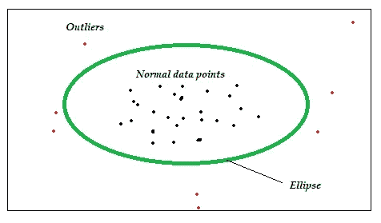
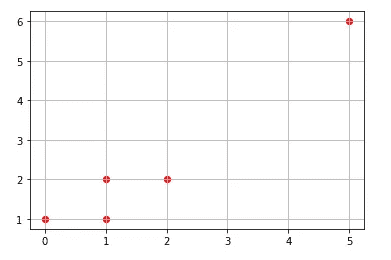
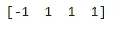

# 用于异常检测的机器学习:椭圆包络

> 原文：<https://towardsdatascience.com/machine-learning-for-anomaly-detection-elliptic-envelope-2c90528df0a6?source=collection_archive---------21----------------------->


由[马可·蒙斯](https://unsplash.com/@markomons?utm_source=medium&utm_medium=referral)在 [Unsplash](https://unsplash.com?utm_source=medium&utm_medium=referral) 上拍摄的照片

## 小型数据科学

欢迎回到异常检测；这是一系列关注异常值检测的“小数据”科学中的第 6 篇。今天我写的是一个叫做`EllipticEnvelope`的机器学习算法，它是数据科学家工具箱中的又一个工具，用于欺诈/异常/异常值检测。

如果您错过了我以前的文章，或者您有兴趣了解关于这个主题的更多信息，请找到下面的链接:

*   [局部异常因子(LOF)](/anomaly-detection-with-local-outlier-factor-lof-d91e41df10f2)
*   [Z 分数](/z-score-for-anomaly-detection-d98b0006f510)
*   [箱线图](/boxplot-for-anomaly-detection-9eac783382fd)
*   [统计技术](/statistical-techniques-for-anomaly-detection-6ac89e32d17a)
*   [时间序列异常检测](/time-series-anomaly-detection-with-anomalize-library-67472003c003)

# 椭圆形信封

那么什么是椭圆包络，算法背后的直觉是什么？

如果你上过几何课，你可能对椭圆很熟悉——一种在二维平面上呈椭圆形的几何形状。



椭圆形外壳的概念图

上图中的绿色区域是一个椭圆。因此，算法——椭圆包络——在给定数据集周围创建一个假想的椭圆区域。落在包络线内的值被视为正常数据，任何超出包络线的值都作为异常值返回。因此，自然地，上图中的红色数据点应该被该算法识别为异常值。从该图可以明显看出，如果数据具有高斯分布，则该算法工作得最好。

# 履行

`sklearn`是机器学习算法的瑞士军刀。因此毫不奇怪，它也有一个使用椭圆包络进行异常检测的模块。下面我用 5 个简单的步骤演示了一个使用虚拟数据点的实现。

## 步骤 1:导入库

```
# import libraries
import pandas as pd
import numpy as np
from sklearn.covariance import EllipticEnvelope
import matplotlib.pyplot as plt
```

## **第二步:获取训练数据**

```
# create a dataframe
df = pd.DataFrame(np.array([[0,1], [1,1], [1,2], [2,2], [5,6]]), columns = ["x", "y"], index = [0,1,2,3,4])# show data in a scatterplot
plt.scatter(df["x"], df["y"], color = "r")
plt.grid()
```



## 步骤 3:准备输入

```
# convert dataframe to arrays
data = df[['x', 'y']].values
```

## 第四步:建模

定义模型时最重要的参数是设置“污染”参数，它基本上定义了将被识别为异常值的值的比例。参数值的范围在 0 到 0.5 之间

```
# instantiate model
model1 = EllipticEnvelope(contamination = 0.1) # fit model
model1.fit(data)
```

## 第五步:预测

```
# new data for prediction (data needs to be in arrays)
new_data = np.array([[10,10], [1,1], [1,1], [1,1]])# predict on new data 
pred1 = model1.predict(new_data)
print(pred1)
```



负值是异常值

## 总结和后续步骤

本文的目的是介绍椭圆包络——一种用于异常检测的机器学习算法——并使用 Scikit-Learn 库实现该算法。如果您现在已经清楚了关键概念，那么继续尝试在真实数据集上实现它，例如，[在线可用的 Iris 数据集](https://raw.githubusercontent.com/uiuc-cse/data-fa14/gh-pages/data/iris.csv)。您应该能够对这个数据集使用上面的 5 个步骤，只需要确保您选择了正确的列以使算法工作。