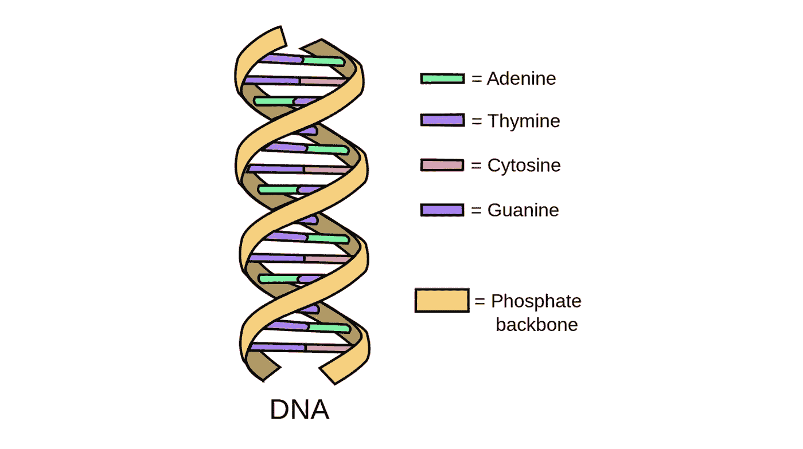
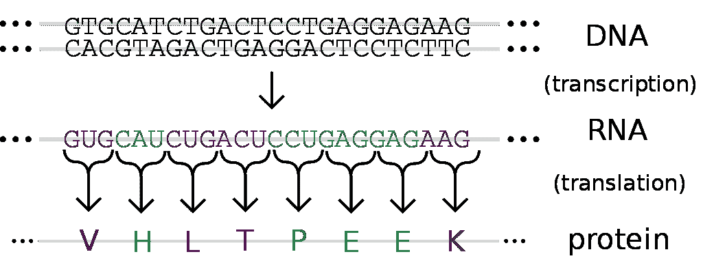
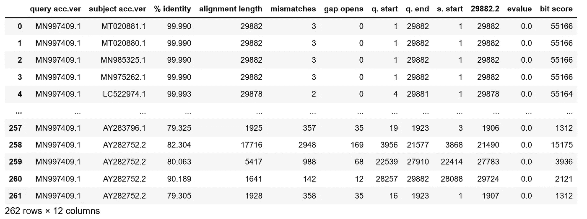
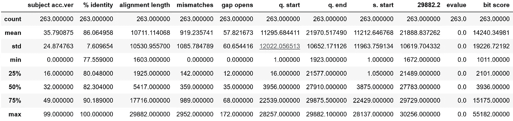
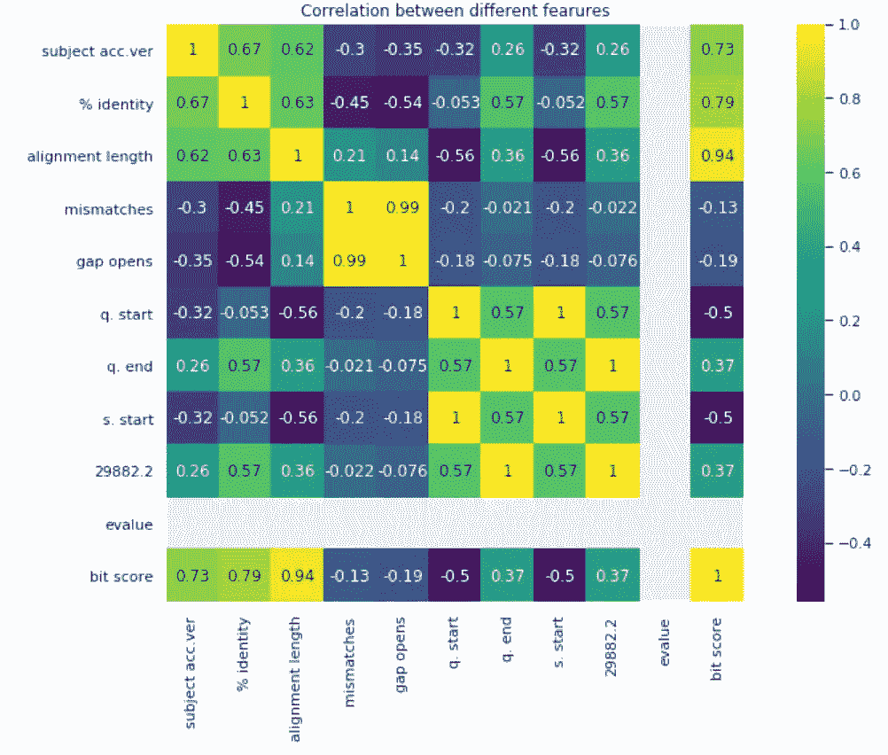
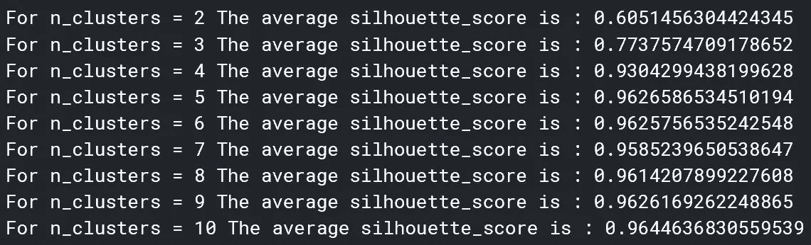
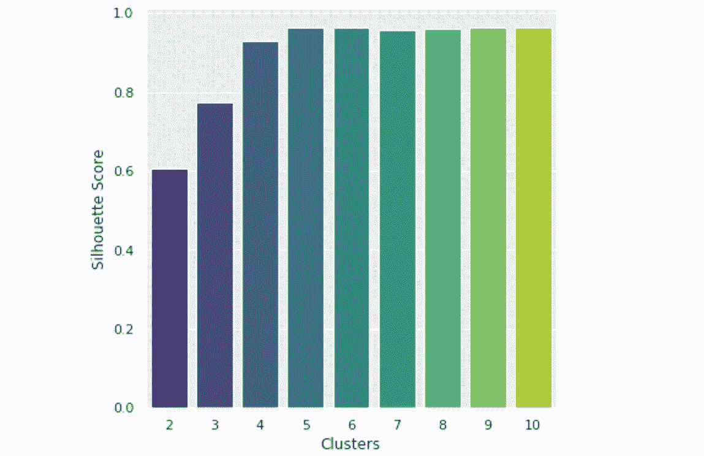
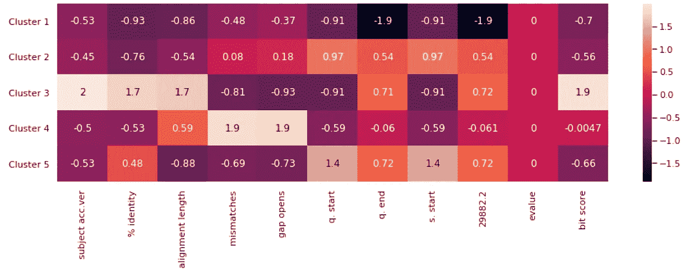
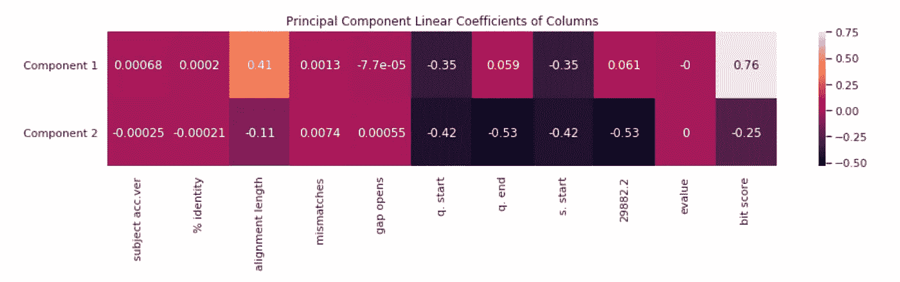
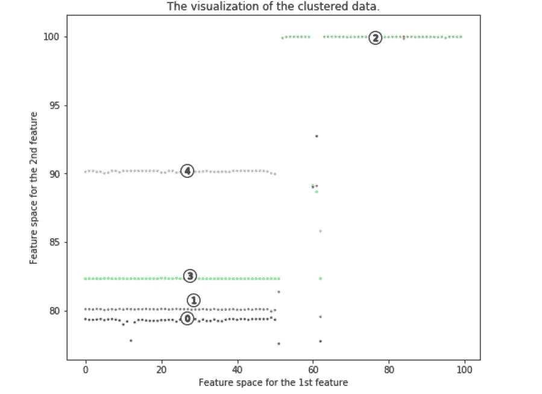

# 生物学的机器学习:新冠肺炎下一步将如何变异？

> 原文：<https://towardsdatascience.com/machine-learning-for-biology-how-will-covid-19-mutate-next-4df93cfaf544?source=collection_archive---------1----------------------->

来源: [Pixabay](https://pixabay.com/illustrations/coronavirus-virus-mouth-guard-4817450/)

## 基于 K-Means 和 PCA 的基因组序列分析

许多人不太了解病毒的一点是，就像地球上所有其他为生存而挣扎的生物一样，它们会进化或变异。

只要看看人类病毒来源于蝙蝠病毒 RNA 核苷酸序列的一个片段…

> aaaatcaagcttgtgttgaagaagttacaacaatctggaaaaactaagtt

…以及人类新冠肺炎 RNA 核苷酸序列的一个片段…

> aaaattaaggcttcattgattaggttaccacaacacactggaagaaactaagtt

……显然，冠状病毒已经改变了其内部结构，以适应其宿主的新物种(更准确地说，冠状病毒的内部结构约有 20%发生了突变)，但仍保持足够的数量，以至于它仍然忠于其原始物种。

事实上，研究表明，新冠肺炎已经多次变异，以提高其生存能力。在我们战胜冠状病毒的斗争中，我们不仅需要找到如何摧毁病毒，还需要找到病毒如何变异以及如何应对这些变异。

在这篇文章中，我将…

*   提供什么是 RNA 核苷酸序列的表层解释
*   使用 K-Means 创建基因组信息聚类
*   使用主成分分析可视化聚类

…并从我们执行的每个分析程序中获得洞察力。

# 什么是基因组序列？

如果你对 RNA 核苷酸序列有基本的了解，可以跳过这一部分。

基因组测序，通常比作“解码”，是分析从样本中提取的脱氧核糖核酸(DNA)的过程。每个正常细胞内有 23 对染色体，这是存放 DNA 的结构。

[来源](https://s3-us-west-2.amazonaws.com/courses-images/wp-content/uploads/sites/2318/2016/06/06163522/DNA_simple2.png)。图像免费共享和商业使用。

DNA 卷曲的双螺旋结构允许它展开成梯形。这个梯子是由成对的被称为碱基的化学字母组成的。DNA 中只有四种:腺嘌呤、胸腺嘧啶、鸟嘌呤和胞嘧啶。腺嘌呤只与胸腺嘧啶结合，鸟嘌呤只与胞嘧啶结合。这些碱基分别用 A、T、G 和 C 表示。

这些碱基形成了各种各样的代码，指导生物体如何构建蛋白质——正是 DNA 从本质上控制着病毒的行为。

DNA 转化为 RNA 再转化为蛋白质的过程。[来源](https://upload.wikimedia.org/wikipedia/commons/thumb/3/37/Genetic_code.svg/1024px-Genetic_code.svg.png)。图像免费共享和商业使用。

使用专门的设备，包括测序仪器和专门的标签，显示特定片段的 DNA 序列。由此获得的信息经过进一步的分析和比较，使研究人员能够识别基因的变化、与疾病和表型的关联，并识别潜在的药物靶点。

基因组序列是一长串的‘A’、‘T’、‘G’和‘C’，代表生物体对环境的反应。生物体的突变是通过改变 DNA 产生的。查看基因组序列是分析冠状病毒突变的一种强有力的方法。

# 了解数据。

数据可以在 Kaggle [这里](https://www.kaggle.com/jamzing/sars-coronavirus-accession)找到，看起来是这样的:

每行代表蝙蝠病毒的一种变异。首先，花一分钟时间来欣赏大自然是多么不可思议——在几周内，冠状病毒已经创造了 262 种变异(还在增加)来提高存活率。

一些重要的列:

*   `query acc.ver`代表原病毒标识符。
*   `subject acc.ver` 是病毒突变的标识符。
*   `% identity`代表百分之多少的序列与原始病毒相同。
*   `alignment length`表示序列中有多少项相同或对齐。
*   `mismatches`代表变异和原始不同的项目数。
*   `bit score`代表一种度量，用于表示对准有多好；分数越高，排列越好。

每个列的一些统计度量(这可以在 Python 中用`data.describe()`方便地调用):

查看`% identity`栏，有趣的是看到一个突变与原始病毒的最小比对百分比——大约 77.6%。对于`% identity`来说，7%的相当大的标准偏差意味着有很大范围的变异。这是由`bit score`中的*巨大的*标准差支持的——标准差大于平均值！

可视化数据的一个好方法是通过关联热图。每个单元格表示一个要素与另一个要素的相关程度。

许多数据彼此高度相关。这是有意义的，因为大多数度量是彼此不同的。如果`alignment length`与`bit score`高度相关，有一点需要注意。

# 使用 K-Means 创建变异聚类

K-Means 是一种用于*聚类*的算法，是机器学习中在特征空间中寻找数据点组的方法。我们的 K-Means 的目标是找到突变的簇，因此我们可以获得关于突变的性质以及如何解决它们的见解。

但是，我们仍然需要选择簇的数量 *k* 。虽然这就像在二维空间中画出点一样简单，但在更高维空间中这是无法实现的(如果我们想保留最多的信息)。像手肘法选择 *k* 这样的方法是主观的，不准确的，所以我们会改用剪影法。

剪影法是根据聚类与数据的吻合程度对 *k* 聚类进行评分。Python 中的`sklearn`库使得实现 K-Means 和 silouhette 方法变得非常简单。

看起来 5 个聚类似乎是数据的最佳聚类。现在，我们可以确定聚类中心。这些是每个聚类围绕的点，并代表 5 种主要突变类型的数值评估(在这种情况下)。

注意:这些特征已被标准化，以便将它们放在相同的比例上。否则，列将无法进行比较。

该热图按列显示了每个集群的属性。因为点是按比例缩放的，所以实际的注释值在数量上没有任何意义。但是，可以比较每列中的换算值。你可以直观地感受到每一个变异群的相对属性。如果科学家要开发一种疫苗，它应该针对这些主要的病毒群。

在下一节中，我们将使用 PCA 来可视化聚类。

# 聚类可视化的主成分分析

PCA，即主成分分析，是一种降维方法。它选择多维空间中的正交向量来表示轴，从而保留了最多的信息(方差)。

使用流行的 Python 库`sklearn`，可以通过两行代码实现 PCA。首先，我们可以检查解释的方差比。这是从原始数据集中保留的统计信息的百分比。在这种情况下，解释的方差比是`0.9838548580740327`，这是天文数字！我们可以确信，无论我们从主成分分析中得到什么样的分析，数据都是真实的。

每个新特征(主成分)是几个其他列的线性组合。我们可以用热图来想象一个列对于两个主要组件中的一个有多重要。

重要的是要理解第一个组分中具有高值意味着什么——在这种情况下，它的特征是具有更高的比对长度(更接近原始病毒)，而组分 2 的主要特征是具有更短的比对长度(突变得离原始值更远)。这也体现在`bit score`的差异较大。

很明显，这种病毒有 5 条主要的变异链。我们可以带走很多洞察力。

四个病毒突变在第一个主成分的左侧，一个在右侧。第一主成分的签名是高`alignment length`。这意味着第一主成分的值越高，意味着`alignment length`越高(更接近原始病毒)。因此，组分 1 的较低值在遗传上与原始病毒更远。大多数病毒群与原始病毒有很大不同。因此，试图制造疫苗的科学家应该意识到病毒会发生变异**批次*。*

# *结论*

*使用 K-Means 和 PCA，能够识别冠状病毒中的五个主要突变簇。开发冠状病毒疫苗的科学家可以使用聚类中心来获得关于每个聚类特征的知识。我们能够使用主成分分析在二维空间中可视化集群，并发现冠状病毒具有非常高的突变率。这可能是它如此致命的原因。*

## *感谢阅读！*

*如果你喜欢，请随意查看我在冠状病毒方面的其他工作:*

*   *[机器学习发现冠状病毒的传染性:从头开始建立指数模型和优化器，以找到冠状病毒 R-Naught](https://medium.com/@andre_ye/machine-learning-finds-just-how-contagious-r-naught-the-coronavirus-is-852abf5f0c88)*
*   *[亲眼看看冠状病毒:任何人都可以将原始数据掌握在自己手中，并使用简单的分析方法揭示冠状病毒的真实本质。](/see-the-coronavirus-for-yourself-88ce06b88f5e)*
*   *[建立冠状病毒研究文献搜索引擎:提高新冠肺炎研究效率。](/building-a-coronavirus-research-literature-search-engine-3fae767b41ba)*
*   *[ka ggle 冠状病毒预测第三名解决方案——这一策略可以将预测全球冠状病毒病例和死亡的准确性提高 7 倍。](https://medium.com/@andre_ye/the-strategy-that-increases-model-accuracy-every-time-guaranteed-6ee5e476262d)*
*   *[预测艾滋病、埃博拉、& SARS 的定律对冠状病毒有什么看法:法尔定律用统计学来估计冠状病毒的未来。](/what-the-law-that-forecasted-aids-ebola-sars-has-to-say-about-the-coronavirus-2473894f03c5)*

****编者注:*** [*走向数据科学*](http://towardsdatascience.com/) *是一份以研究数据科学和机器学习为主的中型刊物。我们不是健康专家或流行病学家，本文的观点不应被解释为专业建议。想了解更多关于疫情冠状病毒的信息，可以点击* [*这里*](https://www.who.int/emergencies/diseases/novel-coronavirus-2019/situation-reports) *。**