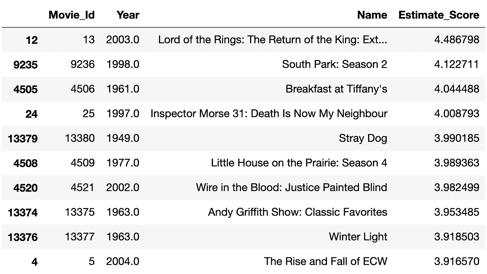

# 用 Python 构建推荐系统的机器学习

> 原文：<https://towardsdatascience.com/machine-learning-for-building-recommender-system-in-python-9e4922dd7e97?source=collection_archive---------4----------------------->

## 利用 Python 中基于模型的协同过滤构建推荐系统


作者照片

[推荐系统](https://en.wikipedia.org/wiki/Recommender_system)广泛应用于产品推荐，如音乐、电影、书籍、新闻、研究文章、餐厅等的推荐。[1][5][9][10].

构建推荐系统有两种流行的方法:

*   [协同过滤](https://en.wikipedia.org/wiki/Collaborative_filtering)【3】【4】【5】【10】
*   [基于内容的过滤](https://developers.google.com/machine-learning/recommendation/content-based/basics)【6】【9】

协作过滤方法[5][10]通过从许多其他用户(协作)收集偏好信息来预测(过滤)用户对产品的兴趣。协同过滤方法背后的假设是，如果一个人 P1 和另一个人 P2 在一个问题上有相同的观点，P1 比随机选择的人更有可能在不同的问题上分享 P2 的观点[5]。

基于内容的过滤方法[6][9]利用产品特征/属性，根据其他用户以前的行为或明确的反馈(如对产品的评级)，推荐与用户喜欢的产品相似的其他产品。

推荐系统可以使用这两种方法中的一种或两种。

在本文中，我使用 Kaggle 网飞奖数据[2]来演示如何使用基于模型的协同过滤方法在 Python 中构建一个推荐系统。

文章的其余部分安排如下:

*   协同过滤概述
*   用 Python 构建推荐系统
*   摘要

# 1.协同过滤概述

正如[5]中所描述的，协同过滤背后的主要思想是一个人经常从另一个有相似兴趣的人那里得到最好的推荐。协同过滤使用各种技术来匹配具有相似兴趣的人，并基于共同兴趣进行推荐。

协同过滤系统的高级工作流程可以描述如下:

*   用户对项目(例如，电影、书籍)进行评级以表达他或她对项目的偏好
*   系统将评级视为用户对项目兴趣的近似表示
*   系统将该用户的评分与其他用户的评分进行匹配，并找到评分最相似的人
*   系统推荐相似用户已经评级很高但是还没有被该用户评级的项目

典型地，协同过滤系统分两步向给定用户推荐产品[5]:

*   步骤 1:寻找与给定用户具有相同评级模式的人
*   步骤 2:使用在步骤 1 中找到的人的评分来计算给定用户对产品的评分预测

这被称为基于用户的协同过滤。该方法的一个具体实现是基于用户的[最近邻算法](https://en.wikipedia.org/wiki/K-nearest_neighbors_algorithm)。

作为替代，基于项目的协作过滤(例如，对 x 感兴趣的用户也对 y 感兴趣)以项目为中心的方式工作:

*   步骤 1:建立项目对之间评级关系的项目-项目矩阵
*   步骤 2:通过检查矩阵和匹配用户的评级数据来预测当前用户对产品的评级

有两种类型的协同过滤系统:

*   基于模型的
*   基于记忆的

在基于模型的系统中，我们使用不同的[机器学习](https://en.wikipedia.org/wiki/Machine_learning)算法来开发模型，以预测用户对未评级项目的评级【5】。基于模型的协同过滤算法有很多，如[矩阵分解](https://en.wikipedia.org/wiki/Matrix_factorization_(recommender_systems)#:~:text=Matrix%20factorization%20is%20a%20class,two%20lower%20dimensionality%20rectangular%20matrices.)算法(如[奇异值分解](https://en.wikipedia.org/wiki/Singular_value_decomposition) (SVD)、交替最小二乘(ALS)算法【8】)、[贝叶斯网络](https://en.wikipedia.org/wiki/Bayesian_networks)、[聚类模型](https://en.wikipedia.org/wiki/Cluster_Analysis)等。[【5】](https://en.wikipedia.org/wiki/Collaborative_filtering#cite_note-Suetal2009-5)。

基于记忆的系统使用用户的评级数据来计算用户或项目之间的相似性。这类系统的典型例子是基于邻域的方法和基于项目/基于用户的 top-N 推荐[5]。

本文描述了如何使用 SVD 模型构建基于模型的协同过滤系统。

# 2.用 Python 构建推荐系统

本节描述如何用 Python 构建推荐系统。

## 2.1 安装库

有多个 Python 库可用于构建推荐系统(例如，Python scikit[Surprise](http://surpriselib.com/)【7】， [Spark 基于 RDD 的协同过滤 API](https://spark.apache.org/docs/latest/mllib-collaborative-filtering.html#:~:text=Tutorial-,Collaborative%20filtering,commonly%20used%20for%20recommender%20systems.&text=mllib%20currently%20supports%20model%2Dbased,spark.)【8】)。我在本文中使用 Python scikit Surprise 库进行演示。

惊喜库可以按如下方式安装:

```
pip install scikit-surprise
```

## 2.2 加载数据

如前所述，我在本文中使用了 Kaggle 网飞奖数据[2]。有多个数据文件用于不同的目的。本文中使用了以下数据文件:

**训练数据:**

*   组合 _ 数据 _1.txt
*   组合 _ 数据 _2.txt
*   组合 _ 数据 _3.txt
*   组合 _ 数据 _4.txt

**电影片头数据文件:**

*   电影 _ 标题. csv

训练数据集太大，无法在笔记本电脑上处理。因此，出于演示目的，我只从每个训练数据文件中加载前 100，000 条记录。

一旦将训练数据文件下载到本地机器上，来自每个训练数据文件的前 100，000 条记录可以作为熊猫数据帧加载到内存中，如下所示:

```
def readFile(file_path, rows=100000):
    data_dict = {'Cust_Id' : [], 'Movie_Id' : [], 'Rating' : [], 'Date' : []}
    f = open(file_path, "r")
    count = 0
    for line in f:
        count += 1
        if count > rows:
            break

        if ':' in line:
            movidId = line[:-2] # remove the last character ':'
            movieId = int(movidId)
        else:
            customerID, rating, date = line.split(',')
            data_dict['Cust_Id'].append(customerID)
            data_dict['Movie_Id'].append(movieId)
            data_dict['Rating'].append(rating)
            data_dict['Date'].append(date.rstrip("\n"))
    f.close()

    return pd.DataFrame(data_dict)df1 = readFile('./data/netflix/combined_data_1.txt', rows=100000)
df2 = readFile('./data/netflix/combined_data_2.txt', rows=100000)
df3 = readFile('./data/netflix/combined_data_3.txt', rows=100000)
df4 = readFile('./data/netflix/combined_data_4.txt', rows=100000)df1['Rating'] = df1['Rating'].astype(float)
df2['Rating'] = df2['Rating'].astype(float)
df3['Rating'] = df3['Rating'].astype(float)
df4['Rating'] = df4['Rating'].astype(float)
```

训练数据的不同部分的不同数据帧被组合成如下一个:

```
df = df1.copy()
df = df.append(df2)
df = df.append(df3)
df = df.append(df4)df.index = np.arange(0,len(df))
df.head(10)
```


电影标题文件可以作为熊猫数据帧载入存储器:

```
df_title = pd.read_csv('./data/netflix/movie_titles.csv', encoding = "ISO-8859-1", header = None, names = ['Movie_Id', 'Year', 'Name'])
df_title.head(10)
```


## 2.3 培训和评估模式

*Surprise* 中的*数据集*模块提供了从文件、Pandas 数据帧或内置数据集(如 ml-100k(movie lens 100k)【4】加载数据的不同方法:

*   Dataset.load_builtin()
*   Dataset.load_from_file()
*   Dataset.load_from_df()

在本文中，我使用 *load_from_df* ()方法从 Pandas DataFrame 加载数据。

*Surprise* 中的 *Reader* 类用于解析包含用户、项目和用户对项目的评分的文件。默认的格式是每个评分按空格分隔的顺序存储在单独的行中:*用户* *项目* *评分*

该顺序和分隔符可使用以下参数进行配置:

*   **line_format** 是一个类似于“*item*userrating 的字符串，表示数据的顺序，字段名之间用空格隔开
*   **sep** 用于指定字段之间的分隔符，如空格、'、'等。
*   **rating_scale** 是指定评级尺度。默认值为(1，5)
*   **skip_lines** 表示文件开头要跳过的行数，默认为 0

我在本文中使用默认设置。*项*、*用户*、*评分*分别对应数据帧的*客户标识*、*电影标识*和*评分*栏。

惊喜库[7]包含用于构建推荐系统的多种模型/算法的实现，例如奇异值分解、概率矩阵分解(PMF)、非负矩阵分解(NMF)等。本文使用了 SVD 模型。

下面的代码从 Pandas DataFrame 加载数据并创建一个 SVD 模型实例:

```
from surprise import Reader, Dataset, SVD
from surprise.model_selection.validation import cross_validatereader = Reader()data = Dataset.load_from_df(df[['Cust_Id', 'Movie_Id', 'Rating']], reader)svd = SVD()
```

一旦用于产品推荐的数据和模型准备就绪，就可以使用交叉验证来评估模型，如下所示:

```
# Run 5-fold cross-validation and print results
cross_validate(svd, data, measures=['RMSE', 'MAE'], cv=5, verbose=True)
```

以下是 SVD 模型的交叉验证结果:


一旦模型评估达到我们的满意程度，我们就可以使用整个训练数据集来重新训练模型:

```
trainset = data.build_full_trainset()
svd.fit(trainset)
```

## 2.4 推荐产品

在推荐模型被适当地训练之后，它可以被用于预测。

例如，给定用户(例如，客户 Id 785314)，我们可以使用经训练的模型来预测用户对不同产品(即，电影名称)给出的评级:

```
titles = df_title.copy()titles['Estimate_Score'] = titles['Movie_Id'].apply(lambda x: svd.predict(785314, x).est)
```

为了向给定用户推荐产品(即电影)，我们可以按照预测评级的降序对电影列表进行排序，并将前 *N* 部电影作为推荐:

```
titles = titles.sort_values(by=['Estimate_Score'], ascending=False)
titles.head(10)
```

以下是向客户 Id 为 785314 的用户推荐的前 10 部电影:



# 3.摘要

在本文中，我使用 scikit 惊喜库[7]和 Kaggle 网飞奖数据[2]来演示如何使用基于模型的协同过滤方法在 Python 中构建推荐系统。

如本文开头所述，数据集太大，无法在笔记本电脑或任何典型的个人电脑上处理。因此，出于演示目的，我只从每个训练数据集文件中加载了前 100，000 条记录。

在真实应用的设置中，我会推荐用 Surprise 搭配[考拉](https://github.com/databricks/koalas)或者用 Spark MLLib 中的 ALS 算法实现协同过滤系统，在 Spark cluster 上运行[8]。

Github [11]中提供了 Jupyter 笔记本以及本文中使用的所有源代码。

# 参考

1.  DLao，[网飞——电影推荐](https://www.kaggle.com/laowingkin/netflix-movie-recommendation)
2.  [Netflix 获奖数据，来自网飞竞赛的数据集，用于改进他们的推荐算法](https://www.kaggle.com/netflix-inc/netflix-prize-data?select=qualifying.txt)
3.  [推荐系统](https://en.wikipedia.org/wiki/Recommender_system)
4.  A.Ajitsaria，[用协同过滤建立推荐引擎](https://realpython.com/build-recommendation-engine-collaborative-filtering/)
5.  [协同过滤](https://en.wikipedia.org/wiki/Collaborative_filtering)
6.  [基于内容的过滤](https://developers.google.com/machine-learning/recommendation/content-based/basics)
7.  [惊喜](http://surpriselib.com/)
8.  南 Ryza，U. Laserson 等。艾尔。，Spark 高级分析，奥赖利，2015 年 4 月
9.  N.S. Chauhan，[如何构建餐厅推荐引擎](https://medium.com/analytics-vidhya/how-to-build-a-restaurant-recommendation-engine-part-1-21aadb5dac6e)(第一部分)
10.  N.S. Chauhan，[如何构建餐厅推荐引擎](https://medium.com/analytics-vidhya/how-to-build-a-restaurant-recommendation-engine-part-2-71e2d0721084)(第二部分)
11.  Y. [Github](https://github.com/yzzhang/machine-learning/tree/master/recommender) 中的张、Jupyter 笔记本