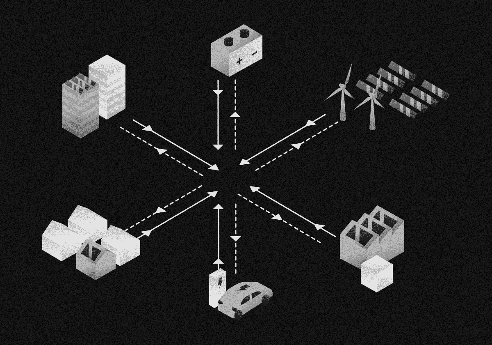

# 用于能量分配的机器学习

> 原文：<https://towardsdatascience.com/machine-learning-for-energy-distribution-2150d095520f?source=collection_archive---------54----------------------->

## 能源领域的机器学习——第三部分

## 能源分销公司的 9 个用例

来源:作者

分布式生产、可再生能源的兴起、向更智能电网的转变以及竞争性营销正在改变能源分配市场，并给公用事业的利润率带来压力。

越来越需要在一定范围内做出更明智的决策。为了保持竞争力，需要快速做出这些决定。机器学习正在成为最重要的工具，帮助你做出更好的定价决策，并与客户建立更好的关系。借助机器学习，您可以:

*   预测价格和需求，
*   优化零售价格，
*   提供更好的报价，赢得更多客户，减少客户流失，预测客户终身价值，
*   预测价值顺序，优化消费

# 准确预测能源价格

随着个人发电(使用太阳能或风能)变得越来越容易和便宜，消费者和企业越来越多地生产自己的电力。

个人发电允许人们制造、消耗和储存自己的能量。根据他们居住的地方，他们甚至可以将多余的电力卖给当地的电力公司。

机器学习可以帮助找到生产、储存或出售这种能源的最佳时间。理想情况下，能源应该在价格低的时候消耗或储存，价格高的时候卖回给电网。

当我们使用机器学习模型来查看历史数据、使用趋势和天气预报时，我们可以每小时做出更准确的预测。这有助于拥有个人和商业能源生成系统的人做出关于如何使用他们的能源的战略决策。

例如，自适应神经模糊推理系统(ANFIS)已被用于预测发电的短期风模式。这使得生产商能够最大限度地提高能源产量，并在价格达到峰值时将能源返销给电网。

# 准确预测能源需求

准确预测客户的能源需求对于任何公用事业提供商来说都至关重要。到目前为止，还没有足够的解决方案来储存大量的能量，这意味着能量需要在产生的同时就被传输和消耗。

我们正在使用机器学习来提高这些预测的准确性。历史能源使用数据、天气预报以及某一天运营的企业或建筑类型都在决定能源使用量方面发挥着作用。

例如，一周中炎热的夏天意味着更多的能源使用，因为办公楼空调的运行能力很高。天气预报和历史数据可以帮助及时识别这些模式，以防止夏季空调导致的轮流停电。

机器学习在各种影响因素(如星期几、时间、预测的风和太阳辐射、重大体育赛事、过去的需求、平均需求、气温、湿度和压力以及风向)中找到复杂的模式，以解释需求的发展。因为机器学习比人类能发现更多错综复杂的模式，所以它的预测更准确。这意味着您可以在购买能源时提高效率并降低成本，而不必进行昂贵的调整。

# 通过更好的交易优化价格

为电力等商品提供最优惠的价格是在开放的能源市场中生存的关键。当消费者可以选择谁提供他们的电力时，价格比较是不可避免的。

为了保持竞争力，公用事业提供商使用机器学习来根据价格最低的时间确定购买能源的最佳时间。

谈到商品追踪，有成千上万的因素影响着能源价格——从一天中的时间到天气的一切。我们可以使用机器学习来分析这些因素的微小变化，这有助于公用事业提供商在何时购买和出售能源方面做出更明智的决定。

但我们可以更进一步，对于我们的一个客户，我们结合了梯度推进、通用加法和深度学习模型，以更准确地预测未来一天的价格。我们还使用机器学习来帮助一家 B2B 能源分销商选择交易策略，以更便宜的价格购买期货。

在一些市场，这种分析导致消费者在一年内多次降价。

# 减少客户流失

在开放的能源市场中，客户可以选择公用事业供应商，了解哪些客户将会流失至关重要。在能源行业，流失率——在特定年份停止使用某项服务的客户的百分比——可能高达 25%。准确预测和防止客户流失对生存至关重要。

我们可以使用机器学习来帮助公用事业所有者预测客户何时准备大量生产。

通过使用跨行业数据挖掘标准流程(CRISP-DM)、AdaBoost 和支持向量机等技术，以及历史使用数据，公用事业提供商可以确定预测客户是否会流失的关键指标。

这些包括客户满意度、就业状况、能源消耗、房屋所有权或租赁状况等。这些因素中的任何一个变化都可能指向准备终止服务的客户。

当我们提前足够长的时间确定这些指标时，您可以通过与客户合作解决他们遇到的任何问题来防止流失。

# 预测客户终身价值

在开放的公用事业市场中，公用事业所有者和提供商必须更加关注客户终身价值(CLV)等指标。这有助于他们了解任何给定客户在合同期限内将花费多少。

机器学习能做的不仅仅是给你一个更准确的 CLV 预测。通过输入客户信息、消费习惯、位置、购买历史和支付行为等数据，我们可以使用深度神经网络等机器学习模型来预测单个客户的整体价值。

有了机器学习，我们甚至可以通过建议增加客户价值的方法来更进一步。这可能意味着向类似的客户提供高针对性的服务，或者利用自然语言处理(NLP)来帮助改善对可能准备流失的沮丧客户的服务。

# 预测赢得客户的概率

对于开放市场中的公用事业提供商来说，全面了解潜在客户对于保持竞争优势至关重要。

但是机器学习能做的不仅仅是给你提供这个完整的画面。它还可以提供您做出数据驱动的营销决策所需的信息..这意味着当一个人登陆你的网站时，你就能判断出这个人是否会成为你的顾客。

我们可以使用机器学习来收集人们随身携带的信息——比如他们住在哪里，他们使用哪种电脑，他们的浏览历史，搜索历史，以及他们访问你的网站的次数——并得出这个人作为消费者的准确图片。

由此，机器学习不仅可以确定那个人成为客户的可能性(这就是所谓的评分)，还可以确定将他们变成客户的最佳策略。这包括使用高度有针对性的广告和提供非常个性化的体验——例如，当一个四口之家的人访问网站时，在主页上使用一个四口之家的照片。

# 向客户提供极具针对性的优惠

在开放的能源市场中，消费者可以选择公用事业供应商。个性化的优惠对于吸引新客户和留住现有客户至关重要，尤其是因为品牌忠诚度已经不像以前那么高了。

我们可以使用机器学习来帮助您获得所需的洞察力，以提供直接针对特定客户需求的不可抗拒的优惠。

通过分析消费习惯和客户数据，机器学习可以帮助你确定在任何给定时间向特定客户提供的最佳优惠。

例如，如果数据表明客户正准备搬家，您可以在他们的新位置发出免除连接费的提议。这种[个性化的优惠](https://www.smart-energy.com/magazine-article/customer-churn-utilities/)让你在竞争中领先，减少客户流失的可能性。

# 优化能源消耗

人们很早就意识到了能源消耗，无论是在家里还是在工作中。但是，如果不进行大量的手工计算，我们只能获得能源使用的总体感觉，而不知道哪些电器或设备使用最多。

智能电表和物联网设备的兴起改变了这一切。非侵入式设备负载监控(NIALM)，也称为分解，是一种使用机器学习在设备特定级别分析能耗的算法。

我们可以帮助您找出哪些设备的运行成本最高。这将有助于家庭和企业客户调整他们的消费习惯，以节省资金和减少能源使用。他们可以少用高价电器，或者换成更节能的型号。

# 预测能源价格的价值顺序

公用事业供应商在能源来源方面有很多选择——从风能、太阳能等可再生能源到化石燃料和核能。到了销售电力的时候，这些不同的来源被组织成一个基于价格的价值顺序。这决定了这些不同来源的电力出售的顺序。

因为我们可以访问来自各种来源的数据，所以我们可以使用机器学习来分析实时数据和历史数据。机器学习算法也更善于考虑影响价格的所有不同因素——如天气、需求、各种来源的可用能源量、历史使用情况等。–预测优化的奖励等级。

这有助于你做出更明智的决定，从哪里获得力量。这在有大量可再生能源的市场上尤其有用，例如[风](https://www.sciencedirect.com/science/article/pii/S0196890414002568)，因为很难保证这些来源的能源可用性。

T 他的文章是机器学习在能源行业应用的 3 部分系列文章之一:

1.  第一部分— [用于**能源生成的机器学习**](/machine-learning-for-energy-generation-302069a942f)
2.  第二部分— [用于**能量传输的机器学习**](/machine-learning-for-energy-transmission-750f518ae282)
3.  第二部分(本文)——针对**能量分布**的机器学习