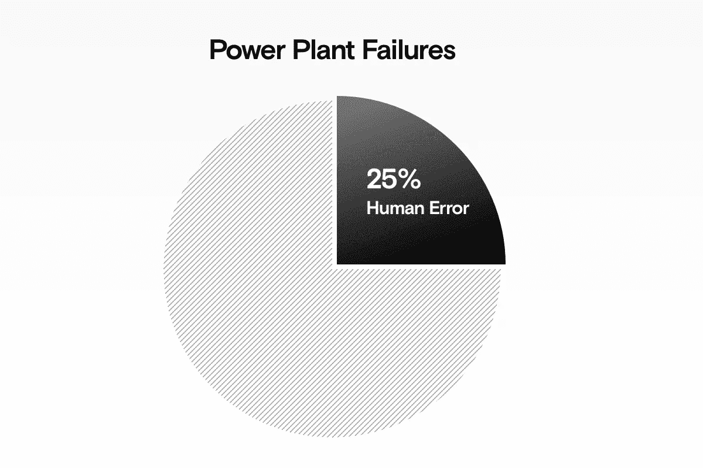
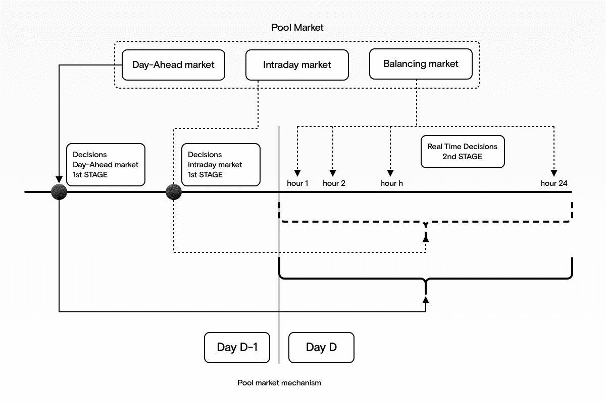

# 用于能源生产的机器学习

> 原文：<https://towardsdatascience.com/machine-learning-for-energy-generation-302069a942f?source=collection_archive---------43----------------------->

## 能源领域的机器学习——第一部分

## 发电厂 ML 的 4 个用例

来源:作者

如果你正在管理风力发电场或任何其他发电厂，那么你很清楚:维护、人为错误、停机和规划效率低下**每年会造成数百万美元的损失**。

在更简单的统计学进展甚微的情况下，机器学习被证明是一种非常有效的工具，可以:

*   **更快更准确地预测故障**
*   **检测人为错误**，在它们变成大问题之前
*   **优化电厂计划**，提高您的盈利能力
*   **预测优序**，优化不同电源的调度

# 预测涡轮机故障

风是一种很好的可再生能源，但是风力涡轮机的维护费用是出了名的昂贵。它占每千瓦时成本的 25%。并且在问题发生后解决问题可能会更加昂贵。

机器学习可以帮助您提前解决这个问题，通过在涡轮机出现故障之前发现问题来降低维护成本。当风力发电场位于难以到达的地方时，例如海洋中部，这一点尤为重要，因为这使得维修成本更高。

监控和数据采集(SCADA)收集的实时数据有助于提前识别系统中可能出现的故障，从而防止故障发生。

例如，我们可以使用来自涡轮机内传感器的数据，如油、油脂和振动传感器，来训练机器学习模型，以识别故障的前兆，如低水平的润滑剂。这种方法可以提前 60 天预测故障。

# 减少潜在的人为错误

来源:作者

每年，人为错误占发电厂故障的 25%。除了每年损失高达 3000 万兆瓦时的发电量，这还会导致客户服务中断，甚至更糟——想想切尔诺贝利和三里岛就知道了。这也意味着与修复错误和让系统重新上线相关的不必要成本。

为了解决这个问题，我们可以使用机器学习来支持控制室操作员做出的决定。

机器学习提供持续的系统监控，帮助您检测异常。我们还会自动建议一个行动计划来防止情况变得更糟。它甚至可以在需要人工干预之前处理问题。

这降低了由于注意力分散、缺乏知识或反应速度而导致的人为错误的风险——有时控制室操作员根本无法快速阻止问题。

# 通过优化调度和定价提高电厂的盈利能力

如今，我们拥有的海量数据正在帮助人们就如何经营企业做出更好的决策。公用事业也不例外。能源价格的波动性意味着，运营一家发电厂可能或多或少有利可图，这取决于一天中简单的时间。

但是，由于公用事业市场节奏如此之快，很难手动跟踪做出这些决策所需的所有数据。

我们可以使用机器学习来帮助。通过将价格和使用的历史数据输入机器学习算法，你可以预测运营他们工厂的最佳时间，从而赚更多的钱。机器学习可以找到使用率高但用于生产能源的原材料价格低的时候。这些极其准确的预测创建了一个优化的发电计划，使盈利能力最大化。

# 预测能源价格的价值顺序

来源:作者

公用事业供应商在能源来源方面有很多选择——从风能、太阳能等可再生能源到化石燃料和核能。到了销售电力的时候，这些不同的来源被组织成一个基于价格的价值顺序。这决定了这些不同来源的电力出售的顺序。

因为我们可以访问来自各种来源的数据，所以我们可以使用机器学习来分析实时数据和历史数据。机器学习算法也更善于考虑影响价格的所有不同因素，如天气、需求、各种来源的可用能源量、历史使用情况等。-创建优化的奖励等级。

这有助于你做出更明智的决定，从哪里获得力量。这在有大量可再生能源的市场上尤其有用，比如风能，因为很难保证这些能源的可用性。

T 他的文章是机器学习在能源行业应用的 3 部分系列文章之一:

1.  第一部分(本文)–用于**能源生产**的机器学习
2.  第二部分-[用于**能量传输的机器学习**](/machine-learning-for-energy-transmission-750f518ae282)
3.  第二部分-[针对**能量分配**](https://medium.com/@FHMS/2150d095520f?source=friends_link&sk=5a31dc83514467cb35b391d03e42d5d2) 的机器学习

*原载于*[*https://www.datarevenue.com*](https://www.datarevenue.com/en-blog/machine-learning-for-energy-generation)*。*