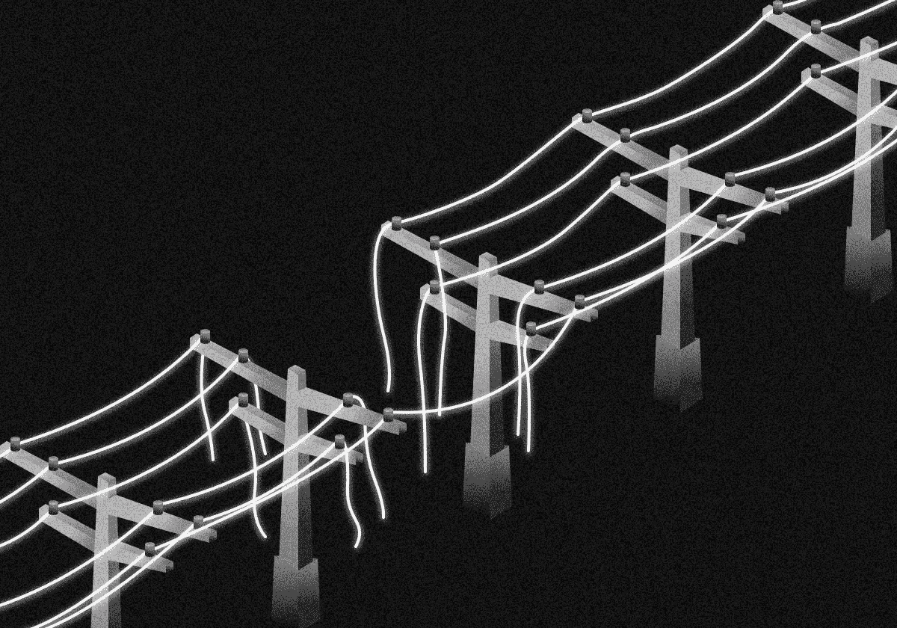
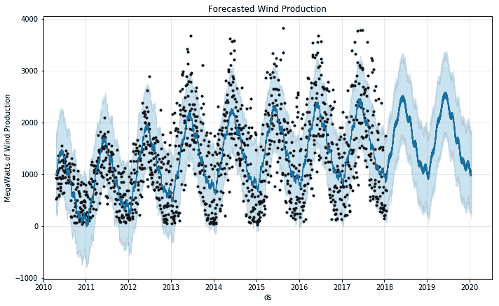

# 用于能量传输的机器学习

> 原文：<https://towardsdatascience.com/machine-learning-for-energy-transmission-750f518ae282?source=collection_archive---------54----------------------->

## 能源领域的机器学习——第二部分

## 传输系统运营商的 6 ML 应用。

来源:作者

在电网中输送电力会带来一系列独特的问题。从能源盗窃到电网故障，一切都可能干扰这一过程。而且，每次出了问题，都要花费时间和金钱去纠正。

机器学习已经成为一种越来越强大的工具，有助于降低与能源传输相关的风险。它可以帮助您:

*   预测和预防电网故障
*   通过实时监控和人工智能预测防止限电
*   检测电网故障
*   平衡网格
*   区分电力系统干扰和网络攻击
*   检测能源盗窃

# 1.预测和预防电网故障

大规模停电给公众带来了混乱，并且每年给公用事业提供商造成大约 490 亿美元的损失。

如果大规模停电很少发生，这不会是什么大问题，但影响超过 50，000 人的停电近年来急剧增加。这意味着公用事业公司需要找到预测和管理这些中断的新方法。

如今，智能电网正在产生大量数据，这意味着预测和管理停电比以往任何时候都更容易。传统电网是单向的(意味着它们只向一个方向传输电力)，而智能电网则是双向的。他们可以在提供电力的同时从电网中的每一个可能的来源获取数据。他们从智能电表、物联网设备和发电站等来源收集和监控数据，提供清晰、实时的电力使用情况。

机器学习可以使用这些数据来预测和防止电网中的大规模停电。它有助于识别数据中不明显的模式，这些模式可能是电网故障的前兆，这有助于维护团队预防故障。

# 2.通过实时监控和人工智能预测防止电力不足

电网在向客户提供持续能源方面有许多障碍需要克服。天气模式、使用、内部故障，甚至像雷击和野生动物干扰这样的意外事件都会影响电力输送。

机器学习越来越多地用于帮助预测潜在的限电情况。通过将历史数据输入人工智能并运行蒙特卡罗模拟来预测潜在的结果，电网运营商可以使用机器学习来识别可能导致电网故障的条件。他们可以据此采取行动。

相位测量单元(PMU)和智能电表等传感器可以实时提供使用信息。当我们将这些工具与历史和模拟数据结合起来时，人工智能可以使用网格平衡和需求响应优化等技术来帮助减轻潜在的网格故障。否则会影响数百万人的事件可以被控制在更小的范围内，并以更少的资金更快地得到解决。

# 3.检测电网故障

大多数公用事业提供商目前用于检测电网故障的方法消耗了大量不必要的时间和资源。这就造成了这样一种情况，即电力传输中断，用户没有电，而故障是先定位，然后修复的。

机器学习可以更快更准确地找到故障，帮助您最大限度地减少对客户的服务中断。例如，我们可以将支持向量机(SVM)与离散小波变换(DWT)相结合来定位线路中的故障。

当我们将 DWT(一种捕捉频率和位置信息的数值和函数分析形式)应用于传输线上记录的瞬态电压时，我们可以通过计算天线模式电压小波(对于地上传输导线)和接地模式电压小波(对于地下传输导线)来确定故障的位置。到目前为止，这种方法已经成功地检测了架空和地下输电线路的故障起始角、故障位置、负载水平和非线性高阻抗故障。

# 4.平衡网格

用[脸书预言家](https://facebook.github.io/prophet/)算法预测风力

平衡电网——确保能源供应与能源需求相匹配——是输电运营商最重要的工作之一。但是可再生能源严重依赖天气，这使得它们更难预测。

输电运营商每年花费数百万美元来修复导致发电量过多或过少的规划错误。在依靠可再生能源和化石燃料发电的混合系统中，这些错误必须在最后一刻通过购买更多的能源或补偿电厂的过剩来纠正。

准确了解需求水平何时达到峰值，可让公用事业提供商连接到二次电源(如传统发电)以支持可用资源并确保持续的服务供应。

机器学习是预测可再生能源产量的最准确的方法。当我们应用像长短期神经网络(LSTMs)这样的高级方法时，AI 可以权衡所涉及的许多因素——风、温度、阳光和湿度预测——并做出最佳预测。这为运营商节省了资金，也为电厂保留了资源。

我们还可以将历史数据输入机器学习算法，如支持向量机(SVM)，以准确预测能源使用量，并确保足够的水平和持续的供应。

# 5.区分电力系统干扰和网络攻击

网络攻击越来越多地被用来攻击重要的基础设施，比如劫持公用设施和索要现金。这可能需要很长时间和大量的资金来解决。例如，在科罗拉多州，在一次网络攻击后，他们花了三个星期才解开数据。他们不得不引入额外的人员来梳理记录，以确保他们客户的个人信息不被泄露，这是同一家公用事业公司在两年内第二次发生这种情况。

检测这些攻击至关重要。

开发人员正在使用机器学习来区分故障(例如短路)或电网干扰(例如线路维护)和智能网络攻击(例如数据注入)。

由于欺骗是这些攻击的一个重要组成部分，因此需要训练该模型来寻找可疑活动，如欺骗发生后留下的恶意代码或机器人。一旦模型经过训练，它就可以监控系统并更快地捕捉可疑活动。

[我们可以应用的一种](https://ieeexplore.ieee.org/abstract/document/8727539)方法是使用符号动态过滤(一种基于信息论的模式识别工具)的特征提取来发现子系统之间的因果关系，而不会使计算机系统负担过重。在测试中，它准确地检测到 99%的网络攻击，真阳性率为 98%，假阳性率不到 2%。如此低的误报率意义重大，因为误报是检测网络攻击的最大问题之一。

# 6.检测能源盗窃

在能源领域，“非技术性损失”意味着能源盗窃或欺诈。

有两种常见的非技术性损失。第一种情况是，客户使用的能源比电表报告的多。第二个是流氓连接从付费用户那里窃取能源。为了实现这一点，坏人可以完全绕过智能电表，或者在系统中插入芯片，改变电表跟踪能源使用的方式。抄表员也可以被贿赂报告更低的数字(尽管由于智能电表，这越来越难做到)。

因为这些非技术性损失每年花费[960 亿美元](https://www.businesswire.com/news/home/20170616005369/en/Electricity-Theft-Non-Technical-Losses-Global-Markets-Solutions)，公用事业提供商正在转向机器学习来解决这个问题。

我们可以帮助您挖掘历史客户数据，以发现表明盗窃或欺诈的违规行为。这些可能是不寻常的使用高峰，报告和实际使用之间的差异，甚至是设备篡改的证据。

本文是机器学习在能源行业应用的 3 部分系列文章之一:

1.  第一部分— [为**发电**的机器学习](/machine-learning-for-energy-generation-302069a942f)
2.  第二部分[——**能量传输**](/machine-learning-for-energy-transmission-750f518ae282) 机器学习
3.  第二部分— [用于**能量分配的机器学习**](https://medium.com/@FHMS/2150d095520f?source=friends_link&sk=5a31dc83514467cb35b391d03e42d5d2)