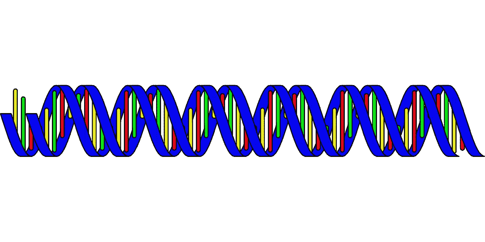
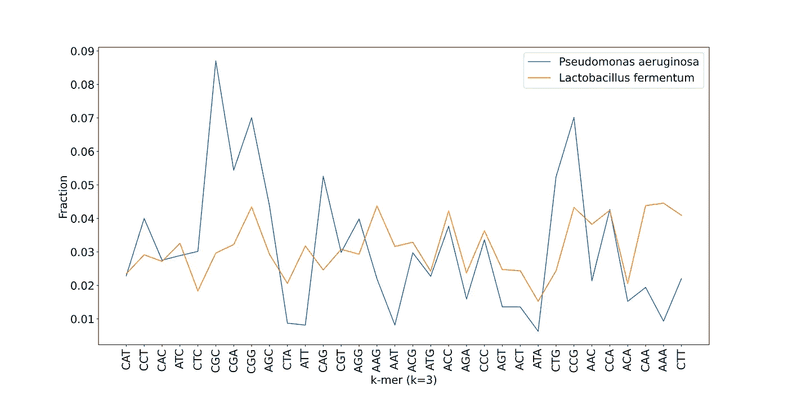

# 基因组学的机器学习

> 原文：<https://towardsdatascience.com/machine-learning-for-genomics-c02270a51795?source=collection_archive---------14----------------------->

## 如何转换您的基因组数据以适应机器学习模型

机器学习已经普及。然而，它不是生物信息学和计算生物学领域的常见用例。使用机器学习技术的工具非常少。大多数工具都是在确定性方法和算法的基础上开发的。在这篇文章中，我将介绍我们如何安排我们的数据，以便在机器学习模型中有效地使用它们。



图片来自 [Pixabay](https://pixabay.com/?utm_source=link-attribution&utm_medium=referral&utm_campaign=image&utm_content=296744) 的 [Clker-Free-Vector-Images](https://pixabay.com/users/Clker-Free-Vector-Images-3736/?utm_source=link-attribution&utm_medium=referral&utm_campaign=image&utm_content=296744)

# 应用领域

在基因组学中有很多场景我们可能会用到机器学习。聚类和分类的主要领域可用于基因组学的各种任务。其中一些如下:

## 聚类(无监督学习)

1.  宏基因组重叠群的宁滨
2.  质粒和染色体的鉴定
3.  聚类读入染色体，以便更好地组装
4.  作为读取集合的预处理器的读取聚类

## 分类(监督学习)

1.  将较短的序列分类(门、属、种等)
2.  序列的系统发育推断
3.  质粒和染色体的检测
4.  寻找编码区域
5.  人类基因组学中的染色体预测

虽然我已经列出了几个我有经验的领域，但是这个清单可能还会更长。

# 数据转换和模型选择

在转换和模型选择这两个步骤中，我认为前者更重要。这是因为如果没有数据表示的坚实基础，我们可能无法从模型中获得最大收益。然而，即使我们的模型看起来很差，拥有干净和信息丰富的数据也可以表现得更好。我们可以考虑两类数据。

## 顺序数据

顺序数据是指输入模型的数据顺序与数据集中数据的实际顺序相对应的数据。让我们看看下面的例子。

1.  蛋白质编码区的预测
    在这个场景中，我们将会看到连续的核苷酸碱基和它们的顺序。否则就没有意义了。在这种情况下，我们可以将数据转换为包含连续的**三聚体单词**的句子。
2.  分类标签预测
    在这种情况下，我们需要更高的精确度，因为寡核苷酸频率在物种之间可能非常相似，而在某些物种之间具有非常低的唯一性。因此，我们将着眼于创建大于 5 或 7 的 **k** 值的 **k-mer** 句子。

让我们考虑下面的例子。我将使用两个物种**铜绿假单胞菌(** CP007224.1) 和**发酵乳杆菌** (AP008937.1) 来演示转化为 **k-mer** 单词句子(显示了前 50 个碱基)。

```
**Pseudomonas aeruginosa** TTTAAAGAGACCGGCGATTCTAGTGAAATCGAACGGGCAGGTCAATTTCC**Lactobacillus fermentum** TTGACTGAGCTCGATTCTCTTTGGGAAGCGATCCAAAATTCATTCCGTAA
```

现在，我们可以将其转换为三聚体单词，如下所示。

```
**Pseudomonas aeruginosa** TTT TTA TAA AAA AAG AGA GAG AGA GAC ACC CCG CGG GGC GCG CGA GAT ATT TTC TCT CTA TAG AGT GTG TGA GAA AAA AAT ATC TCG CGA GAA AAC ACG CGG GGG GGC GCA CAG AGG GGT GTC TCA CAA AAT ATT TTT TTC TCC**Lactobacillus fermentum** TTG TGA GAC ACT CTG TGA GAG AGC GCT CTC TCG CGA GAT ATT TTC TCT CTC TCT CTT TTT TTG TGG GGG GGA GAA AAG AGC GCG CGA GAT ATC TCC CCA CAA AAA AAA AAT ATT TTC TCA CAT ATT TTC TCC CCG CGT GTA TAA
```

现在我们有了单词的句子，处理过程变得类似于情感分析。关键的想法是保持句子的长度，你可以根据序列的平均长度来决定。

## 适用于顺序数据的模型

由于上述场景中 k-mers 的顺序很重要，我们可以很容易地使用**递归神经网络(RNN)** 或**长短期记忆模型(LSTM)** 。这是因为它们能够将项目的顺序保持为一种时间关系。

然而，在上面的场景中，您必须使用标记化，然后是单词嵌入层。确保将编码器和记号赋予器保存到一个文件中(序列化),这样您就有了用于以后预测的编码器。这里 **kmer_strings** 是我创建的句子，**类**是指定的标签。

```
tokenizer = Tokenizer()
tokenizer.fit_on_texts(**kmer_strings**)
vocab_size = len(tokenizer.word_index) + 1
encoded_docs = tokenizer.texts_to_sequences(**kmer_strings**)binarizer = preprocessing.LabelBinarizer()
labels_encoded = binarizer.fit_transform(**classes**)
```

以下是我几天前使用 **Keras Sequential API** 进行序列分类时使用的一个模型。我将单词从最初的 32 个维度嵌入到 5 个维度中(有 32 个独特的三聚体合并了下游链的反向互补)。

```
model = Sequential()
model.add(Embedding(vocab_size, 5))
model.add(Bidirectional(LSTM(5)))
model.add(Dense(30, activation = 'relu'))
model.add(Dropout(0.2))
model.add(Dense(20, activation = 'relu'))
model.add(Dropout(0.2))
model.add(Dense(2, activation = 'softmax'))
```

如果您的分类是多标签，您需要使用 **sigmoid** 激活功能代替 **softmax** 功能。

## 无序数据

对于相似序列之间的相关性比序列的唯一可识别性更重要的情况，我们倾向于使用无序数据。这些通常以寡核苷酸频率向量的形式表示。例如，**铜绿假单胞菌(** CP007224.1) 和**发酵乳杆菌** (AP008937.1)的标准化频率如下所示。



两个物种的三聚体频率模式

我们可以看到它们遵循完全不同的模式。请注意，我们已经失去了三聚体的实际顺序，但留下了一个代表来唯一地识别这两个物种。然而，在 **k=3** 的时候，你很可能会遇到近亲物种之间的碰撞。这是一篇关于如何基于这些模式进行集群的有趣文章；

[](/composition-based-clustering-of-metagenomic-sequences-4e0b7e01c463) [## 基于组成的宏基因组序列聚类

### 基于寡核苷酸组成的宏基因组序列聚类

towardsdatascience.com](/composition-based-clustering-of-metagenomic-sequences-4e0b7e01c463) 

下面的文章可能会对如何非常有效地使用 DBSCAN 有所帮助。

[](/how-to-use-dbscan-effectively-ed212c02e62) [## 如何有效地使用 DBSCAN

### 有效使用最常引用的聚类算法的完整指南

towardsdatascience.com](/how-to-use-dbscan-effectively-ed212c02e62) 

现在您已经看到了数据，您可以使用类似于下面的模型来进行分类。

```
model = Sequential()
model.add(Dense(30, activation = 'relu', input_shape=(32,)))
model.add(Dropout(0.2))
model.add(Dense(20, activation = 'relu'))
model.add(Dropout(0.2))
model.add(Dense(2, activation = 'softmax'))
model.compile(loss='binary_crossentropy', optimizer='adam')
```

请注意，当您为此决定更长的 **k-mers** 时，您的输入维度将增加 **4** 的幂次。此外，计算如此长的向量也需要很长时间。您可能希望阅读下面的文章，这篇文章解释了如何使用一个简单易用的小脚本来实现这一点。

[](https://medium.com/computational-biology/vectorization-of-dna-sequences-2acac972b2ee) [## DNA 序列的矢量化

### ACGT 序列到 k-mer 频率向量的有效转换

medium.com](https://medium.com/computational-biology/vectorization-of-dna-sequences-2acac972b2ee) 

# 现有工具很少

现在，您已经看到了如何在机器学习模型中使用可变长度的基因组序列，让我展示几个实际做到这一点的工具。

1.  [plas class](https://github.com/Shamir-Lab/PlasClass/)([2020 出版，PLOS](https://journals.plos.org/ploscompbiol/article/comments?id=10.1371/journal.pcbi.1007781) )
    对 k-mer 频率向量使用逻辑回归来检测它们是否来源于质粒序列或染色体片段。这是一个基于二元分类的工具。
2.  [plas flow](https://github.com/smaegol/PlasFlow)([2018 出版，核酸研究](https://academic.oup.com/nar/article/46/6/e35/4807335) )
    该工具预测门级分类，预测给定的重叠群是质粒还是染色体。在 k-mer 频率向量上使用神经网络。
3.  [MetaBCC-LR](https://github.com/anuradhawick/MetaBCC-LR/) ( [出版，2020，生物信息学](https://doi.org/10.1093/bioinformatics/btaa441) )
    使用 t-分布式随机邻居嵌入(t-SNE)对基因组长阅读进行降维，以执行宏基因组阅读的三聚体向量的宁滨。

除了这几个工具(我用过的和我写的第三个)，在不同的研究领域有更多的工具。LSTMs 用于基因预测和编码区检测。

然而，机器学习技术在该领域有巨大的潜力可以展示。

我希望你读过一些有用的书。干杯！