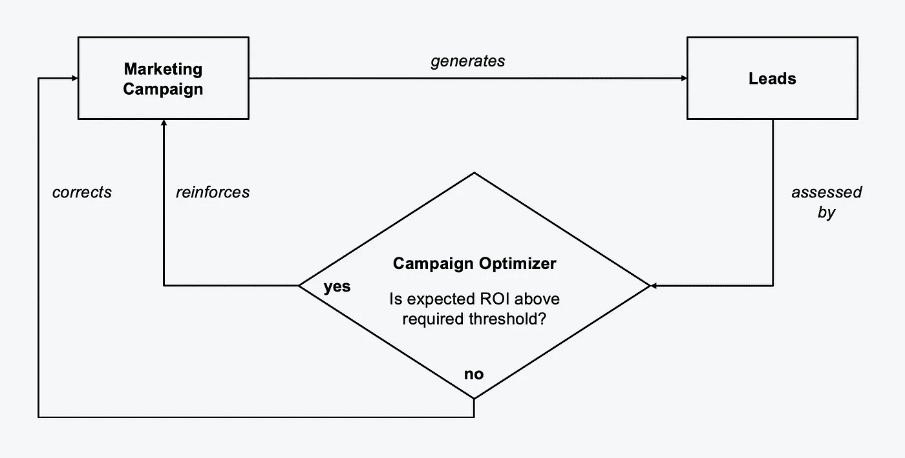
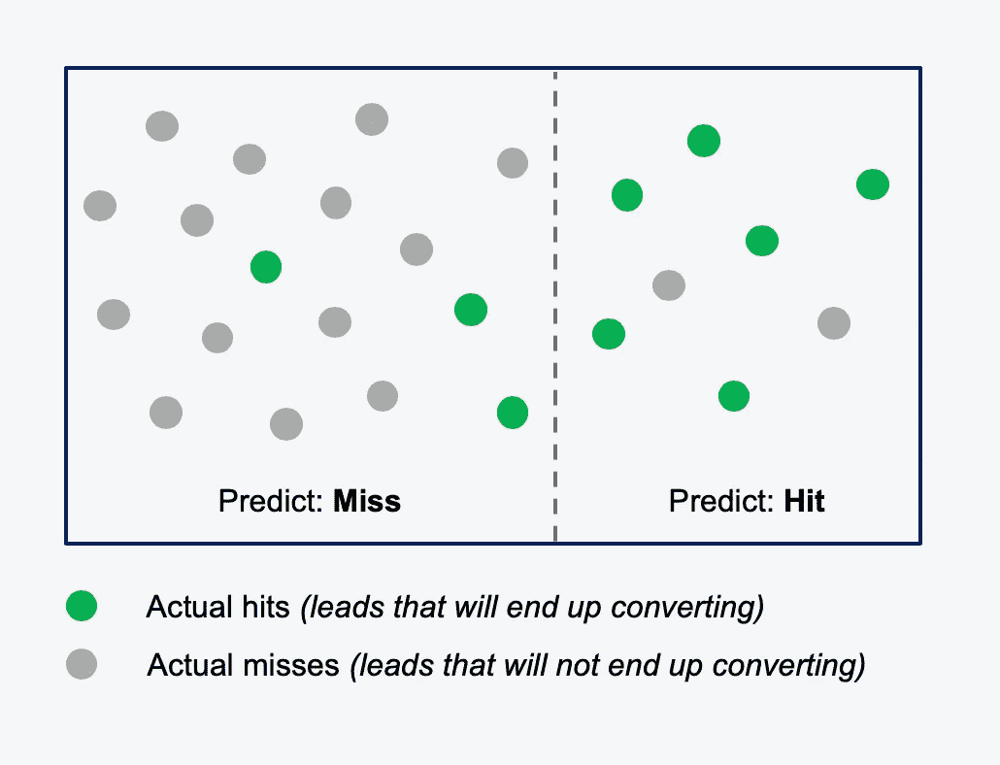
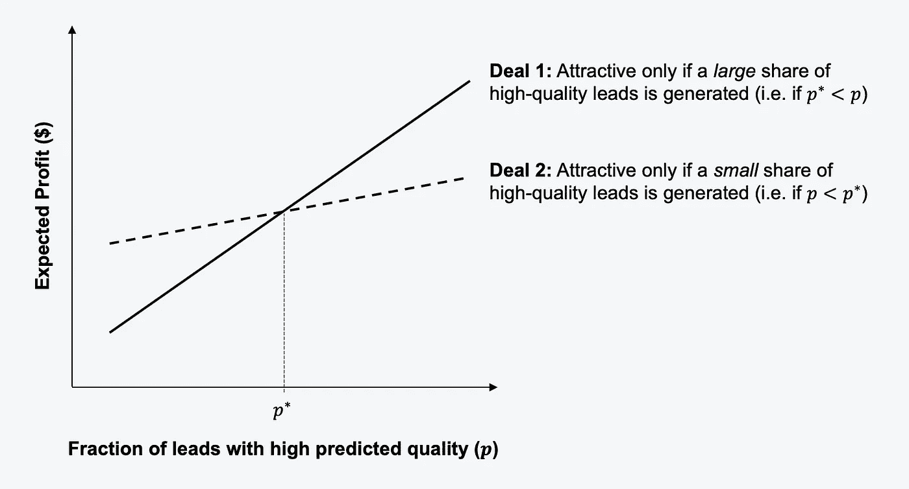

# 用于销售线索管理的机器学习

> 原文：<https://towardsdatascience.com/machine-learning-for-lead-management-4f15e52e732a?source=collection_archive---------12----------------------->

[斯科特·格雷厄姆](https://unsplash.com/@homajob?utm_source=medium&utm_medium=referral)在 [Unsplash](https://unsplash.com?utm_source=medium&utm_medium=referral) 上拍照

线索是许多企业的生命线。销售线索是接触潜在客户的起点。简而言之，“线索”代表关于潜在客户的记录，通常包括一些联系信息，如电子邮件地址和电话号码，还可能包括关于客户的其他属性(例如，产品偏好和人口统计数据)。营销和销售部门在*销售线索管理*上花费了大量的时间、金钱和精力，我们将采用这一概念来涵盖销售线索生成、资格认定和货币化这三个关键阶段。

在本文中，我们将探讨机器学习如何通过为智能、动态和高度可扩展的领导管理方法提供基础来为企业创造切实的价值。我们将使用一个案例研究来使讨论不那么抽象，更容易理解。

# 销售线索管理的三个关键阶段

在深入案例研究之前，至少有必要对我们将要考虑的销售线索管理的三个关键阶段有一个高度的了解:

*   *产生潜在客户*通常通过开展营销活动，让潜在客户了解企业正在销售的产品，并表明他们对这些产品的兴趣，从而产生一份长长的潜在客户名单。例如，在在线环境中，网站可能会询问您的电子邮件地址，以便您注册他们的邮件列表和时事通讯，并不时向您发送特殊产品报价和折扣。网站还可以收集行为跟踪数据(例如，您访问了哪些内容，访问的频率和时间)，并进行定期调查，以开发更丰富的线索档案。
*   *销售线索资格*是指根据各种标准对销售线索进行评估和优先排序。可能的标准包括容易获得或转换(客户对产品说“是”的可能性)、容易交付(企业是否有必要的资源和能力按要求向客户交付产品)、利润潜力(由于高度差异化的产品和客户的高支付意愿，企业可以实现的利润率的大小)和战略适合度(向这一特定客户群销售是否符合公司的战略)。
*   *销售线索货币化*着眼于从合格的销售线索中获取收入的可能方式。货币化的机会通常由业务范围(尤其是其在供应链中的位置和垂直整合的水平)和潜在的可扩展性决定。高度垂直整合的企业可以通过直接向潜在客户销售来实现销售线索的货币化；如果产品的利润率很高，这可能特别有利可图。处于供应链上游的纵向一体化程度较低的企业可以通过将合格的销售线索出售给拥有交付产品手段的下游企业来实现货币化。潜在的可扩展性将受到供应方因素(如生产能力和销售队伍的规模)和需求方因素(如市场规模、增长率、补充和替代产品的可用性)的制约。

# 个案研究

现在，我们将通过一个案例研究来了解机器学习如何在实践中应用于销售线索管理。我们的案例围绕着一个虚构的招聘机构 *Valiant Recruiters Ltd.* ，它帮助客户公司找到技术职位空缺的完美候选人。

Valiant 本质上是一家在线企业；它维护着一个全面的在线门户网站，提供当前的空缺职位，并通过在几个在线渠道，包括专业社交网站和其他求职网站上开展广告活动来吸引潜在的候选人。潜在候选人可以通过上传简历或直接联系 Valiant 招聘人员在 Valiant 的门户网站上注册；在每种情况下，都会在 Valiant 的候选人数据库中创建一个相应的销售线索档案。Valiant 专注于数据科学职位，通常会通过成功地将候选人安置在客户公司来获得可观的佣金。如果候选人由于任何原因(例如，没有合适的空缺，候选人的偏好超出了 Valiant 的专业领域，招聘人员满负荷工作)而无法转换，Valiant 保留将销售线索档案出售给选定的合作招聘机构(多面手和利基参与者)的选项，这些机构可能更适合转换销售线索。

因此，线索管理是 Valiant 商业模式的核心。作为数据科学业务的专家，Valiant 的首席执行官敏锐地意识到了使用机器学习来改善和扩展公司领导管理方法并最终提高底线的潜力。在过去的六个月里，首席执行官领导了一项计划，旨在确定和实施贯穿线索管理所有三个阶段(生成、资格认定和货币化)的高效机器学习用例。

## 创造更好的销售线索

Valiant 在围绕数据科学的宣传达到空前高潮之际推出了领先管理计划。数据科学家的工作仍然是一个相当新的现象，但行业专家已经将其誉为“21 世纪最性感的工作”(例如，见这篇 [HBR 文章](https://hbr.org/2012/10/data-scientist-the-sexiest-job-of-the-21st-century))。各公司都在争相招聘数据科学家，对 Valiant 招聘服务的需求非常火爆。与此同时，许多数据科学角色的定义松散但利润丰厚的性质是这样的，对于 Valiant 来说，仅仅产生线索不是问题——产生*好的*线索才是问题。Valiant 开展的任何营销活动似乎都会收到来自拥有广泛技能和经验的候选人的大量申请。然而，Valiant 汇编的统计数据显示，跨活动的销售线索转化率往往很低。大量的营销预算和招聘资源似乎被浪费在了不良线索上。

在这种背景下，Valiant 的首席执行官已经将营销活动的优化确定为机器学习的一个高影响力用例。特别是，该公司的一名常驻数据科学家承担了构建智能优化器的任务，以提高营销活动的绩效。图 1 显示了优化器在线索生成中的作用的简化概念视图。

图 1:优化营销活动的逻辑(来源:自有插图)

为了理解图 1 背后的逻辑，假设 Valiant 要进行一场营销活动，产生大量的销售线索。这些销售线索将由营销活动优化器根据其预期投资回报(ROI)是否高于某个阈值进行实时评估；在实践中，也可以使用 ROI 以外的性能指标。现在，如果新产生的潜在客户的预期投资回报率高于所需的阈值，优化器将向营销活动管理工具提供正面反馈，否则将提供负面反馈。正反馈告诉该工具加强当前的营销活动策略，而负反馈则是纠正营销活动策略，以便将来获得的销售线索能够根据需要清除预期的 ROI 阈值。

简单地说，这种情况下的投资回报率可能是成功安置候选人的佣金除以这样做的成本(包括招聘顾问花费的时间、起草合同的法律费用和其他管理费用)。但是，我们无法在销售线索产生时计算出销售线索的实际投资回报，因为我们不知道销售线索最终是否会转化。因此，*预期的*投资回报率根据潜在客户实际转化的概率来贴现投资回报率——这就是机器学习可以产生巨大影响的地方。通过使用已关闭销售线索及其结果的历史数据，Valiant 的数据科学家可以构建一个模型来预测新销售线索的转化概率。预期 ROI 需要清除的阈值可能与 Valiant 的首席执行官定期为公司设定的战略目标和关键成果(okr)相关。

此外，机器学习也是通过确定如何以及在何种程度上纠正或加强营销活动来操作反馈循环的关键；这需要将学习逻辑嵌入活动管理工具中，以便它能够对优化器的反馈做出有意义的反应，并随着时间的推移改进营销活动(例如，通过更好地跨渠道分配广告支出，并优化广告消息传递，以便对目标受众更有说服力)。

## 准确确认销售线索

一旦新产生的潜在客户进入 Valiant 的候选人数据库，他们需要尽快获得资格，以便招聘顾问知道如何进行。以下是 Valiant 的销售线索资格认定流程可能会考虑的一些基本问题:

*   **转换的容易程度:**该销售线索转换的可能性有多大，例如，我们能否将该候选人推荐给我们的某个客户，或者将该销售线索出售给合作招聘机构？这种销售线索转化的速度有多快？候选人是立即寻找新的角色，还是在六个月后？
*   **交付便利:【Valiant 转化该销售线索的难度(或工作量)有多大？公司有合适的顾问来指导候选人吗？候选人会不会太挑剔？**
*   **潜在利润:**这条线索能给 Valiant 带来多少利润？一旦有了线索，公司通常会收到相当于候选人在客户公司起薪 20%的佣金。因此，在其他条件相同的情况下，求职者在市场上的起薪越高越好。或者，将线索出售给合作机构会有多有利可图？
*   **战略契合度:**这种领导特征适合数据科学角色吗？还是更适合另一个角色(比如软件工程、业务分析、产品管理)？

虽然手动确认每个潜在客户有其优势(当潜在客户数量较低时，它可能更便宜、更有效)，但对于像 Valiant 这样快速增长、高数量的企业来说，它也有一些主要限制(不可能正确地手动审查每个潜在客户档案，并且依赖于人工参与使得难以快速高效地扩展)。此外，上述问题围绕易获取性、交付等。，往往一开始就不能高度肯定地回答。考虑到 lead qualification 问题固有的不确定性因素，该问题的自动化解决方案也应该理想地考虑这种不确定性。Valiant 的 CEO 强烈预感到，一个基于机器学习的解决方案可能正好符合要求。

首席执行官心目中的解决方案实际上相当于预测性销售线索资格。机器学习模型的合适的目标变量可以是转换的概率和转换的时间(作为转换容易程度的代表)、候选人和招聘顾问之间的交互的数量和长度以及所讨论的问题的复杂性(作为交付容易程度的代表)、通过将候选人安排在过去所实现的利润(作为潜在利润的代表)、以及从客户端招聘经理接收的关于过去的候选人对广告角色的适合性的反馈的性质(作为战略适合的代表)。这些结果的可能预测值可以从领导档案数据和 Valiant 可以访问的任何其他行为跟踪数据中得出。显然，一些结果和预测变量可能比其他变量更容易获得，因此数据收集和准备将是成功实现机器学习模型的关键。

现在，假设 Valiant 的数据科学家建立了一个模型来预测潜在客户的转化结果(即，公司是否能够成功安置候选人)。图 2 给出了这种模型可能实现的预测性能的简化视觉表示。从图中的快照可以看出，该模型总共对 25 个销售线索进行了分类(显示为点)。虚线右侧的引线被分类为潜在命中，而虚线左侧的引线被分类为潜在未命中；本质上，该模型已经预测了每个销售线索转化的概率，并且转化概率大于 50%的销售线索已经被分类为命中。此外，到目前为止，所有 25 条线索都已关闭，那些实际转换的线索(真实命中)显示为绿色，而那些没有转换的线索(真实未命中)显示为灰色。

图 2:销售线索资格模型的预测性能(来源:自有插图)

为了更好地感受图 2 所示模型的预测性能，Valiant 的数据科学家可以计算一些常用指标:

*   **准确性:**这反映了被正确分类为命中或未命中的线索数量，即(6 + 14) / 25 = 20 / 25 = 80%。
*   **精度:**这显示了有多少预测的命中结果后来变成了实际的命中结果，即 6 / (6 + 2) = 6 / 8 = 75%
*   **回忆:**这度量了模型正确预测为可能命中的实际命中数，即 6 / (6 + 3) = 6 / 9 = 67%

因此，我们看到该模型总体上具有较高的预测准确性，尽管其预测有点保守(比召回更精确)。通常需要考虑模型的精确度和召回率之间的权衡-更严格的模型往往会实现更高的精确度但更低的召回率，而更宽松的模型则相反。在 Valiant 的销售线索资格中，精确度和召回率都很重要。一旦推广了销售线索资格模型，招聘顾问就会被告知，首先要处理那些被预测为热门的销售线索(甚至可以按照潜在转换概率的降序排列)，然后再处理其余的线索。因此，高模型精度可确保顾问通过优先处理最终转化频率更高的潜在客户来充分利用他们的时间。然而，高召回率也很重要，因为忽略被模型错误地分类为错过的好线索会导致错过机会；这对于 Valiant 在一年中业务不景气的时候的财务表现尤其不利，因为招聘顾问很少有合格的销售线索。

最后，值得注意的是，根据上述任何资格标准(转换的可能性、交付的容易程度等)，销售线索的吸引力。)会随着时间而改变。通过每一次电话和会面，招聘顾问都有希望更好地了解候选人的偏好、技能和工作前景。在动态的业务环境中，客户端的需求也可能发生变化。即使是 Valiant 自己的战略重点也可能从仅仅安置数据科学家和数据工程师发展到还安置商业智能工程师和其他邻近角色。销售线索资格认定流程今天对某个销售线索的评分可能与一个月后不同。这一点的一个关键含义是，所有活动的销售线索都应经常重新存储，以反映销售线索档案和评估环境的变化。重新评分可以简单地在预定的、定期的基础上(例如，每周)发生，或者由特定事件的发生而触发(例如，与候选人的电话、新客户的获得、对 Valiant 的 OKRs 的改变)。

## 有效地将销售线索货币化

在确认销售线索后，Valiant 可以通过转换销售线索(成功安置候选人)或将销售线索出售给合作伙伴机构来实现盈利。机器学习至少可以通过五种关键方式推动货币化:*计划*行动、*定价*销售线索、*包装*销售线索、*向客户推销*销售线索以及*向合作伙伴机构传递*销售线索——我们可以称之为“销售线索货币化的 5p”。让我们依次看看这些 Ps。

**计划行动:**

为确认销售线索而构建的预测模型对于计划如何处理给定的销售线索非常有用。例如，如果某个销售线索在所有资格标准中排名都很高，那么给予它高优先级可能是有意义的；这可能意味着在其他线索之前处理它，并将其分配给 Valiant 的一位更有经验的招聘顾问，以增加成功关闭线索的机会。相比之下，如果求职者不适合数据科学职位和/或近期内不打算找新工作，那么在转换容易度、交付容易度和战略契合度等资格标准上，销售线索可能排名较低；在这种情况下，如果可能的话，Valiant 最好将销售线索出售给合作伙伴机构。

**定价线索:**

如果 Valiant 希望销售销售线索，能够为其分配货币价值就变得尤为重要。理论上，Valiant 可以从给定的销售线索中获取的最高销售价格是最高出价者愿意支付的价格。如果销售价格高于产生销售线索的成本，那么 Valiant 就能获利。然而，在一开始，Valiant 可能需要报出一个合适的价格，而不一定知道潜在潜在潜在潜在买家的支付意愿，这就是来自潜在买家资格认定阶段的预测模型可以再次派上用场的地方。特别地，引导价格可以通过跨资格标准的预测概率(或分数)来加权，以平均产生一定水平的利润。

为了了解这是如何工作的，为了简单起见，假设我们只关心潜在客户的转换是否容易。如果销售线索很容易转化(转化率超过某个阈值)，我们称之为“高质量”，否则称为“低质量”。实际上，我们可能期望高质量销售线索的销售线索生成成本和销售价格高于低质量销售线索。用数学术语来说，让 *C(高)*和 *C(低)*分别是高质量和低质量线索的线索生成成本，让 *R(高)*和 *R(低)*分别是 Valiant 可以从高质量和低质量线索中获得的现实销售价格或收入。如果预测生成的销售线索的一小部分 *p* 是高质量的，那么总预期利润将是 *p(R(高)-C(高))+ (1-p)(R(低)-C(低))*。至关重要的是，Valiant 可以切换公式中的杠杆( *p* 、 *R* 和 *C* )，以确定实现预期盈利水平的必要条件，并相应地为销售线索定价。

**封装引线:**

除了单独销售线索之外，Valiant 还可以将多个线索打包销售给有意愿的合作伙伴机构。在这种情况下，购买机构的支付意愿可能是铅包整体质量的函数。据推测，主要由高质量销售线索组成的包装可能会获得较高的价格，而销售线索购买者在不同的资格标准方面可能会有更具体的要求。拥有机器学习模型来预测多个资格标准的线索质量，将使 Valiant 能够很好地包装线索，以满足特定买家的定制要求。例如，Valiant 可以将具有某种预期的转换和交付简易性、盈利潜力等的销售线索打包在一起。

值得注意的是，虽然在人才招聘的背景下，以这种方式包装销售线索可能看起来很新颖，但这种做法在金融和保险等其他行业中实际上相当成熟，在这些行业中，销售线索包是使用复杂的数学模型构建的，以符合某些“风险概况”(例如，“AAA”，“BB”)—Valiant 可能会从这些行业借用一些概念来构建自己的销售线索包。

**向客户推销销售线索，向合作机构传递销售线索:**

机器学习可以用来帮助 Valiant 向客户推销线索，并以类似的方式将其传递给合作伙伴机构。在这两种情况下，Valiant 都面临着企业对企业(B2B)的交易场景。客户通常会将特定数据科学角色的人员配备外包给 Valiant，并附带特定条件(例如，员工的技能和经验水平、薪资范围、开始日期)。如果 Valiant 推荐了一位最终被录用的候选人，它就能获得佣金，不管 Valiant 在招聘过程中为寻找、审查和指导候选人付出了多少努力。因此，能够预测特定地区和时间范围内人才库的质量可以明确帮助 Valiant 决定是否值得与客户签订合同。与此同时，向合作伙伴机构销售线索意味着将 Valiant 的一些有限资源(招聘人员、预算、时间)从客户工作重新分配给销售线索——只有在特定背景下销售线索的预期价值高于从事客户工作时，这才有战略意义。同样，了解人才库可以帮助 Valiant 决定如何以最佳方式分配资源。

图 3 显示了预测模型如何指导战略性 B2B 交易。横轴根据具有高预测质量的线索的比例( *p* )来描述所生成的线索的质量(例如，在特定城市和一年中的特定时间)。纵轴显示了给定交易在不同的 *p* 值下的预期利润。图 3 示出了 Valiant 可能必须在两个示例交易之间进行选择的比较。请注意，尽管在 *p* 值较低的情况下，交易 1 不如交易 2 有吸引力，但一旦高质量销售线索的比例超过值 *p** ，交易 1 就会变得更有吸引力。在其他条件都相同的情况下，如果 Valiant 能够得出 *p** 和 *p* 的值，那么它就有可能做出合理的战略决策，这正是预测性销售线索资格模型的用途。

图 3:战略性 B2B 交易(来源:自有插图)

# 包裹

机器学习可以帮助企业产生更好的线索，以更高的准确性证明它们，并最终更有效地将其货币化。鉴于每个阶段的目标不同，机器学习帮助解决的问题以及解决方案的性能和局限性在三个阶段都有所不同。

值得注意的是，尽管 Valiant 是一家虚构的公司，旨在通过示例来帮助解释机器学习的价值，但 Valiant 在销售线索管理方面面临的问题，以及使用机器学习解决这些问题的机会，都牢牢植根于现实。事实上，Valiant 的案例研究代表了几个类似数据科学项目的某种风格化融合，我和其他人过去都参与过这些项目。除了招聘之外，从金融和保险到旅游和汽车零售的各种行业都可以从更智能和可扩展的领导管理方法中受益匪浅。

最后，虽然越来越有可能购买软件即服务(SaaS)解决方案来进行销售线索管理，但对于公司来说，推动自己的销售线索管理议程仍然很重要。除其他事项外，议程应阐明铅管理的动机(“为什么”)，规定 SaaS 系统的成功标准(例如，最低准确度、精确度等)。)，并将它们链接回战略 KPI(例如，转换率、利润等)。)这将是公司高管和投资者最关心的问题。