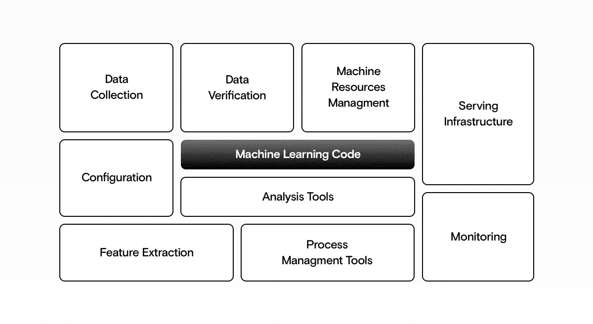
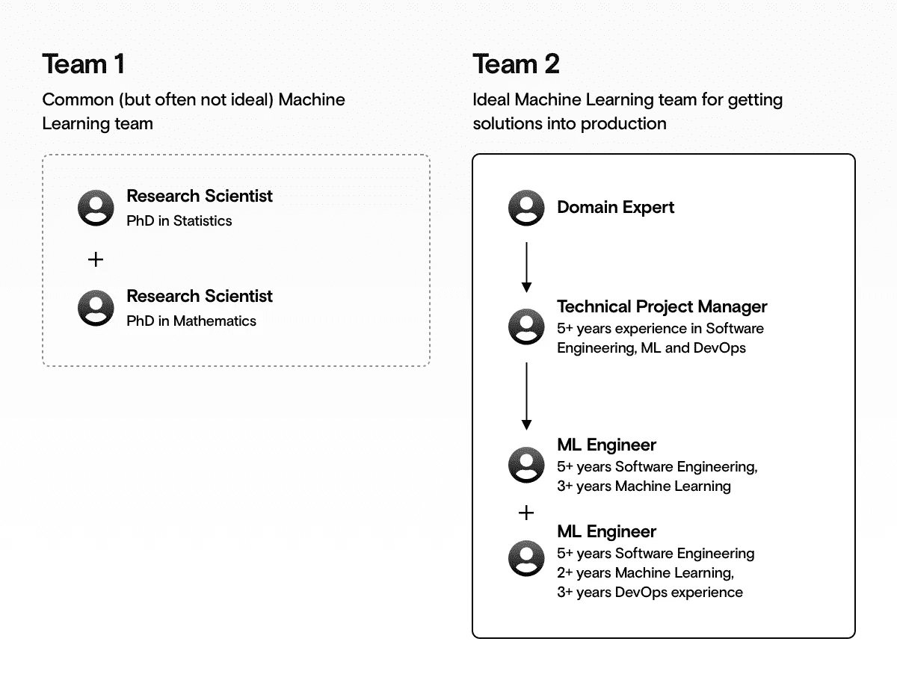

# 机器学习介绍——面向经理

> 原文：<https://towardsdatascience.com/machine-learning-for-managers-1599a26ca145?source=collection_archive---------35----------------------->

## 权威指南

## 机器学习项目成功所需的一切。

源作者

构建机器学习解决方案不同于构建通用软件解决方案。监督机器学习项目涉及一些独特的方面和潜在的陷阱。

在本指南中，我们将回顾交付一个成功的机器学习解决方案所需的所有见解。

对于更高层次的概述，也看一看[什么是人工智能？首席执行官需要知道的一切](https://www.datarevenue.com/en-blog/everything-a-ceo-needs-to-know-about-ai)和[人工智能的 4 个关键成功因素](https://www.datarevenue.com/en-blog/ai-project-success-factors)。

# 这篇文章是写给谁的？

这篇文章是为那些为大中型企业构建机器学习解决方案的人而写的。如果你想学习机器学习是为了好玩或者获取一般知识，那么自己或者和一个没有经验的团队建立一个概念证明是完全可以的。但我们将假设你的任务是建立一个大规模的机器学习项目，承担真正的风险(如果失败)并产生真正的价值(当成功时)。

# 什么是机器学习，为什么它很重要？

虽然机器学习可以在许多不同的领域增加巨大的价值，但它也经常被夸大。我们都看过科幻电影，人们可能会很容易认为机器学习是赋予机器人类水平的智能。事实上，虽然机器学习可以在许多方面帮助你，但最好将其视为一种分析数据的专门工具，而不是解决任何问题的灵丹妙药。

# 什么是机器学习？

[机器学习最终是在结构化数据中寻找模式](https://www.datarevenue.com/en-blog/the-3-basics-of-ai-no-math)并做出预测。这些可以是(而且经常是)对未来将要发生的事情的预测。但这不是你在机器学习解决方案中找到术语“预测”的唯一方式。通常这也意味着预测一些问题的答案，比如:“这张照片里是哪种狗？”后一种预测不是基于时间的预测(展望未来)，而是这样一种预测:“如果问这个特定的问题，一个无所不知的先知会给出什么答案？”

# 机器学习和传统软件有什么不同？

机器学习也可以认为是“从数据中学习”。传统的软件解决方案是围绕**演绎**构建的(一个聪明的人确定一组规则，并将它们编码为一系列 **if** 语句，然后这些规则可以应用于数据)，而机器学习解决方案是围绕**归纳**构建的(机器学习算法通过查看大量示例自动发现规则，然后这些规则可以应用于更多数据)。

> 传统的软件解决方案是围绕**演绎**构建的，而机器学习解决方案是围绕**归纳构建的。**

传统编程与机器学习——来源作者

# 机器学习和 AI 有什么不同？

作为题外话，我们将在整篇文章中使用术语“机器学习”，但在通常的用法中，术语“人工智能”或“AI”经常被代替使用。更详细的讨论见[机器学习 vs .人工智能。他们不是同一个](https://www.datarevenue.com/en-blog/the-difference-between-machine-learning-and-artificial-intelligence)。

# 为什么机器学习很重要？

机器学习，尤其是最近的进步，几乎肯定能给你的业务带来新的机会，无论你在哪个领域。机器学习受到如此多关注的原因之一是因为它被用于推动几个看似不相关的领域的突破，包括:

*   **图像处理**(比如面部识别)；
*   **声音处理**(例如，带字幕的自动字幕视频)；
*   **文本处理**(比如不同自然语言之间的翻译)；
*   **时间序列处理**(例如预测未来能源使用量)；
*   **数字建模**(例如，估算一栋房子的合理价格，或者某个特定客户购买某种产品的概率)。

这些领域中的每一个都扩展到更多的子领域(例如，我们用于面部识别的相同算法也可以在 X 射线中检测癌症)，更重要的是，非常相似的算法可以用于所有这些领域，这意味着一个算法的进步可以导致许多领域的进步。这适用于几乎每一个领域，包括[医药](https://www.datarevenue.com/en-blog/artificial-intelligence-in-medicine)、[营销](https://www.datarevenue.com/en-blog/machine-learning-for-marketing)、[金融](https://www.datarevenue.com/en-blog/machine-learning-in-finance)，以及[交易](https://www.datarevenue.com/en-blog/machine-learning-for-trading)。

这些领域中的机器学习都是由巨大的(并且不断增长的)数据集实现的。机器学习的改进释放了这些数据的更多价值，因此数据本身变得更有价值。随着对数据的更多关注，机器学习模型会进一步改进，从而形成良性循环。

# 机器学习是否很适合你的公司和项目？

机器学习有如此大的潜力，几乎每个公司都想使用它。但这并不意味着它总是一个好主意。

作为一名业务经理，你会面临两种风险:

*   迫使机器学习成为一种解决方案，在这种情况下，它不能增加价值，以努力保持现代化和相关性；
*   未能在解决方案中利用机器学习，而 it **会**增加价值。

虽然每种情况都是独特的，但关于机器学习是否对你的公司或项目有益，还是有一些好的经验法则。

## 机器学习解决方案可能非常适合的常见迹象。

*   你依靠人工来完成看似重复的任务。这些“重复性”任务通常没有完全定义，也不像看起来那样重复。例如，如果你雇佣一些人来撰写销售电子邮件或处理支持案例，机器学习解决方案可能能够帮助他们提高效率，但它无法取代他们，因为他们的许多任务都依赖于同情心和创造力。
*   你期望收集大量数据。团队抢先实施机器学习是很常见的，因为他们希望他们的应用程序一旦成功就能处理大数据。在这些情况下，最好先集中精力收集和组织数据，手动获得洞察力，然后在稍后阶段考虑机器学习**。**

## 机器学习解决方案可能不适合的常见迹象。

请记住，这些只是指导方针。几乎每个公司都能在某个地方找到[机器学习用例](https://www.datarevenue.com/en-blog/the-ai-machine-learning-usecase-checklist)。问题是你现在是否需要机器学习，投资回报率(ROI)会是多少。如果您的公司仍然很小，或者您只有一点点数据，您可能会从手动分析数据中获得更大的投资回报。但如果不是，机器学习很可能会帮你创造价值。

# 在生产中运行的机器学习解决方案实际上是什么样子的？

花 2-3 周时间拼凑一个 PoC(概念验证)可能很有诱惑力:一个可以接受你的公司拥有的一些数据并产生一些潜在有用的预测的模型。有数以百万计的教程向您展示如何使用一些标准库，用几行代码实现这一点，并且很容易认为生产您的模型会很容易。不会的。虽然许多人可能认为创建第一个模型会让他们走完 80%的机器学习解决方案之路，但之前构建和生产过机器学习解决方案的人会知道，PoC 更接近于**旅程的 10%**。

*   **数据**:用于发现已有模式，建立模型；
*   **代码**:用于定义和服务模型，并与其他服务集成；
*   **模型**:用于生成预测。

所有机器学习解决方案都可以大致分为三个概念:

机器学习解决方案:概念验证与生产-来源作者

在比较 PoC 和生产解决方案时，这三者看起来非常不同。

ML 解决方案中只有一小部分是真正的机器学习代码。-来源作者

生产解决方案也有更多的活动部分。概念验证通常涉及构建一个简单的模型，并验证它是否能够生成通过快速健全检查的预测。一切都可以在同一台机器上完成。相比之下，这只是生产流程的第一部分。在生产阶段，你需要一个强大的培训服务器和一个跟踪不同模型的良好流程。在将训练好的模型与您现有的生产服务集成之前，您需要一种方法来测试它们，大规模地执行推理，并监控一切以确保它们都是可靠的。最后，您将多次迭代这个过程，因为您可以改进数据、代码或模型组件。

# 你需要什么样的团队来生产机器学习解决方案？

当你在建立一个机器学习团队时，雇佣有学术背景的研究人员是很有诱惑力的。如果他们发明了新的机器学习算法，他们一定是使用这些算法的最佳人选，对吗？不总是。

雇用一名研究人员为你构建一个机器学习解决方案，通常就像雇用一名设计凯膳怡电器的人为你做饭一样。虽然研究人员提出了解决问题的新方法，并具有深厚的理论专业知识，但他们在使用现有工具、遵循良好的工程实践以及做出困难的时间/质量权衡方面往往缺乏更多的实践专业知识。

> 雇用一名研究人员为你构建一个机器学习解决方案，通常就像雇用一名设计凯膳怡电器的人为你做饭一样。

通常情况下，你希望有人能够使用现有的机器学习算法和工具——就像厨师使用标准食材和厨房电器熟练地拼凑出美味的一餐——而不是从头开始设计新工具。

术语仍然不完全一致，但你通常会找到至少一名**机器学习工程师**——专门为企业构建机器学习解决方案的人。

# 应该找还是建立一个机器学习团队？

你需要做出的主要选择是建立自己的机器学习团队还是聘请咨询公司。建立自己的团队可能需要很多年，如果你不需要立即看到结果，并且如果你希望机器学习成为你和你的竞争对手之间的**关键区分因素**，这可能是唯一正确的选择。

如果你建立了一个团队，你也可以选择提升现有员工的技能，而不是雇佣新员工。在这种情况下，您可能想知道是向您的数学家传授工程技能，还是向您的工程师传授数学和统计技能。无论哪种方式，这都是一个困难的飞跃，但一个好的工程师通常可以在大约 2 年内学到足够的数学和统计学知识(特别是如果他们已经有一些基础背景的话)，成为一个伟大的机器学习工程师，而统计学家通常需要更长的时间来掌握所有的工程背景和所需的工具集(通常在 5 年左右)。

有效的机器学习团队应该是什么样子——来源作者

一个好的机器学习团队不仅仅依靠机器学习工程方面的专业知识。软件工程、DevOps 和管理方面的专业知识同样重要，常见的结构可能如下所示:

在[数据营收](https://datarevenue.com)，我们团队的每个人都是机器学习工程师。这使我们比那些将机器学习视为达到目的的手段而不是目的本身的公司更有优势。但我们仍然花了 2 年的时间反复试验，建立了一个优秀的团队，花了 4 年时间，我们才完全相信我们招聘机器学习工程师的过程(我们现在每 150 名合格的申请人中就有 1 人被聘用)。

如果你认为人工智能是帮助你超越竞争对手的主要因素，那么建立一个团队是有意义的。如果机器学习只是让你达到顶峰的一部分，那么引入外部专家可能会更好。

但是雇佣中介也有风险，尤其是如果你雇佣了错误的中介。所以你需要知道[如何选择机器学习咨询公司](https://www.datarevenue.com/en-blog/how-to-choose-a-machine-learning-consulting-firm)。

# 机器学习项目的理想结构是什么？

仅仅构建机器学习解决方案的技术部分本身就具有挑战性。组织好整个项目需要商业和技术技能的罕见结合，在你开始之前，你会想好[一个好的工作流程](https://www.datarevenue.com/en-blog/machine-learning-workflow)的所有不同阶段。

规划一个机器学习项目最重要的事情之一就是**考虑到生产进行规划。如果你的目标是概念验证，那么这就是你将得到的。虽然这是一个好的开始，但是您希望从事 PoC 工作的人员不断地优先考虑投入生产的目标。**

PoC 和生产之间的一个很好的中间阶段是**试生产**阶段。这看起来几乎完全像一个生产解决方案，但它可能在范围、面向多少用户或使用多少数据方面受到限制。

从一开始，你就应该仔细构建研究和实验阶段的结构和时间表。重要的是，每个人都知道目标是:“x 天内我们能得到的最好的模型是什么？”而不是“我们能得到的最好的模型是什么？”否则，你将永远陷入“再做一次实验”的怪圈。

弄清楚闪亮的新机器学习解决方案将会影响到公司的哪些内部和外部部门也是至关重要的。如果你要替换另一个团队开发的非机器学习解决方案，请记住，他们可能会依赖他们的方法。“此处未开发”是一个很难跨越的障碍，无论是在您公司内部的团队之间，还是在外部团队和您的团队之间。

在你开始建造之前，确保你的模型可以缩放。通常，一个解决方案在 PoC 甚至是试点阶段都工作得很好，但是机器学习解决方案具有密集和独特的资源需求，如果没有适当的规划，它很容易淹没您的基础架构。确保您的解决方案足够高效，可以扩展到在您的完整数据集上进行培训，并处理您希望它上线后收到的请求数量。

在更高的层面上，确保你在开始之前已经考虑了我们的[机器学习项目清单](https://www.datarevenue.com/en-blog/machine-learning-project-checklist)中的一切。

# 为什么你仍然可能失败:常见的陷阱

*   **人们可能不信任你的模型:**即使你的模型产生了非常准确的预测，如果你不能解释你是如何得到答案的，也很难赢得你的团队和你的客户的信任。在你致力于机器学习解决方案之前，你应该理解任何关于可解释性和可解释性的硬性要求。在某些领域，比如药理学，可解释性也可能是一个法律要求。
*   **你可能会构建一个不可维护的解决方案**:仅仅有一个现在可以工作的模型是不够的。您的解决方案需要维护、更新和修复。您将需要一个良好的管道来将模型、代码和数据的更改引入到未来的生产中，否则您将会得到一个今天有效明天无效的模型，并且在您的需求发生变化时无法修复。拥有一个已经犯过这些错误并从中吸取教训的有经验的团队是避免这种情况的好方法。
*   **你的模型可能过于复杂:**即使你的模型产生正确的结果，在构建机器学习解决方案的所有工作完成之后**发现一个更简单的解决方案也是令人惊讶的。例如，您的研究可能会发现，您可以通过查看一年前同一天的价格来预测价格。因此，在您构建任何模型之前，您应该首先创建最合理的基线，并在项目期间将其用作基准测试。**
*   **你的模型可能会伤害或威胁某个特定的业务部门:**虽然机器学习通常会增强而不是取代人类的才能，但在某些情况下，人们可能会将你的解决方案视为对他们工作的威胁。例如，一个金融专业人员的整个职业生涯可能围绕着寻找数据模式，也许你的模型自动化了其中的每一个方面。坦率地说出你的模型的目标是什么，以及它是否会影响你公司现有的角色。与你的团队讨论他们的角色可能会如何改变，以及使用 ML 来完成一些更单调乏味的任务如何能让他们专注于算法不能做的事情。
*   **外部因素可能会发生变化:**机器学习解决方案自然对它们接受训练的数据非常敏感。如果外部事件意味着当前数据与历史数据非常不同，您可能会看到模型的可靠性急剧下降。例如，根据 2019 年 4 月的时态数据训练的模型在 2020 年 4 月可能非常不准确，因为新冠肺炎危机打破了许多模式和预期。
*   **你的模型可能会显示偏差:**在机器学习训练的数据中存在人类偏差是很常见的。例如，美国司法程序中用来决定提前释放哪些囚犯的 COMPAS 系统被[发现有明显的种族偏见](https://www.propublica.org/article/machine-bias-risk-assessments-in-criminal-sentencing)。如果你的机器学习解决方案存在偏见，尽早发现这一点是至关重要的，而不是在项目投入生产后就关闭整个项目。

我们已经提到了陷入 PoC 阶段的危险，有错误的团队，或者当机器学习不适合特定问题时使用机器学习。但是在前进之前，您应该知道更多潜在的陷阱:

构建机器学习解决方案肯定是一项艰巨的任务！我们希望你读完这篇文章后会对此更有信心。

【https://www.datarevenue.com】最初发表于**。**