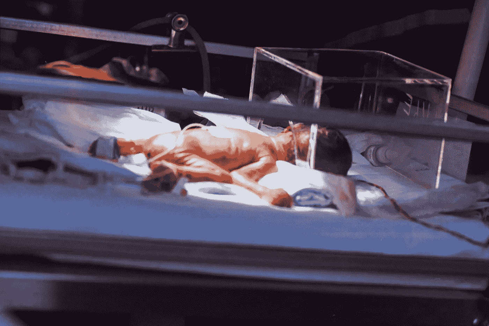
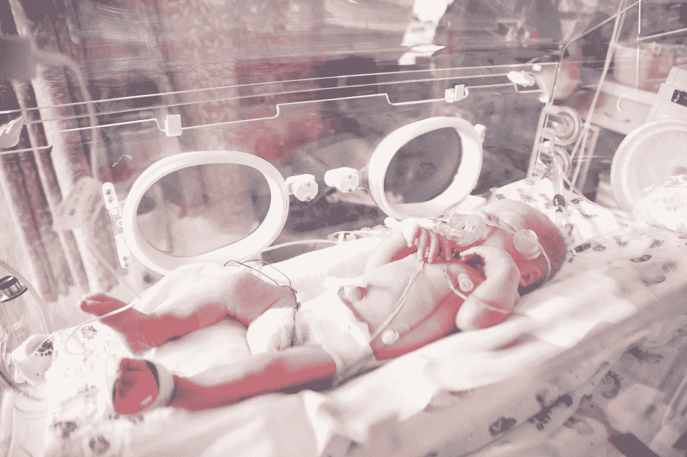

# 新生儿重症监护的机器学习

> 原文：<https://towardsdatascience.com/machine-learning-for-neonatal-intensive-care-15b3874da1f6?source=collection_archive---------43----------------------->

## 告知最困难的决定

由 [Unsplash](/s/photos/nicu?utm_source=unsplash&utm_medium=referral&utm_content=creditCopyText) 上的 [Hush Naidoo](https://unsplash.com/@hush52?utm_source=unsplash&utm_medium=referral&utm_content=creditCopyText) 拍摄的照片

*一个微小的新人类被机器和传感器包围着。一位医生担忧地看着。她知道几率。*

[*29%*](https://pediatrics.aappublications.org/content/139/3/e20161821) *。*

*23 周出生婴儿的存活率。她把想法放在一边，做她能做的事。*

# NICU 内部

[新生儿重症监护病房(NICU)](https://en.wikipedia.org/wiki/Neonatal_intensive_care_unit) 是一个做出改变人生决定的环境。新生儿学家使用各种来源的信息来构建新生儿的状况图，以确保他们得到正确的医疗护理。这些训练有素的专家根据源源不断的患者数据做出判断，以确保尽可能多的婴儿能够随父母回家。

正确解读这些海量数据并确定适当的护理是一项极其困难的任务。然而，机器学习正被用来识别和开发可以增强这些决策过程的方法。在这个最重要的领域，机器学习被应用于改善患者结果的方式有四种。

## 预测出生窒息

当婴儿在分娩过程之前、之中或之后缺氧时，就会发生出生窒息，这是五岁以下儿童死亡的第五大原因。它与同样大量的死产有关，并且由于由此导致的器官损伤，经常会导致长期残疾和损伤。

在设备齐全的医院，这种情况的诊断是通过观察血液中的酸水平，使用试探法，如[阿普加试验](https://www.ucsfbenioffchildrens.org/tests/003402.html)，并通常寻找其他神经问题或呼吸窘迫的迹象。尽管有这些程序，症状可能并不总是立即明显，直到为时已晚。特别是，某些发展中国家的医院可能不具备能够进行常规决定性测试的设备或基础设施。

[**乌本瓦**](https://www.ubenwa.ai/) 是一款移动应用，使用语音识别领域的技术来检测新生儿哭声中出生窒息的早期迹象。2015 年，Charles Onu 开发了一个[原型基于支持向量机的机器学习模型](https://arxiv.org/abs/1808.08299v1)，它可以在实验室环境中以 89%的准确率对已知窒息婴儿的记录进行正确分类。2017 年，查尔斯和他的团队将这个模型构建成了一个[原型移动应用](https://arxiv.org/abs/1711.06405v1)，有可能成为一个广泛可用的工具，可以部署到资源匮乏的环境中。

一个主要障碍是缺乏窒息婴儿的临床注释数据(即哭声记录)。查尔斯和乌本瓦大学的其他人最近探索了一个想法，即[迁移学习可以用来](https://arxiv.org/abs/1906.10199v3)应用从成人言语中习得的表征，以克服训练数据的缺乏。

## 检测癫痫发作

新生儿癫痫发作是一种需要紧急护理的严重疾病——如果癫痫发作未被发现和治疗，可能会导致脑损伤甚至死亡。与较大的儿童和成人不同，婴儿的癫痫症状在临床上并不总是可见的，这使得他们很难被发现。

唯一可靠的检测方法是通过[脑电图](https://en.wikipedia.org/wiki/Electroencephalography)或 EEG 监测大脑的电活动——但这些信号是不断产生的，通常需要训练有素的专业人员来正确解释输出。

在 2011 年， **Temko 等人**发表了[一篇论文](https://doi.org/10.1016/j.clinph.2010.06.034)，他们在论文中训练了另一个基于支持向量机的模型，将脑电图活动片段分类为癫痫发作/非癫痫发作事件。他们的模型能够在测试脑电图数据中检测到高达 100%的癫痫事件——尽管有一些假阳性结果。然而，该模型的灵敏度可以根据可以容忍的假阳性的数量来调整。调整到没有假阳性指示的水平，该模型仍然能够检测超过 50%的癫痫发作，这仍然是一个重要的和有希望的成就。

莎伦·麦卡琴在 [Unsplash](/s/photos/nicu?utm_source=unsplash&utm_medium=referral&utm_content=creditCopyText) 上的照片

## 脓毒症的早期识别

当身体对感染反应过度，随后的免疫反应开始对身体自身的器官和组织造成损害时，就会发生脓毒症。这种情况与高死亡率有关，并且可能是如此具有破坏性，以至于被认为有风险的新生儿通常被尽快给予抗生素，直到败血症被排除。相对较少的足月儿(不是早产的婴儿)会受到败血症的影响，但是早产儿的风险要高得多。三分之一的极早产儿(出生时胎龄小于 28 周)在重症监护期间会发生败血症。
早期诊断对于最大限度地提高良好临床结果和恢复的机会至关重要，但诊断脓毒症的困难在于其迹象是非特异性的——也就是说，许多其他疾病和状况都可能产生类似的症状。

2019 年， **Masino 等人** [开始研究](https://www.ncbi.nlm.nih.gov/pmc/articles/PMC6386402/)机器学习模型是否可以用来在婴儿败血症被临床怀疑前四小时识别它。他们在 30 个特征上训练了 8 个不同的机器学习模型，这些特征是在领域专业知识的帮助下选择的。从婴儿身上收集的这些特征包括生命体征、临床评估结果以及从各种实验室程序(如血液测试)中获得的值。发现八个模型中的六个表现良好，实现了 0.85-0.87 的 AUC。进一步的研究正在进行中，以确定这些模型是否可以在试验中提高临床效率。

## 预测呼吸窘迫综合征

新生儿呼吸窘迫综合征(NRDS)是生命第一个月死亡的主要原因之一。即使在发达国家，死亡率也可能高达 60 %( T10 ),而且很大一部分存活下来的婴儿仍然会发展成改变生活的障碍。 [NRDS 发生在 10%的早产儿身上](https://www.amboss.com/us/knowledge/Neonatal_respiratory_distress_syndrome)，通常发生在婴儿尚未产生足够的肺部所需物质来防止气道塌陷的时候。在严重的情况下，需要机械通气。

2016 年，数字诊断公司 [**SIME Dx**](https://simedx.com/) 宣布，它已经开发出一种测试，可以[准确预测哪些婴儿有患呼吸窘迫综合征的风险](https://onlinelibrary.wiley.com/doi/10.1111/apa.13683)。这项测试利用了一种装置，该装置使一束红外光穿过胃液样本——一种通常从出生婴儿身上采集的物质。一个独特的签名产生了，然后通过管道进入 SIME 的人工智能工具，以高度的灵敏度预测 NRDS。反过来，这使医生能够判断哪些婴儿需要治疗，哪些不需要，确保及时护理，减少不必要的程序。2018 年，SIME 宣布了一种完全自动化测试的新设备，目前正在商业化的道路上。

# 结论

看到一个戴着呼吸机的小婴儿，人们不禁感到一阵激动，也许还有一种宇宙不公平感。除了我们保护和支持孩子的进化本能，每一个新生命都伴随着一种更深刻的价值感。那双不可思议的明亮而好奇的眼睛是一个光圈，背后隐藏着难以想象的无价潜力。一套独特的想法和观点将会改变世界。每一个不能被拯救的婴儿都是全人类的损失。

如果我们能提高 NICU 婴儿的存活率——哪怕只有一个百分点——谁知道会带来什么新的想法和观点。机器学习和人工智能可以帮助我们释放这种潜在的人类潜力，一次一个模型。

## 更多信息和积分

Andrew Hetherington 是英国伦敦的一名见习精算师和数据爱好者。

*   在 [LinkedIn](https://www.linkedin.com/in/andrewmhetherington/) 上与我联系。
*   在 andrewhetherington.com 查看我的网站。
*   看看我在 [GitHub](https://github.com/andrewhetherington/python-projects) 上摆弄什么。

图片:婴儿在保育箱里，由 Hush Naidoo 拍摄。戴着氧气面罩的婴儿。