# 用于股票预测的机器学习。定量方法

> 原文：<https://towardsdatascience.com/machine-learning-for-stock-prediction-a-quantitative-approach-4ca98c0bfb8c?source=collection_archive---------4----------------------->

## 训练用于股票价格预测的多个模型并分析它们的结果


马库斯·斯皮斯克在 [Unsplash](https://unsplash.com?utm_source=medium&utm_medium=referral) 上的照片

使用机器学习来预测**股价**可能具有挑战性，而**可能很难**。模拟股票价格的动态可能很难，在某些情况下，甚至是不可能的。

在本文中，我将介绍一些使用机器学习预测股票价格的技术。我们将看到一些模型的运行，它们的性能以及如何**改进**它们。所有的计算都将使用著名的 Pandas、NumPy 和 Scikit-learn 库在 Python 中完成。

# 数据准备

对于这个例子，我将使用**微软**过去 10 年的每日股票价格，从**雅虎财经**下载 CSV 格式。除了交易量之外，该数据集还包括最高价、最低价、开盘价和调整后的收盘价。

首先，让我们加载数据集。为了简单起见，我将用“调整后收盘价”来代替“收盘价”。

```
df = pd.read_csv("MSFT.csv",index_col=0)df['Close'] = df['Adj Close']
df = df.drop("Adj Close",axis=1)
```

# 生成输入要素

价格本身不足以产生有用的预测。对于本例，我将添加**以下指示器**，它们将用作我们模型的**输入**:

*   移动平均线(最近 *N* 天的平均价格)
*   布林线(移动平均线加上或减去一定量的标准差)
*   唐奇安通道(过去 *N* 天的滚动最高价和最低价)

我们再加上**周期为 5，10，20，50，100 200 的简单均线**。

```
for sma_period in [5,10,20,50,100,200]:
    indicator_name = "SMA_%d" % (sma_period)
    df[indicator_name] = df['Close'].rolling(sma_period).mean()
```

现在让我们添加**布林线**，设置如下:

*   20 个周期，2 个标准差
*   20 个周期，1 个标准差
*   10 个周期，1 个标准差
*   10 个周期，2 个标准差

```
df['BollingerBand_Up_20_2'] = df['Close'].rolling(20).mean() + 2*df['Close'].rolling(20).std()df['BollingerBand_Down_20_2'] = df['Close'].rolling(20).mean() - 2*df['Close'].rolling(20).std()df['BollingerBand_Up_20_1'] = df['Close'].rolling(20).mean() + df['Close'].rolling(20).std()df['BollingerBand_Down_20_1'] = df['Close'].rolling(20).mean() - df['Close'].rolling(20).std()df['BollingerBand_Up_10_1'] = df['Close'].rolling(10).mean() + df['Close'].rolling(10).std()df['BollingerBand_Down_10_1'] = df['Close'].rolling(10).mean() - df['Close'].rolling(10).std()df['BollingerBand_Up_10_2'] = df['Close'].rolling(10).mean() + 2*df['Close'].rolling(10).std()df['BollingerBand_Down_10_2'] = df['Close'].rolling(10).mean() - 2*df['Close'].rolling(10).std()
```

最后，让我们加上均线周期相同的唐契安通道。

```
for channel_period in [5,10,20,50,100,200]:
    up_name = "Donchian_Channel_Up_%d" % (channel_period)
    down_name = "Donchian_Channel_Down_%d" % (channel_period)

    df[up_name] = df['High'].rolling(channel_period).max()
    df[down_name] = df['Low'].rolling(channel_period).min()
```

现在我们想在**的几个时间滞后**中使用所有这些功能(即最后一天、最后两天等等)，所以我们需要**将**全部延迟一些时间。对于本例，我们将把它们从 1 天改为 10 天。

```
newdata = df['Close'].to_frame()
for lag in [1,2,3,4,5,6,7,8,9,10]:
    shift = lag
    shifted = df.shift(shift)
    shifted.columns = [str.format("%s_shifted_by_%d" % (column ,shift)) for column in shifted.columns]
    newdata = pd.concat((newdata,shifted),axis=1)
```

看一下数据集，我们现在会注意到像 SMA _ 5 _ shifted _ by _ 3 这样的特征。意思是“前 3 天计算的 5 期移动平均线”。

最后，我们将创建**目标变量**，这是我们希望**预测**的数字。对于这个例子，假设我们想预测未来 5 天的收盘价。

```
forward_lag = 5newdata['target'] = newdata['Close'].shift(-forward_lag)
newdata = newdata.drop('Close',axis=1)newdata = newdata.dropna()
```

我们现在有了**大量的**数据(2302 行× 311 列)，如下图所示。

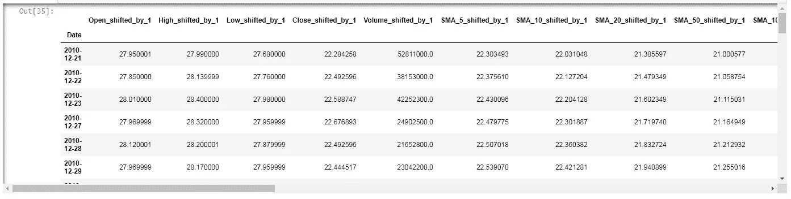

# 在训练集和测试集中拆分

像往常一样，我们将把数据集分成**训练**和**测试**集。训练集将用于训练我们的模型并调整**超参数**，而测试集将仅用于**性能**计算。

随机执行分割**。**

```
X = newdata.drop("target",axis=1)
Y = newdata['target']X_train, X_test, y_train, y_test = train_test_split(X, Y, test_size=0.3, random_state=42)
```

# **特征选择**

**310 个特性是一个很大的数字。只拿**最重要的**非常有用。对于本例，我们将根据每个特征和目标的**皮尔逊相关系数**的绝对值对特征进行排序。这个想法是只选择与目标最相关的 50 个特征。**

```
correlations = np.abs(X_train.corrwith(y_train))features =  list(correlations.sort_values(ascending=False)[0:50].index)X_train = X_train[features]
X_test = X_test[features]
```

**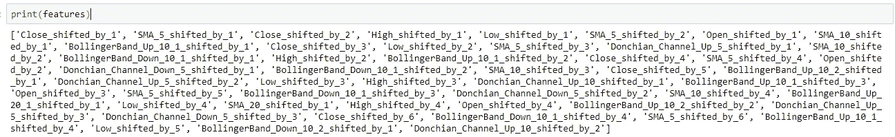**

**现在我们可以从模型开始。**

# **线性回归**

**先说有史以来最简单的回归模型，那就是**线性回归**。**

**首先，我们将训练模特。**

```
lr = LinearRegression()lr.fit(X_train,y_train)
```

**然后我们计算模型的**预测**。**

```
y_pred = lr.predict(X_test)
```

**预测可以与真实测试集数据进行比较，以计算**预测误差**。对于这个例子，我将使用**平均绝对误差**。**

```
mean_absolute_error(y_test,y_pred)
```

**误差为 1.325**

**我们最终可以绘制测试集的**真实值**和**预测值**来检查它们是否位于穿过 0 的 45°线上**

```
plt.scatter(y_test,y_pred)
plt.xlabel("Real")
plt.ylabel("Predicted")
plt.title("Linear regression")plt.show()
```

**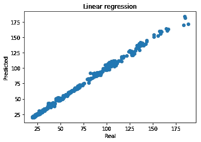**

**如你所见，真实值和预测值非常相似。**

# **随机森林**

**下一个模型是来自 sklearn 库的**随机森林回归器**。**

**由于随机森林模型有许多**超参数**，通过**随机搜索**微调它们是有用的。我们要调整的超参数是**树的数量**和**特征的数量**。**

**我们将使用 **5 重交叉验证**执行 20 步随机搜索，计算每重的平均绝对误差，然后在 5 重中取平均值。最小化误差(即最大化带负号的误差)的超参数值是**最佳**值。**

```
rf = RandomizedSearchCV(RandomForestRegressor(),
param_distributions =  {
                  'n_estimators':np.arange(10,500,5),
                  'max_features':np.arange(1,10,1)
               },
                  cv=5, n_iter = 20,
                  iid=False,random_state=0,refit=True,
                  scoring="neg_mean_absolute_error")rf.fit(X_train,y_train)
```

**超参数的最佳值是:**

**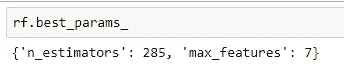**

**用用于线性回归的相同代码计算的平均绝对误差是 0.868**

**这是散点图。**

****

**随机森林显示出比线性回归更低的误差。**

# **梯度推进树回归器**

**我们现在可以尝试使用**梯度推进树回归器**，它使用**推进**技术来提高模型精度。**

**我们仍然有**两个超参数**，它们是在提升序列中使用的树的数量和特征的最大数量。**

```
gb = RandomizedSearchCV(GradientBoostingRegressor(),
param_distributions =  {
               'n_estimators':np.arange(10,500,5),
               'max_features':np.arange(1,10,1)
            },
          cv=5, n_iter = 20,
          iid=False,random_state=0,refit=True,
          scoring="neg_mean_absolute_error")gb.fit(X_train,y_train)
```

**超参数的最佳值是:**

**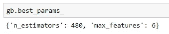**

**平均绝对误差为 0.916，下面是散点图。**

**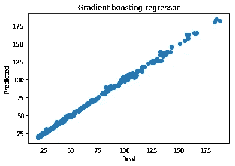**

**GBR 是一个很好的模型，但有一个**略高于**随机森林的误差。**

# **k 个最近邻居**

****KNN** 在许多应用程序中是一个非常强大模型，我们将在这个例子中使用它。我们将最近邻从 1 更改为 20，并将评分公式从“统一”(每个邻居都具有相同的权重)更改为“距离”(每个邻居都由它与输入向量之间的距离的倒数进行加权)。**

**由于这个超参数空间非常小，我们可以很容易地使用**网格搜索**来代替随机搜索。**

```
knn = GridSearchCV(KNeighborsRegressor(),
param_grid =  {
            'n_neighbors':np.arange(1,20,1),
            'weights':['distance','uniform']
            },
          cv=5, 
          iid=False,refit=True,
          scoring="neg_mean_absolute_error")knn.fit(X_train,y_train)
```

**最佳值是:**

**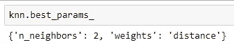**

**平均绝对误差为 0.830，这是散点图。**

**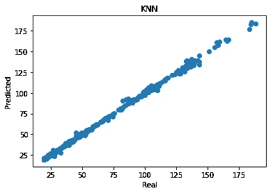**

**到目前为止，这是产生**最低误差**的模型。**

# **神经网络**

**我们将使用单层**人工神经网络**完成我们的模型搜索，该网络具有 5000 个最大历元、自适应学习速率，并使用随机梯度下降优化算法。**

**我们的超参数是隐藏层的神经元的数量(我们将从 1 到 50 跨越)和它们的激活函数(T21)的数量(将跨越逻辑和逻辑)。**

**在将训练数据交给人工神经网络之前，我们必须**对它们进行缩放**。我们将使用**最小最大缩放器**将每个特征缩放到**0–1 区间**。**

```
scaler = MinMaxScaler()scaler.fit(X_train)nnet = RandomizedSearchCV(MLPRegressor(max_iter=5000,learning_rate = 'adaptive',solver='sgd'),
param_distributions =  {
     'hidden_layer_sizes':[(x,) for x in np.arange(1,50,1)],
     'activation':['logistic','relu']
},
cv=5, n_iter = 20,
iid=False,random_state=0,refit=True,
scoring="neg_mean_absolute_error")
```

**这些是最好的价值:**

**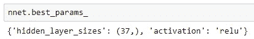**

**平均绝对误差为 1.407，这是散点图。**

**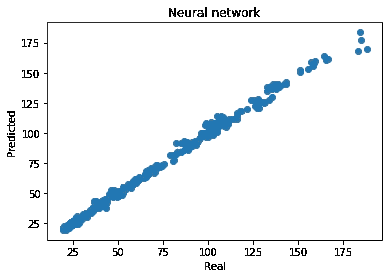**

# **KNN 是量子交易的圣杯吗？不全是**

**到目前为止，一切似乎都在告诉我们，KNN 是最强大的模特。事实上，并非如此。**

**一切都取决于我们如何执行**培训/测试分割**。如果我们随机分割记录，测试集中的一些记录可能**非常接近**训练集中的其他记录。这就是为什么 KNN 和树工作得很好。**

**如果我们把**前 70%** 的数据作为训练，把**后 30%** 的数据作为测试，会怎么样？测试记录现在与训练记录不同，所以事情会发生巨大的变化。**

**我们可以通过下面的代码来执行这种分割，它替换了前面的 train_test_split 代码**

```
X = newdata.drop("target",axis=1)
Y = newdata['target']train_size = int(X.shape[0]*0.7)X_train = X[0:train_size]
y_train = Y[0:train_size]X_test = X[train_size:]
y_test = Y[train_size:]
```

**我们现在可以**重复**每个型号的培训程序。在计算误差之前，让我们看一下散点图。**

**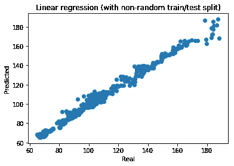****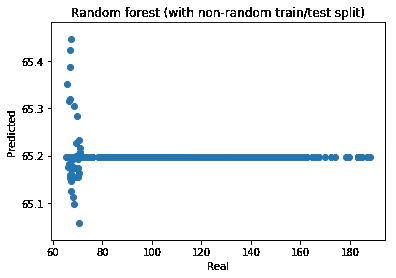****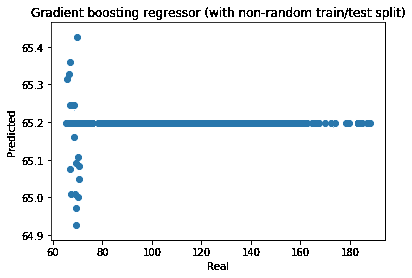****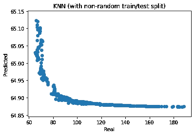****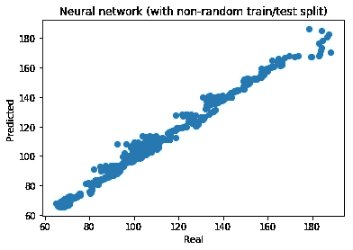**

**很明显，KNN 和树现在表现很差**。线性回归和神经网络**仍然抵制**。****

****以下是每个模型的平均绝对误差:****

*   ****线性回归:2.379****
*   ****随机森林:42.591****
*   ****梯度推进回归量:42.594****
*   ****k 最近邻:42.885****
*   ****神经网络:2.366****

****现在最好的模型是**神经网络**。****

****发生了什么事？****

****请记住，我们正在使用经典的机器学习方法来模拟一种现象，这实际上是一个**时间序列**。记录并非完全互不相关，因此**随机**训练/测试分割**可能是错误的**。这就是为什么交易系统通常是以历史数据的第一部分作为训练集，只有最近的数据作为测试集。****

****此外，KNN 和树只能预测与它们被训练的输出相似的输出。线性回归和神经网络是**参数公式**，因此一旦**参数**已经通过训练过程**固定**，它们可以无限制地预测任何可能的值。****

****股票价格可以从 0 变到无穷大，这就是为什么我们需要一个数学模型而不是拓扑或几何模型。****

# ****提高线性回归的性能****

****我们都喜欢神经网络，但让我们面对一个简单的事实:在这个例子中，ANN 的表现比线性回归略好。这不是一个戏剧性的性能改进。****

****我认为当模型是简单的时候，机器学习会更有效。这就是为什么，为了这个目的，我宁愿选择**线性回归**。****

****有没有办法让**提升**的性能？当然可以。****

****还记得随机森林和梯度推进回归器吗？它们的预测能力依赖于**装袋**和**助推**技术。前者创建**多个训练数据集**重新采样原始记录并随机选择特征子集，而后者创建一系列模型，**从之前的错误中学习**。****

****使用 sklearn 的 **BaggingRegressor** 和 **AdaBoostRegressor** 模块，这些技术可适用于任何型号。****

****为了将 Bagging 应用于线性回归，我们将使用下面的代码。它对模型的数量和特征的数量执行超参数优化。****

```
**lr_bag = RandomizedSearchCV(BaggingRegressor(LinearRegression()),
param_distributions =  {
               'n_estimators':np.arange(10,500,5),
               'max_features':np.arange(1,10,1)
          },
          cv=5, n_iter = 20,
          iid=False,random_state=0,refit=True,
          scoring="neg_mean_absolute_error")lr_bag.fit(X_train,y_train)**
```

****最佳值是:****

****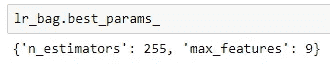****

****平均绝对误差为 2.343，下面是散点图。****

****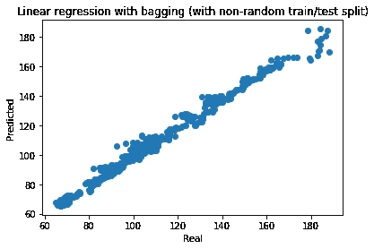****

****最后，我们可以使用 Boosting 技术优化模型的数量(我们可以使用简单的网格搜索，因为我们只有一个超参数)。****

****代码如下:****

```
**lr_boost = GridSearchCV(AdaBoostRegressor(LinearRegression()),
param_grid =  {
               'n_estimators':np.arange(20,500,5)
      },
      cv=5, 
      iid=False,refit=True,
      scoring="neg_mean_absolute_error")lr_boost.fit(X_train,y_train)**
```

****最佳值是:****

****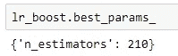****

****平均绝对误差为 2.580，散点图为:****

****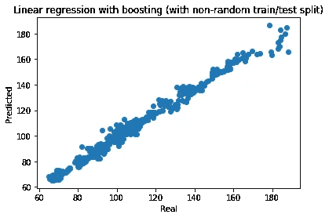****

****到目前为止，通过使用 bagging 的**线性回归获得了最佳结果。******

# ****可能的后续步骤****

****预测股票价格很难，而且非常困难。应该经常**这样做，以便从最近的价格波动中吸取教训，并试图更好地**预测未来的**。******

****线性回归在 Bagging 技术的帮助下表现最佳，Bagging 技术**减少过度拟合**并试图**减少输入特征之间的共线性**。****

****下一步可能是使用递归神经网络，特别是长短期记忆( **LSTM** )模型。在过去的几年里，它们越来越受欢迎，并证明了它们模拟非线性问题的能力。****

*******来自《走向数据科学》编辑的提示:*** *虽然我们允许独立作者根据我们的* [*规则和指导方针*](/questions-96667b06af5) *发表文章，但我们并不认可每个作者的贡献。你不应该在没有寻求专业建议的情况下依赖一个作者的作品。详见我们的* [*读者术语*](/readers-terms-b5d780a700a4) *。*****