# 零售需求预测的机器学习

> 原文：<https://towardsdatascience.com/machine-learning-for-store-demand-forecasting-and-inventory-optimization-part-1-xgboost-vs-9952d8303b48?source=collection_archive---------2----------------------->

## 零售店需求预测方法的比较研究(XGBoost 模型与滚动平均法)

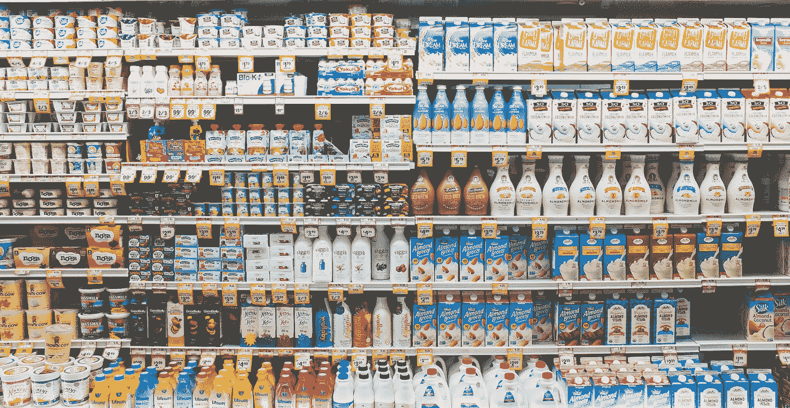

在 [Unsplash](https://unsplash.com/s/photos/retail?utm_source=unsplash&utm_medium=referral&utm_content=creditCopyText) 上 [NeONBRAND](https://unsplash.com/@neonbrand?utm_source=unsplash&utm_medium=referral&utm_content=creditCopyText) 拍摄的照片

# **一、需求计划优化问题陈述**

对于大多数零售商来说，需求计划系统采用固定的、基于规则的方法来进行预测和补货订单管理。

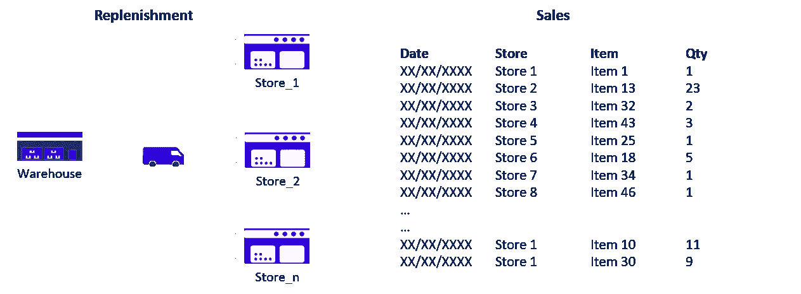

(1)需求计划优化问题陈述—(图片由作者提供)

这种方法对于稳定和可预测的产品类别足够有效，但是在库存和补货优化方面会显示出它的局限性。

这种潜在的优化可以通过以下方式降低运营成本:

*   **库存优化:**将[店铺库存](https://www.youtube.com/watch?v=U1HqjHZzgq4)与实际需求相匹配，减少所需存储空间**(租赁成本)**
*   **补货优化:**优化每笔订单的补货数量，使仓库与商店之间的补货次数最小**(仓储&运输成本)**

**示例:拥有 50 家店铺的零售商**

在这项研究中，我们将从 Kaggle 挑战中获取一个数据集:[商店商品需求预测挑战](https://www.kaggle.com/c/demand-forecasting-kernels-only/data)。

范围

*   2013 年 1 月 1 日至 2017 年 12 月 31 日**的交易**
*   91.3 万笔销售交易
*   **50** 独特的 SKU
*   **10** 店铺

💌新文章直接免费放入你的收件箱:[时事通讯](https://www.samirsaci.com/#/portal/signup)

## (更新)改进模型

我一直致力于该模型的改进版本，并在下面的文章中分享我的见解(带完整代码)。目标是了解添加业务特征(价格变化、销售趋势、商店关闭等)对模型准确性的影响。

 [## 零售预测的机器学习-特征工程

### 供应链优化了解与缺货、商店关闭日期或其他相关的额外功能的影响

www.samirsaci.com](https://www.samirsaci.com/machine-learning-for-retail-sales-forecasting-features-engineering/) 

> Github 库:[**链接**](https://github.com/samirsaci/ml-forecast-features-eng)

# **二。销售预测 XG boost**

最初的数据集已被用于 Kaggle 挑战赛，在该挑战赛中，各团队竞相设计预测销售的最佳模型。

Kaggle 挑战的初始数据框架

这里的第一个目标是使用 XGBoost 设计一个预测模型；该模型将用于优化我们的补货策略，确保库存优化并减少从您的仓库发货的数量。

## 1.添加日期功能

## 2.列车的每日、每月平均值

## 3.将每日和每月平均值添加到测试和滚动平均值中

## 4.用于检查相关性的热图

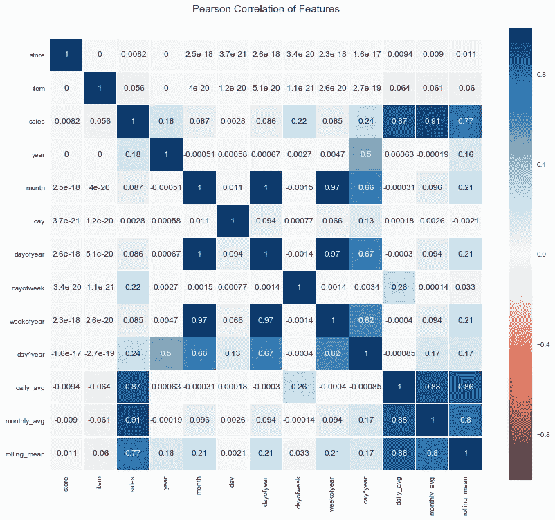

皮尔森相关热图—(图片由作者提供)

让我们保留月平均值，因为它与销售额的相关性最高，并删除彼此高度相关的其他特征。

## 5.清理特征、训练/测试分割和运行模型

## 6.结果预测模型

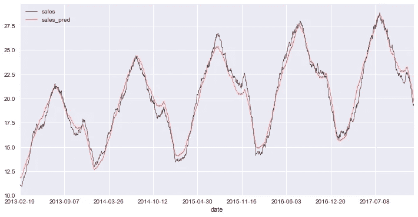

预测与实际销售—(图片由作者提供)

基于这一预测模型，我们将构建一个模拟模型来改进商店补货的需求计划。

决赛成绩

数据帧特征

*   **日期:**交易日期
*   **货号:** SKU 号码
*   **店铺:**店铺编号
*   **销售:**销售交易的实际值
*   **sales_prd:** XGBoost 预测
*   **错误 _ 预测:**销售 _prd —销售
*   **repln:** 补货天数的布尔值(如果该天在['星期一'，'星期三'，'星期五'，'星期日']中，则返回 True)

 [## 萨米尔 Samir 供应链组合的数据科学

### 🏭使用高级数学概念的供应链网络优化👨‍🏭仓储的持续改进…

samirsaci.com](http://samirsaci.com) 

# **三。需求计划:XGBoost 与滚动平均值**

## **1。使用滚动平均值的需求计划**

预测需求的第一种方法是以前销售的滚动平均值。在第 n-1 天结束时，您需要预测第 n 天、第 n+1 天、第 n+2 天的需求。

1.  计算最近 p 天的平均销售量:滚动平均(第 n-1 天，…，第 n-p 天)
2.  将此平均值应用于第 n 天、第 n+1 天、第 n+2 天的销售预测
3.  预测需求=预测日 n +预测日(n+1) +预测日(n+2)

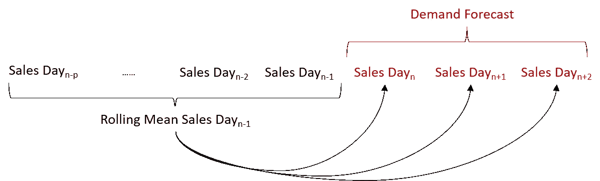

使用滚动平均法的需求预测—(图片由作者提供)

## **2。XGBoost 与滚动平均值**

有了 XGBoost 模型，我们现在有两种滚动平均法需求计划方法。

让我们试着比较这两种方法在预测准确性方面的结果:

1.  **准备第 n-1 天补货**
    我们需要预测第 n 天、第 n +1 天、第 n+2 天的补货量
2.  **XGB 预测给我们一个需求预测**
    Demand _ XGB = Forecast _ Day(n)+Forecast _ Day(n+1)+Forecast _ Day(n+2)
3.  **滚动平均法给我们一个需求预测**
    Demand _ RM = 3 x Rolling _ Mean(Day(n-1)，Day(n-2)，..日(n-p))
4.  **实际需求**
    需求 _ 实际=实际 _ 日(n) +实际 _ 日(n+1) +实际 _ 日(n+2)
5.  **预测误差**Error _ RM =(Demand _ RM—Demand _ Actual)
    Error _ XGB =(Demand _ XGB—Demand _ Actual)

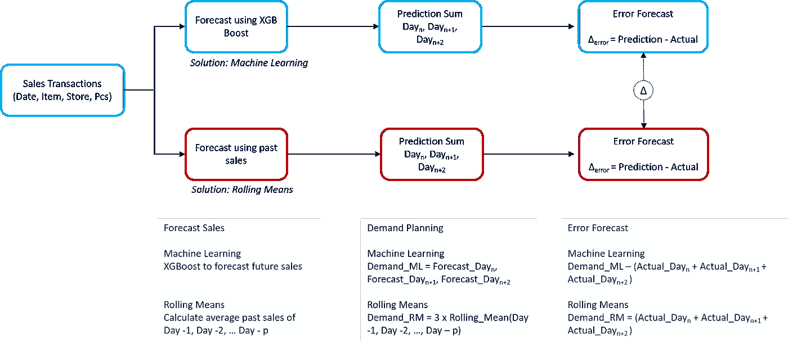

使用 XGBoost 和滚动平均的方法—(图片由作者提供)

**a .参数整定:p 天滚动平均值**

在将滚动平均值结果与 XGBoost 进行比较之前；让我们尝试找出 p 的最佳值，以获得最佳性能。

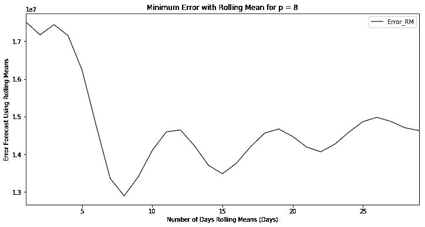

滚动平均值的最小误差—(图片由作者提供)

**结果:**-(p = 8)与(p = 1)的预测误差为 35%

因此，基于销售事务配置文件，我们可以通过使用过去 **8 天**的平均值来预测第二天的销售额，从而获得最佳的需求计划绩效。

**b. XGBoost 对滚动平均值:p = 8 天**

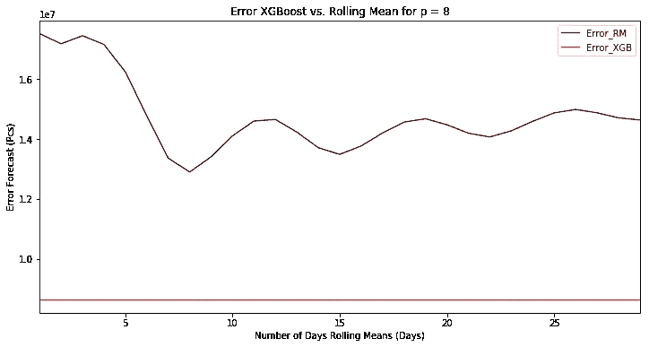

误差 XGBoost 与滚动平均值的关系—(图片由作者提供)

**结果:** -使用 XGBoost 与滚动平均值的预测误差为 32%

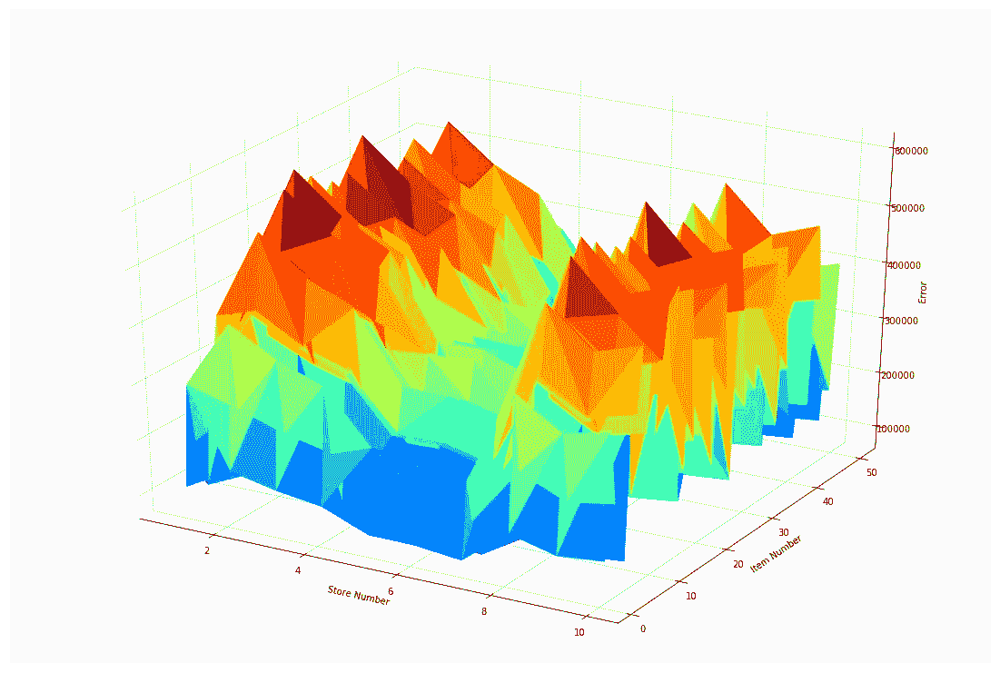

预测误差(x 轴:商店编号，y 轴:商品编号，z 轴:误差)——(图片由作者提供)

# 四。结论和下一步措施

*关注我的 medium，了解更多与供应链数据科学相关的见解。*

## 1.结论

利用滚动平均法进行需求预测，可以将预测误差降低 **35%** ，并找到最佳参数 **p 天**。

然而，我们可以通过用 XGBoost 预测代替滚动平均值来预测第 n 天、第 n+1 天和第 n+2 天的需求，从而将误差降低 **32%，从而获得更好的性能。**

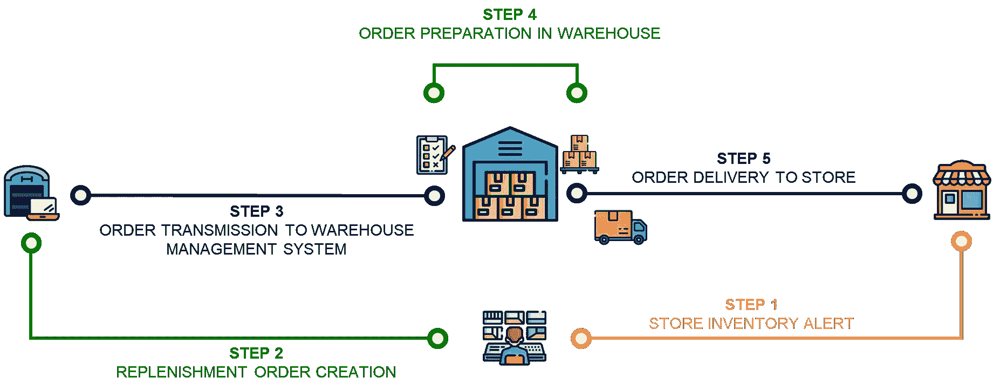

库存管理流程

## 2.可持续方法:绿色库存管理

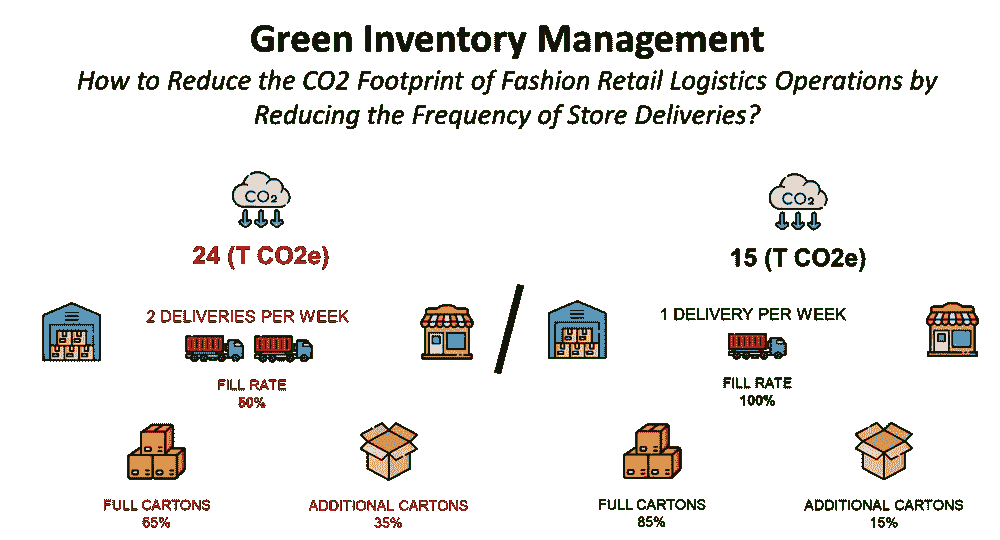

(图片由作者提供)

> 如果我们降低商场补货的频率，会对二氧化碳排放量产生什么影响？

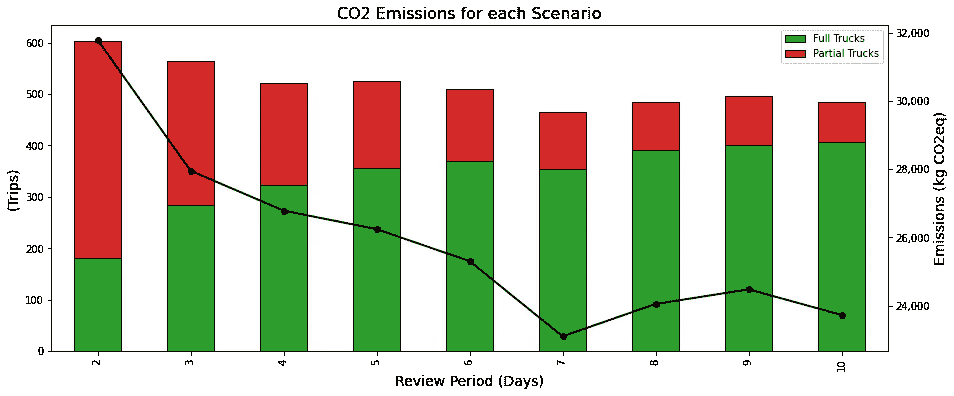

在这种情况下，研究如何使用数据分析来模拟商店补货频率的变化，并衡量对整体环境影响的影响。

 [## 绿色库存管理-案例研究

### 可持续发展如何减少时尚零售物流运作的二氧化碳排放量？

www.samirsaci.com](https://www.samirsaci.com/green-inventory-management-case-study/) 

# 关于我

让我们在 [Linkedin](https://www.linkedin.com/in/samir-saci/) 和 [Twitter](https://twitter.com/Samir_Saci_) 上连线，我是一名[供应链工程师](https://www.samirsaci.com/about/)使用数据分析来改善物流运作和降低成本。

如果你对数据分析和供应链感兴趣，可以看看我的网站

 [## Samir Saci |数据科学与生产力

### 专注于数据科学、个人生产力、自动化、运筹学和可持续发展的技术博客

samirsaci.com](https://samirsaci.com) 

# 参考

[1] Kaggle 数据集，商店商品需求预测挑战，[链接](https://www.kaggle.com/c/demand-forecasting-kernels-only)