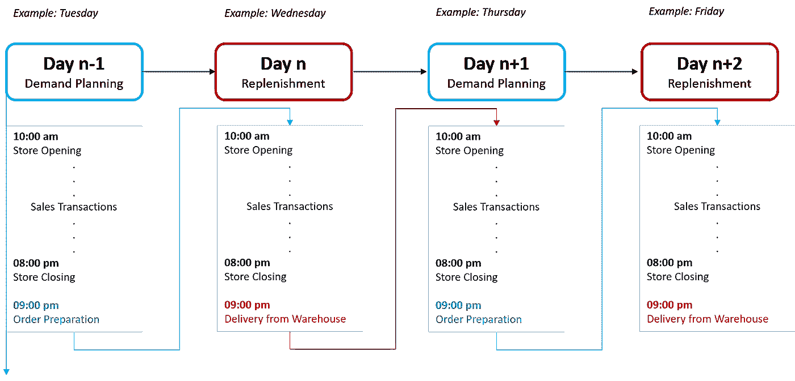
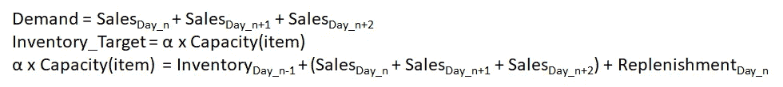
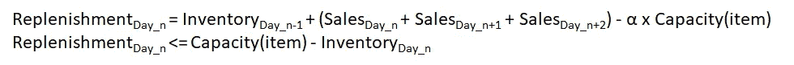
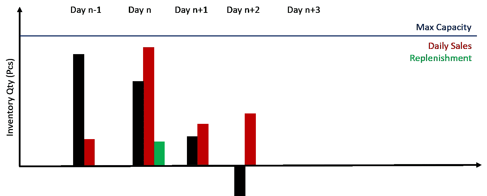
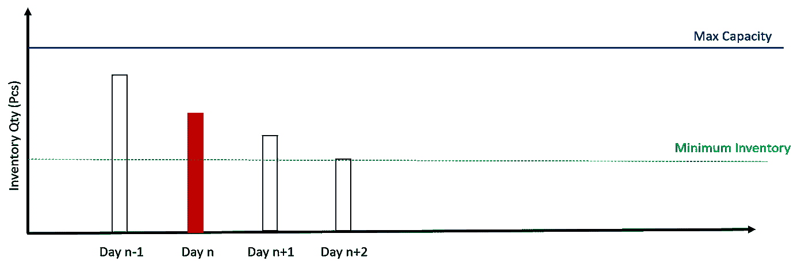
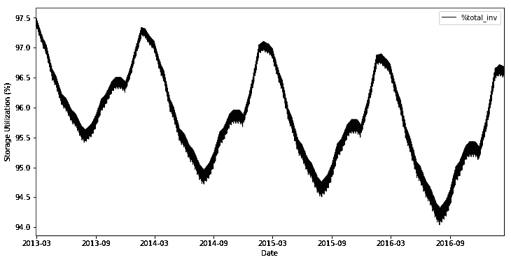
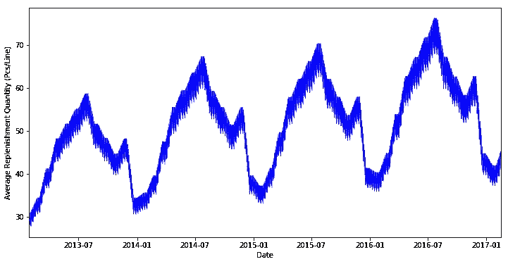

# 商店配送计划的机器学习

> 原文：<https://towardsdatascience.com/machine-learning-for-store-demand-forecasting-and-inventory-optimization-part-2-replenishment-6ded544be81b?source=collection_archive---------18----------------------->

## 设计补货策略，优化库存，减少从仓库发货的次数

Wynand van Poortvliet 在 [Unsplash](https://unsplash.com/s/photos/delivery?utm_source=unsplash&utm_medium=referral&utm_content=creditCopyText) 上拍摄的照片

*本文是商店需求预测系列文章的一部分。您可以在以下链接中找到第一篇文章，其中解释了 XGBoost 模型的实现:*[*Article 1*](/machine-learning-for-store-demand-forecasting-and-inventory-optimization-part-1-xgboost-vs-9952d8303b48)*。*

💌新文章直接免费放入你的收件箱:[时事通讯](https://www.samirsaci.com/#/portal/signup)

# 一、补货策略和顺序

## **1。需求计划&交付计划**

数据集:销售交易—(来源:Kaggle)

范围

*   2013 年 1 月 1 日至 2017 年 12 月 31 日的交易
*   **91.3 万笔**销售交易
*   **50** 独特的 SKU
*   **10** 店铺
*   每周补货天数:周一、周三、周五、周日
*   **24** 订单创建和从仓库发货之间的提前期
*   商店营业时间从**上午 10:00**到**下午 08:00**
*   晚上 **09:00 从仓库发货**

补充序列—(图片由作者提供)

根据我们的交付周期要求，商店必须在关门前一天创建补货订单。

我们的补货算法将测量库存水平

*   **上午 10:00:**开业前
*   **下午 08:00:**店铺关门后，发货前(如果是补货日)

商店开业前上午 10:00 记录的库存水平—(图片由作者提供)

目标:库存日 n+1(上午 10:00)= alpha x 产能(alpha in [0，1])

1.  **第 n-1 天:准备补货**
    数据输入:库存第 n-1 天(晚上 09:00)，销售预测第 n 天，第 n+1 天，第 n +2 天
2.  **目标:第 n+ 2 天的库存(08:00 pm)** 在下一次交货前确定库存水平: **(09:00 pm)** 第 n+2 天
3.  **需求计划** Day_n 补货需要覆盖 Day_n、Day_n+1、Day_n+2 的需求，以达到下一次发货前 Day_n+2 结束时的库存水平目标。
4.  **约束** 交货后库存必须低于最大产能

需求计划方程式—(图片由作者提供)

约束方程—(图片由作者提供)

## **2。不同战略模拟的 KPI 设置**

**库存短缺事件** 我们的补货策略将根据其能力进行评估，以准确估计达到库存目标第 n+2 天的补货数量。这一估计可能被低估:

例子

库存短缺事件示例—(图片由作者提供)

1.  **第 n-1 天:准备补货订单**
    -仓库开始准备订单
2.  **第 n 天:当天结束时收到的发货** -日常交易减少的库存
    -当天结束时收到的订单
3.  **第 n+1 天:库存短缺** -从第 n 天继承的库存水平不足以满足第 n+2 天的需求，直到装运在当天结束时到达。

按日平均库存水平(%),
100×存储数量(件)/存储最大容量(件)

库存优化:在不发生库存短缺事件的情况下，达到可能的最低值

**减少补货频率** 利用销售预测，补货策略可以减少补货次数。

减少补给频率的示例—(图片由作者提供)

上例显示了一个跳过补货日的例子；第 n 天的库存高于最低库存，足以满足第 n+1 天的需求。

**备注:**该 KPI 高度依赖库存水平(%)；在低库存水平下，很难跳过补货而不冒缺货事件的风险。

 [## 萨米尔·萨奇

### 数据科学博客，专注于仓储，运输，数据可视化和机器人流程自动化…

samirsaci.com](http://samirsaci.com) 

# 二。补货方式 1:满储能力

我们首先从一个简单的补货策略开始，补货订单数量的计算基于:

*   **第 n-1 天:第 n-1 天补货订单**
    输入数据:库存 _ 第 n-1 天(09:00 pm)、产能(物料)
*   **订单数量达到最大产能**

补给公式—(图片由作者提供)

1.  **初始数据:**创建销售数据框架、库存记录、物料产能和补货数据

注意

*   最大存储容量= 10 x 最大日销售量(以后可以调整)
*   补充天数:“星期一”、“星期三”、“星期五”、“星期日”

**2。方法 1:** 需求=产能 _ 最大值-库存 _ 天数 _n-1 (09:00 pm)

**3。按天运行模拟:**销售交易，库存补货，库存≥0

模拟结果

*   产能= 10 x 最大日销售额
*   补充天数:“星期一”、“星期三”、“星期五”、“星期日”

存储利用率(%) =库存数量/容量最大值—(图片由作者提供)

平均补货数量(件/行)——(图片由作者提供)

库存短缺事件:0
跳过的补货次数:0

# 四。结论和下一步措施

*关注我的 medium，了解更多与供应链数据科学相关的见解。*

## 1.结论

方法 1 很简单，可以优化。正如预期的那样，我们的平均存储利用率接近 100%,没有补货天数。

平均补货量图表也向我们展示了销售交易趋势是周期性的，并且遵循一个趋势。

## 2.后续步骤

*   **库存水平:**以最低库存水平为目标，确保不发生库存短缺事件
*   **订单频率:**使用我们的预测模型减少补货

# 关于我

让我们在 [Linkedin](https://www.linkedin.com/in/samir-saci/) 和 [Twitter](https://twitter.com/Samir_Saci_) 上连线，我是一名供应链工程师，正在使用数据分析来改善物流运营和降低成本。

如果你对数据分析和供应链感兴趣，可以看看我的网站

 [## Samir Saci |数据科学与生产力

### 专注于数据科学、个人生产力、自动化、运筹学和可持续发展的技术博客

samirsaci.com](https://samirsaci.com) 

# 参考

[1]商店项目需求预测挑战(Kaggle)，[链接](https://www.kaggle.com/c/demand-forecasting-kernels-only)

[2] [Samir Saci](https://medium.com/u/bb0f26d52754?source=post_page-----6ded544be81b--------------------------------) ，零售需求预测的机器学习(2020)，[链接](https://s-saci95.medium.com/machine-learning-for-store-demand-forecasting-and-inventory-optimization-part-1-xgboost-vs-9952d8303b48?sk=4fa4404d8c51c7798e0b48bf99c8c35d)