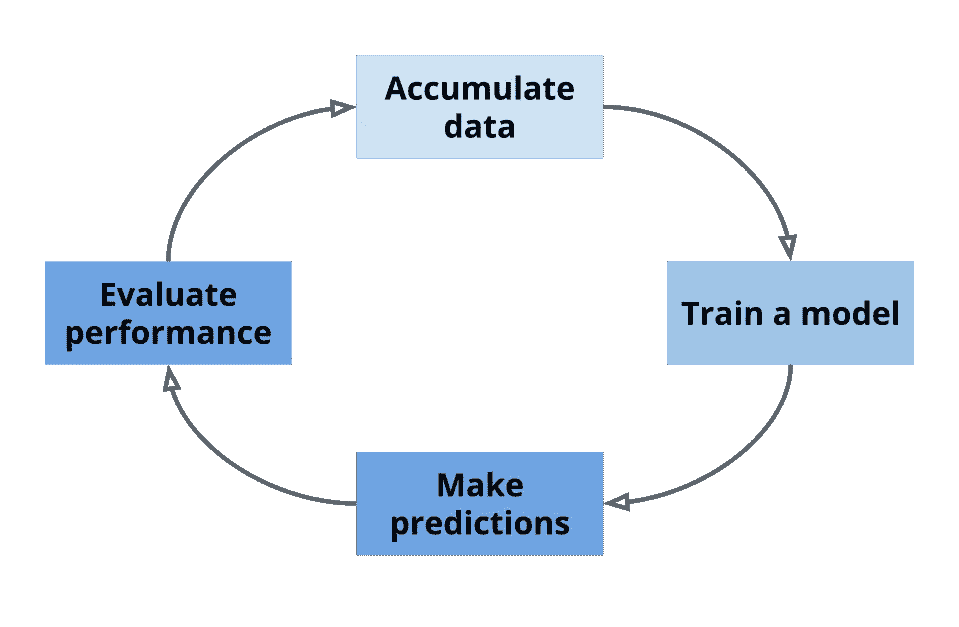
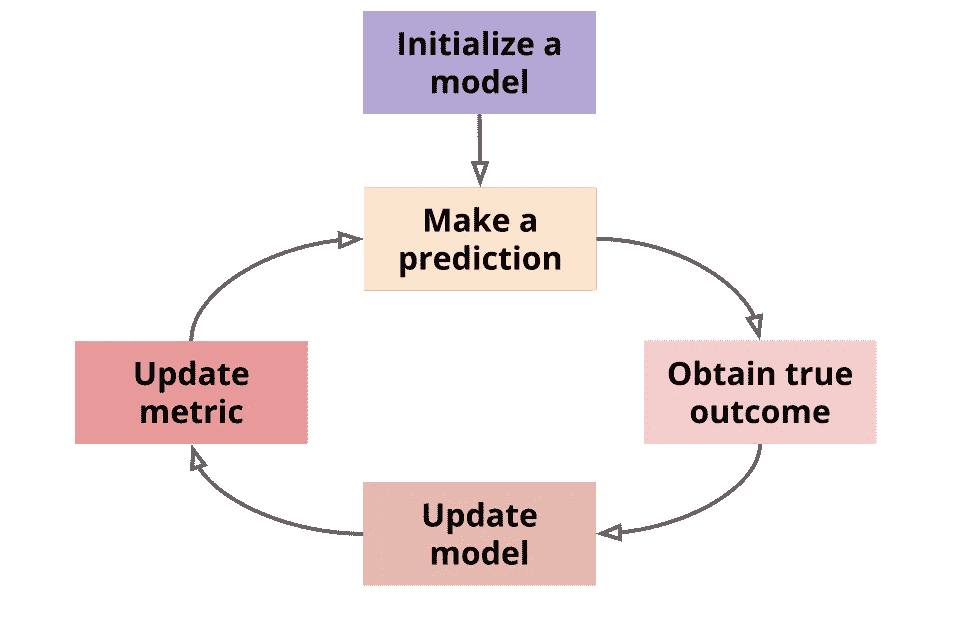
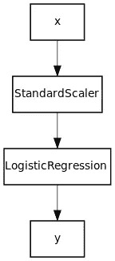

# 基于 creme 的流数据机器学习

> 原文：<https://towardsdatascience.com/machine-learning-for-streaming-data-with-creme-dacf5fb469df?source=collection_archive---------7----------------------->

## 在线机器学习可以改变你对生产中的数据科学的看法

若昂·布兰科在 [Unsplash](https://unsplash.com?utm_source=medium&utm_medium=referral) 上的照片

# 动机

将机器学习模型部署到生产环境中是一项艰巨的任务。目前，通常的做法是有一个离线阶段，在这个阶段，模型是在数据集上训练的。该模型随后被部署到网上，对新数据进行预测。因此，模型被视为静态对象。为了从新数据中学习，必须从头开始重新训练模型。这种部署模式有时被称为[λ架构](https://www.wikiwand.com/en/Lambda_architecture)。

lambda 架构的模型生命周期，来源:[在线机器学习的好处](https://maxhalford.github.io/slides/the-benefits-of-online-learning/#1)

lambda 架构无处不在，在整个行业都是如此。事实上，AutoML 平台如 [DataRobot](https://www.datarobot.com/) 和 [H2O](https://www.h2o.ai/) 正是这么做的。你给他们数据，他们给你提供一个 API，在这个 API 后面有一个模型。自动化程度较低的工具也是如此，比如 [MLflow](https://mlflow.org/) [、Amazon Sagemaker、](https://aws.amazon.com/fr/sagemaker/) [Cubonacci](https://www.cubonacci.com/) 和 [Alteryx](https://www.alteryx.com/) 。这也是不太知名的项目如 [Cortex](https://github.com/cortexlabs/cortex) 和 [Clipper](https://github.com/ucbrise/clipper) 所采用的方法。我不是在敲打这些工具；事实上，我觉得它们都很棒，它们为彼此提供了健康的竞争。

机器学习模型以这种方式部署，因为它们受到模型学习能力的限制。事实上，机器学习算法通常假设所有的训练数据都是一次性可用的。这在文献中被称为*批量学习*。从历史上看，统计学家和 ML 研究人员最感兴趣的是将模型“拟合”到数据集，然后就不管它了。只有一小部分研究致力于设计能够在有新数据时自我更新的模型。

拥有能够增量学习的模型不是很好吗？想一想:拿一个在大学天天上课的学生来说。当一节课开始时，学生已经积累了过去所有课的知识。老师并不是每次想让他的学生学习新思想时都从第一堂课开始。那太疯狂了，对吧？这正是许多机器学习实践者正在做的事情。

原来，批量学习还有一个不太为人知的妹妹，叫*在线学习*。正如你可能已经猜到的，在线学习包含了所有能够一次进行一次观察的模型。**在线学习是一种范式转变，因为它允许改变我们思考机器学习部署的方式**。除了对新数据进行预测，在线模型还能够从中学习。事实上，在线学习的预测和学习阶段可以交织成有时被称为 [kappa 架构](https://milinda.pathirage.org/kappa-architecture.com/)的东西。

kappa 架构的模型生命周期，来源:[在线机器学习的好处](https://maxhalford.github.io/slides/the-benefits-of-online-learning/#1)

在 kappa 架构中，数据被视为一个流。一旦一个模型被一个新的数据更新，那么这个数据就可以被有效地丢弃。换句话说，**你不必存储一个历史训练集，并不时地重新训练你的模型**。另一个好处是**你的模型总是最新的**。自然的结果是**你的模型能够处理** [**概念漂移**](https://www.wikiwand.com/en/Concept_drift) ，当数据的分布随着时间的推移而演变时就会发生这种情况。此外，模型生命周期更容易考虑，因为学习和预测步骤都是一次处理一个输入。与此同时，批处理模型必须尽可能频繁地重新训练，以应对概念漂移。这需要持续监控，并使维护更加困难。通过批量学习，您还必须确保您用于训练模型的功能在生产中也是可访问的。

批处理机器学习很棒，在很多情况下都很好用。然而，在线机器学习对于某些用例来说是更合适的解决方案。它只对新数据不断到来的应用有意义:垃圾邮件过滤、推荐系统、物联网传感器、金融交易等。正如我们刚刚提到的，当数据中的模式不断发展并需要模型适应时，在线模型尤其出色。根据我的经验，许多实践者试图把方钉装进圆孔:批处理机器学习不适合在流环境中使用。我看到批量模型在生产中直线下降，因为它们不能从新数据中学习。

使用在线机器学习模型还可以降低运营成本，无论是在计算能力还是人工干预方面。首先，您不需要强大的硬件来处理流数据集，因为一次只有一个流元素存在于内存中。事实上，在线机器学习可以有效地部署在树莓派上。其次，您的数据科学家可以花更少的时间来处理模型再训练，因为模型更新被纳入在线机器学习，因此可以花更多的时间在具有更多附加值的任务上。

那么，为什么我们不都使用在线机器学习呢？嗯，我们有些人是。大玩家——你知道我指的是谁——正在使用在线模型进行[广告点击率预测](https://research.google/pubs/pub41159/)以及[新闻推送推荐](https://www.microsoft.com/en-us/research/blog/real-world-interactive-learning-cusp-enabling-new-class-applications/)。在线机器学习并不是主流观念。罪犯很容易找到。 [Kaggle](https://www.kaggle.com/) 竞赛将数据科学呈现为一项科学实验，其中数据被分成训练集和测试集。大学课程和 MOOCs 教给学生最流行的机器学习算法，大多是批处理算法。最后，像 [scikit-learn](https://scikit-learn.org/stable/) 这样的流行库鼓励用户从保存在内存中的矩形数据集的角度来思考，而不是从流数据的角度。

在我看来，人们不使用在线机器学习的主要原因仅仅是因为没有很多可用的工具来这样做。有很好的工具来分析流数据，如 [Samza](http://samza.apache.org/) 和 [Flink，](https://flink.apache.org/)但它们不允许进行任何严肃的机器学习。还有从大数据集学习的工具，比如 [Spark](https://spark.apache.org/) 、 [Vowpal Wabbit](https://vowpalwabbit.org/) 、 [Dask](https://dask.org/) 和 [Vaex](https://vaex.readthedocs.io/en/latest/) 。然而，这些工具并没有完全接受在线范式，并且大多数仍然假设您正在使用静态数据集，尽管它并不适合内存。

# 介绍 creme 图书馆

大约 15 个月前，我发现了在线机器学习。从那时起，这是一个启示，我一直在努力分享我的观点。为此，我开始编写一个名为 [creme](https://github.com/creme-ml/creme) 的 Python 库。名字来源于*增量学习*，是在线学习的代名词。接下来，我的一些朋友加入了我的行列: [Geoffrey Bolmier](https://github.com/gbolmier) (他目前正在为 scikit-learn 工作)[raphal Sourty](https://github.com/raphaelsty)、 [Robin Vaysse](https://github.com/VaysseRobin) 和 [Adil Zouitine](https://github.com/AdilZouitine) 。我们最近发布了 0.5 版本，并开始看到它被一些公司用于概念验证。

creme 是一个通用库，因此涵盖了机器学习的许多领域，包括特征提取和模型选择。你可以把 creme 想象成在线机器学习的 scikit-learn(科学知识)——我们意识到这听起来有多么雄心勃勃。

作为一个非常简单的介绍性示例，假设您想要计算一个值序列的平均值。自然的方法是累加所有的值，然后将总数除以值的个数。然而，有一种在线算法是精确的，甚至不需要在开始之前知道值的数量。它被称为[韦斯特算法](http://www.nowozin.net/sebastian/blog/streaming-mean-and-variance-computation.html)，实现起来很简单。在线平均值可以在 creme 中计算如下:

creme 中的运行平均值

计算移动平均值可能看起来没什么了不起，但它为更高级的技术打开了大门，如目标编码:

creme 中的目标编码

您会注意到在前面的代码片段中，`TargetAgg`有两个方法:`fit_one`，它更新模型，和`transform_one`，它将输入转换成特性。在这种情况下，`TargetAgg`有一个`transform_one`方法，因为它是一个转换器(咄)。其他估算器，比如`linear_model.LinearRegression`，有方法`fit_one`和`predict_one`。分类器，比如`tree.DecisionTreeClassifier`，也有一个`predict_proba_one` 方法。

关于 creme 要知道的另一件事是特性存储在字典中。字典是实用的，因为它们是隐含稀疏的:0 值根本不包含在字典中。这允许扩展到具有数百万个要素的大型数据集。此外，字典没有固定的长度，这意味着即使您添加或删除功能，creme 模型也会起作用。最后，使用字典意味着每个功能都有一个名称，这是一种人性化的设计。注意，我们不使用 numpy 或 pandas，尽管 creme 支持这两种格式。相反，我们主要依赖 Python 的标准库，它为使用字典提供了强大的原生支持。正如我们将在后面看到的，这不会影响性能，事实上恰恰相反。

现在是严肃的事情:让我们在数据流上训练一个分类器。例如，我们将使用[网站钓鱼](http://archive.ics.uci.edu/ml/datasets/Website+Phishing)数据集，该数据集描述网页并指示它们是否是钓鱼企图。我们将使用来自`linear_model`模块的逻辑回归。我们将通过使用`metrics.Accuracy`的一个实例来度量模型的性能，正如您已经猜到的，它可以在线更新。

学习网站钓鱼数据集

正如您在上面的代码片段中看到的，预测和学习步骤是交错进行的。在这种情况下，我们按顺序对数据集进行流式处理，但是您可以完全控制如何设置。通过使用在线机器学习，特别是 creme，你不再受到你需要所有数据来训练一个模型的阻碍。另一件需要注意的事情是，我们已经使用了一个管道，通过逻辑回归构建了一个标准的缩放步骤。**管道是 creme** 的一等公民，我们强烈鼓励使用它们。您可以查看我们的[用户指南](https://creme-ml.github.io/notebooks/the-art-of-using-pipelines.html)以获取更多示例。在 creme 中，管道有方便的方法，如`model.draw()`:

网站钓鱼渠道的图形表示

请注意，并不是所有的算法都有在线的等效算法。例如，核支持向量机不可能适合流数据集。同样，CART 和 ID3 决策树也不能在线训练。然而，还有一些鲜为人知的在线近似方法，例如用于支持向量机的[随机傅立叶特征](https://people.eecs.berkeley.edu/~brecht/papers/07.rah.rec.nips.pdf)和用于决策树的 [Hoeffding 树](https://homes.cs.washington.edu/~pedrod/papers/kdd00.pdf)。creme 提供了许多东西，我们强烈建议您查看它的 [GitHub 页面](https://github.com/creme-ml/creme)和[在线文档](https://creme-ml.github.io/)。以下是一些亮点:

*   `reco`模块包含推荐系统的算法，很像[惊喜](https://github.com/NicolasHug/Surprise)，但在线。
*   时间序列预测，用`time_series`模块。
*   您可以通过`model_selection`模块中的`SuccessiveHalvingRegressor`和`SuccessiveHalvingClassifier`进行在线选型。我们也有整合多臂强盗算法的计划。
*   在线不平衡学习。
*   渐进式验证，是交叉验证的在线对应物。
*   决策树和随机森林。
*   带有大量优化器的线性模型。

对在线学习的主要批评是它比批量学习慢。事实上，因为数据是一次处理一个元素，所以我们不能充分利用矢量化。一种解决方案是小批量，这是在线学习和批量学习的有效折衷。然而，对于 creme，我们决定一次只处理一个元素，因为它更容易推理，并且极大地简化了模型部署。由于这种设计选择，**在在线学习场景中，creme 实际上比 scikit-learn、Keras 和 Tensorflow 要快得多**。下表总结了在不同库中实现的线性回归的结果:

在线线性回归基准

你可以在这里找到运行基准测试的代码。这并不意味着 creme 可以比其他库更快地处理数据集，这意味着当一次处理一个元素的数据时，creme 会更快。其他库迎合批量学习场景，而不是在线学习。根据您的数据科学经验，这可能看起来像一个利基案例。然而，与批量学习相比，以这种方式处理数据使得模型部署和维护变得轻而易举。

# 部署

一旦你设计了一个在线机器学习模型，部署它就相对简单了。假设您希望通过 web 请求与您的模型进行交互，那么您必须实现的 API 非常简单。本质上，您需要一条路线来更新模型，另一条路线来进行预测。您可能还想实现一些路由来监控模型的性能。真的是这样:您不需要考虑模型再培训，也不需要担心您的模型不够最新。这就是 lambda 架构的美妙之处。将数据视为一个流会给表带来很多好处。最重要的是，creme 是一个很好的选择，因为它使用字典，很容易在 JSON 之间进行翻译，JSON 是 API 的*通用语*。

为了演示部署用 creme 构建的模型有多简单，我们实现了一个名为 [chantilly](https://github.com/creme-ml/chantilly) 的小工具。这个工具只不过是一个 Flask 应用程序，它提供了上传模型、让模型学习、获得预测和监控指标的必要途径。它还提供了一个当前非常简单的实时仪表板。尚蒂伊仍处于起步阶段，我们有[计划](https://github.com/creme-ml/chantilly#roadmap)让它变得更加有趣和简单易用。

chantilly 存储库包含一个基于纽约市出租车数据集的[示例](https://github.com/creme-ml/chantilly/tree/master/examples/taxis)。数据集包含出租车行程的详细信息及其持续时间。目标是预测旅行需要多长时间。简而言之，我们能够利用这个历史数据集，以与事件发生时完全相同的方式模拟一系列事件。因此，我们能够建立一个值得信赖的基准和一个可靠的想法，我们的模型将执行。这非常重要:能够正确地重现生产场景有助于建立对模型的信任。对于批量模型，你永远无法确定你的模型会有怎样的表现。当然，你可以做交叉验证，但这并不能完全模拟本地的生产场景。

请注意，我们并不打算让 chantilly 成为一个通用的工具。我们认识到，每个数据科学团队都有自己特定的模型部署方式。因此，chantilly 主要旨在成为一个简单易读的例子，说明如何为机器学习模型实现 lamda 架构。尽管如此，我们将继续在尚蒂伊开展工作，并提供与现有基础设施合作的方式。例如，chantilly 目前提供了一个流 API 来监控指标更新。这允许您编写一个简短的脚本，将这些更新发送到连接到 Grafana 仪表板的 InfluxDB 数据库。

# 更进一步

creme 是一个年轻的库，但我们已经从数据科学团队那里得到了一些很好的反馈，他们正在使用它来证明概念。以下是关键要点:

*   在线模型可以一次学习一个实例。
*   在线模型不需要重新培训，因为他们是在飞行中学习的。
*   在线机器学习简化了模型部署和维护。

如果你想了解更多关于 creme 的信息，我们鼓励你查看 [GitHub 库](https://github.com/creme-ml/creme)以及[用户指南](https://creme-ml.github.io/content/user-guide.html)和 [API 参考](https://creme-ml.github.io/content/api.html)。让我们在 GitHub 上出演[也有助于我们接触到更多的观众。](https://github.com/creme-ml/creme/stargazers)

我们对新员工的入职非常感兴趣。如果你的兴趣已经达到顶峰，你想成为团队的一员，那么欢迎联系我们！

我们也很高兴(自由地)与数据科学团队携手合作，看看 creme 是否符合您的需求，以及我们可以在哪些方面改进它。