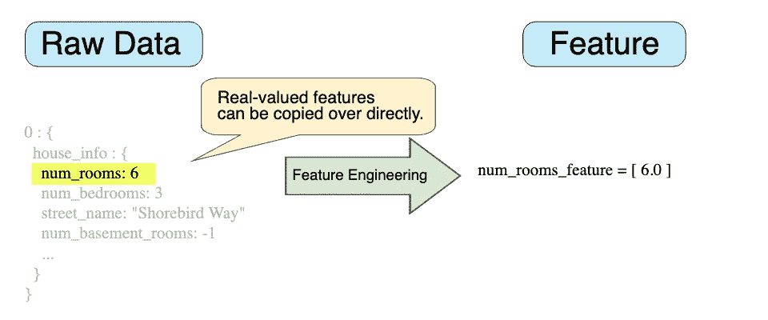
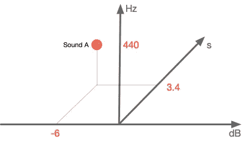
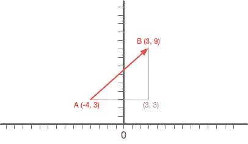

# 机器学习基础:特征和相似性

> 原文：<https://towardsdatascience.com/machine-learning-foundations-features-and-similarity-a6ef2901f09f?source=collection_archive---------17----------------------->

## 机器学习背后的一些基础的实用解释


照片由[维姆·范因德](https://unsplash.com/@wimvanteinde?utm_source=medium&utm_medium=referral)在 [Unsplash](https://unsplash.com?utm_source=medium&utm_medium=referral) 拍摄

机器学习的世界充满了对“特征向量”、“维度”、“空间”和“距离”的引用。除非你已经有了很强的数学背景，否则所有这些都是无法抗拒的。在这篇文章中，我将解释一些基本知识。

## 特征

为了让程序执行机器学习任务，我们需要一种用数字表示对象的方法。例如，如果我们想让我们的软件识别声音，我们需要一种用数字来表示声音的方法。识别图像或文本也是如此。

> 我们在机器学习中用来表示物体方面的数字叫做*特征*。

在计算中，我们已经有了对象的标准数字表示。例如，图像由描述屏幕上每个像素颜色的 RGB 值组成。声音由 [PCM](https://en.wikipedia.org/wiki/Pulse-code_modulation) 音频样本组成，描述音频信号随时间的响度。

虽然我们*可以*使用这些数字表示来训练机器学习系统，但通常不希望这样做。原因是:

*   处理大量数据(例如，每幅图像数百万像素)在计算上非常昂贵
*   标准数字表示包含大量冗余信息

为了解决这个问题，我们采用了一个过程，将这些细粒度的值转换成更少数量的更具描述性的特征。这个过程被称为[特征提取](https://en.wikipedia.org/wiki/Feature_extraction)。可以认为特征存在于从更接近机器表示(不太抽象)的低级特征到更接近人类感知(更抽象)的高级特征的层次结构中。

用于表示*声音*的常见特征可能是:音调、响度、亮度和噪声。更高级的特征可以是速度、音调和情绪。用于表示文本的特征可以是“单词存在”、“单词计数”和“词频”。



图一。从原始数据到特征值的特征工程。信用:[谷歌开发者](https://developers.google.com/machine-learning/crash-course/representation/feature-engineering)

在传统的机器学习中，用于描述对象的特征通常是通过结合先验知识、直觉、测试和自动特征选择来获得的。这个过程叫做*特征工程*。在最近的深度学习技术中，特征提取本身可以是机器学习过程的自动部分。

> 确定哪些特征最好地描述了特征之间重叠最少的对象的过程被称为特征选择

## 尺寸和空间

我们现在知道特征是表示对象的某个方面的值。为了在不同物体的特征之间进行比较，从空间上考虑它们是方便的。我们可以将每个特征*标签*视为一个*维度*，将每个特征*值*视为该维度内的一个*位置*。我们用来描述一个物体的所有维度的组合称为一个*特征空间*。

起初，这一切看起来令人困惑！这是因为我们倾向于认为“空间”是一个以米或英尺为单位的三维实体。然而，可以应用于 3D 物理空间的所有相同的几何也可以应用于具有任意维数的数学空间，其中每个维数代表任意数值范围。

让我们考虑一个实际的例子…

假设我们有*一个*描述声音的特征…“平均响度”，它的值是-6 分贝。这给了我们一个维度和一个特征值(-6)。我们可以在一条线上从空间上表示这一特征:


图二。一维空间表示的平均响度特征

现在，让我们再添加两个特性，“平均频率”(单位为赫兹)和持续时间(单位为秒)。这给了我们的特征空间总共三个维度。我们现在可以将声音表示为三维空间中点:



图 3。用三维空间中的一个点表示的声音，维度为赫兹、秒和分贝

但不止于此！与物理空间不同，特征空间可以有任意多个维度。因此，如果我们加上“平均亮度”、“平均噪音”和“攻击时间”，这将总共给出六个维度。

## 特征向量

描述对象的一组特征被称为*特征向量*。起初，这似乎是一个令人困惑的概念。我们从学校数学中知道，矢量是有方向和大小的东西。向量的典型例子是“位移”和“速度”。我们可能熟悉这样的图表:



图 4。从 A 点到 B 点的位移矢量 **a**

这显示了向量 **a** (红线)作为二维中从点 A 到点 B 的位移。矢量的*大小*或*范数*可以使用以下等式计算:

```
‖a‖₂ = √((x₂-x₁)² + (y₂-y₁)²)
```

**a** 是表示 **a，**大小的数学符号，上面的公式称为欧几里德范数或 L2 范数。代入我们得到的积分值:

```
√((3--4)² + (9-3)²) = √(7² + 6²) = 9.2
```

所以我们的向量 **a** 的大小是 9.2，但是这和我们机器学习的特征向量有什么关系呢？我们图 3 中的声音(A)只是 3D 空间中的一个“点”，对吧，不是“矢量”？

实际上，我们可以将图 3 中的声音视为一个矢量，将它的位置与原点相关联(坐标 x=0，y=0，z= 0)。从原点延伸到给定点的矢量称为*位置矢量*。当人们谈论机器学习中的“向量”时，他们通常指的是位置向量。

重新绘制图 3 以显示声音 A 的位置向量，我们得到以下结果，其中红色箭头是向量:


图 5。指示位置向量的声音 A 的特征向量(红色箭头)

为了计算我们的特征向量的长度，我们可以再次使用 L2 范数。所以:

```
‖a‖₂ = √((0--6)² + (440-0)² + (3.4-0)²)
```

你可以看到，对于一个位置向量，原点总是零，所以原点项可以省略。因此，我们对于特征“点”向量的 L2 范数的概括公式变成:

```
‖a‖₂ = √(x₁² + ··· + xᵢ²)
```

其中 x₁是我们特征向量中的第一个元素，xᵢ是第 I 个元素。插入声音 A 的值，这就变成了

```
‖a‖₂ = √((-6)² + 440² + 3.4²) = 440.05
```

因此，声音 A 的三维特征向量的长度*为 440.05。*

## 缩放和标准化

你会注意到，到目前为止显示的声音 A 的特征空间没有按比例绘制。如果有，它看起来会更像这样:


图 6。“按比例”特征空间近似

因此，我们的特征向量的大小或长度由一个单一的特征决定:频率(Hz)。因此我们的星等是 440.05，非常接近我们的频率值。我们实际上可以将声音的持续时间增加一倍到 6.8 秒，而这只会将我们的特征向量的长度增加 0.04。这是坏事！

数据范围的这种可变性会给许多机器学习算法带来问题，因为一些特征会被视为比其他特征更重要。因此，通常在将特征向量提交给机器学习系统之前应用特征缩放。这可确保输入数据的结构不会“偏向”范围较大的某些要素。

一种广泛使用的缩放方法是 [*标准化*](https://en.wikipedia.org/wiki/Feature_scaling#Standardization_(Z-score_Normalization)) (或 Z 分数标准化)。大多数机器学习库都有一个用于标准化的[内置函数](https://scikit-learn.org/stable/modules/generated/sklearn.preprocessing.StandardScaler.html)，但是在纯 python 中，例如，它可能看起来如下:

```
def standardise(v):
    mean = sum(v)/len(v)
    std_dev = math.sqrt((1/len(v) * sum([ (x_i - mean)**2 for x_i in v])))
    return [(x_i - mean)/std_dev for x_i in v]
```

因此，假设我们有 5 个声音，每个声音的特征向量如下:

图 7。5 种声音的示例特征向量。

如果我们将这些值标准化，就会得到以下结果:

图 8。5 种声音的标准化特征向量

请注意，每个功能的范围现在都大大缩小了，彼此大致相当。这使得数据更适合机器学习应用，在我们的情况下，消除了对“平均频率”特征的偏见。

注意，如果数据需要在特定范围内(例如 0..1)然后应该使用[最小-最大缩放比例](https://en.wikipedia.org/wiki/Feature_scaling#Rescaling_(min-max_normalization))。

## 距离和相似性

机器学习中最普遍的工具之一是测量两个对象之间“距离”的能力。这使我们能够衡量这些物体有多相似。距离可以被认为是相似性的倒数，随着物体之间距离的增加，相似性降低。

> 相似性用于推荐系统、分类器、聚类算法和其他机器学习技术。对相似性和距离度量的坚实理解是正确理解机器学习的基础。

我们现在知道，我们可以将一组特征视为 n 维空间中的一个*向量*。我们还知道，我们可以归一化我们的特征，以便在该空间内特征值之间进行有意义的比较。测量不同*特征向量*之间的距离则更进一步。

让我们将两个声音(A 和 D)的标准化特征向量添加到我们的 3D 图形中。


图 9。声音 A 和声音 D 的归一化 3D 特征向量

我们可以看到，每个声音的标准化特征被绘制为 3D 空间中的一个点。

为了衡量声音有多相似，我们需要计算连接两点(声音 A，声音 B)的向量的长度。如下所示。


图 10。声音 A 和声音 D 的点之间的矢量 **AD** (红线)

从前面我们知道，要计算向量的长度，我们可以使用 L2 范数。所以为了计算声音 A 和声音 D 之间的距离，我们需要计算矢量 ***AD*** 的 L2 范数。回顾上面的 L2-诺姆公式，我们得到:

```
‖*AD*‖₂ = √((x₂-x₁)² + (y₂-y₁)² + (z₂-z₁)²)
```

其中`x`、`y`和`z`是图的维度，x₂和 x₁分别是声音 d 和声音 a 的 x 坐标。

代入这两个声音的归一化坐标，得到:

```
‖*AD*‖₂ = √((1.35--1.65)² + (-0.53--0.81)² + (1.85--0.65)²) = 3.91
```

现在我们有了一组代表 5 个物体(在我们的例子中是声音)的标准化特征向量和一个计算两个物体之间距离的方法。这使我们能够根据与源对象的相似性对我们的对象进行分组！因此，根据上面的表格，我们可以计算出所有其他声音的相似度，然后根据相似度排序。这给出了:

图 10。声音 A 到 E 的特征向量按与 A 的距离排序

这为一系列技术提供了基础，如聚类和 [k-NN 分类](https://en.wikipedia.org/wiki/K-nearest_neighbors_algorithm)，鼓励读者进一步探索。

在这个例子中，为了便于可视化，我们只使用了三个特性。然而，一个典型的应用程序会包含更多的特性，通常在 20 到几百个之间。在这种情况下，两个(非原点)点之间的 l2 范数(或欧几里德距离)可以概括为:

```
*d*(p, q) = √((*q*₁-*p*₁)² + ··· + (qᵢ-pᵢ)²)
```

其中，qᵢ是点 q 的第 I 维的值，pᵢ是点 p 的第 I 维的值

有许多其他方法来计算两个特征向量之间的相似性，例如余弦相似性，其测量方向上的差异而不是距离。这些将在以后的文章中讨论。

## 最终注释

在这篇文章中，我介绍了*特征*、*特征向量*、特征*归一化*和测量特征向量之间的*距离*的概念。这已经通过使用声音的标称特征(响度、频率、持续时间)的工作示例来完成。需要记住的重要一点是，这些“声音特征”仅用于说明目的。在现实世界的场景中，这些可能不是有用的特性，具体取决于比较或测量的是什么。

特征选择是机器学习和数据科学“艺术”的一部分。下一步，鼓励读者探索一系列的[真实世界数据集](https://www.kaggle.com/datasets)，并尝试应用本文中的概念来探索数据。