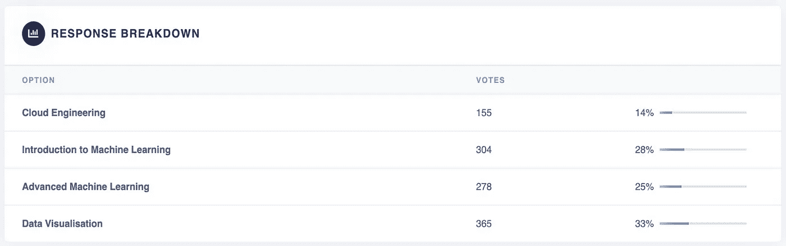

# 机器学习和数据科学隔离免费在线课程

> 原文：<https://towardsdatascience.com/machine-learning-free-online-courses-from-beginner-to-advanced-f50982dce950?source=collection_archive---------9----------------------->

来源:[西蒙·艾布拉姆斯](https://unsplash.com/@flysi3000)@ Unsplash-免费库存图片

## 从初级到高级。充分利用 covid 19-锁定

上周，我发表了一篇文章，推荐 [4 门免费数学课程，用于隔离和提升你的数据科学技能](/4-free-maths-courses-to-do-in-quarantine-and-level-up-your-data-science-skills-f815daca56f7?source=friends_link&sk=e21d4439fe6e60160c25668377f66936)。反应是惊人的，我真诚地希望你们中的许多人已经喜欢上了这些课程的内容。尽管如此，一些人对这个故事做出了回应，并在上面留下了私人笔记，专门询问机器学习课程。

这就是为什么在我发表了这篇文章后，我在上面添加了一个投票，以准确衡量你对几个主题的兴趣，并帮助我对进一步的内容进行优先排序。令人惊讶的是，超过 1100 人回答了问题，53%的人询问了入门或高级机器学习课程。

来源:对前一篇文章中作者投票的回复

这就是为什么今天我发布了一套新的课程，只专注于机器学习，并将其分为 3 个级别:初级、中级和高级。然而，请继续关注，因为在未来的故事中，我将发布关于数据可视化的独家内容。

**重要提示**:几个人写信给我回应我上周的故事，说 Coursera 只提供一周的免费服务。即使这是真的，正如我在故事中的“提示”中提到的，Coursera 的大多数课程和专业都有审核它们的选项。你不会获得证书，但你可以使用课程的大部分资源。我个人觉得这已经足够了。注册时，只需选择审核课程的选项。Coursera 将为您提供免费试用，但就在“开始免费试用”按钮后面，您应该会发现一个小文本，上面写着“**审核课程**”。这很棘手，但我已经仔细检查了我推荐的所有课程，所以它们都应该是免费的:)

# A.初级课程

**1。** [**机器学习**](https://www.coursera.org/learn/machine-learning?ranMID=40328&ranEAID=OyHlmBp2G0c&ranSiteID=OyHlmBp2G0c-ZhHqK.FCt..veOt.D2q8zg&siteID=OyHlmBp2G0c-ZhHqK.FCt..veOt.D2q8zg&utm_content=10&utm_medium=partners&utm_source=linkshare&utm_campaign=OyHlmBp2G0c)

地点:Coursera

参与机构:斯坦福

所需时间:54 小时

先决条件:它不需要任何东西，但我认为对微积分，尤其是线性代数的一些理解将有助于充分利用这门课程。

点评:[这门课的授课老师吴恩达](https://en.wikipedia.org/wiki/Andrew_Ng)，是机器学习和人工智能领域的传奇人物。他是斯坦福大学的教授，Coursera 的创始人之一，开发了机器学习的首批在线课程之一，该课程仍可在 [YouTube](https://www.youtube.com/watch?v=qeHZOdmJvFU&list=PLZ9qNFMHZ-A4rycgrgOYma6zxF4BZGGPW&index=1) 上观看。

课程本身的摘要:

> 本课程提供了机器学习、数据挖掘和统计模式识别的广泛介绍。主题包括:(一)监督学习(参数/非参数算法，支持向量机，核，神经网络)。㈡无监督学习(聚类、降维、推荐系统、深度学习)。㈢机器学习的最佳做法(偏差/差异理论；机器学习和 AI 中的创新过程)。

涵盖的主题:

*   线性回归
*   逻辑回归
*   正规化
*   神经网络
*   支持向量机
*   无监督学习
*   降维
*   异常检测
*   推荐系统

**2。** [**机器学习用 Python**](https://www.coursera.org/learn/machine-learning-with-python?ranMID=40328&ranEAID=OyHlmBp2G0c&ranSiteID=OyHlmBp2G0c-iBJdTtvK7X8Htu_9yr1Yiw&siteID=OyHlmBp2G0c-iBJdTtvK7X8Htu_9yr1Yiw&utm_content=2&utm_medium=partners&utm_source=linkshare&utm_campaign=OyHlmBp2G0c)

地点:Coursera

参与机构:IBM

所需时间:22 小时

先前要求:与先前课程相同，即基础数学。

评论:尽管课程说的是“中级水平”,但我个人认为这对该领域的新人来说是一个很好的起点。如果你正在寻找比斯坦福大学以前的课程更短的课程，这也是一个很好的选择，因为这需要不到一半的时间。

课程本身的摘要:

> 本课程使用一种平易近人且广为人知的编程语言 Python 深入研究机器学习的基础知识。在本课程中，我们将回顾两个主要部分:首先，您将了解机器学习的目的以及它在现实世界中的应用。第二，你将对机器学习的主题有一个总体的了解，比如监督与非监督学习、模型评估和机器学习算法。

涵盖的主题:

*   回归
*   分类
*   使聚集
*   推荐系统

# B.中级课程

**3。** [**神经网络和深度学习**](https://www.coursera.org/learn/neural-networks-deep-learning?)

地点:Coursera

涉及机构:deeplearning.ai

所需时间:30 小时

先决条件:需要 Python 编码和高中数学水平的经验。先前的机器学习或深度学习知识是有帮助的。

评论:在我看来，一旦你掌握了 ML 的基本概念，并且熟悉了 Python，下一步可能是熟悉 TensorFlow，因为现在很多计算量很大的算法都是用它运行的。还有，快速的事实，吴恩达也是 deeplearning.ai 的幕后推手，因此也是这门课程的幕后推手。

课程本身的摘要:

> 在本课程中，您将学习深度学习的基础。学完本课后，您将:
> 
> -了解驱动深度学习的主要技术趋势
> -能够构建、训练和应用完全连接的深度神经网络
> -知道如何实现高效(矢量化)的神经网络
> -了解神经网络架构中的关键参数
> 
> 这门课程还教你深度学习实际上是如何工作的，而不是仅仅给出一个粗略的或表面的描述

涵盖的主题:

*   深度学习简介
*   神经网络基础
*   浅层神经网络
*   深度神经网络

**4。** [**卷积神经网络**](https://www.coursera.org/learn/convolutional-neural-networks?specialization=deep-learning)

地点:Coursera

涉及机构:deeplearning.ai

所需时间:20 小时

前期要求:需要一些 TensorFlow 知识，Python 编码，高中水平的数学。

评论:继上一个课程之后的理想课程。

课程本身的摘要:

> 本课程将教你如何建立卷积神经网络，并将其应用于图像数据。由于深度学习，计算机视觉比两年前工作得更好，这使得许多令人兴奋的应用成为可能，从安全的自动驾驶到准确的人脸识别，再到放射图像的自动读取。

涵盖的主题:

*   卷积神经网络的基础
*   深度卷积模型:案例研究
*   目标检测
*   特殊应用:人脸识别和神经类型转移

# **C .高级课程**

**5。** [高级机器学习专业化](https://www.coursera.org/specializations/aml?ranMID=40328&ranEAID=TnL5HPStwNw&ranSiteID=TnL5HPStwNw-N2dMWkE_9hz9nLO49crTQQ&siteID=TnL5HPStwNw-N2dMWkE_9hz9nLO49crTQQ&utm_content=10&utm_medium=partners&utm_source=linkshare&utm_campaign=TnL5HPStwNw)

地点:Coursera

参与机构:国立研究大学高等经济学院(俄罗斯)

所需时间:10 个月，每周 6 小时

先决条件:为已经在这个行业中的人设计，在机器学习和数学方面有坚实的基础。

评论:这是一个完整的专业，所以从技术上来说，如果你觉得你不需要它，或者你已经在工作中或以前的课程中涉及到这些主题，你可以跳过其中的任何课程。

课程本身的摘要:

> 深入探究现代人工智能技术。你将教计算机看、画、读、说、玩游戏和解决工业问题。这个专业介绍了深度学习，强化学习，自然语言理解，计算机视觉和贝叶斯方法。顶级 Kaggle 机器学习实践者和 CERN 科学家将分享他们解决现实世界问题的经验，并帮助您填补理论和实践之间的差距。

涵盖的主题:

*   深度学习简介(32hs)
*   如何赢得数据科学竞赛:向顶级 Kagglers 学习(47hs)
*   机器学习的贝叶斯方法(30hs)
*   实用强化学习(30 小时)
*   计算机视觉中的深度学习(17hs)
*   自然语言处理(32 小时)
*   通过机器学习应对大型强子对撞机的挑战(24 小时)

再说一遍，这就是现在所有的窥视。

别忘了看看我的其他一些故事:

*   [4 门免费数学课程，让您在检疫中提升 DS 技能](/4-free-maths-courses-to-do-in-quarantine-and-level-up-your-data-science-skills-f815daca56f7?source=friends_link&sk=e21d4439fe6e60160c25668377f66936)
*   [我们数据人为什么以及如何帮助对抗新冠肺炎](/why-and-how-should-we-data-people-help-fight-against-covid-19-eng-esp-a45ee5e3688a?source=friends_link&sk=d2c58fe25d52ae855400065944a4aea8)
*   [5 种更好绘图的工具和技术](/5-more-tools-and-techniques-for-better-plotting-ee5ecaa358b?source=friends_link&sk=afd579f429a4890be0def79da8e28b57)

访问[我在 Medium](https://medium.com/@gonzaloferreirovolpi) 上的个人资料，查看我的其他故事。还有**如果你想直接在你的邮箱里收到我的最新文章，只需** [**订阅我的简讯**](https://gmail.us3.list-manage.com/subscribe?u=8190cded0d5e26657d9bc54d7&id=3e942158a2) **:)**

最后，我很想听听你接下来想读什么！以下是我对未来故事可能主题的简单调查:

回头见！