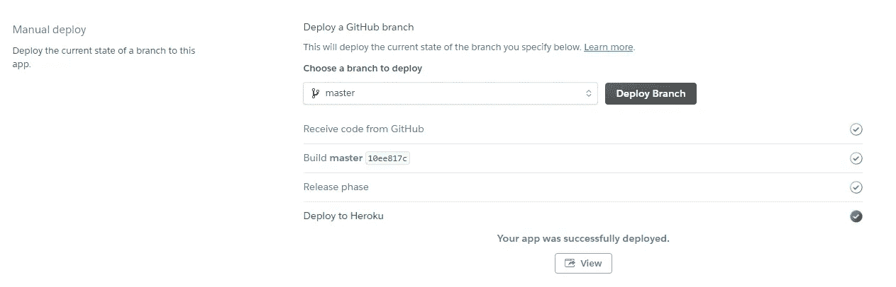

# 机器学习:从构思到网络应用

> 原文：<https://towardsdatascience.com/machine-learning-from-ideation-to-a-web-app-ed5ccd3e1df1?source=collection_archive---------36----------------------->

## 使用 Python 和 Flask 的端到端数据科学之旅，包括数据收集、Web 抓取、数据清理、特征工程、模型训练和云部署


由[像素](https://www.pexels.com/photo/analysis-blackboard-board-bubble-355952/)上的[像素](https://www.pexels.com/@pixabay)生成的图像

我之前所有关于实用 ML 方面的文章都主要围绕您的数据科学之旅中 ML 管道的单一主题。然而，在这里，我的目标是带您经历整个端到端的旅程，从数据收集开始，到任何地方的任何人都可以访问的云部署的 ML 模型结束。

除了通常怀疑的数据管理、特征工程、特征选择、模型训练和验证，我们还将看到如何执行网络搜集(通过 [BeautifulSoup](https://www.crummy.com/software/BeautifulSoup/) )，以及使用 [Flask](https://flask.palletsprojects.com/en/1.1.x/) 在 [Heroku](https://www.heroku.com/) 上部署一个 ML 模型。我希望带您经历一次实用的数据科学之旅，突出 ML 项目中一些相对无趣且耗时的任务。

# 预测问题

我们在这个项目中的目标将是预测任何两个国家之间的[一日国际(ODI)](https://en.wikipedia.org/wiki/One_Day_International) 板球比赛的获胜者，即分类问题。

对于那些不熟悉板球的人来说，这个游戏的工作原理如下:

*   两支各有 11 名选手的队伍争夺 ODI
*   每个队在每一局最多有 50 次击球或投球出局的机会
*   掷硬币获胜的一方(通过掷硬币或掷球棒)可以决定先掷球棒还是先掷保龄球
*   该队击球手首先在单局[中设定目标得分](https://en.wikipedia.org/wiki/Innings)。每局比赛持续到击球一方“全部出局”(即 11 名击球手中有 10 名“出局”)，或者第一方分配的所有回合都完成为止
*   第二个击球的队试图得分超过目标得分以赢得比赛。从团队保龄球第二的角度来看，他们试图在击球队达到目标得分之前击败第二队或完成分配的回合
*   比赛的结果可以是实际结果(一方获胜，另一方输掉比赛)，平局(在分配的回合结束时双方得分相同)，或平局/没有结果/放弃(在不可能比赛或由于天气条件或其他玩家无法控制的情况下比赛仍未结束的情况下)

一旦我们有了训练有素的模型，我们将:

*   为我们的模型所需的所有独立变量构建一个带有输入表单的 HTML 前端——需要 HTML 知识(本文没有明确涉及)
*   使用 Flask 框架构建应用程序的后端
*   在 Heroku 上部署 web 应用程序，使其公开可用并可通过 URL 访问

# 数据收集

我们的主要数据来源将是与男性 ODI 相关的四个公开数据集[此处](https://data.world/cclayford/cricinfo-statsguru-data)。这些数据是从[criinfo 的 Statsguru](https://stats.espncricinfo.com/ci/engine/stats/index.html) 搜集来的，包括了从 1971 年 1 月第一次对外直接投资到 2020 年 3 月所有对外直接投资的基本细节。这四个 CSV 具有每个游戏的以下必要信息:

*   相关的比赛细节，包括比赛国家的名称、比赛日期、比赛场地和结果


ODI _ 结果

*   单个运动员的击球和保龄球统计，例如得分、击球次数、击球次数、投球次数等。


ODI _ Burgess(截断的列)

我们将在数据管理阶段将这些数据帧连接在一起。尽管这些文件中提供了丰富的信息，但它们仍然缺少其他一些重要信息，如下所示:

*   投掷结果，我们将从每场比赛的[记分卡](http://www.howstat.com/cricket/Statistics/Matches/MatchScorecard_ODI.asp?MatchCode=4423&Print=Y)中刮出，正如在 [Howstat](http://howstat.com/cricket/home.asp) 上主持的那样
*   国际板球理事会(ICC) ODI 球员排名——根据 ICC 的官方国际击球和保龄球排名。我们将从 [ICC 排名](http://www.relianceiccrankings.com/datespecific/odi/)中收集这些信息

## 折腾信息的网络抓取

Web 抓取是从网站中提取信息，并将其存储在本地计算机或代码中的过程。Python 拥有多个 web 抓取库，允许我们将来自网站的原始数据作为 python 代码的一部分。我们将使用 BeautifulSoup 来实现这个目的，因为它使用起来非常简单，同时拥有几个与文本操作和解析相关的高级功能。

BeautifulSoup 的工作方式是获取一个网站，然后将其 HTML 元素解析为一个 BeautifulSoup 对象。然后，我们可以使用 HTML 标记和它的树状结构，根据它在 BeautifulSoup 对象中的位置提取特定的文本。例如，BeautifulSoup 可以帮助我们:

*   查找所有链接
*   找到第一个表格，给我它的第一个(或任何其他)单元格的内容
*   查找特定类的所有链接
*   在表格中查找特定文本，然后在下一个单元格中给我该文本

要了解网站的结构、使用的 HTML 标签以及如何使用 BeautifulSoup 处理特定网站的 HTML 标签，需要一些 HTML 的基础知识。

Howstat 上每个 ODI 在匹配的 URL 中都有一个唯一的匹配代码。我们将在一个`for`循环中使用这些唯一的匹配代码来收集曾经玩过的每个 ODI 的以下信息:

*   团队名称
*   掷硬币获胜的队
*   比赛日期
*   比赛场地的名称

比赛日期和场地名称将用于匹配和合并 toss 结果与我们的比赛细节的主要数据集。网站上显示的相关信息如下——在所有匹配中保持一致:


通过一点点的试验和错误，我确定了 Howstat 上的匹配代码(主要是顺序的)，并将它们保存在一个 [CSV 文件](https://drive.google.com/file/d/15-sZtSWipYeYcOIRGdbZZP0THwql0Y7r/view?usp=sharing)中。一旦这个 CSV 作为数据帧上传，我们将在一个`for`循环中检查每个比赛代码，从每个比赛的 Howstat 记分卡中提取所需的信息，并保存为一个单独的数据帧。前提很简单:

*   定义每个记分卡的基本 URL，在我们的例子中是:`http://www.howstat.com/cricket/Statistics/Matches/MatchScorecard_ODI.asp?MatchCode={code}&Print=Y`
*   解析 HTML 内容并保存为一个 BeautifulSoup 对象。
*   在解析的 HTML 中查找所有表格。我们没有找到带有 toss 信息的特定表格，因为源 HTML 没有任何唯一的表格标识。您可能会遇到一些特定的用例，在这些用例中，您想要的表是用一个惟一的类在 HTML 中定义的。如果是这样的话，那么不需要找到所有的表，只需用 BeautifulSoup 的`find_all`方法的`class_`参数就可以找到目标表。回到我们的用例，对于 BeautifulSoup 对象中表格的每个元素:

1.  如果元素的文本是`Match Date`，查找并保存下一个元素。下一个元素将是比赛的实际日期
2.  如果元素的文本是`Toss`，查找并保存下一个元素。下一个元素将是赢得掷币的队的名字
3.  如果元素的文本是`Venue`，查找并保存下一个元素。下一个元素是比赛场地的名称

*   将上述每个匹配的三个数据点添加到字典中
*   将字典转换成数据帧，以便有效地处理数据

现在你有了它，一个由所有 ODI 播放过的 toss 信息组成的数据帧，尽管废弃的文本仍需要一些清理。


toss_df(网页抓取后)

到目前为止执行的步骤代码:

# 数据管理和更多的网页抓取

我们现在将承担某些数据清理、预处理和合并任务，为最终摄入分类算法准备数据。

## ODI _ 结果数据框架

我们将首先清理保存每个游戏高级细节的`ODI_results`数据帧。注意它的结构:每个游戏有两个记录:一个来自每个游戏团队的视角。例如，如果英格兰在某一天赢了澳大利亚的比赛，那么这场比赛将有以下两个记录:

*   一个从英格兰的角度来看，显示英格兰赢得了这场比赛，和
*   另一个来自澳大利亚的视角，澳大利亚输掉了这场比赛

此外，请注意，数据框中没有将对方国家的名称作为单独的一列。相反，它与`Match`栏捆绑在一起，就像这样:团队 1 对团队 2。我们将执行以下步骤:

*   通过拆分`Match`列，去除结果列的前导和尾随空格，并使用一个简单的`numpy.where`方法，创建一个新的`Opposition`特性
*   删除不需要的列，只保留下列内容:`Result, Home/Away, Ground, Match Date, Country, Opposition`
*   将`Match Date`列转换为`datetime`格式


ODI_results_clean

## ODI _ 局数数据帧

现在我们将处理我们的`ODI_innings`数据帧，这需要做更多的清理工作。让我们先了解一下它的结构:

*   每一个参加比赛的运动员的名字都在一排
*   每个玩家的游戏特定统计数据在列中。击球和保龄球统计都有其特定的列
*   由于一名球员可以在同一场比赛中同时击球和投球，因此来自同一支球队的 11 名球员在每场比赛中都被包括两次，首先是他的击球统计数据，然后是他的保龄球统计数据。`Innings Number`列区分了这两个集合

我在手动 EDA 过程中注意到的一些问题:

*   某些特定比赛的重复记录，其中相同局的统计重复
*   在几个例子中，球员的名字被重复，所以统计数据是两个不同的球员，但有相同的球员名字。这意味着我们不能执行一揽子`drop_duplicates`操作。相反，我们需要选择列的子集来识别重复项
*   我们还需要修改一些拼写，使其与 ICC 排名列表中的拼写一致——这是我们即将进行的抓取排名信息的网络抓取任务的先决条件
*   由于 ICC 规则允许在特定条件下的比赛中使用替补球员，一些球员有 12 个球员的信息(而不是标准的 11 个)。我们将在此阶段保留所有 12 名球员的信息，稍后再处理

数据清理任务类似于我们在`ODI_results`上执行的任务，包括:

*   基于要素子集删除重复的记录/行
*   删除不需要的列，只保留下面的列:`Players, Opposition, Ground, Match Date, Country`。在特征工程的稍后阶段，我们将返回到一些被删除的列
*   清理`Opposition`列(删除`v`，重命名特定的列，使两个数据帧的命名一致:`ODI_results`和`ODI_innings`
*   将`Match Date`列转换为`datetime`格式


ODI _ 局数 _ 清洁

## 合并 ODI_results 和 ODI _ Burgess

现在，我们应该将两个清理过的数据帧合并为一个。我们的目标是在`ODI_results_clean`数据帧中添加 24 列，每一列都有参赛队和非参赛队的 12 名球员的名字:


上面的数据结构确保了我们将每个游戏的数据放在一行中。这是一个相当棘手的过程，涉及多个`merge`和`unstack`操作，但我会尽力解释我的方法:

*   首先，将`Match Date`、`Ground`、`Country`上的`ODI_results_clean`和`ODI_innings_clean`合并，让游戏国玩家以长格式加入`ODI_results_clean`。在这个上下文中，长格式意味着用一列来保存玩家的名字，因此，每场比赛将跨越多行——类似于`ODI_innings_clean`。注意这里使用的是`left` join 而不是`inner` join，因为我们希望保留来自`ODI_results_clean`的所有数据，即使 ODI _ Burgess _ clean 中没有相应球队的球员信息
*   然后执行类似的`merge`操作，只是这一次使用`Opposition`栏代替`Country`(以获得对手队球员的姓名)，连同`Match Date`和`Ground`
*   我们希望合并两个新的长格式数据框架，在单独的列中包含所有细节和每个队的球员。然而，在合并过程中，如果不复制玩家的名字，我们就不能以他们当前的形状做到这一点。在应用合并操作之前，我们希望有一个“平面”数据帧结构，其中每个国家的比赛数据都在一行中，即所有球员都在列中。我们将通过使用`groupby`和`unstack`方法的自定义函数来实现这一点
*   一旦我们从比赛和对手的角度获得了 2 个“平面”数据帧，我们将执行一个简单的内部合并来将这两个数据帧连接在一起。我们使用了一个内部连接，因为我们想确保只有普通的行被连接，因为我预计`ODI_innings_clean`不会有特定球队的球员信息，无论是官方 ODI 状态还是其他
*   替换一些球员名字的拼写，以确保我们的数据和 ODI 排名之间的拼写一致，我们将废弃。我通过手工试错法发现了这一点，如果您有来自多个来源的数据，这在一定程度上是必需的

迄今为止执行的数据管理操作代码:

## ICC ODI 等级的网页抓取

接下来是最后一点网络抓取，从官方 ICC ODI 排名网站[获取截至比赛日所有球员的 ICC ODI 排名。实现这一点的高级工作流如下:](http://www.relianceiccrankings.com/datespecific/odi/)

*   将`ODI_matches`数据帧分解回“long”格式，这样就只有一个`Players`列，单个匹配将跨越多行。这样做将有助于我们合并后刮排名

对于 ODI 播放的每个唯一日期:

*   刮出击球和保龄球的前 100 名球员，并将他们保存在单独的数据框中
*   获取当天参加比赛的球员姓名，并保存到第三个数据帧
*   合并这三个数据帧
*   在运动员姓名、击球等级和保龄球等级上逐个拆分合并的数据帧，使这三个信息集在三个数据帧中，运动员和等级在列中
*   沿着列将三个未堆叠的数据帧连接在一起
*   将结果 DF 附加到列表中

在`for`循环的末尾，我们将有一个多个数据帧的列表，其中包含 ODI 比赛的每个日期的球员姓名、保龄球和击球等级。最后一步是对该列表进行简单的连接，以生成一个综合的最终数据帧(`final_result`)，该数据帧包含以下 7，738 行 78 列的信息:

*   国家名称
*   反对派名称
*   主场/客场——从这个国家的角度来看，这场比赛是主场还是客场
*   地面
*   比赛日期
*   结果—我们的目标变量
*   24 名运动员的名字，国家和反对派各 12 名
*   ICC ODI 保龄球 24 名球员的排名(`np.nan`以防球员排名在前 100 名之外)
*   ICC ODI 名选手的击球等级(`np.nan`如果选手不在前 100 名之内)

## toss_df 数据帧

下一步是清理我们的`toss_df`数据帧，并将其与`ODI_matches`数据帧合并。一些高级任务包括:

*   从`Match`栏中提取比赛和对手队的名称
*   从`Ground`栏中提取准确的地面名称
*   作为网页抓取的结果，`Toss Won by`列中的一些记录包括`Result:`。这种情况更有可能发生在那些被放弃的、未完成的或其他不可能有结果的匹配中。我们将放弃这些记录
*   更新一些`Ground`名称，使其与`ODI_matches`数据帧一致
*   与`final_result`数据帧合并成`final_data`数据帧

下一个数据管理任务的代码如下:

# 特征工程

我们已经有了相当多的信息来开发一个预测性的工作模型，但是我们可以添加和评估更多的信息。

## 比赛月份

我认为天气会对 ODI 比赛的结果产生影响。我们可以添加一年中的月份来代表这些信息。

## 赢/赔率

这是一个国家在任何给定日期赢得的累计比赛数与输掉的比赛数之比。根据我们目前收集的信息，我们可以很快确定这一点。

## 击球/保龄球平均得分和每次得分(RPO)

接下来，我们将根据原始`ODI_innings`数据框架中的局数信息，为每个团队计算以下四个新特性:

*   平均打击率:每次击球失败得分
*   保龄球平均得分:每门失分
*   击球 RPO:每次击球得分
*   保龄球 RPO:每次投球失分

这四个特征将根据每个国家截至比赛日期(但不包括比赛日期)的累计统计数据进行计算。计算它们所需的相关列有:


ODI _ Burgess _ for _ averages 数据框架

我们只有计算四个新特征所需的六个特征中的五个，因为我们在游戏中被一个团队遗漏了`Innings Wickets Taken`。但是这很容易计算，因为我们有每场比赛对手的`Innings Wickets Taken`。一个队失去的三柱门相当于对方得到的三柱门。

然后，一旦我们有了计算四个新特性所需的所有六列，我们将遍历所有国家，计算每个国家到比赛日期为止(但不包括比赛日期)这六个变量的累积值。一旦我们有了累积的统计数据，我们只剩下计算四个新特性了。我们的新数据框架将如下所示:


ODI_team_averages 数据框架

接下来，我们将删除除最后四列之外的所有列，并与`final_data`数据帧合并。

## 掷硬币赢了

我们还可以将`Toss Won By`列更新为类似于`Toss Won?`的内容，以表明游戏团队是否赢得了比赛。这将把列转换成二进制格式，并通过虚拟/一位热码编码消除潜在的稀疏数据帧。

## 玩家排名

请记住，对于某些游戏，我们有十二个玩家(由于游戏期间的玩家替换)，但对于我们的模型训练和预测，我们不能有超过十一个玩家。这是因为在一场比赛开始前，一个队不能有超过 11 名队员。

为了适应这种情况，并且只有在我们的数据集中有 12 名玩家的比赛中，我们才会更新任何一名玩家的等级，使其等于截至`Match Date`的所有 12 名玩家的平均等级。

我们的特征工程已经接近尾声了，但是也许让我们也尝试一些额外的东西。目前，我们每场比赛总共有 44 个排名栏——这可能有点太多了，可能会导致“维数灾难”。如果我们可以在一个单独的列中总结每个队的击球和保龄球等级信息，会怎么样？这可能会将排名列的数量从 44 减少到 4。

但在此之前，我们应该估算缺失的等级。排名缺失是由于在比赛当天，球员不在 ICC ODI 排名前 100 名之列，即他们的排名高于 100。我会用一个常量`101`来代替缺失的等级。您可以尝试一些其他常数，但我认为这是最合适的，因为较高的常数可能会由于有点离群而导致误解。

我们可以选择任何描述性统计数据来表示 11 名球员的击球和保龄球信息，只要外行人在预测过程中能够快速计算出来。我将计算总和、平均值和中值，并在特征选择期间进一步评估。

我们现在已经完成了所有的特性工程，产生了 14 个新特性。

特征工程活动的所有代码如下:

# 特征选择

参考我以前的[文章](/how-to-find-the-best-predictors-for-ml-algorithms-4b28a71a8a80)，重温我将在这里使用的特性选择技术。

## 分类特征选择—卡方检验

执行卡方检验以确定我们的分类特征是否与目标变量相关，结果如下:


卡方检验

显然，我们在这里得到了令人惊讶的结果——我本以为投掷结果和场地会对比赛结果产生重大影响。然而，根据我们手头的数据，鉴于它们的高 p 值，情况似乎并非如此。

我们有可能在有和没有这两个特性的情况下运行模型验证指标，并从那里得到它。但对于这个项目，我们将在模型训练之前放弃这些功能。

## 数字特征选择— F 统计量

对数值特征进行 ANOVA F-统计测试可得出以下结论:

*   `Match Month`对于预测来说没有统计学意义(再次令人惊讶)
*   所有其他特征本身都具有统计学意义
*   与总等级和平均等级相比，四个中值等级特征的 F 统计量非常低:我们不会考虑将它们用于模型训练
*   总等级和平均等级的 F 统计量是相同的，所以如果我们愿意，可以使用任何一个
*   作为一个粗略的启发，如果我们将`Country Total Batting Rank`特征的 F 统计量与每个`Country_Batting Rank_x`列的 F 统计量之和进行比较，后者大于前者。

因此，我将放弃所有 12 个描述玩家等级的额外特征，这些特征是在上一个特征工程中创建的(和`Match Month`)，继续我们对单个玩家等级的建模。

特征选择的代码如下:

# 模型培训和验证

最后，我们来到机器学习的有趣部分——模型训练。我们将使用简单的逻辑回归算法进行预测。

我还尝试了特定的其他算法(例如，XGBoost、Random Forest、Ada Boost、Gradient Boosting)，但是除了 Random Forest，其他三种算法并没有导致预测准确性的实质性提高。

在删除了基于特征选择步骤的列之后，我们只需要在拟合逻辑回归模型之前从分类特征中创建虚拟变量。

对于全面的模型评估，我们将执行`[RepeatedStratifiedkFold](https://scikit-learn.org/stable/modules/generated/sklearn.model_selection.RepeatedStratifiedKFold.html)`交叉验证，重复十次，以准确度作为我们的评估标准，因为我们的数据不是不平衡的。

我们的平均准确度分数为 68.66%，这是一个合理的准确度，如果不是非常高的话。但我想这是意料之中的，因为比赛的本质是个人的才华可以让一场比赛从一个失败的位置变成一个团队的胜利位置。

我们也可以画一个 ROC 曲线，确定合适的概率阈值来区分预期的赢和输。


受试者工作特征曲线

使用 [Youden 的 J 统计量](https://en.wikipedia.org/wiki/Youden%27s_J_statistic)，我们的理想概率阈值达到 48.27%，也就是说，该阈值将产生最大的区分能力，以区分预期的赢和输。

我们的最后一步将是通过我们的 web 应用程序(Final_LR_Model.pkl)简单地处理模型以实现预测。

所有建模和验证相关的代码是:

# 为数据捕获构建一个 HTML 前端

那么我们现在如何使用我们的模型进行预测呢？有几种方法可以做到这一点:我们可以将特性传递给模型，并调用`predict`或`predict_proba`方法，或者我们可以与他人共享腌好的文件来预测他们自己(只要他们了解 python)。

但这两种方法都需要人工干预来加载数据并将其传递给模型。如果我们希望向世界开放我们的模型，允许任何人在任何时间做出他们的预测，而不需要与 python 和其他技术任务进行任何直接交互，会怎么样？

为了实现这一点，我们可以开发一个网站来捕获用户输入，将其传递给 Flask 后端进行预处理和预测，并通过另一个网页将模型输出返回给用户。本质上，我们想要像[这种](https://bit.ly/predict-odi)的东西——这是我们部署在云上的模型，让世界可以访问它，并且不需要 python、机器学习等知识。

开发一个网站需要一定程度的 HTML 和 CSS 样式表知识，这超出了本文的范围。然而，设计一个简单的输入表单并不需要成为专家。一些免费的在线平台和软件提供模板，或者允许通过简单的拖放界面进行 HTML 开发。

HTML 代码告诉浏览器在屏幕上显示什么，而 CSS 文件告诉它如何在屏幕上显示 HTML 内容。CSS 是一种通过指定背景颜色、字体大小和颜色、边距等来控制网页布局的有效方法。

请参考我们 web 应用程序的 [HTML](https://github.com/finlytics-hub/ODI/blob/master/templates/home.html) 和 [CSS](https://github.com/finlytics-hub/ODI/blob/master/static/style.css) 代码，并注意以下几点:

*   HTML 代码(连同任何相关的图像)应该在一个“模板”文件夹内。templates 文件夹应该与 Flask 应用程序位于同一层，我们将在后面介绍它
*   源代码应该位于名为“static”的文件夹中。静态文件夹应该与 Flask 应用程序位于同一级别。注意，这个文件夹的名称可以是您想要的任何名称，只要它在 HTML 代码中被适当地引用
*   我们将在 templates 文件夹中有两个 HTML 代码:[一个](https://github.com/finlytics-hub/ODI/blob/master/templates/home.html)用于捕获用户输入(`home.html`)，另一个[用于显示模型输出(`result.html`)](https://github.com/finlytics-hub/ODI/blob/master/templates/result.html)
*   `home.html`文件将包含几个下拉菜单和文本字段来捕捉用户输入。对于分类特征，最好使用下拉菜单来限制用户输入我们的模型未知的值。例如，`Country`、`Opposition`和`Home/Away`特性

定义下拉菜单的示例代码:

```
<select class="element select large" id="element_2" name="element_2" required="required">     
<option value="" selected="selected"></option>    <option>Afghanistan</option>
<option>Australia</option>    
<option>Bangladesh</option>    
<option>England</option>    
<option>India</option>    
<option>Ireland</option>    
<option>New Zealand</option>    
<option>Pakistan</option>    
<option>Scotland</option>    
<option>South Africa</option>    
<option>Sri Lanka</option>    
<option>West Indies</option>    
<option>Zimbabwe</option>  
</select>
```

定义整数文本字段的示例代码(例如，玩家的保龄球等级):

```
<input id="element_99" name="element_99" class="element text large" type="number" step=".01" required="required" value=""/>
```

定义浮动文本字段的示例代码(例如击球率):

```
<input id="element_3" name="element_3" class="element text large" type="number" step=".01" required="required" value=""/>
```

让我们来看看这些标签的一些主要元素:

1.  `<select>…</select>`指定一个下拉框
2.  `<option>…</option>`指定每个下拉选项
3.  `id`是字段的唯一标识
4.  `name`是字段的唯一名称，我们的 Flask 应用程序可以使用它来引用特定的字段
5.  `class`是对 CSS 代码中定义的特定样式指南的引用
6.  `number`指定只接受整数作为输入
7.  `step`允许输入浮点数
8.  `required`确保用户不能将字段留空
9.  `value`是表单加载时用户看到的默认值

*   CSS 代码在 HTML 文件的`<head>…</head>`标记中被引用，如下所示(其中‘static’是保存 CSS 代码‘style . CSS’的文件夹名，`[url_for](https://flask.palletsprojects.com/en/1.1.x/api/#flask.url_for)`是生成动态 URL 的内置 Flask 方法):

```
<link type="text/css" rel="stylesheet" href="{{ url_for('static', filename='./style.css') }}">
```

*   `result.html`中的主要元素是对作为`{{pred}}`的`pred`变量的引用，它显示存储在 Flask 应用程序中的值

# 通过 Flask 开发 Web 应用程序的后端

我们将使用 Flask 框架开发 web 应用程序的后端。可以把 Flask 想象成一个库，可以像 Python 中的其他库一样导入。所以基本上，我们的应用程序将是一个简单的 Python 文件(扩展名为`.py`，而不是扩展名为`.ipynb`的笔记本)，除了所有其他 Python 功能之外，它还利用了 Flask。

我们后端应用程序的代码如下:

app.py

为了让上面的代码不言自明，我尽了最大努力做了很好的注释，但是让我们从更高的层面来看一下:

*   导入所有需要的库
*   实例化名为`app`的 Flask 应用程序
*   加载我们的腌渍模型(`Final_LR_Model.pkl`)，它和`app.py`在同一个文件夹中
*   创建两个列表:`cols`带有输入列的名称，即在应用虚拟编码之前模型使用的特征，以及`col_list`带有虚拟编码特征的名称
*   通过 Flask 的`[render_template](https://flask.palletsprojects.com/en/1.1.x/api/#flask.render_template)`方法显示`home.html`网页
*   将所有用户输入保存在列表`int_features`中，并将需要预测的国家名称保存在`country`变量中
*   在应用虚拟编码(`cols`)之前，将输入列表转换成一个 NumPy 数组，然后转换成一个 dataframe，其列与我们模型中的列相同
*   创建分类特征的虚拟变量，并重新索引生成的数据帧，以确保它具有我们的模型所需的所有虚拟编码列(通过带有`labels = col_list`参数的`pd.reindex`)
*   通过`predic_proba`预测一场比赛获胜的概率，转换成浮点数，通过一个简单的`if`语句确定该国有望赢得比赛还是输掉比赛
*   通过`render_template`显示`result.html`网页，将您选择的字符串分配给`pred`变量
*   运行应用程序

就是这个！

但是，让我们先在本地测试我们的应用程序，然后再将它部署到云中。启动 Anaconda 提示符(或您选择的任何终端)，导航到包含`app.py`、`Final_LR_Model.pkl`和模板&静态文件夹的文件夹，并使用以下命令运行它:

```
python app.py
```


忽略版本冲突版本(您可能看不到)，在 web 浏览器中打开 URL。你应该看到你漂亮的`home.html`并且能够输入测试值并做出预测。

恭喜你！你现在已经构建了你的第一个 ML 应用程序。接下来，我们将把这个应用程序从您的本地机器带到云中，以便其他人可以通过 URL 使用它。

# Heroku 上的云部署

Heroku 为云部署提供平台即服务(PaaS)。有几种方法可以完成 Heroku 部署，但最简单的可能是通过 GitHub 库。

除了我们在本地测试应用程序时使用的两个文件和两个文件夹，在 Heroku 部署之前，我们还需要 GitHub 存储库中的两个文件:

*   `requirements.txt` 是一个文本文件，包含执行应用所需的 python 包的名称。这些是为成功执行应用程序而在环境中安装的必备软件包


requirements.txt

你应该非常熟悉上述所有要求。可以把 Gunicorn 看作一个中间件，它允许您的 Flask 应用程序与托管它的服务器进行通信。从技术上讲，它是一个 Python Web 服务器网关接口(WSGI) HTTP 服务器

*   `Procfile`(没有任何文件扩展名)是一个应用程序中的进程类型列表，即一个给 web 服务器的指令列表，指示当有人登录到该应用程序时应该首先执行哪个文件。下图中的一行代码告诉服务器使用 Gunicorn WSGI 打开一个 web 应用程序，并在一个名为`app.py`的文件中运行一个名为`app`(这是我们在`app.py`中定义的应用程序名称)的应用程序


Procfile

在这个阶段，你的 GitHub 库应该是这样的:


[https://github.com/finlytics-hub/ODI](https://github.com/finlytics-hub/ODI)

按照以下步骤完成 Heroku 部署:

*   登录你的 Heroku 账户(注册这种规模的项目是免费的),在你的仪表盘上点击“创建新应用”


Heroku 仪表板

*   输入您想要的应用程序名称和首选地区，然后单击“创建应用程序”


创建新应用程序

*   在“部署方法”下选择 GitHub，并连接到您的 GitHub 帐户


选择并连接到 GitHub

*   GitHub 可能会要求您在允许通过 Heroku 访问您的 GitHub 帐户之前进行身份验证
*   一旦你的 GitHub 账户连接到 Heroku，搜索并连接到你的目标 GitHub 库


连接到 GitHub 存储库

*   连接到存储库后，在“手动部署”选项下部署其所需的分支


部署分支

*   等待一段时间，Heroku 从存储库中取出所有需要的代码，在其服务器上安装所有需要的库，并完成部署。一旦完成，Heroku 将确认你的成功部署(或其他),并给你一个选项来查看你的应用程序在一个特定的网址



成功部署

部分了解我们可通过互联网访问的应用程序:


部署的应用程序(部分快照)

现在你有了它——一个完整的工作机器学习模型，用 Python 开发，部署在云上，任何人都可以全天候访问！

# 结论

这是一次非常旋风般的旅行，我希望您会一直跟着我，同时也学习一些新的概念、工具、技术和方法。

你也可以在这里找到完整的笔记本[。](https://github.com/finlytics-hub/ODI/blob/master/Cricket_ODI_Predictions.ipynb)

如果您想讨论任何与数据分析、机器学习、金融或信用分析相关的问题，请随时联系 [me](https://www.finlyticshub.com/) 。

下次见，摇滚起来！