# 机器学习指南—边做边学

> 原文：<https://towardsdatascience.com/machine-learning-guide-learning-by-doing-afe732afde39?source=collection_archive---------26----------------------->

## 强化你技能的指南


与 Raj 在 [Unsplash](https://unsplash.com/s/photos/learning?utm_source=unsplash&utm_medium=referral&utm_content=creditCopyText) 上的[公路旅行照片](https://unsplash.com/@roadtripwithraj?utm_source=unsplash&utm_medium=referral&utm_content=creditCopyText)

我坚信学习如何做某事的一个有效方法就是实际去做。“边做边学”的风格也适用于机器学习。当然，对概念和理论的全面理解是必要的，但如果不能实现实际的模型，我们的机器学习技能将是不够的。

在这篇文章中，我将带您了解构建机器学习模型的过程，从探索性数据分析开始，最终达到模型评估。这将是一个简单的模型，但它肯定会帮助你理解的概念和程序。我将尝试详细解释每个步骤，并提供代码。

我们将尝试从拍卖中预测汽车的价格。数据集可在 kaggle 上的[这里](https://www.kaggle.com/doaaalsenani/usa-cers-dataset)获得。该员额的主要部分是:

1.  探索性数据分析
2.  数据预处理
3.  构建和评估模型

# **1。探索性数据分析(EDA)**

让我们从将数据集读入熊猫数据帧开始，并查看它:

```
import numpy as np
import pandas as pddf = pd.read_csv("/content/USA_cars_datasets.csv")df.shape 
(2499, 13)df.head()
```


该数据集包括 2499 辆汽车的 13 个特征。在确定汽车价格时，有些特征很重要，而有些则是多余的。例如，“vin”、“lot”和“未命名:0”列对价格没有影响。这三列代表一辆车的 ID。由于数据集取自美国的一个网站，我认为国家一栏只包括“美国”。让我们检查一下:

```
df.country.value_counts()
usa       2492  
canada       7 
Name: country, dtype: int64
```

并非所有但绝大多数都是“美国”，所以在我们的模型中使用“国家”列作为特征是没有意义的。因此，我们不会在模型中使用的列有:

*   vin，批次，未命名:0，国家

让我们使用 **drop** 函数删除这些列:

```
df.drop(['Unnamed: 0','vin', 'lot','country'], axis=1, inplace=True)
```

除了要删除的列列表之外，我们还传入了两个参数。 **Axis=1** 表示我们正在删除列，并且 **inplace** 参数设置为 True 以保存数据帧中的更改。

现在数据帧的列数减少了:

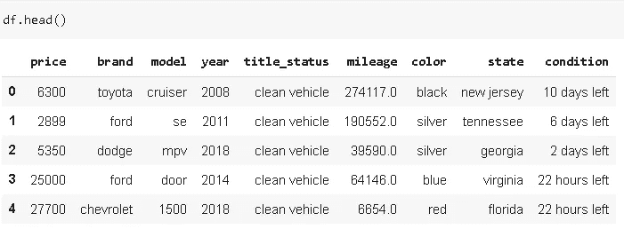

我们将构建一个受监督的机器学习模型来执行一个**回归**任务。监督学习意味着我们有一个想要预测的目标。监督学习可以分为两大类:

*   回归:目标变量是连续的
*   分类:目标变量是离散的

价格列是我们的目标变量(因变量)，其他列是我们将用来预测价格的特性(自变量)。

# **缺失值**

让我们检查一下数据集中是否有任何缺失值:

```
df.isna().sum().sum()
0
```

该数据集经过预先清理，因此没有任何缺失值，但是检查和处理缺失值是一个很好的做法。在大多数情况下，我们会有缺失值，并且应该学会如何检测和处理它们。 **df.isna()。sum()** 返回每列中缺失值的数量。通过再加一个总和，我们可以看到整个数据帧中缺失值的总数。以下是关于如何查找和处理缺失值的详细帖子:

[](/handling-missing-values-with-pandas-b876bf6f008f) [## 用熊猫处理缺失值

### 关于如何检测和处理缺失值的完整教程

towardsdatascience.com](/handling-missing-values-with-pandas-b876bf6f008f) 

# **数据类型**

检查列的数据类型很重要，如果有不合适的数据类型，就进行更改。

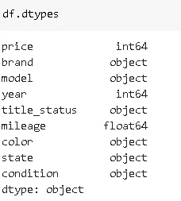

他们看起来很好。如果数据集有很多观察值(行)，我们可以使用“category”数据类型代替 object，以减少内存使用。

# **目标变量**

我总是从检查目标变量开始。目标变量是我们难以预测的。最后，我们将根据我们的预测与目标的接近程度来评估模型。因此，很好地了解目标变量是一个很好的实践。让我们检查目标变量的分布。我们首先需要导入将在 EDA 过程中使用的数据可视化库:

```
import matplotlib.pyplot as plt
import seaborn as sns%matplotlib inline #render visualizations in the notebookplt.figure(figsize=(10,6))
sns.distplot(df['price']).set_title('Distribution of Car Prices')
```

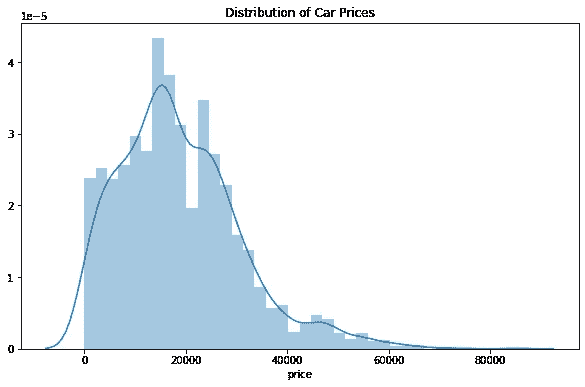

价格变量不是正态分布的。它是右偏的，意味着分布的尾部右侧比左侧长。另一种证明偏斜度的方法是比较平均值和中值。如果平均值高于中值，则分布是右偏的。Mean 是平均值，median 是中间的值。因此，如果平均值高于中位数，我们有更多的样本在中位数的上边。


如预期的那样，平均值高于中值。所以，昂贵的汽车比便宜的汽车多。

# **独立变量**

**品牌和型号**


我们有 8 个特点。让我们从探索“品牌”特征开始:

```
df.brand.value_counts().size
28
```


有 28 个不同的品牌，但前 6 个类别包含了大多数汽车。


几乎 94%的汽车属于六个品牌。剩下的 6%分布在 22 个不同的品牌中。我们可以将这 22 个品牌标为其他。我们首先创建一个包含这 22 个品牌的列表，然后在“品牌”列上使用熊猫**替换**功能:

```
other = df.brand.value_counts().index[6:]
len(other)
22#replace 22 brands with "other"
df.brand = df.brand.replace(other, 'other')
```

让我们检查一下操作是否成功:

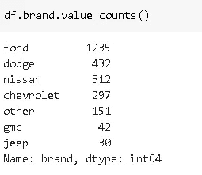

> 边做边检查是一个好习惯。如果你只在最后检查，你可能很难找到错误的原因。

是时候检查价格是否根据不同的品牌而变化了。箱线图是完成这项任务的信息工具。

```
plt.figure(figsize=(12,8))sns.set(style='darkgrid')
sns.boxplot(x='brand', y='price', data=df)
```


方框中的线表示平均价格。福特汽车的平均价格最高，但请记住，数据集中几乎一半的汽车是福特汽车。在构建和评估我们的模型时，这可能是有用的。还有一些极端值(即异常值)用圆点表示。我们稍后将处理异常值。箱线图的高度表示数值的分布程度。该数据集包括的道奇汽车比雪佛兰汽车多，但雪佛兰汽车的价格比道奇汽车更分散。各种各样的模型可能会导致这种传播。让我们来看看每个品牌有多少型号:

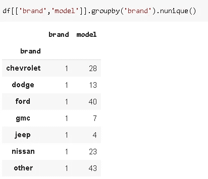

虽然道奇车比雪佛兰车多，但雪佛兰的车型数量是道奇的两倍多，我认为这就是价格差异的原因。让我们再次使用箱线图来查看不同型号的价格分布:

```
plt.figure(figsize=(12,8))sns.set(style='darkgrid')
sns.boxplot(x='model', y='price', data=df[df.brand == 'dodge']).\
set_title('Prices of Different Dodge Models')
```

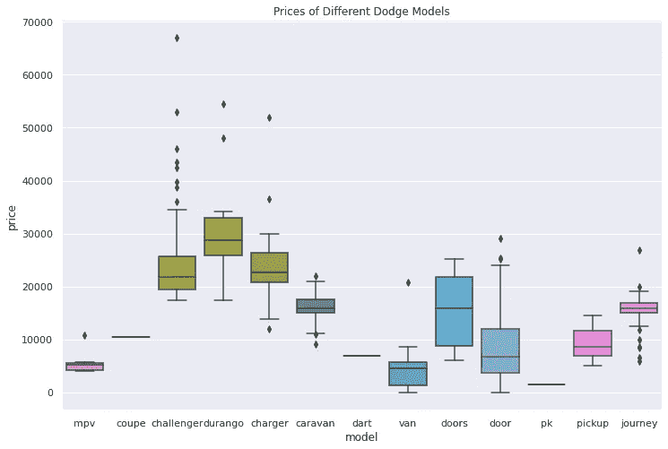

我选择道奇品牌作为例子。如箱线图所示，价格范围因型号而异。

整个数据集中有 127 个模型，但 50 个模型覆盖了几乎 94%的汽车，因此我们可以将剩余的模型标记为其他。

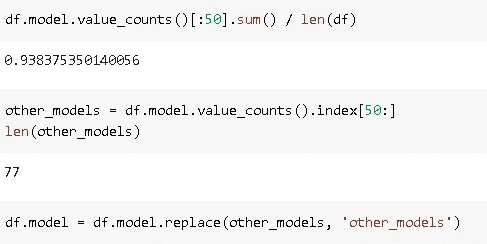

**标题状态**

我们已经涵盖了品牌和型号。让我们检查一下“**标题 _ 状态**栏。它表明汽车是干净的还是可回收的，这是决定价格的一个因素。我们来确认一下:


我们没有很多打捞车，但它是一个具有显著价格差异的必备功能。

**颜色**

“颜色”列与“品牌”列在类别数量上相似。


有 49 种不同的颜色，但 90%的汽车属于 6 种不同的颜色。我们可以像在“品牌”栏中一样，将剩余的颜色标记为其他颜色。


让我们看看现在有哪些颜色:

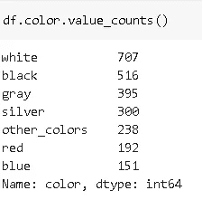

平均价格很接近。同时检查极值(即异常值)是一个很好的做法。

```
sns.set(style='darkgrid')plt.figure(figsize=(12,8))
sns.boxplot(x='color', y='price', data=df)
```

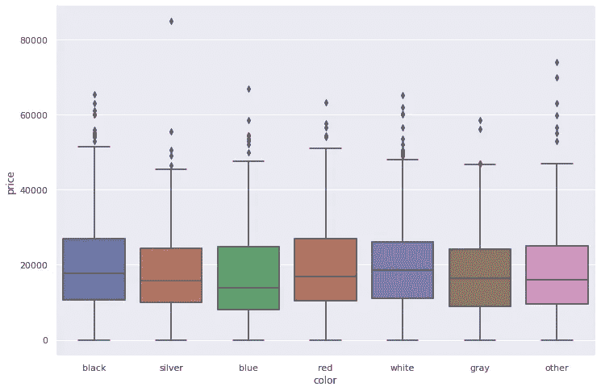

颜色与价格

上图告诉我们两件重要的事情:

*   颜色不是价格的决定性因素。不同颜色的平均价格和价差并没有太大的变化。因此，最好不要将“颜色”作为一个特征包含在我们的模型中。
*   存在异常值，我们需要以某种方式处理它们。否则，模型将尝试捕获它们，这将阻止模型很好地推广到数据集。

我们有一些价格极高的汽车。这些异常值不会以特定的颜色进行分组。从上图来看，似乎所有的异常值都在 45000 以上。让我们检查一下我们有多少异常值，并决定我们是否能够放弃它们:


45000 以上的汽车有 102 辆，占整个数据集的 4%。我想我们可以放弃这些样本。在某些情况下，4%太多了，所以如何标记和处理异常值取决于你。离群值没有严格的定义。

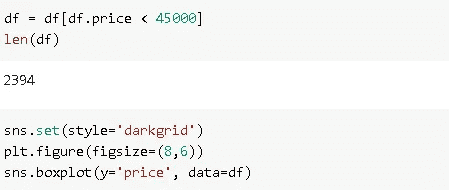

剔除异常值后的价格箱线图

**年份和里程**

年份和里程肯定会改变汽车的价格，所以我们将在模型中使用这些功能。我更喜欢通过从当前年份中减去“年份”来将“年份”列转换为“年龄”:

```
age = 2020 - df.iloc[:,3].values
df['age'] = agedf = df.drop(['year'], axis=1)
```

**条件**

条件表明拍卖结束的时间，我认为这可能会增加需求，从而提高价格。但是，我们不能使用它当前的格式。我们应该用一个合适的数据类型来表示它，这个数据类型是显示分钟数的整数。

有许多方法可以完成这项任务。请随意尝试不同的方法。我会这样做:

1.  在空格上拆分条件列，并扩展到具有三列的新数据框架(例如，10-天-左)
2.  将第二列转换为适当的分钟值(例如，用 1440 替换天，用 60 替换小时)
3.  然后将第一列乘以第二列，得到拍卖结束的剩余时间(分钟)。

注意:条件列中有一些行带有“列表已过期”。对于这些行，我将用零替换“Expired ”,用一替换“Listing ”,这样剩余时间就变成零。

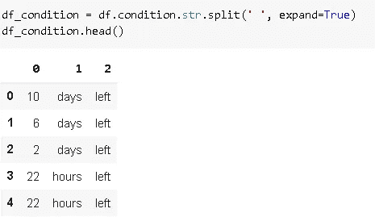

```
a = {'days':1440, 'hours':60, 'minutes':1, 'Expired':0}
df_condition[1] = df_condition[1].replace(a)df_condition[0] = df_condition[0].replace('Listing',1)
#convert to numeric to do multiplication
df_condition[0] = pd.to_numeric(df_condition[0]) df_condition['time'] = df_condition[0] * df_condition[1]#create a new column in the original dataframe
df['time_left'] = df_condition['time']
```

原始数据帧:


EDA 过程中另一个有用的工具是相关矩阵，它可以用来发现连续特征之间的相关性。 **corr()** 方法可应用于数据帧，结果也可使用**热图**可视化:

```
corr = df[['price','mileage','age', 'time_left']].corr()plt.figure(figsize=(10,6))
sns.heatmap(corr, cmap='Blues').set_title('Correlation Matrix')
```

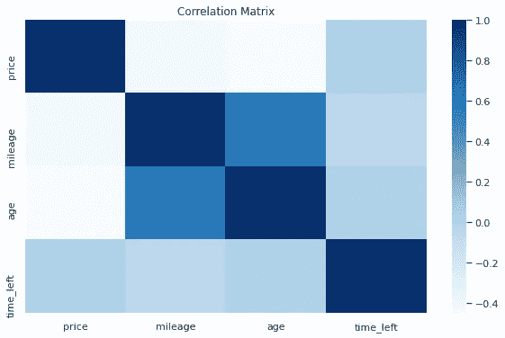

价格似乎与剩余时间无关，但价格与年龄或里程数之间存在显著的负相关。这是意料之中的，因为旧车更便宜。

# **2。数据预处理**

我们已经探索了数据集，并清理了它的一部分。但是，我们还没有完成。

我们有品牌和颜色等分类特征。这些特征需要用模型可以处理的格式来表示。我们不能只在模型中输入字符串。我们首先需要将类别转换成数字(**标签编码**)。如果分类变量不是有序的(也就是说，它们没有等级顺序)，仅仅做标签编码是不够的。我们需要用二进制列来表示类别。这可以使用“**虚拟**或“**一个热**”编码来完成。例如，我们可以将“闪避”标签设为 3，将“GMC”设为 1。如果我们只对非有序分类变量进行标签编码，模型会认为类别 3 比类别 1 更重要，这是不正确的。一种热编码将每个类别表示为一列，该列只取两个值，1 和 0。对于“道奇”品牌的汽车，只有“道奇”一栏的值变成 1，其他栏都是 0。通过这种方式，我们可以确保类别之间没有层次结构。

我们还需要**标准化**数字数据，以便这些值在相同的范围内。否则，模型可能会更重视较高的值。例如,“里程”列中的值远高于“年龄”列中的值。我们可以在[0，1]的范围内对这些值进行归一化，使得每列的最大值变为 1，最小值变为 0。

**虚拟编码**

由于我们数据集中的分类变量不是有序的，标签编码是不够的。因此，我们可以直接应用 pandas **get_dummies** 函数，用分配给每个类别的列来表示分类变量。

```
dummy_variables = pd.get_dummies(df[['brand','model','title_status']], drop_first=True)dummy_variables.shape
(2394, 57)dummy_variables.head()
```


**正常化**

我们可以通过一些简单的数学运算手动进行标准化，但我更喜欢使用 scikit-learn 的 **MinMaxScaler()** 函数。

```
num_features = df[['mileage', 'age', 'time_left', 'price']]sc = MinMaxScaler()
num_features = sc.fit_transform(num_features)
```


正如我们所看到的，所有的值都在 0 和 1 之间。

预处理完成后，我们可以组合分类和数字特征。下一步是分离自变量和目标(因变量)。

```
cat_features = dummy_variables.valuesdata = np.concatenate((cat_features, num_features), axis=1)X = data[:, :data.shape[1]-1]
y = data[:, data.shape[1]-1]print(X.shape)
print(y.shape)
(2394, 60)
(2394,)
```

我们有 60 个自变量和一个目标变量。

在预测分析中，我们建立机器学习模型，对新的、以前从未见过的样本进行预测。整个目的就是能够预测未知。但是模型不能凭空做出预测。我们向模型展示一些样本并训练它。然后，我们期望模型对来自相同分布的样本进行预测。为了训练模型，然后测试它，我们需要将数据集分成两个子集。一个是培训，一个是测试。

使用 scikit-learn 的 **train_test_split** 函数可以很容易地完成训练集和测试集的分离。

```
from sklearn.model_selection import train_test_splitX_train, X_test, y_train, y_test = train_test_split(X, y, test_size = 0.2, random_state=42)
```

我们将使用 80%的数据进行训练，剩余的 20%用于测试模型。

# **3。构建和评估模型**

我将实现两种不同的模型。

*   岭回归:线性回归与 L2 正则化的一种变体。正则化增加了对模型中较高项的惩罚，从而控制了模型的复杂性。如果增加一个正则项，该模型试图最小化损失和模型的复杂性。限制复杂性可以防止模型过度拟合。
*   梯度推进回归器:一种使用推进将许多决策树结合起来的集成方法。这是一个比岭回归更高级模型。

**岭回归**

```
from sklearn.linear_model import Ridge#Create a ridge regressor object
ridge = Ridge(alpha=0.5)#Train the model
ridge.fit(X_train, y_train)#Evaluate the model
print('R-squared score (training):{:.3f}'.
format(ridge.score(X_train, y_train)))print('R-squared score (test): {:.3f}'
.format(ridge.score(X_test, y_test)))R-squared score (training): 0.626 
R-squared score (test): 0.623
```

r 平方是一个回归得分函数。它衡量目标变量中有多少变化是由自变量解释的。R 平方值越接近 1，模型的性能越好。训练集和测试集的 r 平方得分非常接近，因此模型不会过度拟合。似乎正规化运作良好。然而，该模型在预测能力方面的性能不够好，因为 R 平方得分不接近 1。

**梯度推进回归器**

```
from sklearn.ensemble import GradientBoostingRegressor#Create a GradientBoostingRegressor objectparams = {'n_estimators': 600, 'max_depth': 5,
'learning_rate': 0.02, 'loss': 'ls'}
gbr = GradientBoostingRegressor(**params)#Train the model
gbr.fit(X_train, y_train)#Evaluate the model
print('R-squared score (training): {:.3f}'
.format(gbr.score(X_train, y_train)))print('R-squared score (test): {:.3f}'
.format(gbr.score(X_test, y_test)))R-squared score (training): 0.755 
R-squared score (test): 0.703
```

如结果所示，R 平方分数有显著增加。

# **最后的想法**

训练集和测试集的值之间有细微的差别，但我认为就我们现有的数据而言，这是可以接受的。我们可以创建一个模型，它在训练集上的 R 平方值非常接近 1，但在测试集上的性能将非常低。

主要原因是数据有限。对于复杂的模型，我们通常需要大量的数据来构建一个体面和健壮的模型。数据集中的分类变量有许多类别，但没有足够的数据用于每个类别。因此，改进模型首先要做的是寻找更多的数据。

另一种提高性能的方法是超参数调整。超参数定义了我们可以调整的模型的属性。例如，我对梯度推进回归器的以下超参数尝试了不同的值:

*   **n_estimators** :要执行的升压阶段的数量。
*   **max_depth** :单个回归树的最大深度。
*   **learning_rate** :每棵树的贡献因学习率而缩小。

没有严格的规则来确定这些参数的最佳值。我们需要找到正确的平衡。请随意尝试这些参数的不同值，看看性能如何变化。请不要局限于我们在探索性数据分析部分所做的。您总是可以更深入地研究数据集，找出数据的相关性和底层结构。

感谢您的阅读。如果您有任何反馈，请告诉我。