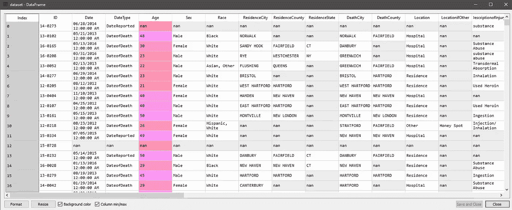
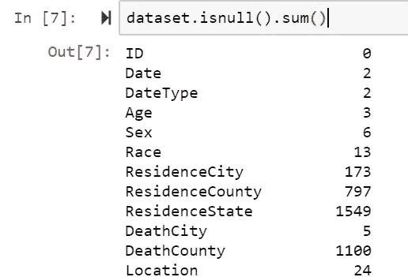
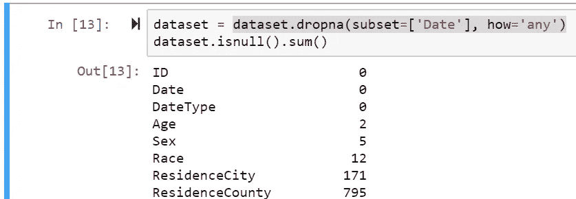
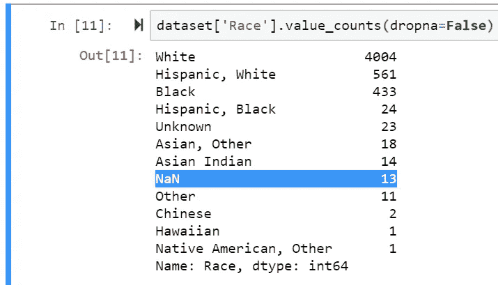
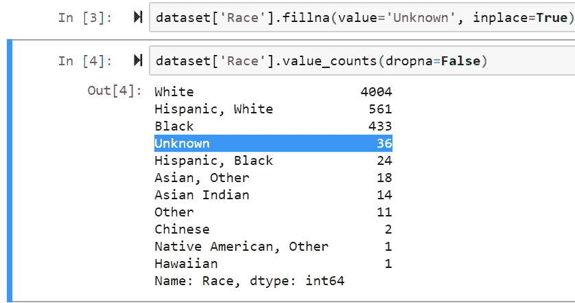
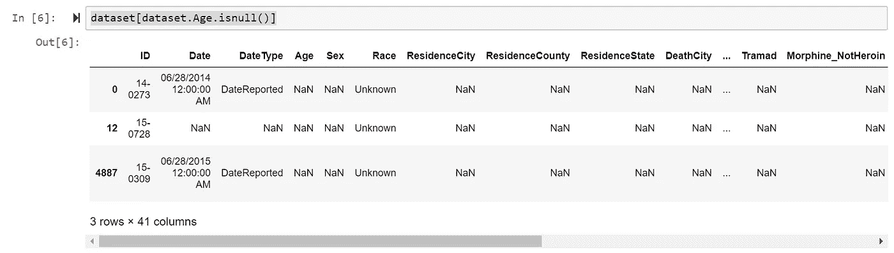
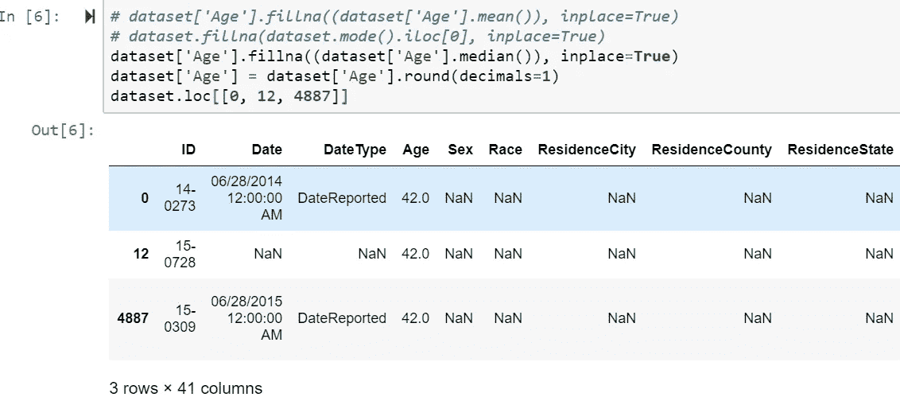

# 机器学习——处理缺失数据

> 原文：<https://towardsdatascience.com/machine-learning-handling-missing-data-27b09ab146ba?source=collection_archive---------47----------------------->

## 开始使用数据前如何清理数据的指南。

**这里是我们将在教程中使用的数据:** [点击这里](https://catalog.data.gov/dataset/accidental-drug-related-deaths-january-2012-sept-2015)

当数据中有空值时，它们通常会以 NAN 值的形式出现在 IDE 中。在开始数据训练之前，您需要处理这些缺失的数据。我们有两种基本的方法可以做到这一点。我们可以删除缺少值的行，或者填充它们。

**图 1:** 来自 PC 的数据集截图

上面你可以看到有多少单元格丢失了数据。

# 检查是否存在 nan

数据集真的很大，那么如何快速找到空值呢？

我们可以使用`isNull()`方法找到任何可能出现的 NAN 值。我们可以使用`.sum()`方法获得每列所有 NAN 值的**计数**

**代码片段:** `dataset.isnull().sum()`

下面是上面数据集的部分示例:

**图片 2:** 从电脑上截取的截图

我们在这里看到' ***年龄*** '有 *2 南值*和' ***死亡县*** '有 1100。这段代码片段为我们提供了数据集中每列 NAN 值的准确数量。

# 处理南价值观。

根据如何处理 NAN 值的数据集，您有几种选择。

# 1.删除丢失的值

在上例中，我们看到' ***日期*** '有 *2 个 NAN 值*。

现在对我来说，' ***Date*** '可能是我的处理所必需的，所以我想删除任何没有日期值的行。

为了实现这一点，我们可以使用内置方法，`dropna().`这个方法自动删除任何带有 NAN 的行。但是，我们将希望使用特定的列，所以让我们看看如何做到这一点

**a .删除列中缺少值的行**

**代码片段:** `dataset.dropna(subset=['ColumnName1', 'CoulmnName2'], how='any')`

这里我们看到不再有任何与 NAN 相关的日期行。

***快速旁注，*** 如果任何选中的列有 NAN ，则`how=’any’`将删除该行*。在这个例子中，我只看了一列，所以没关系，但是假设`subset=[‘Date’, ‘Age’]`。如果' ***Date*** '或 **'Age'** 有一个 NAN 值，该行将被删除。*

如果我们希望仅当 ***【日期】&【年龄】都是 NAN*** 时才删除该行，我们可以使用`how=’all’`，它在删除该行之前检查所有值是否都是 NAN 。

## **b .删除所有带有 NAN 的行**

可能的情况是，当任何列有 NAN 时，我只想删除任何行。使用`.dropna()`方法很容易做到:

**代码片段:** `dataset = dataset.dropna(how=’any’)`

但是在我们的例子中，执行这个操作会删除所有的行，所以它不是很有用。

## c.删除所有列都是 NAN 的行

有时会发生这样的情况，有些行只包含所有的 NAN 值。要删除这些不必要的行，我们可以:

**代码片段:**

# 2.填充缺失值

因此，有时我们的数据几乎是完美的，但我们只是有一些需要填充的缺失值，以便我们可以处理数据。

## **a .填写分类数据**

让我们以“种族”一栏为例。如果我们用`value_counts()`方法查看数据集中的值，确保设置`dropna=False`以便我们也可以计算 NAN 值，而不仅仅是类别，我们会得到这样的结果:

**代码片段** : `dataset[‘Race’].value_counts(dropna=False)`

我们在这里看到' ***种族*** '列中有 13 个 NAN 值。幸运的是，我们已经有了像“*”或“ ***其他*** ”这样的类别可以使用。*

*在这种情况下，我们将所有 NAN 值映射到“*”类别是有意义的，因为我们不知道这些值是否属于任何*主要类别*或属于“ ***其他*** ”类别。**

**要做到这一点，我们只需要使用下面的`.fillna()`方法，我们可以将所有缺失的值赋给' ***未知的*** '。**

****代码片段** : `dataset[‘ColName’].fillna(value= ‘Replace’, inplace=True)`**

****

**然后砰！所有的 NAN 值已经被映射到' ***未知的*** '就像我们想要的那样。**

## **b.填写数字数据**

**如果我们以' ***年龄*** '为例，我们可以从我们之前的运行(图 3)中看到有 **3 行，其中年龄为 NAN** 。现在，由于这不是很多丢失的数据，通常我们可以删除它们，因为它可能不会影响我们的训练。但是假设我们需要处理它们，我们可以采用什么策略呢？**

****替换为列的平均值、中间值或最频繁值****

**根据具体情况，您可能希望用平均值、中值或众数来替换这些值。在这种情况下，mean 是有意义的，但是让我们用三种方法来做。**

****平均值** : `dataset[‘col’].fillna((dataset[‘col’].mean()), inplace=True)` **最频繁** : `dataset[‘col’].fillna(dataset[‘col’].mode().iloc[0], inplace=True)`
**中位数** : `dataset[‘col’].fillna((dataset[‘col’].median()), inplace=True)`**

**在这个年龄示例中，我们可以看到**索引 0、12 和 4887 是 NAN 值****

****

**运行 median 的代码(并进行一些舍入)后，我们得到了看起来更好的东西。**

********

**马库斯·温克勒在 [Unsplash](https://unsplash.com?utm_source=medium&utm_medium=referral) 上拍摄的照片**

**这就是处理丢失数据的基本方法。通常情况下，您应该能够只使用这里的代码，或者通过谷歌搜索一些罕见的情况。**

****下期龙珠 Z:更多预处理！****