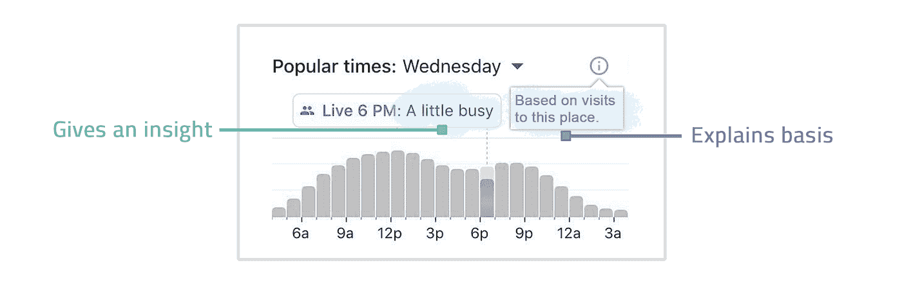
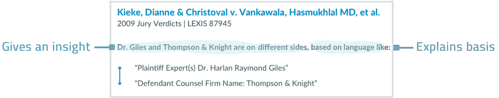
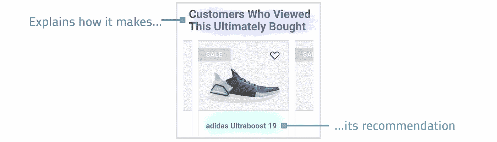
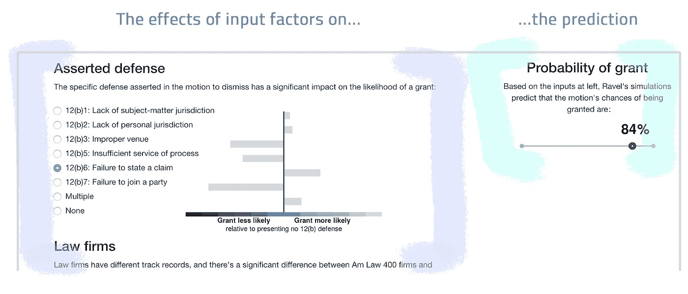
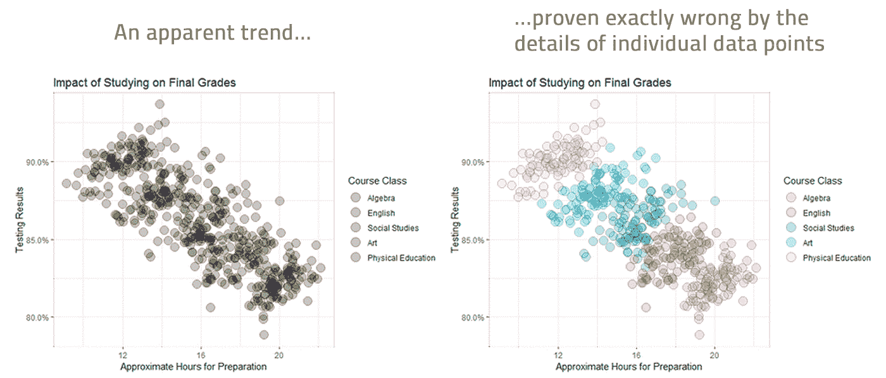
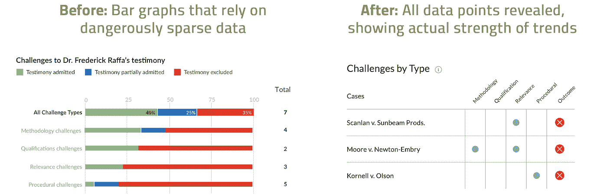
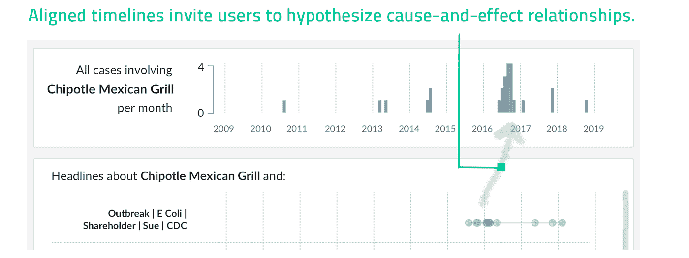

# 机器学习具有不确定性。为它而设计。

> 原文：<https://towardsdatascience.com/machine-learning-has-uncertainty-design-for-it-f015a249a444?source=collection_archive---------41----------------------->

## 通过正确的设计，我们可以将更多的数据科学见解产品化并发布，即使是不完美的、概率性的见解。

信用:[怀特莫卡](https://www.shutterstock.com/g/monsit)。经许可使用。

我们生活在机器学习的时代。这意味着我们制造的产品越来越少以我们所知的事实进行交易:相反，它们越来越依赖于*概率*的东西，比如推论、预测和推荐。根据定义，这些东西具有*不确定性*。不可避免的，他们会*错*。

但这并不意味着它们没有产品价值。毕竟，你可能宁愿知道有 50%的可能性会下雨，也不愿完全没有预报。如何从必然出错的算法中解锁用户价值？我们可以做预测所做的事情:**设计我们的产品时要坦率地面对不确定性。**

在机器学习的时代，设计能够传达其*确定度*的产品可以成为一个巨大的竞争优势:

*   **可以解锁新价值。**我们可以将更多的数据科学见解产品化和发布，即使是不完美的、概率性的见解，方法是让用户能够自己判断如何使用它们，而不是为它们做出决定而什么都不发布。
*   **可以降低风险。**传达不确定性是一种免责声明:用户可以权衡证据并得出结论，风险自担，而不是必须从表面上接受产品的声明，并为不透明、不正确的结论负责。
*   **可以提高可用性。**好的设计让用户看到产品在做什么:*系统状态的可见性*是第一个[尼尔森诺曼对用户界面设计的启发](https://www.nngroup.com/articles/ten-usability-heuristics/)。不确定性的可见性让用户免去了自己计算某样东西有多可靠的痛苦。

所有这些的问题是什么？不确定性是很难设计的。机器学习用概率表达不确定性，但*概率不是产品*:正常人不想钻研*p*-值和置信区间，设计师也不想创造出充满星号和技术细节的复杂怪物。此外，非专家不太擅长解释原始概率，有时会把它们变成可怕的战略决策。

我们*应该*传达产品中的不确定性，但我们需要有效的、以用户为中心的设计解决方案来做到这一点。在本文中，我将描述三种很好的设计模式:

*   **展示你的作品**
*   **揭示个人数据点**
*   **让用户完成拼图**

为了使事情具体化，我将主要从 [Context](https://www.lexisnexis.com/en-us/products/context.page) 中提取例子，这是我们的法律数据分析产品，从数百万司法意见的语言中提取有用的见解。这是将机器学习产品化的一个很好的试验场，因为我们的律师用户群可能会对概率高度怀疑，并且完全不原谅错误。在设计适合他们的产品方面，我们学到了很多！

## **设计模式#1:展示你的作品**

这里的公式很简单:提供你的概率洞察力(*机场现在有点忙…* )，让用户知道你的算法是如何得出的(*…基于对这个地方的访问*)。谷歌地图是这样做的:

这可以让你的洞察力更有说服力，也更有用:用户可以调整他们在方法中看到的任何特定的偏见或限制，并自己决定对结论有多大的信心。

在上下文中，我们的见解是基于司法文件的书面语言。下面，我们的语言算法发现，专家证人贾尔斯博士和律师事务所汤普森&奈特之前有联系:他们过去似乎有过*反对*对方(在决定是否聘用贾尔斯博士时知道这一点是件好事)。我们的设计展示了引导算法得出这一结论的确切语言。这有助于用户验证结论，并加深了对这位专家和律师事务所如何认识的了解:

在推荐引擎的世界里，展示你的作品也很方便。下面的设计以一个完整的句子的形式做到了这一点:

这种设计非常明确地告诉用户该算法如何工作:本质上，该算法只是招募过去的客户作为推荐者，这是一种被称为协作过滤的聪明技术。通过完全透明，设计免除了满足潜在期望的算法，这是*不确定*要满足的，比如推荐非常相似、相关或诱人的产品。

最后，有时展示你的作品会成为主要的吸引力。在[拉威尔定律](https://home.ravellaw.com/)中，我们建立了一个实验性的*动议结果预测器*，它计算一项动议将被法院批准的百分比机会，并显示不同的因素(如*类型的主张辩护)*如何根据经验使批准的可能性更大或更小。我们通过简单的可视化展示了因素权重:

我们向预测者展示的律师对理解这些个体因素的运作更感兴趣——他们在起草动议时可以控制的可操作的事情——而不是对结果的精确预测。预测是困难和不确定的，但是*展示我们(模特)的作品*给了我们的律师一个有用的参考*他们的*工作。

## **设计模式#2:显示单个数据点**

如今，这些不起眼的个体数据点可能看起来像是一种遗迹，许多设计关注于如何将大规模数据集抽象为人类可消化的概括，通常是以数据仪表板的形式。但是一般化会给我们带来麻烦，尤其是当数据稀疏的时候。矛盾的是，*大数据*意味着我们现在比以往任何时候都有更多可能的小数据集，这是将大数据集切割成我们感兴趣的内容的结果。我们应该针对*小数据*固有的不确定性进行设计。

此外，在大大小小的数据集中，当数据实际上遵循与我们假设的不同的分布时，[急于下结论](https://www.edwardtufte.com/tufte/books_be)会带来麻烦。潜在的分布可能是[偏斜的](https://alevelmaths.co.uk/statistics/skewness/)、[双峰的](https://medium.com/precarious-physicist/teaching-a-class-with-a-bimodal-distribution-if-you-have-one-c9629ac15469)，甚至是相反的，就像这个[辛普森悖论](https://www.quora.com/What-is-Simpsons-paradox/answer/Jon-Wayland)的例子:

对于一个产品来说，披露个体的原始数据点可能更安全——也常常更有用——从而*传达其关于任何结论可靠性的* *不确定性*。考虑我们的一个上下文设计的前后情况，显示专家证人成功获得法庭认可的证词的记录:

最初的设计需要大量的“汇总统计数据”，我们称之为——多个条形图，表明专家在各种情况下的证词接受率。问题是许多专家只有一两个结果，这不足以可信地为这些图表提供动力。我们最终会笨拙地宣布许多 0%和 100%的准入率，每个都有一个数据点支持——这在技术上没有错，但意味着专家如何作证有太多的确定性。相反，我们的最终设计将专家证词的每一个挑战可视化，让用户发现模式，并自己判断他们应该对这些模式有多确定。

## **设计模式#3:让用户完成拼图**

机器学习可以做令人惊讶的事情——但它仍然不能解决所有问题，并且[这个难题的一些部分最好交给人类](https://medium.com/@mmyslin/ai-in-the-right-places-a-framework-for-powering-data-analytics-products-fd153c99d8a4)。一种算法可能擅长寻找碎片，但对整体解决方案仍不确定。我们的设计应该为用户安排这些部分——并让他们自己完成拼图。

当涉及到[人工智能尚未真正解决的高阶问题时，这个想法最有趣，比如解释因果](https://www.quantamagazine.org/to-build-truly-intelligent-machines-teach-them-cause-and-effect-20180515/)。我们的上下文用户看到随着时间的推移影响特定公司的诉讼激增，并想知道*是什么导致了*这些激增。我们的设计将法律案件和新闻故事*安排在平行的时间线上，邀请用户自己推断因果关系。在这里，用户可能会假设，涉及 Chipotle 的法律案件的激增可以用稍早一些的关于 Chipotle 和大肠杆菌的新闻标题来解释:*

像这样的问题— *为什么会发生什么，接下来会发生什么，你应该怎么做—* 很难解决，明确回答也有风险。但是这两个我们都不一定要做，至少不完全要做。通过建议性地布置算法*找到的拼图，产品设计可以激发用户思考、充实和评估的想法——将[人类置于循环中](https://hai.stanford.edu/news/humans-loop-design-interactive-ai-systems)以从不完美的机器学习中提取价值。*

## **最终想法**

为不确定性而设计让我们能够解锁全新的产品，而机器学习对于传统设计来说可能不够准确。我提供了产品设计传达不确定性的三种方式:展示他们的作品，揭示个体数据点，让用户完成拼图。但是，随着机器学习的扩展，以及[用户对不确定性的思考更加复杂](https://www.newsweek.com/spotify-cuts-political-ads-before-election-2020-1479476)和[道德和法规呼吁透明](https://en.wikipedia.org/wiki/General_Data_Protection_Regulation)，我们揭示不确定性的设计解决方案的范围肯定会扩大。我很期待看到我们的成果。