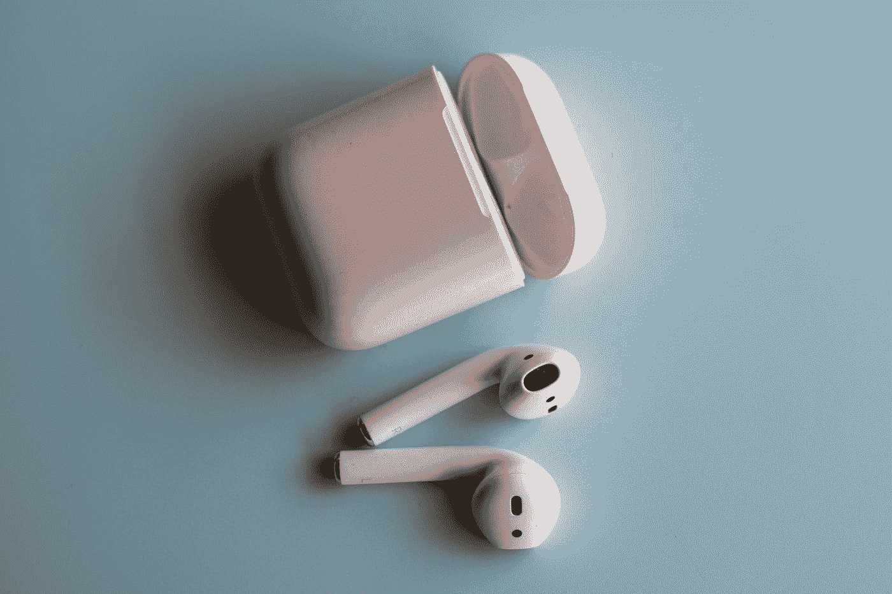
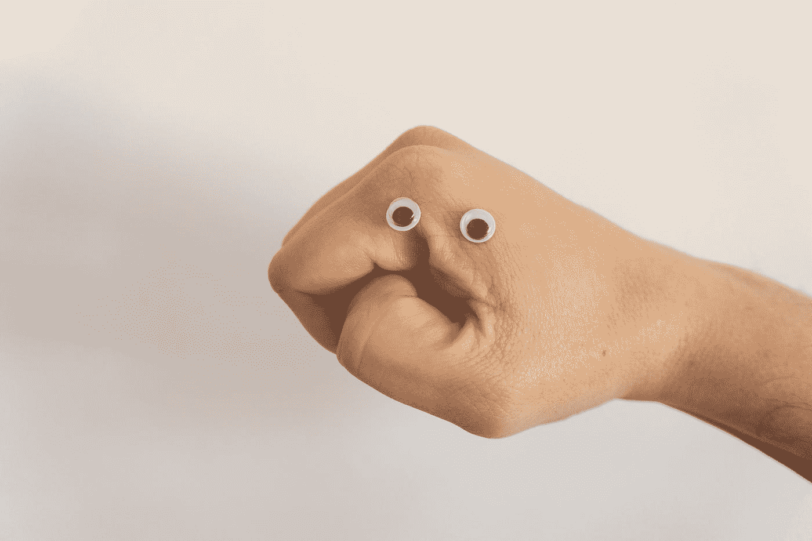
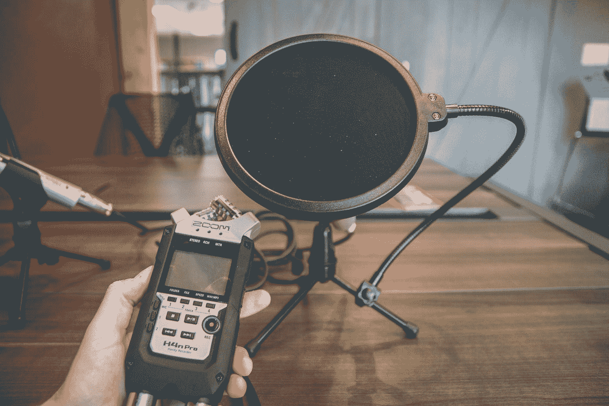

# 机器学习和听力损失

> 原文：<https://towardsdatascience.com/machine-learning-hearing-loss-d60dab084e3f?source=collection_archive---------34----------------------->

[Liviu C.](https://unsplash.com/@liviu_c?utm_source=medium&utm_medium=referral) 在 [Unsplash](https://unsplash.com?utm_source=medium&utm_medium=referral) 上的照片

## 关于机器学习如何使听力损失者受益的简要文献综述。

机器学习已经扩展到许多不同的领域和学科。尝试新的领域是成长和学习新事物的最好方式。以下是研究人员如何应用机器学习来改善聋人和重听人的生活的总结。

# 论文(按顺序)

所有这些论文都可以在没有任何大学赞助或付款的情况下获得。

1.  [为什么那些使用美国手语交流的人没有更好的辅助技术？](https://dl.acm.org/doi/pdf/10.1145/3283224)
2.  [机器学习的语法面部表情识别](https://www.researchgate.net/profile/Sarajane_Peres/publication/262838423_Grammatical_Facial_Expressions_Recognition_with_Machine_Learning/links/0c96053aefb2fe6138000000/Grammatical-Facial-Expressions-Recognition-with-Machine-Learning.pdf)
3.  [一种机器学习方法，用于为助听器调配处方](https://www.mdpi.com/2079-9292/8/7/736)
4.  [视听:聋人和重听人的声音检测](https://courses.cs.washington.edu/courses/cse481h/12wi/projects/accessible-sound/docs/paper.pdf)

# [会说话的手套](https://dl.acm.org/doi/pdf/10.1145/3283224)

Keith Kirkpatrick 的这篇文章介绍了聋人和重听人在与不懂手语的人交谈时遇到的问题。

> 机器人，自然语言处理，美国手语，可穿戴设备

## 解释问题

重听人依靠口译服务，无论是面对面的还是在线的，在医生办公室、法庭或咖啡店与听觉世界进行交流。然而，这些服务并不总是可用的，在线口译受到移动互联网问题的困扰:速度慢、不一致或不存在。

[Franck V.](https://unsplash.com/@franckinjapan?utm_source=medium&utm_medium=referral) 在 [Unsplash](https://unsplash.com?utm_source=medium&utm_medium=referral) 上拍摄的照片

## 一个可能的解决方案

解决译员缺乏的一个办法是可以将美国手语翻译成英语的手套。通过嵌入的运动传感器，手套记录用户的运动，并将运动转化为正确的手势。可以使用几种不同的 ML 算法来找到正确的符号:K 均值、卷积神经网络(CNN)、递归神经网络(RNN)。

## 漫长的路要走

SignAloud 和 BrightSign 是这篇文章中重点提到的两家公司。BrightSign 被认为优于 SignAloud，因为用户可以录制自己版本的标志，以便更好地翻译。然而，这两种产品都达不到真正的解释，因为它们没有考虑面部表情。面部表情是美国手语的一个重要组成部分，如果不考虑面部表情，很多意思就会消失。这就是为什么你会看到美国手语翻译在为官员翻译时摘下面具。

佛朗哥·安东尼奥·乔瓦内拉在 [Unsplash](https://unsplash.com?utm_source=medium&utm_medium=referral) 上拍摄的照片

此外，像这样的手套在聋人群体中受到了负面的影响。聋人团体希望看到更多的聋人或重听人参与这些产品的开发，而不仅仅是测试。

# [检测符合语法的面部表情](https://www.researchgate.net/profile/Sarajane_Peres/publication/262838423_Grammatical_Facial_Expressions_Recognition_with_Machine_Learning/links/0c96053aefb2fe6138000000/Grammatical-Facial-Expressions-Recognition-with-Machine-Learning.pdf)

巴西的研究人员开发了一个 ML 模型来检测巴西手语 Libras 中的语法面部表情。

> 计算机视觉，MLP，神经网络

照片由 [Unsplash](https://unsplash.com?utm_source=medium&utm_medium=referral) 上的 [Anastasia Vityukova](https://unsplash.com/@anastasiavitph?utm_source=medium&utm_medium=referral)

## 问题是

面部表情是每一种手语的重要组成部分。同样的手势，但不同的面部表情可以把一个句子从陈述句变成疑问句，或者否定整个句子。不幸的是，大多数研究集中于检测特定的标志或预定义的句子。

这对实时自动翻译是一个巨大的障碍。

## 可能的解决方案

在这篇论文中，研究人员和聋人定义了九种不同的 gfe 供模型识别。他们在各种不同的句子中使用这些识别的 gfe 记录聋人，并使用这些数据训练多层感知器(MLP)。

## 结论

他们的模型结果喜忧参半。该模型能够很好地识别一些面部表情，但它无法识别 9 个 gfe 中的 4 个。作者确实做了两个观察。

1.  识别 gfe 需要时间(时间序列)数据。(RNN>CNN)
2.  不是所有的 gfe 都是一样的。一些需要深度信息，而另一些发现它很嘈杂。

这项研究是实现手语到口语实时翻译的又一个跳板。

# [助听器优化](https://courses.cs.washington.edu/courses/cse481h/12wi/projects/accessible-sound/docs/paper.pdf)

来自韩国的研究人员使用国家声学实验室(nal)的数据来创建优化助听器验配过程的模型。

> 深度学习，人工神经网络，迁移学习

[马克·佩顿](https://unsplash.com/@mark0polo?utm_source=medium&utm_medium=referral)在 [Unsplash](https://unsplash.com?utm_source=medium&utm_medium=referral) 上的照片

## 装配助听器

获得助听器的过程类似于获得眼镜。听力学家为患者播放一系列声音，询问他们听起来如何，然后相应地调整助听器。

这个过程得到了 NAL 助听器软件的帮助，该软件可以帮助找到正确的值。然而，这仍然是一个不完美的猜谜游戏。

有一个更好的起点意味着更少的调整，可以为重听人带来更好的生活质量。

## 输入和输出

患者的听力损失信息被用作神经网络(NN)的输入，助听器的插入增益是输出。

助听器配置有六种不同的频段。作者将听力损失信息(输入)编码为 252 位，并使用六种不同的频率作为输出。

## 结果

作者发现，神经网络模型能够在 1%的误差范围内预测每个频率的正确增益水平。

# [定制声音检测](https://www.mdpi.com/2079-9292/8/7/736)

华盛顿大学的学生开发了一个应用程序，使用 ML 来识别特定于用户环境的声音。

照片由 [NeONBRAND](https://unsplash.com/@neonbrand?utm_source=medium&utm_medium=referral) 在 [Unsplash](https://unsplash.com?utm_source=medium&utm_medium=referral) 上拍摄

在这篇短文中，学生们概述了目前存在的通用声音检测应用程序的问题。大多数时候，应用程序对于个人或环境来说并不是唯一的，这降低了声音检测的准确性。

为了解决这个问题，学生们开发了一个应用程序，允许用户记录他们环境中特有的声音，并根据这些声音训练定制模型。

结果是为每个聋人和重听人定制了一个声音检测系统。

# 机器学习和其他一切

 [## 机器学习与自闭症

### 关于机器学习如何影响自闭症诊断和治疗的简要文献综述。

towardsdatascience.com](/what-is-machine-learning-doing-for-autism-6e86daa3b12a)