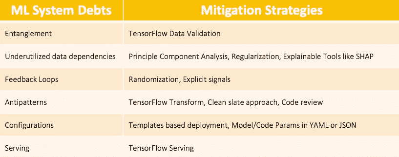
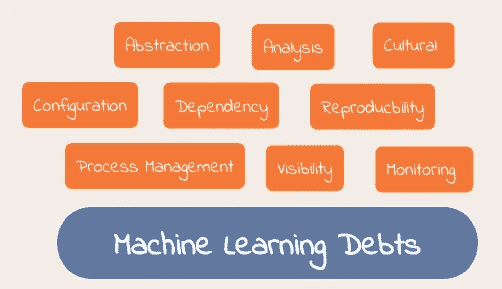
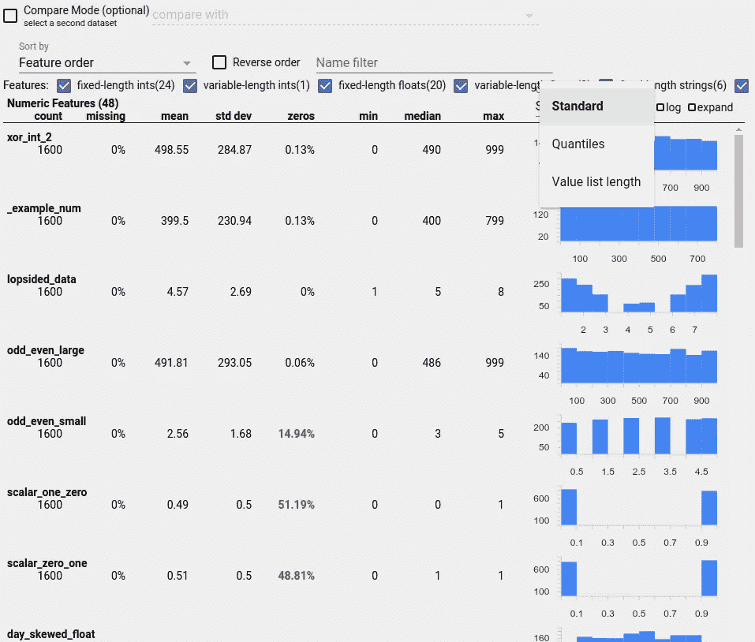
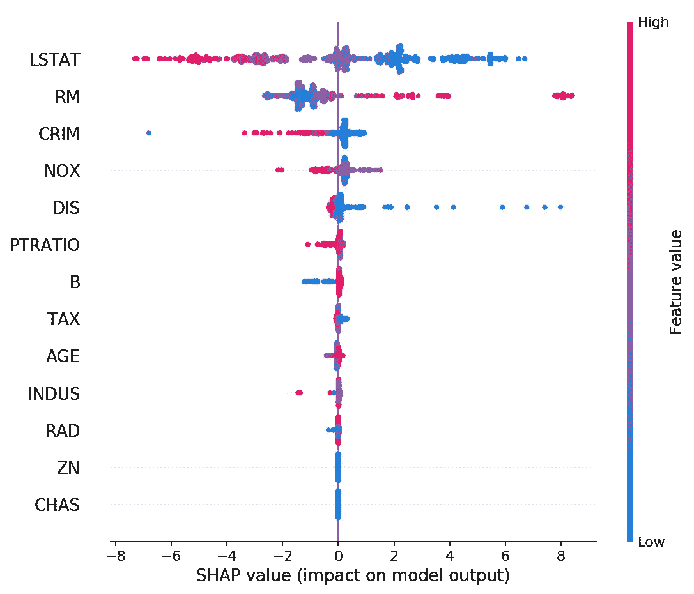
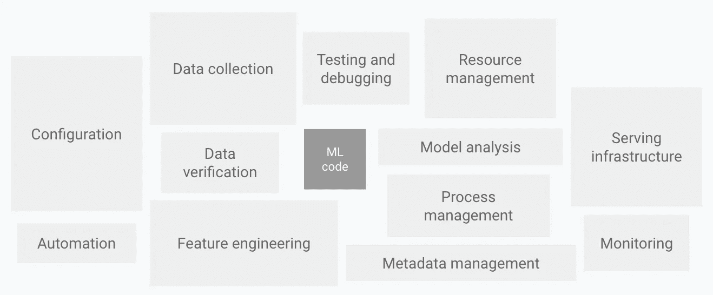

# 机器学习:隐藏的技术债务和解决方案

> 原文：<https://towardsdatascience.com/machine-learning-hidden-technical-debts-and-solutions-407724248e44?source=collection_archive---------44----------------------->

[埃尔努尔](https://www.shutterstock.com/image-photo/businessman-high-interest-debt-business-concept-720830461)在[摄影站](https://www.shutterstock.com/)拍摄的照片

随着机器学习系统被广泛采用，解决各种行业(汽车、BFSI、娱乐、医疗、农业……)的复杂现实问题，随着时间的推移，改进和维护这些系统变得比开发和部署更加昂贵和困难。由于数据和其他特定 ML 问题的额外挑战，这些 ML 系统的长期维护比传统系统更加复杂[1]。在本文中，我们讨论了 ML 系统的一些隐藏的技术缺陷，下表总结了一些可能的缓解策略。

软件工程中的抽象是可维护系统的最佳实践之一。严格的抽象边界有助于表达给定软件组件的输入和输出的不变量和逻辑一致性。但是很难在 ML 系统中实施如此严格的抽象边界，因为系统的预期行为是使用数据学习的，并且几乎没有办法将抽象与数据的异常分开。[3]

# **纠缠**

具体来说，假设我们有一个在模型中使用 f1，…，fn 特性的 ML 系统。因为特征分布的改变或添加新特征或删除现有特征改变了所有特征的重要性权重以及目标输出。这被称为**改变任何东西都会改变一切(CACE)** 现象，不仅适用于输入特征，还适用于超参数、学习设置、采样方法、收敛阈值、数据选择以及基本上所有其他可能的调整[2]。

为了**减轻**这种情况，一种可能的解决方案是在预测变化发生时检测预测变化并诊断变化的原因，这种预测变化的一个原因可能是特征分布(漂移)的变化，这可以使用类似于 [**TensorFlow 数据验证**](https://www.tensorflow.org/tfx/guide/tfdv) 的工具来发现，该工具支持模式偏斜、特征偏斜和分布偏斜检测。例如，如下图所示，通过可视化特征值的分布，我们可以捕捉到特征分布的这些问题。

来自 [TensorFlow 扩展数据可视化指南](https://www.tensorflow.org/tfx/guide/tfdv#skewdetect)的图像显示了特征分布

**未充分利用的数据依赖关系**

这些依赖是由于**遗留**功能、**ε**功能、**相关**功能和**捆绑**功能造成的。

**传统**特性是早期模型开发中包含的特性，随着时间的推移，这些特性会因新特性而变得多余。

**捆绑**功能，当一组功能被评估并发现有益时，由于时间压力或类似的影响，在没有仔细调查所有功能的情况下，添加了捆绑中的所有功能，以提高衡量标准。

***ε***特征是包含在模型中的特征，因为它们在准确性或其他度量方面提供了非常小的增益。

**相关**特征是与其他特征具有高度相关性的特征。

为了**减轻**这些未充分利用的依赖性，人们可以依靠留一特征评估、 [**主成分分析、**](https://www.tensorflow.org/tfx/transform/api_docs/python/tft/pca) 、 [**套索**](https://en.wikipedia.org/wiki/Lasso_(statistics)) **规则化**、 [**自动编码器**](https://www.tensorflow.org/tutorials/generative/autoencoder) ，使用类似[**【SHAP**](https://github.com/slundberg/shap)的可解释工具，或者使用 [**提升树估计器**](https://www.tensorflow.org/api_docs/python/tf/estimator/BoostedTreesEstimator)

例如，SHAP 汇总图可以帮助我们确定特征的重要性以及特征值分布及其对预测的影响。下图显示了波士顿房价数据集的增强回归树模型的汇总图。

1.LSTAT 是影响模型预测的最重要的特征，并且较低的特征值正有助于预测，而较高的特征值负有助于预测。

2.CHAS 和 ZN 特征没有预测能力，可以安全地从模型中移除。

SHAP python 包还支持单个预测解释图、依赖图等。这也可以用于诊断预测变化。

图片来自 [SHAP Git 仓库](https://github.com/slundberg/shap)，Xgboost Boston 模型的汇总图

# 反馈回路

这种债务主要存在于活的 ML 系统中，如果 ML 系统随着时间的推移得到更新，这通常最终会影响它们自己的行为。这些环可以以许多不同的形式(直接或间接)存在，并且不容易被检测到。

例如，推荐系统经常根据用户活动持续推荐来自相似演员、流派等的项目。这种**信念**被放大或强化的现象被称为[回音室。](https://en.wikipedia.org/wiki/Echo_chamber_(media))常见的**缓解**策略是通过收集显式反馈，包括搜索行为等，使这些闭环推荐系统开环。

# 反模式

ML 系统中的实际学习或推理代码只占整个系统代码的一小部分，如下图所示，在 ML 系统中出现许多反模式是很常见的，应该避免。

真实世界 ML 系统的构建模块。图片来自 [MLOps](https://cloud.google.com/solutions/machine-learning/mlops-continuous-delivery-and-automation-pipelines-in-machine-learning) 解决方案

1.  **粘合代码:**这种反模式是由于支持代码使数据适合使用特定的 ML 模型/库而产生的，这可以通过使用标准预处理库**来减轻**，如[**tensor flow Transform**](https://www.tensorflow.org/tfx/transform/get_started)**，它使用 [**Apache Beam**](https://beam.apache.org/) 进行分布式计算，使用 [**Apache Arrow**](https://arrow.apache.org/) 进行矢量化 [**NumPy**](https://numpy.org/)**
2.  ****管道丛林:**随着新的数据源被增量地添加到模型中，这导致代码充满了连接、采样步骤等。这可以通过一种**全新的方法**来**减轻**，即在模型开发冻结后从零开始开发管道代码，或者更全面地考虑数据收集和特征提取。**
3.  ****死的实验代码路径:**作为胶合代码或管道丛林的结果，很多时候实验是通过实现实验代码路径来执行的，然而随着时间的推移，这些代码路径难以保持向后兼容性。通常的标准做法是审查并删除这些代码路径，以**减轻**这种债务。**

# **配置债务**

**由于机器学习系统每一步的可配置选项的范围，如使用哪些功能、如何选择数据、特定于模型的参数、预处理或后处理、模型部署等，这种债务可能会累积。这些配置错误可能代价高昂，导致严重的时间损失、计算资源浪费或生产问题。**

**为了**减轻**的配置负担，通常的做法是将与模型、超参数搜索、预处理或后处理相关的参数保存在 [YAML](https://yaml.org/) 文件、模块化模板、Jinja2 模板、基础设施代码等中。**

**在这篇博客中，我们看到了一些 ML 方面，如模型纠缠、数据(发现、来源、管理、版本)，以及这些数据和 ML 特定方面如何导致比传统系统更多的隐藏技术债务。此外，我们如何使用可视化、端到端机器学习框架(如 **TensorFlow Extended** )和最佳软件工程实践来缓解这些问题。在 ML 系统中存在更多的 ML 债务，涉及**服务、监控、测试、再现性、过程管理**等。我们将在以后的文章中讨论它们的缓解策略。**

# **参考**

1.  **[https://papers . nips . cc/paper/5656-hidden-technical-debt-in-machine-learning-systems . pdf](https://papers.nips.cc/paper/5656-hidden-technical-debt-in-machine-learning-systems.pdf)**
2.  **[https://www . Microsoft . com/en-us/research/uploads/prod/2019/03/amershi-icse-2019 _ Software _ Engineering _ for _ Machine _ learning . pdf](https://www.microsoft.com/en-us/research/uploads/prod/2019/03/amershi-icse-2019_Software_Engineering_for_Machine_Learning.pdf)**
3.  **[https://storage . Google APIs . com/pub-tools-public-publication-data/pdf/43146 . pdf](https://storage.googleapis.com/pub-tools-public-publication-data/pdf/43146.pdf)**
4.  **[https://cloud . Google . com/solutions/machine-learning/mlops-continuous-delivery-and-automation-pipeline-in-machine-learning](https://cloud.google.com/solutions/machine-learning/mlops-continuous-delivery-and-automation-pipelines-in-machine-learning#characteristics)**
5.  **https://christophm.github.io/interpretable-ml-book/**
6.  **[https://www . ka ggle . com/reisel/how-to-handle-correlated-features](https://www.kaggle.com/reisel/how-to-handle-correlated-features)**
7.  **[https://matthewmcateer . me/blog/machine-learning-technical-debt/](https://matthewmcateer.me/blog/machine-learning-technical-debt/)**