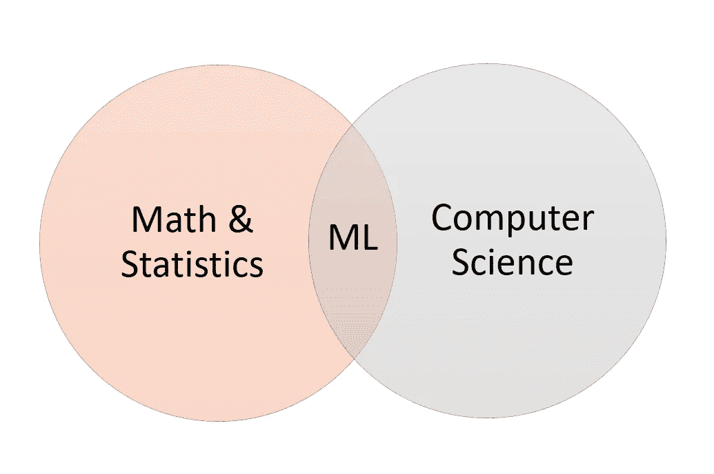
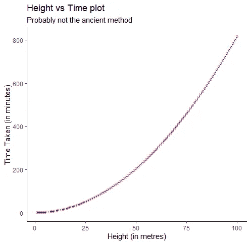
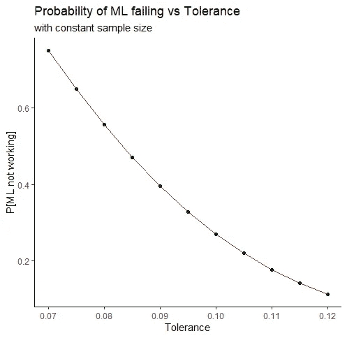
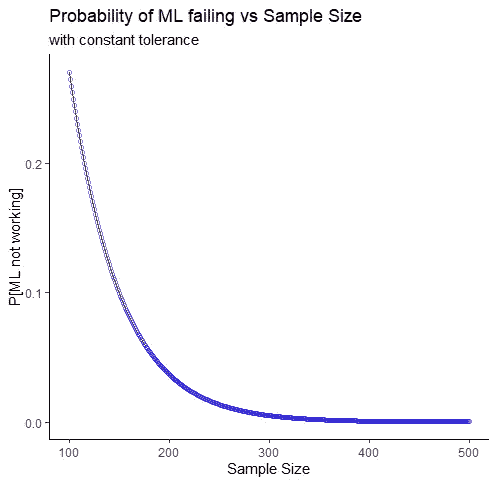

# 机器学习:它是如何工作的；更重要的是，它为什么会起作用？

> 原文：<https://towardsdatascience.com/machine-learning-how-does-it-work-and-more-importantly-why-does-it-work-7876f8d80277?source=collection_archive---------22----------------------->

## ML 的本质与 Hoeffding 不等式

早在 2017 年，我被介绍到一个很酷的世界。这个词本身就非常有趣。我很感兴趣，想知道更多。所以，就像任何正常人一样，我打开浏览器，输入“什么是机器学习？

作者图片

这个维恩图出现了。以及其他有共同后缀的词:监督学习，非监督学习，强化学习，深度学习。接下来是复杂程度递增的其他词:数据、分类、回归、模型、聚类、集成、支持向量、神经网络等，等等。

在花了将近一年的时间试图理解所有这些术语的含义，将获得的知识转换成工作代码，并利用这些代码解决一些现实世界的问题之后，我终于明白了一些重要的事情。

由[塞巴斯蒂安·加布里埃尔](https://unsplash.com/@sgabriel?utm_source=unsplash&utm_medium=referral&utm_content=creditCopyText)在 [Unsplash](https://unsplash.com/s/photos/dawn?utm_source=unsplash&utm_medium=referral&utm_content=creditCopyText) 上拍摄的照片

> 机器学习太牛逼了！
> 
> 但是为什么会起作用呢？

太傻了。这是我一开始就应该问的问题。一年后不会。但是你知道..亡羊捕牢，未为晚也。

当我在网上搜索答案时，我没有找到任何相关的内容。太奇怪了。互联网应该有一切的答案，对不对？

这让我很激动。我想要答案。我花了一段时间才找到它。这篇文章，我的第一篇文章，就是这个发现的结果。现在互联网对我的一个问题有了答案。

# 什么？

机器学习是一种工具，你可以使用它来学习生成数据的**过程**背后的**模型** 。您获取流程创建的数据，并使用它来建模流程。好处？如果您对流程建模，您可以通过计算模型输出来预测流程输出。

以社交媒体为例。每次你使用你的社交媒体账户，你都会以帖子、浏览、喜欢、不喜欢、评论等形式创建数据。你的社交媒体活动是一个过程，这个过程创造了数据。您创建的数据用于模拟您的兴趣，以便您可以在时间线中看到更多相关内容。

# 怎么会？

让我们用一个简单假设的例子来理解 ML 是如何工作的。

马尔科·塞斯奇在 [Unsplash](https://unsplash.com/s/photos/leaning-tower-of-pisa?utm_source=unsplash&utm_medium=referral&utm_content=creditCopyText) 上的照片

## 一个场景

你是十四世纪的自然哲学家。你从不同的高度(可能是从一个人造奇迹的不同楼层)扔下金属球，记录它到达地面的时间。因为你是一个*非常酷的*人，你使用机器学习来模拟这个过程。

您记录了高度值为 1 米、2 米、3 米…100 米的数据，并使用一些古老的绘图技术绘制了这些数据。(笛卡尔坐标系是一个世纪后发明的)

作者图片

## 要求

要让机器学习发挥作用，你需要三个先决条件:

1.  数据。它通常被称为**样本**。你记录球体从不同高度落下到达地面的时间。另一方面，**总体**是样本的通用集合，即球体从*所有*高度到达地面所用时间的数据。
2.  数据中的模式。它通常被称为**目标函数**。这个目标函数定义了总体。ML 的全部意义在于得到一个逼近目标方程的数学方程。
3.  这种模式无法用数学方法确定。因为如果可以钉住，就不会要求 ML(不考虑测量带来的各种误差)。

在我们的例子中，您已经记录了数据，并且它有一个模式。因为你来自十四世纪，你不会知道基本的运动学。所以你不能用数学方法把模式钉在数据后面。

现在请不要认为一个十四世纪的人怎么会知道 ML 而不知道基础物理。这都是假设，正如我所说，你是一个非常酷的自然哲学家。

最后，您开始将球体到达地面的时间建模为其下落高度的函数。你用你所有的 ML 知识，为上面的过程做了一个模型。

# 为什么？

你做的任何模型都会有样本内误差:E(in)。这是当你试图在你用来对过程建模的样本中进行预测时所得到的误差。在我们的示例中，当您试图预测 1 到 100 米范围内的高度时，这将是模型中的误差。

如果模型**在您使用的样本之外运行，那么它就可以工作**。我们姑且称之为 E(out)。在我们的示例中，当您试图预测超过 100 米的高度或非整数高度(如 1.5 米)时，这将是模型的错误

> 回想一下，ML 的全部目的是得到一个逼近目标函数的数学模型。

> 对于理想模型，E(in) = E(out) = 0

同样，如果事情是理想的，我们就不需要 ML。为了量化 E(in)和 E(out)之间的变化，我们引入了一个新术语，称为容差(δ)。我们使用公差来确定我们的模型性能。如果样本内和样本外误差的绝对变化在容差范围内，我们宣布您使用的建模方法有效。

> 对于一个好的模型，|E(in) — E(out)| ≤ δ

不等式的轻微重新定位可以用来定义一个坏的模型

> 对于坏模型，|E(in) — E(out)| > δ
> 
> 如果一个模型是坏的，那么你使用的机器学习技术不起作用

## 赫夫丁不等式

赫夫丁不等式是概率论中的一个概念。它给出了样本估计值和样本期望值之间的最大偏差。为了简化上面的陈述，我们来看一个具体的例子，均值(average)。

> P[ |μ — ν| > δ ] ≤ 2exp(-2δ N)

有很多希腊字母。让我们一个一个地研究它们

1.  μ是预期值。这是人口的平均值
2.  ν是估计值。这是样本的平均值
3.  δ是公差水平
4.  exp 是指数函数
5.  n 是样本的大小(即数据中记录的数量)
6.  p[某物]是某事发生的概率

我们可以把这个概念推广到我们的问题上。样本内误差 E(in)是样本的估计值。样本外误差 E(out)是样本的期望值。将赫夫丁不等式应用于这种情况，我们得到:

> P[ |E(in) — E(out)| > δ ] ≤ 2exp(-2δ N)

考虑到模型复杂性(M ),我们可以将上述等式概括为:

> ≈ P[ ML 不工作]≤2 MEX(-2δN)

## 耐受性的影响

作者图片

对于一个合适的近似值，公差值应该非常小。随着你降低你的耐受水平，ML 在该δ失败的概率增加。需要注意的是，由于这一事实，δ = 0 ( E(in) = E(out) = 0)的理想模型是无法实现的。

## 样本量的影响

作者图片

随着样本量的增加，ML 失败的概率降低。因此，数据中的观察次数越多越好。

## 模型复杂性的影响

模型复杂度与概率值成线性关系。并且概率值总是小于或等于 1。因此，模型的复杂性会极大地影响 ML 的成功。如果复杂性增加，成功的概率就会降低。

成功的建模方法背后的想法是平衡模型的复杂性和样本大小，因为容差总是保持较低(这就是过拟合和欠拟合等术语发挥作用的地方)

# ML 为什么起作用→ML 什么时候起作用

## 又是那个场景！

你，作为一个十四世纪的自然哲学家，已经成功地利用机器学习对一个球体从一定高度掉落到地面所需的时间进行了建模。

> **为什么**你认为这种方法行得通吗？

您使用的 ML 方法之所以有效，是因为当您尝试对流程进行建模时，您平衡了模型复杂性和您拥有的样本大小(具有合理的容差),从而将失败的可能性降至最低。

如果你想建立一个复杂的模型，那么你需要一个大的样本量来获得良好的泛化能力。所以，

> **当**你平衡了模型复杂度和样本量，ML 就起作用了。

照片由[马库斯·斯皮斯克](https://unsplash.com/@markusspiske?utm_source=unsplash&utm_medium=referral&utm_content=creditCopyText)在 [Unsplash](https://unsplash.com/s/photos/end?utm_source=unsplash&utm_medium=referral&utm_content=creditCopyText) 拍摄

ML 背后的概念已经存在了 60 多年(感知器是在 50 年代发明的)。但是最近几年，这个领域有了巨大的发展。

你会经常听到“大数据”和“深度学习”这些术语。虽然前者意味着数据集的一般样本量急剧增加，但后者证明了当今建模流程的复杂性可能会增加。

希望这篇文章对你有所帮助。如果你已经达到这一点，感谢花 8 分钟左右的时间来阅读我的漫谈！