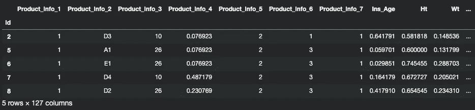
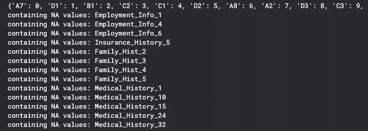
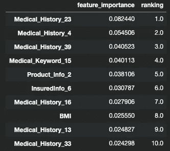
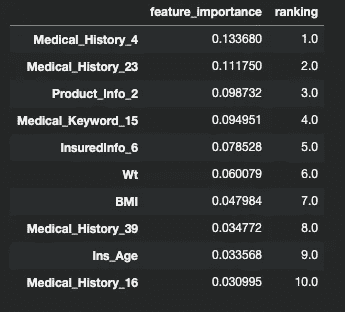
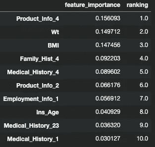
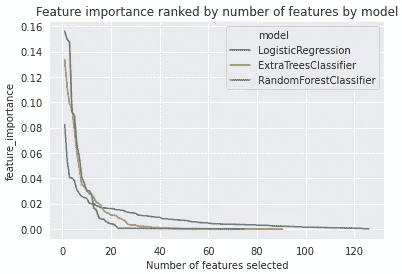
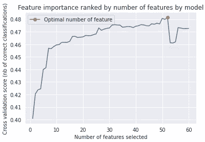
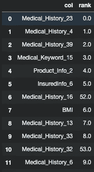

# 【机器学习】如何做特征选择

> 原文：<https://towardsdatascience.com/machine-learning-how-to-do-the-feature-selection-2de56182cd9b?source=collection_archive---------26----------------------->

## 成为一名数据科学家。

## 你的第一份数据科学相关工作的一个重要问题

当我参加一个数据科学相关工作的面试时，面试官问了我以下问题。事后我在面试的时候也问了应聘者同样的问题:给定一个大型数据集(1000 多列，100000 行(记录))，你会如何选择有用的特征来建立(监督)模型？

这是一个很好的问题，可以区分你的数据科学知识是学生水平还是专业水平。当你是一名学生时，你从一个美丽而干净的数据集中学习算法。然而，在商业世界中，数据科学家在数据清洗方面投入了大量精力，以建立机器学习模型。

回到我们的问题:

> 给定一个大型数据集(超过 1000 列，10000 行(记录))，如何选择有用的特征来构建(监督)模型？

事实上，这个问题没有绝对的答案，不过是测试你的逻辑思维和解释能力。在这篇文章中，我将分享一些方法(特性选择)来处理它。

[Kaggle 笔记本上传到这里](https://www.kaggle.com/kkhuiaa/feature-selection-notebook)，这里我使用的数据集是[保诚人寿承保数据](https://www.kaggle.com/c/prudential-life-insurance-assessment):

[](https://www.kaggle.com/kkhuiaa/feature-selection-notebook) [## 功能选择笔记本

### 使用 Kaggle 笔记本探索和运行机器学习代码|使用来自保诚人寿保险评估的数据

www.kaggle.com](https://www.kaggle.com/kkhuiaa/feature-selection-notebook) 

此任务旨在预测人寿保险投保人的风险水平(承保)。关于特性选择的更多实现，您也可以查看 [Scikit-learn](https://scikit-learn.org/stable/modules/classes.html#module-sklearn.feature_selection) 文章。

首先，我们读取数据:



作者图片

在这里，我将做一些简单的数据清理。大多数机器学习模型实现不接受字符串输入，因此我们必须将它们转换成数值。由于我们的目标是有序目标(即监督学习)，通过基本的 OneHotEncoder 转换分类变量会遭受“维数灾难”(通常在模型训练中也需要更多时间)。

相反，我们对分类列所做的如下:基于它的分类值，我们计算 Y 目标的相应平均值(通过“GroupBy”)并对它进行排序，从 0 到该列的唯一分类值的数量减 1。这种映射可用于测试数据或以后的生产。

然后，我们按照标准程序填写缺失值:



作者图片

# 0.足球队选拔的类比

假设你有 200 名足球运动员，你想选择其中的 11 人组成最好的足球队。你会如何选择他们？


[unsplash 照片，由 Alora Griffiths 上传](https://buffer.com/library/free-images/)

# 1.无监督方法

在足球运动员选择的类比中，无监督方法评估每个运动员的基本信息，如身高、身体质量指数、年龄和其他健康指标。这些都不是足球特有的(无人监管)，但绝大多数优秀的足球运动员都应该有很好的身体基础。

*   **删除丢失率高的列**
    第一种也是最简单的方法是在无监督的方法中删除列。我们可以删除缺少太多值的列。

```
(59381, 127)
(59381, 126)
```

*   **删除差异小的列**
    另一种方法是删除差异太小的列，因为这些列通常提供的信息很少。

```
number of columns after dropping by variance threshold: 16
```

*   **PCA**
    PCA 是一种更高级的执行特征选择的方式。主要优点是变换后的特征现在是独立的；然而，转换后的特征很难解释。关于 Scikit-learn 的 PCA 实现，您可以查看[这篇文章](https://stackabuse.com/implementing-pca-in-python-with-scikit-learn/)。

# 2.监督方法

更复杂的方法是通过监督学习来实现。回到我们对足球队选择的类比，我们分两轮进行:

在第一轮比赛中，我们对每个球员的足球技能(监督下)进行评估，如点球，射门，短传能力，并进行排名。假设我们现在可以从 200 名选手中选出前 50 名选手。

第二轮，既然要在 50 个玩家中找出 11 个玩家的最佳**组合，就需要评估这 50 个玩家会如何合作。我们将最终找到最好的 11 名球员。(为什么不直接做第二轮？运行每个迭代需要很多时间，所以我们需要在第一轮进行初步测试。)**

从技术上讲，第一轮是**“按模型选择特征”**，第二轮是**“递归特征消除”(RFE)** 。现在让我们回到机器学习和编码。

*   **基于模型的特征选择** 一些 ML 模型被设计用于特征选择，例如基于 L1 的线性回归和 **Ext** remely **Ra** 随机化**树** (Extra-trees model)。与 L2 正则化相比，L1 正则化倾向于将不重要特征的参数强制为零。(知道为什么吗？)极度随机化的树随机地分裂叶子(不是通过信息增益或熵)。重要的特征应该仍然比不重要的特征更重要(通过基于杂质的特征重要性来测量)。

    我们用三个模型来评估它:

```
CPU times: user 15.9 s, sys: 271 ms, total: 16.2 s
Wall time: 14.3 s========== LogisticRegression ==========
Accuracy in training: 0.4138598854833277
Accuracy in valid: 0.41020945163666983
Show top 10 important features:
```



作者图片

```
========== ExtraTreesClassifier ==========
Accuracy in training: 0.3467497473896935
Accuracy in valid: 0.3467213977476055
Show top 10 important features:
```



作者图片

```
========== RandomForestClassifier ==========
Accuracy in training: 0.3473391714381947
Accuracy in valid: 0.34581622987053995
Show top 10 important features:
```



作者图片

我们还为每个模型绘制了模型重要性排名:



作者图片

由于基于 L1 的逻辑回归具有最高的准确性，因此我们将仅通过逻辑回归选择(从图中)前 60 个特征:

selected _ model = ' logistic regression '
number _ of _ features = 60
selected _ features _ by _ model = importance _ fatures _ sorted _ all[importance _ fatures _ sorted _ all[' model ']= = selected _ model]。索引[:特征数量]。tolist()

*   **递归特征消除(RFE)**
    第二部分是选择**最佳特征组合**。我们通过**“递归特征消除”(RFE)** 来实现。我们不是构建一个模型，而是构建 n 个模型(其中 n =特征的数量)。在第一次迭代中，我们通过所有 60 个特征来训练模型，并计算交叉验证准确性和所有列的特征重要性。然后我们去掉最不重要的特征，所以我们现在有 59 个特征。基于这 59 个特征，我们重复上述过程，并且我们在最后一个单个特征处结束。这种方法需要时间，但会给你一个可靠的特征重要性排序。如果时间不允许用于大型数据集，可以考虑在每次迭代中采样或丢弃更多要素。



作者图片

```
CPU times: user 7min 2s, sys: 334 ms, total: 7min 2s
Wall time: 26min 32s
```

如你所见，随着更多特征的训练，验证准确度将最终饱和(大约 0.475)。我们现在可以查看我们的功能重要性排名:



作者图片

同样，没有黄金法则来执行特征选择。在生产的商业世界中，我们必须平衡硬件能力、所需时间、模型的稳定性和模型性能。找到最佳的列组合后，我们现在可以选择最佳的超参数集。