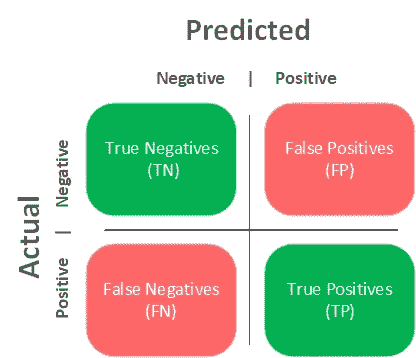
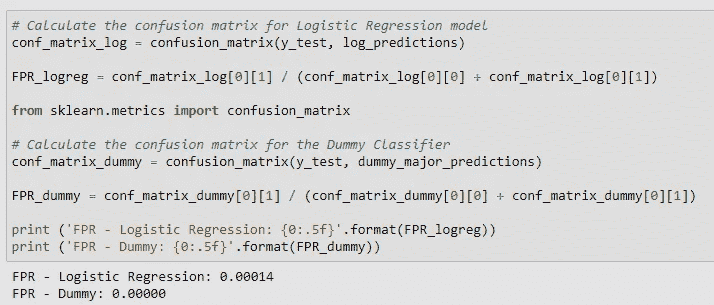
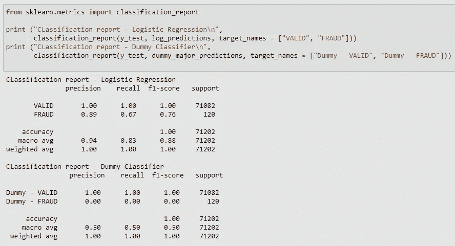

# 机器学习——如何评价你的模型？

> 原文：<https://towardsdatascience.com/machine-learning-how-to-evaluate-your-model-1dabbdc849a4?source=collection_archive---------29----------------------->

## 机器学习算法的基本评价指标和方法

就在最近我讲了一些基本的机器学习算法，即 [K 近邻](/towards-machine-learning-k-nearest-neighbour-knn-7d5eaf53d36c)、[线性和多项式回归](/towards-machine-learning-linear-regression-and-polynomial-regression-df0c83c15b6e)和[逻辑回归](/logistic-regression-giraffes-and-cars-1cb67ab8a571)。在所有这些文章中，我们使用了来自 [Udacity](https://github.com/udacity/AIPND/tree/master/Matplotlib/data) 的流行汽车燃油经济性数据集，并对汽车进行了某种分类，即按照车辆“尺寸”分类或根据驱动轮分类。此外，每次我们计算训练和测试数据的基本模型精度，并试图将我们感兴趣的汽车放入模型中以检查其性能。

这一切都很好，但有时人们可能会面临一个数据集，其中的类分布不是很好，就像这个例子中的 3920 辆不同的汽车。这会导致问题吗？在这样的数据集上，一个基本的精度评估就足够了吗？

在 [Kaggle](https://www.kaggle.com/mlg-ulb/creditcardfraud) 上可以找到这样一个数据集的主要例子。这是流行的信用卡欺诈数据集。是什么让这个数据集与众不同？与有效交易相比，信用卡欺诈的数量非常少。更多关于后者。🙂


布鲁斯·马尔斯在 [Unsplash](https://unsplash.com?utm_source=medium&utm_medium=referral) 上拍摄的照片

在本文中，我将使用这个数据集来解释一些最流行的机器学习模型的评估指标。

## 文章的结构:

*   介绍
*   混淆矩阵
*   数据集加载和描述
*   模型描述
*   模型评估
*   结论

享受阅读吧！

# 介绍

类别不平衡是分类数据中非常普遍的现象。它实际上意味着什么？通常，我们会得到一些二进制或多类数据，其中一个类相对于其他一个或多个类处于少数。除了上面提到的信用卡欺诈例子，常见的例子是健康问题、交通事故、航空事故或任何其他事件，在这些事件中，我们有非常负面的结果，这种情况很少发生，与大量正面结果相反，反之亦然。

如果衡量一个旨在对这类数据进行分类的模型的准确性，会发生什么情况？

即使模型很糟糕，我们也能得到很高的精确度。为什么会这样呢？

我们举个简单的例子。我们想要一个能预测我们旅途中轮胎是否漏气的模型。还记得你轮胎瘪了的时候吗？可能，不要或者你从来没有过。这种事情很少发生。因此，如果模型必须预测我们在旅途中不会有爆胎，在不知道任何可能导致爆胎的因素或特征的情况下，如果我们将模型设置为总是预测“最频繁”的结果，即我们永远不会有爆胎，则模型可以正确预测大多数结果。

这种模型被称为[虚拟分类器](https://www.geeksforgeeks.org/ml-dummy-classifiers-using-sklearn/)。它们完全独立于训练数据特征。Scikit-Learn 有一个 [DummyClassifier](https://scikit-learn.org/stable/modules/generated/sklearn.dummy.DummyClassifier.html) 类(我们将在后面使用)。

# 混淆矩阵

在我们继续举例之前，我想提一下模型评估过程中的一个重要术语。混乱矩阵。它极大地帮助我们将模型的结果可视化。让我们来看看爆胎问题的混淆矩阵。想想爆胎是积极的结果时的情况(即使不是🙂).我知道这有点令人困惑，但就机器学习算法而言，零(0)标签代表负面结果，而一(1)标签代表正面结果。在我们的例子中，大多数结果(0)是当我们在旅途中没有一个轮胎漏气时。虽然我们很少会有一个单位，这是一个标签的结果。

大概这就是为什么它被称为“混乱矩阵”🙂。玩笑归玩笑，解释如下。



二元混淆矩阵的简单可视化

绿色方块代表我们的模型预测正确结果的情况，真正(TP)模型预测我们将得到一个漏气轮胎，我们实际上有一个漏气轮胎，真负(TN)模型预测没有漏气轮胎，我们实际上没有漏气轮胎。

红色方块表示模型预测错误的情况，或者是假阴性(FN ),即模型预测轮胎不漏气，但实际上我们有一个漏气的轮胎，或者是假阳性(FP ),即模型预测轮胎漏气(阳性结果),但我们没有漏气的轮胎。

# 数据集加载和描述

和往常一样，首先我们导入依赖项。

接下来，我们加载数据集。这一次，我们使用一个不平衡的数据集，来自 [Kaggle](https://www.kaggle.com/mlg-ulb/creditcardfraud) 。该数据集包含有关信用卡交易的数据，其中大多数是合法的(284 315)，而极少数是欺诈的(492)。V1、V2、V3、…、V28 列是通过五氯苯甲醚获得的主要成分。(来自源站点的描述)主要组件将被用作我们的线性模型的特征。


信用卡交易数据集的条形图(按作者)

此外，我们将把数据分成训练样本和测试样本。

# 模型描述

我们将使用逻辑回归模型。要阅读更多关于线性回归的内容，请查看本文。

为了创建模型，我们需要从 sklearn.linear_model 导入 LogisticRegression 类。

该模型预测积极和消极的结果。

```
array([0, 1], dtype=int64)
```

让我们通过将策略设置为“most _ frequent”来创建虚拟分类器。这意味着分类器将基于训练数据中最常出现的结果来预测结果。我们使用 sklearn.dummy 中的 DummyClassifier 类。

```
array([0], dtype=int64)
```

正如所料，虚拟分类器根据最频繁出现的事件来预测结果，在这种情况下是零，这意味着这是一个有效的交易。

# 模型评估

## 混淆矩阵

我们已经定义了什么是混淆矩阵，现在让我们为我们的两个模型计算它。首先，我们需要从 sklearn-metrics 导入混淆矩阵类。首先，我们将计算逻辑回归模型的矩阵。

```
array([[71072,    10],        

       [   40,    80]], dtype=int64)
```

根据结果，逻辑回归模型预测:

**真否定(TN) = 71 072**

**误报(FP) = 10**

**假阴性(FN) = 40**

**真阳性(TP) = 80**

让我们看看虚拟分类器的矩阵是什么样的。

```
array([[71082,     0],        
       [  120,     0]], dtype=int64)
```

重要的是要注意，矩阵的对角线显示了成功的预测(“当模型预测正确时”)，以及真正的否定和真正的肯定。虚拟分类器将所有情况预测为阴性，即零，这就是为什么虚拟分类器的混淆矩阵显示 71 082 个真阴性和 120 个假阴性，这意味着它将所有交易预测为有效。

另一方面，逻辑回归分类器预测了 71 072 个真阴性(正确预测有效交易)、1 0 个假阳性(预测欺诈，但实际有效)、40 个假阴性(预测有效，但实际欺诈)和 80 个真阳性(正确预测欺诈)。

既然我们已经讨论了模型的可能结果，我们可以开始计算指标了。

## 准确(性)

指标列表中的第一项是模型准确性，这可能是衡量预测性能时最基本和最常用的指标。

准确度表示正确(真实)预测值与所有结果之间的比率，或者换句话说，真阴性和真阳性与所有结果之间的比率。这意味着，我们可以对矩阵的对角线求和，然后除以所有四个结果的和。


在这里，我们可以清楚地看到，为什么在评估不平衡的数据集时，准确性会给出错误的信心。使用我们的逻辑回归模型，我们仅获得比虚拟分类器稍好的准确性。这清楚地表明，其他评估指标是必要的，尤其是在处理类之间有很大差异的数据时。

## 分类误差

分类误差可以被视为准确性的对立面，它被计算为偏离对角线的计数(假阴性和假阳性)的总和，也是模型预测错误的结果的数量。


让我们为我们的模型计算一下。


同样，这两个指标看起来都很好，即使对于我们的虚拟分类器也是如此。但是事情应该很快会改变。

## 回忆

召回也称为真阳性率、灵敏度或检测概率，因为它计算真阳性结果(当模型预测到欺诈交易时)与真阳性和假阴性之和(假阴性结果是当模型预测没有欺诈，但实际交易是欺诈时)之间的比率。


当具有高数量的真阳性和避免假阴性非常重要时，这个度量是重要的，一个主要的例子是检测一些医学问题的算法。或者甚至我们的信用卡例子是好的，如果我们说想要确定我们的模型正确地预测所有的欺诈交易，而且避免将欺诈归类为有效交易。基本上，回忆给我们一个想法****实际阳性的比例被正确预测**。**

**让我们计算两个模型的召回率。**

****

## **精确**

**Precision 计算真阳性(当模型预测到欺诈交易时)与真阳性和假阳性之和(当模型预测到实际为欺诈的有效交易时)之间的比率。简单地说，它表明了我们的模型在预测正面类别(欺诈性银行交易或爆胎)方面有多“精确”。**

****

**Precision 计算真阳性(当模型预测到欺诈交易时)与真阳性和假阳性之和(当模型预测到实际为欺诈的有效交易时)之间的比率。简单地说，它表明了我们的模型在预测正面类别(欺诈性银行交易或爆胎)方面有多“精确”。**

****

**首先，我们需要解决的是，在虚拟分类器的情况下，我们得到“零除”错误，因为对于虚拟模型，真阳性和假阳性的总和(混淆矩阵的右栏)都是零。**

**其次，我们的逻辑回归模型给出了 88.89 %的精度值，这非常好，因为这意味着预测的欺诈交易中有 88.89%确实是欺诈。**

## **假阳性率(FPR)**

**假阳性率或有时称为特异性，表示假阳性值(当模型预测实际上是欺诈的有效交易时的情况)与所有真阴性(当模型预测有效交易时的情况，并且它确实是有效交易)和假阳性的总和之间的比率。此指标有助于我们确定错误分类的负面实例的比例，换句话说，有多少有效交易被分类为欺诈。**

********

**同样，由于零阳性预测，我们的虚拟模型产生零假阳性率。而我们的逻辑回归模型的 FPR 为 0.00014，这意味着只有 0.014%的有效交易被该模型归类为欺诈。**

## **F1 分数(F 分数)**

**在评估机器学习算法时，另一个非常受欢迎的指标是 F1 分数。这是根据召回率和精确度计算的指标。它被计算为两个值的[调和平均值](https://en.wikipedia.org/wiki/Harmonic_mean)。对于两个数字的特殊情况，调和平均值计算如下:**

****

**此外，还有一个更一般形式的等式，它允许用户修改**精度**或**召回**的权重:**

****

**β参数允许用户强调召回率或精确度的影响，如下所示:**

**给予 **Precision** 更大的权重: **β = 0.5** (模型性能受误报的影响更大——欺诈交易被预测为有效)**

**给予 **Recall** 更多权重: **β = 2** (模型性能受假阴性影响更大——有效交易被预测为欺诈)**

**让我们计算一下这两款车型的 F1 分数。**

****

**同样，我们可以观察到一个合适的模型，如逻辑回归模型，比虚拟模型产生更好的结果。**

## **奖励内容:sklearn —分类 _ 报告**

**在文章的最后，我想指出 sklearn 提供了一个 [classification_report](https://scikit-learn.org/stable/modules/generated/sklearn.metrics.classification_report.html) 函数，它可以同时计算召回率、精确度和 F1 分数指标。此外，它还为我们提供了标记结果案例的选项。让我们看看如何在我们的案例中使用它。**

****

**“ ***支持*** ”列显示为所需标签的结果数。在我们的测试数据中，有 71 082 笔有效交易和 120 笔欺诈交易。**

# **结论**

**在本文中，我介绍了机器学习算法的一些基本评估指标和方法。此外，我们看到了当我们有一个不平衡的数据集时，准确性指标有时会非常误导人。在这种情况下，我建议使用这里介绍的其他指标。**

**作为奖励，我添加了 sklearn — classification_report 函数，它提供了一种快速简单的方法来评估我们的算法。**

**请随时查看我的 github 页面上的 [**Jupyter 笔记本**](https://github.com/karlek10/Model_evaluation/blob/main/Model_evaluation.ipynb) 。**

**我希望这篇文章是清楚和有帮助的。关于这篇文章或我的工作的任何问题或建议，请随时通过 [LinkedIn](https://www.linkedin.com/feed/?trk=guest_homepage-basic_sign-in-submit) 联系我。**

**查看我在[介质](https://medium.com/@Karlo_Leskovar)上的其他文章。**

**感谢您花时间阅读我的作品，干杯！🙂**