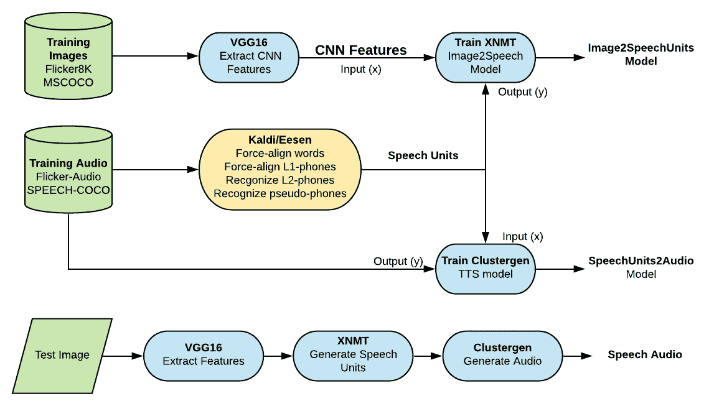

# 机器学习&图像到音频字幕

> 原文：<https://towardsdatascience.com/machine-learning-image-to-audio-captioning-964dc0f63df9?source=collection_archive---------40----------------------->

杰森·罗斯韦尔在 [Unsplash](https://unsplash.com?utm_source=medium&utm_medium=referral) 上的照片

## 关于机器学习如何用于将图像直接翻译成语音的简要文献综述。

机器学习已经扩展到许多不同的领域和学科。尝试新的领域是成长和学习新事物的最好方式。以下是研究人员如何应用机器学习直接从图像中生成音频描述的总结。

# [图像 2 语音:自动生成图像的音频描述](http://www.cs.cmu.edu/~awb/papers/hasegawajohnson17icnlssp.pdf)

研究人员在不使用文本作为中间形式的情况下为图像生成音频字幕。

> Clustergen、VGG16、LSTM、MSCOCO、语音-COCO、XNMT、Flickr、Flickr-Audio

丹尼尔·山特维克在 [Unsplash](https://unsplash.com?utm_source=medium&utm_medium=referral) 上的照片

## 摘要和导言

研究人员提出了人工智能的一个新领域，图像 2speech。他们将主要任务定义为:

> " Image2Speech 系统应该直接生成图像的语音描述，而不需要首先生成文本."

以前，image2speech 问题被分解为两个步骤:image2txt，然后 txt2speech。但是，一些语言没有书面形式(例如阿尔及利亚语、摩洛哥语、黎凡特语、各种阿拉伯语等)，因此传统的 img 2 语音翻译不适用于这些语言。

## 方法

研究人员使用标准的开源库、软件和数据来开发他们的模型。图一。展示了这些技术是如何相互关联的。

1.  [VGG16](/step-by-step-vgg16-implementation-in-keras-for-beginners-a833c686ae6c) (从图像中提取 CNN 特征)
2.  [XNMT](https://github.com/neulab/xnmt) (从 CNN 特征生成语音单元)
3.  [ClusterGen](https://www.cs.cmu.edu/~awb/papers/is2006/IS061394.PDF) (将语音单元转换成音频)
4.  [Kaldi](https://kaldi-asr.org/doc/about.html) 和 [Eesen](https://github.com/srvk/eesen) (自动语音识别，将音频翻译成语音单元)
5.  [Flickr 图像数据集](https://www.kaggle.com/hsankesara/flickr-image-dataset)和 [Flickr 音频](https://groups.csail.mit.edu/sls/downloads/flickraudio/)
6.  [MSCOCO](https://arxiv.org/abs/1405.0312) 和[演讲-COCO](https://arxiv.org/abs/1707.08435)

图一。图像速度的实验方法。来源:作者

Image2Speech 系统由三个独立的网络组成(VGG16、XNMT 和 Clustergen)。整个网络根据图像和音频描述对进行训练。

作者使用 VGG16 提取图像特征，然后 XNMT 将这些图像特征转化为语音单元，最后 Clustergen 将语音单元转化为音频。

> " XNMT(可扩展机器翻译工具包)专门用于训练序列对序列神经网络."

# 数据

数据来自两个不同的来源。它们都有一个图像数据集(Flickr 和 MSCOCO)和一个音频数据集(Flickr-Audio 和 SPEECH-MSCOCO)。因此，每个图像都伴随有文本字幕和该文本字幕的音频朗读。

示例图像 1000268201。来源:[公共领域](https://www.kaggle.com/hsankesara/flickr-image-dataset)

上图的字幕是由亚马逊土耳其机械公司的工人制作的:

1.  一个穿着粉色连衣裙的孩子正在入口通道爬上一组楼梯。
2.  一个女孩走进一栋木制建筑。
3.  一个小女孩爬进木制玩具屋。
4.  一个小女孩爬楼梯去她的玩具屋
5.  一个穿着粉色连衣裙的小女孩走进了一个小木屋。

MSCOCO 是最大的 image2txt 和 text2speech 数据集。它是如此之大，以至于研究人员在训练过程中无法将它全部包含进来。

# 结果

在所有模型被训练之后，它们实现了 78.8%的电话错误率。作者将此描述为:

> “不是完全自然的，而是由可理解的单词组成的可理解的句子”

# 结论

作者定义了一个新的人工智能领域，比传统的 image2speech 更具挑战性和限制性。在没有任何中间文本的情况下，从图像生成语音是新应用的独特问题。在本文中，作者提出了第一个此类模型，并希望鼓励其他人继续构建更有趣的模型。

# 机器学习和更多

 [## 机器学习和听力损失

### 关于机器学习如何使听力损失者受益的简要文献综述。

towardsdatascience.com](/machine-learning-hearing-loss-d60dab084e3f) 

# 参考文件

> Mark Hasegawa-Johnson，Alan Black，Lucas Ondel，Odette Scharenborg，Francesco Ciannella，《图像 2speech:自动生成图像的音频描述》，载于 inter speach(2020)[http://www . cs . CMU . edu/~ awb/papers/Hasegawa Johnsons 17 icnlssp . pdf](http://www.cs.cmu.edu/~awb/papers/hasegawajohnson17icnlssp.pdf)