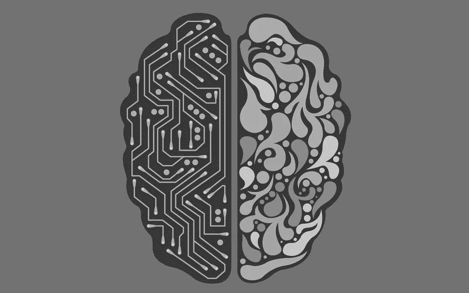

# 坚果壳中的机器学习

> 原文：<https://towardsdatascience.com/machine-learning-in-a-nut-shell-df251f480f77?source=collection_archive---------20----------------------->

图片由肖恩·巴蒂通过 pixabay.com 提供

# 怎么这么热闹？

机器学习是一个概念，也是当今科技环境中经常被丢弃的热门词汇，就解释而言，它还有很多需要改进的地方。人们经常把机器学习算法称为黑匣子；虽然机器学习的某些方面可能缺乏透明度，但通过了解机器学习的一些背景知识，可以减轻很多沮丧或困惑。

作为一门学科，机器学习比你想象的要简单得多，并且可以简化为许多组成部分。当机器学习在您的业务、项目或组织的背景下提出时，拥有这种高层次的视角将允许您理解并参与对话。

# 机器学习是由什么组成的？

机器学习有两个主要领域，我们将在这里进行分解。你遇到的大多数“ML”解决方案都属于这两类:监督学习和非监督学习

# 监督学习

监督机器学习问题的想法是，你实际上有一个预定义的数据集，其中包含所谓的因变量和响应变量。因变量是你想要理解的，自变量是你可以用来理解事物的。

监督学习的世界又分为两个子类:回归和分类。当我给出这些例子时，监督学习的全貌应该会变得更加清晰

# 回归

当我们在监督学习子类的上下文中谈论回归时，我们实际上谈论的是连续变量的预测。换句话说，不是预测某个东西是不是垃圾邮件，是不是猫，是不是什么即分类；那么我们预测的是一个可以“持续”的数字。

## 让我们用几个例子来说明这一点

假设你想预测个人收入。你有一个数据集，它详细描述了某人的经历、教育、技能等等..在此基础上，你可以利用这些变量来预测他们可能会生产什么。

另一个经典的例子是房价。您想知道您的房子在给定市场中的价格，因此您可以传递该市场的房屋销售数据来创建一个模型，该模型使用房间数、平方英尺、地块大小、建造年份等数据点来预测房屋价值。

希望这锁定了回归&也提高了分类。

# 分类

还记得我说的那些不是回归吗？那些东西是分类的。我们在这里仍然使用监督学习，但它不是预测一个连续的数字。

我们试图预测类别或阶层。这又引入了一个难题，但是当涉及到分类时；你可以试着预测某样东西属于或不属于某个类；即二进制分类，或者你可以预测一个记录属于哪一类；即多类分类。

对于二元分类，您可能希望预测一个机会/交易的结果是赢还是输。

你可以根据收视率、票房和预算来预测电影类型。

# 无监督学习

当谈到无监督学习时；模型会自己识别自然模式，而不是命令你的模型去理解什么。

# 使聚集

可能最流行的无监督学习方法被称为聚类。类似于我刚才描述的回归；假设您正在查看住房数据，但您希望了解住房的自然分组，而不是预测给定的变量，聚类将允许您根据与定义的组的最大相似性和与其他组的最大不相似性来识别住房的自然分组。

有了住房数据，你可以指定你关心平方英尺和房子的价值；你可能会看到自然分组可能是房屋类型、不同市场、年龄等的指标。

# 结论

机器学习活动还可能属于另外两个新兴的、不太流行的类别。那些是强化学习和半监督的。我不会在这里深入探讨这两个问题，但是如果你觉得这很有帮助，并且想要更多类似的内容，可以看看我在 datasciencelessons.com 的博客。

感谢阅读！祝数据科学快乐！