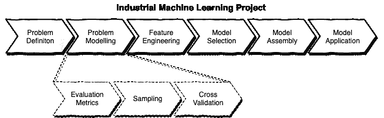

# 学术研究与实践中的机器学习

> 原文：<https://towardsdatascience.com/machine-learning-in-academic-research-v-s-practical-5e7b3642fc06?source=collection_archive---------21----------------------->

## 典型工业机器学习项目的阶段

安迪·凯利在 [Unsplash](https://unsplash.com?utm_source=medium&utm_medium=referral) 上的照片

作为解决大数据世界问题的关键技术之一，机器学习肯定越来越受欢迎。作为一名博士毕业生，我来自这个领域的学术方面。然而，自从我开始尝试在实践中应用我的“知识”以来，我发现建立一个 ML 模型来解决一个业务问题和写一篇论文之间有相当大的区别。

学术研究通常只关注理论。我们曾经试图将模型的精度提高一点点。即使我们在某个特定的课题上只迈出了一小步，也不妨碍我们写出一篇优秀的学术论文并发表。

实际上，对于一个基于行业的项目，只关注机器学习的一个方面是不够的。我们通常需要按照一定的步骤来解决问题，根据我过去的经验，如下所示:

因此，以下这些常用短语对于典型的工业 ML 项目至关重要:

1.  **问题建模**
2.  **特色工程**
3.  **型号选择**
4.  **模型组装**

在本文中，我将在其余部分介绍这些阶段，并说明为什么这些步骤对于解决实际问题是必要的，以及学术研究和工业项目在这些方面有什么不同。

# 问题建模

照片由[Olav Ahrens rtne](https://unsplash.com/@olav_ahrens?utm_source=medium&utm_medium=referral)在 [Unsplash](https://unsplash.com?utm_source=medium&utm_medium=referral) 上拍摄

在开始解决问题之前，我们需要对问题进行建模，因为实际问题通常很复杂。这是实践和学术研究的显著区别之一。当我们专注于学术研究的理论时，使用一些公共数据集是很常见的。这可以节省我们收集数据的时间和预算，并使我们能够从其他类似研究的相同基线开始，这有利于以后的评估。

问题建模从收集信息开始，以便理解它，然后将问题抽象成可预测的东西。

我们需要为问题建模做的具体步骤

*   阐明业务逻辑(领域知识)
*   提取现有要素(输入)
*   定义要预测的内容(输出)
*   选择合适的评估指标
*   选择原始数据集的最相关子集(采样)
*   基于评估指标交叉验证模型

就我而言，有很多数据科学家和机器学习工程师通常会从一个 ML 问题的特征工程开始，这被认为是一个不合适的过程。

问题建模不应该被忽略的原因有很多，但是我发现下面两个子步骤是主要的。

## 评估指标

评估方法有很多种，如混淆矩阵、ROC/AUC、MAE 和 MSE。在学术研究项目中，选择任何有意义的人都是常见的，最重要的是，与其他算法相比，你的算法在这些指标下显示出最佳结果。这实际上并不尴尬，因为我相信所有的研究人员都想强调他们已经取得的进步，尽管他们可能也想在“未来工作”部分展示一些局限性。一般来说，这就是在学术研究中使用评估指标的方式，以强调贡献。

说到行业，这样评价你的模式会很危险。你可以向你的老板展示该模型在特定评估指标下的先进性。但是，如果您没有选择最适合问题的适当方法，该模型可能最终在实验中非常有效(当您向您的老板炫耀时)，但在实践中却不有效(生产使用)。想象一下，如果您的模型是对患者进行分类，以确定他们是否患有疾病，如果该模型在实践中运行不佳，可能会产生巨大的影响甚至危及生命的后果。

因此，我们需要选择能够最好地反映问题空间的评估指标，以及能够产生与原始数据集最相似的波动的评估指标。选择一个正确的度量标准可以确保您有一个合适的方法来评估您的模型，不仅针对您的测试数据集，而且针对您的实际使用。此外，它将极大地提高 ML 模型迭代的效率。

## 交叉验证

在学术研究中，大多数时候，小样本数据集不会成为问题，除非你的研究主题是使用有限的样本训练一个好的模型。然而，在实践中只有很小的样本量是很常见的。这可能是因为您的信息系统冷启动，或者您的企业还没有太多的用户，或者只是因为一些限制，如隐私政策，不允许您有足够的样本。

假设我们的样本数据集中只有 100 个条目，基于这个数据集训练了两个不同的模型。模型 A 有 98%的准确率，模型 B 有 92%的准确率。我们是否可以简单地说 A 型比 B 型“更好”？答案是否定的。

样本数据集太小，所以它没有足够的信心来确定哪个模型比另一个更先进。交叉验证是增加这种信心的技术之一。最常见的方法是保留，它将样本数据集分成训练集和测试集。还有一些其他方法，如 K 倍交叉验证和 bootstrap 抽样。这些交叉验证技术有助于使用相对较小的样本数据集使您的模型更接近实际用途。

# 特征工程

米卡·鲍梅斯特在 [Unsplash](https://unsplash.com?utm_source=medium&utm_medium=referral) 上的照片

如果你的学术研究课题不是关于特征工程的，你大概不会被这个困扰。您可以下载公共数据集，如 MovieLens 等。然后，使用您的算法训练一个模型，并将其与在同一数据集上使用其他算法训练的模型进行比较，以显示您的算法是如何进步的。然而，特征工程对于工业 ML 项目总是必要的，因为所收集的数据集对于您的企业来说是唯一的，并且大多数时候甚至不能直接用于训练可用的模型。

例如，一个制造工厂可能有 100 多个与设备相关的传感器，您需要训练一个模型来预测设备何时会出现异常。您可能会发现，在特征工程阶段，可能只有 20 个传感器会导致“异常”。此外，有些传感器可能无法独立工作。它必须与其他传感器一起转换，以便与该设备的“异常”相关联。因此，在实践中几乎不可能准备好原始数据集。为了在模型可以被很好地训练之前找到有意义的特征，特征工程对于大多数项目是强制性的。

通常，存在各种因素，机器学习工程师需要应用不同的原则和方法来执行特征工程任务，例如在问题建模阶段或业务逻辑本身中选择不同的模型。

因此，在我们完成了问题建模、数据过滤和清理之后，是时候开始特性工程了。这是一项关键但困难的任务，通常依赖于对 ML 的经验以及对领域知识的透彻理解。不夸张的说，大部分成功的机器学习项目都有优秀的特征工程。

# 型号选择

瑞安·昆塔尔在 [Unsplash](https://unsplash.com?utm_source=medium&utm_medium=referral) 上拍摄的照片

虽然特征工程很重要，但它仍然不是成功的工业机器学习模型的唯一因素。也就是说，选择不同的模型会导致完全不同的预测结果。换句话说，如果我们为问题选择的模型不合适，那么迭代模型变得实用可能是非常低效的，或者最有可能的是，永远没有一个有用的模型。

这在学术研究中很少困扰我，因为大多数时候，我们会分析特定类型的 ML 模型。我们甚至可能会寻找一个合适的数据集，以确保它更适合模型，而不是相反。然而，在一个工业 ML 项目中，我们正在解决一个特殊的问题，因此我们不能选择数据集。因此，我们只能为所提供的数据集选择模型。

我们应该根据不同的情况选择不同的模式。例如，逻辑回归可能适用于布尔型预测目标，随机森林通常适用于一些分类问题，深度学习通常是图像/语音识别的最佳选择。

因此，在一系列特征工程任务之后，我们还需要考虑哪种类型的模型可以从具有最佳潜在结果的特征中学习潜在模式。毫无疑问，选择一个合适的模型需要对大多数流行的模型有深刻的理解，并有丰富的行业经验。

# 模型装配

照片由[迈克·彼得鲁奇](https://unsplash.com/@mikepetrucci?utm_source=medium&utm_medium=referral)在 [Unsplash](https://unsplash.com?utm_source=medium&utm_medium=referral) 上拍摄

同样，除非你的研究课题是关于模型组装的，那么你就不会担心这个问题。然而，当涉及到一个行业项目时，你会发现为一个 ML 问题集合不同的模型是非常有效的。

正如在模型选择一节中提到的，我们需要选择一个最适合问题的模型。然而，这也是因为不同的模型在从特征中捕捉不同类型的潜在模式方面各有所长。很多时候，我们需要组装多个模型才能有一个更优的模型。

ML 模型有多种组装方法，如加权、投票、装袋和堆叠。与模型选择类似，模型组装也依赖于对模型的深刻理解和数据科学家的个人经验来优化组装的模型。

# 结论

总之，在如何利用机器学习模型方面，学术研究和基于行业的项目之间存在明显的差异。

对于学术研究，我们通常只关注机器学习的一个方面，并尽力改善这一单一方面。对于我们的研究论文中没有涉及的其他方面，我们可以不花力气，或者只花很少的力气。

对于一个基于行业的机器学习项目，如果你来自学术背景，就不要被困住。也就是说，不要只关注一个方面，而是遵循典型的阶段来建模问题，执行特征工程，选择合适的模型并进行优化组装。

让我们建立实用的机器学习模型！

 [## 通过我的推荐链接加入 Medium 克里斯托弗·陶

### 作为一个媒体会员，你的会员费的一部分会给你阅读的作家，你可以完全接触到每一个故事…

medium.com](https://medium.com/@qiuyujx/membership) 

如果你觉得我的文章有帮助，请考虑加入 Medium 会员来支持我和成千上万的其他作者！(点击上面的链接)