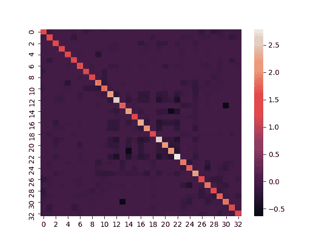
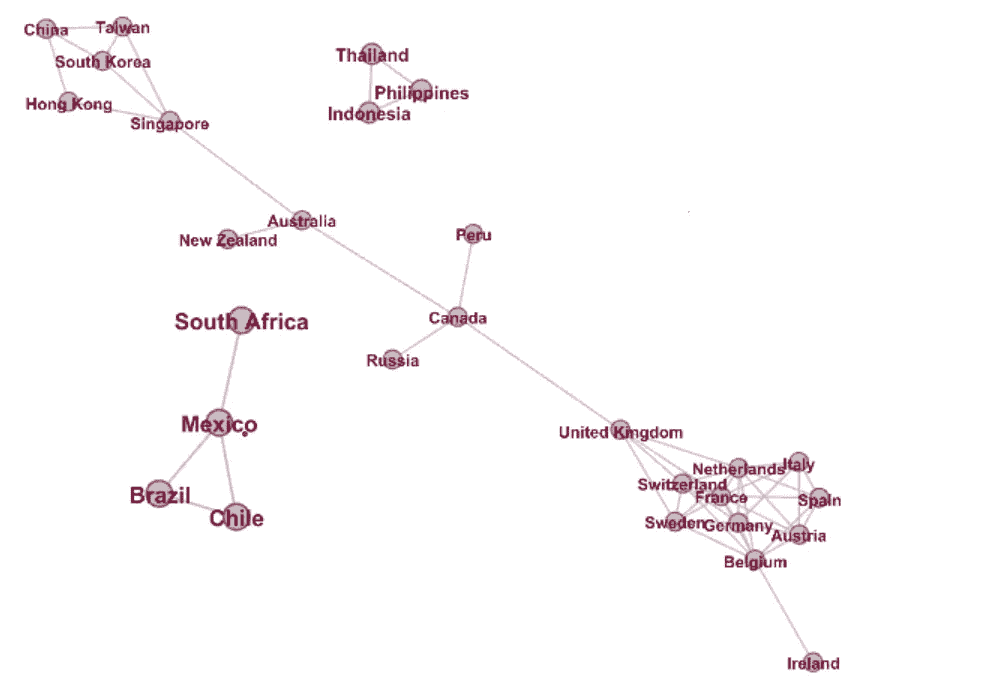

# 金融中的机器学习:使用图形套索识别国际股票交易所交易基金中的交易对

> 原文：<https://towardsdatascience.com/machine-learning-in-action-in-finance-using-graphical-lasso-to-identify-trading-pairs-in-fa00d29c71a7?source=collection_archive---------15----------------------->

**TL；博士:** *在这篇文章中，我将尝试解决识别相关股票投资组合的问题，这通常是 pairs 交易策略的第一步，也是最重要的一步。这种方法利用了图形 lasso 算法，该算法已被证明是许多实际问题的强大机器学习解决方案，如识别共同变化的大脑区域，社交媒体网络分析等。这是关于这个主题的系列教程中的第一篇，重点是它的一个应用；* [*我的第二篇帖子*](/porting-ideas-to-math-a-step-by-step-derivation-of-graphical-lasso-2e01f7165d95) *以血淋淋的细节阐述了其背后的美丽理论，未来的帖子将展示该算法如何带来令人惊讶的营销洞察力。所以请关注我，敬请期待。*


马库斯·斯皮斯克在 [Unsplash](https://unsplash.com?utm_source=medium&utm_medium=referral) 上拍摄的照片

股票投资的世界是诱人的，我们许多有技术的人都希望进入其中。然而，浪费我们的时间去筛选股票宇宙的基本面，比如说，仅仅在 SP500，对于有创造力的头脑来说，这本身就过于乏味和卑微了。

幸运的是，凭借编码知识和对机器学习的兴趣，你完全有能力在量化投资领域大展拳脚。下面，我将说明如何，作为创建自己的交易策略的第一步，使用一种称为图形套索的强大的机器学习算法，在国际股票 ETF 报价机中识别有意义的配对和聚类，以创建一个投资组合，这将是建立自己的配对交易策略的第一步，也是最重要的一步。

在整个教程中，我将把细节保持在最低限度和有意义的可行范围内，以便让您快速入门，您可以自由探索该算法的更多可能性。

系好安全带，让我们上路吧！


照片由[迭戈·希门尼斯](https://unsplash.com/@diegojimenez?utm_source=medium&utm_medium=referral)在 [Unsplash](https://unsplash.com?utm_source=medium&utm_medium=referral) 上拍摄

# 图形套索简介

还记得名为 lasso 的回归方法吗？该方法用于通过添加 L1 正则化项来导出回归问题的稀疏解。图形套索是它在图形世界的延伸。

图形套索不是估计回归问题中独立变量的系数，而是估计数据的精度(逆协方差)矩阵。因此，它不是像 lasso 回归中那样将许多系数推至 0，而是将矩阵中的许多值推至 0。

为什么是“图形化”？因为精度矩阵可以显示为唯一地对应于一个无向图(在后面的部分中有更多的介绍)。

换句话说，图形化套索的目标是从你的数据中归纳出一个具有稀疏连接的无向图。这个事实将在我们稍后尝试说明 ETF 图并识别可能的集群时派上用场。

关于算法更具体的数学处理，请参考[我在这个系列的第二篇文章](/porting-ideas-to-math-a-step-by-step-derivation-of-graphical-lasso-2e01f7165d95)，它一步一步地分析了算法。

# 数据准备

在这个实验中，让我们使用报价机的每日收盘价。我们将使用雅虎财经提供的历史数据。例如，要将股票行情系统 QQQ 的历史数据下载到您的本地机器上，您可以导航到 https://finance.yahoo.com/quote/QQQ/history?p=QQQ 的，选择日期范围，然后点击“下载”。在我们的实验中，假设我们对某些国家特别好奇，并检索以下国家 ETF 的数据:

```
#Setting up the mapping from ticker to country
etfs = {"EWJ":"Japan","EWZ":"Brazil",
        "FXI":"China","EWY":"South Korea",
        "EWT":"Taiwan","EWH":"Hong Kong",
        "EWC":"Canada","EWG":"Germany",
        "EWU":"United Kingdom","EWA":"Australia",
        "EWW":"Mexico","EWL":"Switzerland",
        "EWP":"Spain","EWQ":"France",
        "EIDO":"Indonesia","ERUS":"Russia",
        "EWS":"Singapore","EWM":"Malaysia",
        "EZA":"South Africa","THD":"Thailand",
        "ECH":"Chile","EWI":"Italy",
        "TUR":"Turkey","EPOL":"Poland",
        "EPHE":"Philippines","EWD":"Sweden",
        "EWN":"Netherlands","EPU":"Peru",
        "ENZL":"New Zealand","EIS":"Israel",
        "EWO":"Austria","EIRL":"Ireland","EWK":"Belgium"}
```

然后，我们做一些整理工作来简化数据格式，以便于以后的处理:

```
symbols, names = np.array(sorted(etfs.items())).T
```

现在，您应该已经下载了这些国家 ETF 的数据文件。下一步是将它们整理成一个大数据文件，其中列是股票代号，如上面排序的“EWK”，行是时间顺序的日期。你可以使用一个简单的 Python 脚本或者其他你喜欢的工具来实现。

让我们将整理好的文件读入熊猫数据帧:

```
#Read in series of daily closing prices
#The file 'input.csv' uses the tickers above as columns, and dates #as index in df
df = pd.read_csv("input.csv", index_col='Date')
```

# 数据处理

在应用算法之前，我们需要注意一件事:

```
#Convert price series to log return series
df = np.log1p(df.pct_change()).iloc[1:]
```

这一行代码将每日收盘价的时间序列转换成一系列的对数回报。请注意，这一步不是强制性的，但在这种情况下通常是一种良好的做法。可以论证如下:

虽然股票价格不是正态分布，但对数回报也不是，而是比价格更接近正态分布。应用数学家喜欢正态性，因为当他们使用不同的分析工具/算法处理数据时，它减轻了很多痛苦，其中大部分都假设数据正态性能够有意义地发挥作用。

底线:**学会热爱高斯，获得对他的分布的品味，尽你所能在你的数据中发现它。**

# 核心

现在我们准备应用算法:

```
#Calling Glasso algorithm
edge_model = covariance.GraphicalLassoCV(cv=10)
df /= df.std(axis=0)
edge_model.fit(df)
#the precision(inverse covariance) matrix that we want
p = edge_model.precision_
```

这里我们利用 Python 中的 sklearn 包来方便地实现图形化套索。请注意我是如何检索得到的精度(逆协方差)矩阵的，这是我们这里的重点。我们选择精确(逆协方差)矩阵，而不是协方差矩阵的原因是图形套索与其他无聊算法的区别，也是我下一篇文章的主题。现在，它足以说:

(1)是的，大多数人做协方差分析，但那可能是因为他们只知道这些。既然你已经听说过逆协方差，请从现在开始把它用到你的优势上。

(2)精度矩阵可以唯一定义一个无向图:其单元格( *i* ， *j* )的值，如果等于 0，则表示变量 *i* 和 *j，*之间的条件独立性，如果不为零，则表示条件(不)依赖的程度；并且这些依赖关系映射到无向图，使得如果两个顶点是条件独立的，则它们之间没有链接。

说了这么多，让我们看看使用 Seaborn 是什么样子的:

```
sns.heatmap(p)
```

我们得到了:



x 和 Y 标签遵循 ETF 的排序顺序

它看起来不错，但实际上并没有告诉我们太多。图形套索的强大之处在于它能够学习精确矩阵，然后将矩阵映射到图形。

所以让我们这样做:

```
#prepare the matrix for network illustration
p = pd.DataFrame(p, columns=cols, index=cols)
links = p.stack().reset_index()
links.columns = ['var1', 'var2','value']
links=links.loc[ (abs(links['value']) > 0.17) &  (links['var1'] != links['var2']) ]
#build the graph using networkx lib
G=nx.from_pandas_edgelist(links,'var1','var2', create_using=nx.Graph())
pos = nx.spring_layout(G, k=0.2*1/np.sqrt(len(G.nodes())), iterations=20)
plt.figure(3, figsize=(30, 30))
nx.draw(G, pos=pos)
nx.draw_networkx_labels(G, pos=pos)
plt.show()
```

上面的代码片段将精度矩阵转换为图形，并使用 Python 中的 Networkx 包来绘制它。我已经尝试让节点尽可能稀疏，这样节点标签就不会重叠，但还是不太令人满意。你自己试试看。

为了解决这个问题，让我们再做一步，将图形导出到 Gephi 中:

```
nx.write_gexf(G, 'graph.gexf')
```

在 Gephi 中打开文件并调整其布局，我们得到了以下有趣的国家 ETF 集群:



集群:混乱中的秩序

天真的是，你可以把这三个集群视为三个独立的投资组合，然后计算出每个组合的套期保值比率。或者更好的是，您可能想要尝试添加边权重并说明节点之间的结合强度，并基于该信息进一步将大型集群划分为较小的集群。请随意添加更多的数据和股票代码，并开始自己的研究。

群集布局看起来很有趣。它与地理位置非常匹配，这并不奇怪，因为地理上聚集在一起的国家往往会形成紧密结合的共同市场，并往往有大致共同变化的股票市场。同样有趣的是，东亚市场如何首先通过新加坡，然后通过澳大利亚和加拿大连接到欧洲集群。我无法深入分析这些联系，现在就把它留给好奇的读者去娱乐或困惑。


克里斯汀·罗伊在 [Unsplash](https://unsplash.com?utm_source=medium&utm_medium=referral) 上的照片

请记住，随着世界的发展和国家之间不断的友好或不友好，集群会发生变化。这是对任何交易算法的期望，以解释世界上的范式转变。

做你自己的实验，并把它作为你建立自己的交易算法的第一步。请继续关注这方面的更多信息，以及机器学习、金融和更多其他有趣的话题。

***来自《走向数据科学》编辑的提示:*** *虽然我们允许独立作者根据我们的* [*规则和指导方针*](/questions-96667b06af5) *发表文章，但我们并不认可每个作者的贡献。你不应该在没有寻求专业建议的情况下依赖一个作者的作品。详见我们的* [*读者术语*](/readers-terms-b5d780a700a4) *。*