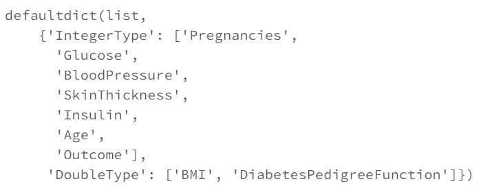
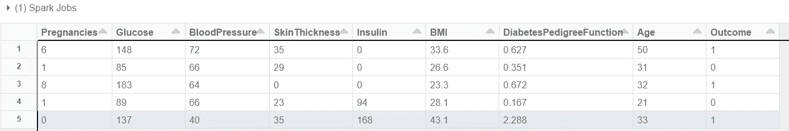
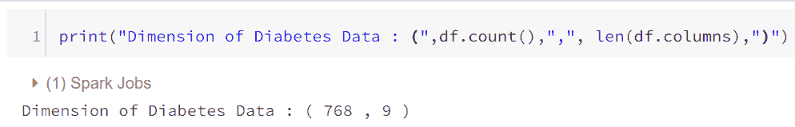
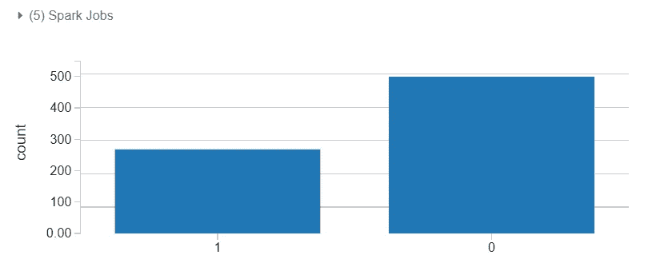
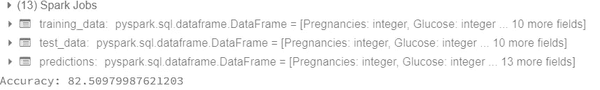
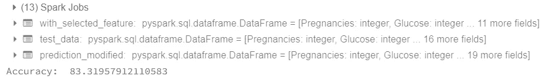

# 面向初学者的 Apache Spark 中的机器学习—医疗保健数据分析

> 原文：<https://towardsdatascience.com/machine-learning-in-apache-spark-for-beginners-healthcare-data-analysis-diabetes-276156b97e92?source=collection_archive---------36----------------------->


图片由[皮克斯拜](https://pixabay.com/?utm_source=link-attribution&utm_medium=referral&utm_campaign=image&utm_content=895567)的 Gerd Altmann 提供

## 大数据/数据科学/教程/指南/ Apache Spark /机器学习

> 使用 Databricks 在 Apache Spark 中构建第一个机器学习模型的分步指南

# 简介:

Apache Spark 是一个集群计算框架，旨在实现快速高效的计算。它可以用相对较低的计算能力处理数百万个数据点。Apache Spark 构建在 Hadoop 的 Map-Reduce 之上，是其扩展，可以有效地使用不同的集群计算组合。Spark 的主要特性是内存集群计算，它提高了应用程序的速度，包括交互式查询和流处理。

这篇文章是使用数据块在 Spark 中开发预测模型的快速入门指南。


[**图:数据块:统一数据分析**](https://databricks.com/)

我将使用 Databricks 的免费社区版本，感谢他们！

# 关于数据/背景信息:

在这篇文章中，我将使用机器学习来帮助我们预测患者患糖尿病的概率。数据集是从[UCI 机器学习库](http://archive.ics.uci.edu/ml/index.php)下载的。

在这里，我使用提供的关于患者的信息来预测糖尿病的概率。这是一个二元分类问题，我将尝试预测属于糖尿病类别的观察值的概率。

我将首先演示最少量的探索性分析，然后跳转到机器学习模型(即回归和基于树的模型)，并比较和总结结果。

# 数据预处理和探索；

以下代码行加载数据并创建 dataframe 对象。将 **Inferschema** 设置为 **true** 可以很好地猜测每一列的数据类型。

```
#The Applied options are for CSV files
df = spark.read.format("csv") \
     .option("inferSchema","true") \
     .option("header","true") \
     .option("sep",",") \
     .load(file_location)
```

我还创建了一个字典来存储与数据类型相关的特性。在我们的例子中，我们有一个“整型”和“双精度型”。

```
from collections import defaultdictdata_types = defaultdict(list)
for entry in df.schema.fields:
  data_types[str(entry.dataType)].append(entry.name)
```



查看列及其数据类型的代码输出

让我们看看数据集的前 5 行。

```
display(df.limit(5))
```



糖尿病数据集由 768 个数据点组成，每个数据点有 9 个特征:



“结果”是我们要预测的特征，其中 0 表示患者没有糖尿病，1 表示患者确实有糖尿病。在这 768 个数据点中，500 个标记为 0，268 个标记为 1。

```
display(df.groupby('Outcome').count())
```



使用 Databricks 的一个优点是，它有助于将查询可视化为一些基本的绘图选项，以便更好地理解数据和代码。

我们有一个完整的数据集，没有任何缺失值，但是要找到更多关于处理缺失数据的信息，您可以参考这篇文章:

[https://www . analyticsvidhya . com/blog/tag/missing-values-treatment/](https://www.analyticsvidhya.com/blog/tag/missing-values-treatment/)

# 处理分类数据:

在我们的数据中，我们只有一个分类列，即超过 17 个类别的“怀孕”。下面的代码显示了如何将分类列/特征转换为一键编码。在 Spark 中，使用“字符串索引器”为每个类别分配一个唯一的整数值。0 被分配给最频繁的类别，1 被分配给下一个最频繁的类别，依此类推。

```
from pyspark.ml import Pipeline
from pyspark.ml.feature import OneHotEncoder, StringIndexerstage_string = [StringIndexer(inputCol= c, outputCol=
        c+"_string_encoded") for c in strings_used]
stage_one_hot = [OneHotEncoder(inputCol= c+"_string_encoded",
        outputCol= c+ "_one_hot") for c in strings_used]ppl = Pipeline(stages= stage_string + stage_one_hot)
df = ppl.fit(df).transform(df)
```

在上面的代码中，我使用了一个管道，它可以在一次迭代中有效地处理一系列任务。人们可以列出任务清单，管道会处理所有事情。

一般来说，机器学习管道描述了编写代码、将其发布到生产、进行数据提取、创建训练模型和调整算法的过程。在 ML 平台上工作是一个连续的过程。但是对于 Apache Spark 来说，管道是一个将步骤转换、评估和装配到一个对象中的对象。这些步骤被称为 ml 工作流。

# 向量汇编程序:

这里的想法是将一个给定的列列表组装成一个向量列，并将它们捆绑在一起。这是 Spark 的机器学习模型所需的额外步骤。这一步骤通常在数据探索和预处理步骤结束时执行。在这个阶段，我正在使用一些原始的和一些转换的特征来训练一个模型。

```
from pyspark.ml.feature import VectorAssemblerfeatures = ['Pregnancies_one_hot','Glucose','BloodPressure',
'SkinThickness','Insulin','BMI','DiabetesPedigreeFunction','Age']vector_assembler = VectorAssembler(inputCols = features, 
                                   outputCol= "features")
data_training_and_test = vector_assembler.transform(df)
```

# 模型拟合:

我们有几个内置的分类器，包括随机森林、提升树、逻辑回归等。首先，作为一个例子，我实现了 Random Forest，指定了分类器中树的数量，并将其余参数保留为默认值。

为了评估我们模型的性能，我使用 ROC 曲线度量。您可以选择自己喜欢的“metricName”。

该模型的准确率为 82.5%。这表明我们的模型在默认参数下运行良好。

```
from pyspark.ml.classification import RandomForestClassifier
from pyspark.ml.evaluation import BinaryClassificationEvaluator(training_data, test_data) = data_training_and_test.randomSplit([0.7, 0.3], 2017)
rf = RandomForestClassifier(labelCol = "Outcome", 
                        featuresCol = "features", numTrees = 20)
rf_model = rf.fit(training_data)predictions = rf_model.transform(test_data)
evaluator= BinaryClassificationEvaluator(labelCol = "Outcome", rawPredictionCol="probability", metricName= "areaUnderROC")
accuracy = evaluator.evaluate(predictions)print("Accuracy:",accuracy*100)
```



# 功能选择:

特征选择过程有助于过滤掉不太重要的变量，从而得到更简单、更稳定的模型。在 Spark 中，实现特性选择不像在 Python 的 scikit-learn 中那样简单，但是可以通过将特性选择作为管道的一部分来管理。这个想法是:

1.  首先安装分类器。例如，您可以选择回归模型或基于树的模型，任何您选择的模型。
2.  如果使用随机森林，则查找要素重要性；如果使用逻辑回归，则查找系数。
3.  将最重要的功能集存储在列表中。
4.  从 **ml** 库中使用' **VectorSlicer** '方法，并从刚才选择的列表中创建一个新的 vector。

下面的代码显示了如何从我们之前拟合的模型中创建一个重要特性的列表。大于 0.03 的特征被保留，rf_model 是拟合的随机森林模型。

```
importance_list = pd.Series(rf_model.featureImportances.values)
sorted_imp = importance_list.sort_values(ascending= False)
kept = list((sorted_imp[sorted_imp > 0.03]).index)
```

取 0.03 是随机的，可以基于 AUC 度量尝试不同的值。后来我用矢量切片器收集所有重要性大于 0.03 的特征。

```
from pyspark.ml.feature import VectorSlicer
vector_slicer = VectorSlicer(inputCol= "features", 
                         indices= kept, outputCol= "feature_subset")
with_selected_feature = vector_slicer.transform(training_data)rf_modified = RandomForestClassifier(numTrees=20,
                labelCol = "Outcome", featuresCol="feature_subset")
test_data = vector_slicer.transform(test_data)
prediction_modified = rf_modified.fit(with_selected_feature)
                                 .transform(test_data)evaluator_modified = BinaryClassificationEvaluator(labelCol = "Outcome",rawPredictionCol="probability", metricName= "areaUnderROC")
accuracy = evaluator_modified.evaluate(prediction_modified)print("Accuracy: ",accuracy*100)
```



通过特征选择，我们看到准确率提高了 1%,总体准确率为 83%。从完整的特征集中，我们得到了 82%的准确率。在处理大数据时，即使 1%的改进也很重要。

最后，我只想说，Apache Spark 是一个简洁易用的开源框架。

感谢您抽出时间阅读！

我总是期待着学习和成长，如果您有任何问题或建议，请联系我！

领英|*sagardaswani1703@gmail.com*|[Github](https://github.com/Sagar401)