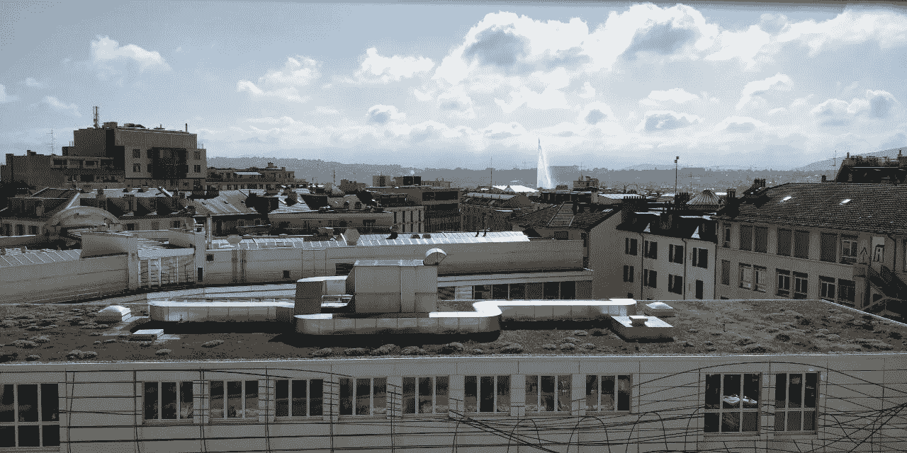
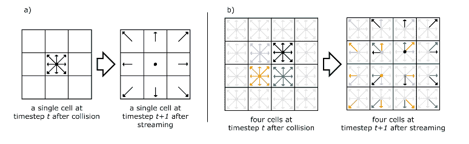

# 计算流体力学中的机器学习

> 原文：<https://towardsdatascience.com/machine-learning-in-computational-fluid-dynamics-7018941414b9?source=collection_archive---------17----------------------->

## 我的暑期实习经历！

从我在日内瓦和平区坐过的桌子上看到的景色。图片鸣谢:Moi。

2018 年夏天，我获得了一个在瑞士日内瓦高等教育学院实习的绝佳机会。

我花了几乎三个月的时间用机器学习解决了一个问题，在我见过的最美丽的国家之一，遇到了这么多了不起的人。有什么不喜欢的，对吧？

# 该项目

顾名思义，该项目涉及用机器学习模型取代格子玻尔兹曼方法中的复杂计算，以提高名为 [**帕拉博斯**](https://palabos.unige.ch/)—**Pa**rallel**La**ttice**Bo**ltzmann**S**olver 的模拟器的性能。

我在这里会完全诚实；当我在那里得知这个项目时，我有点不知所措。我没有物理学背景，对机器学习也相当陌生。我不认为我有足够的资格做这样的事情——冒名顶替综合征的可用性必须是 100%,似乎从不错过任何机会！无论如何，我决定全力以赴，看看我能走多远，因为这是我们学习的方式。

## 背景

格子 Boltzmann 方法(LBM)是计算流体动力学(CFD)中模拟单相和多相流体流动的并行算法。它有助于模拟复杂的边界条件和多相界面。

它将流体建模为虚拟粒子，这些粒子在离散网格上执行连续的碰撞和流动步骤。常用的点阵命名为 *DnQm，*这意味着点阵具有 *n* 的空间维度和 *m* 的离散速度。在每个时间步中，任何节点上的粒子只能以一种离散速度移动到它们最近的相邻位置。一旦粒子移动到它们相邻的位置之一，它们将与同时到达同一位置的其他粒子发生碰撞。

LBM 的粒子运动。[来源](https://people.ece.cornell.edu/land/courses/ece5760/DE1_SOC/HPS_peripherials/Lattice_Boltzmann_index.html)。

在直接数值模拟中——计算流体动力学中的一种模拟——在没有任何湍流模型的情况下数值求解纳维尔-斯托克斯方程。

大涡模拟(LES)是计算流体力学中用于模拟湍流的数学模型。计算域的大小应至少比表征湍流能量的尺度高一个数量级，同时计算网格应足够精细，以解决最小的动态有效长度尺度，从而进行精确模拟。

如果通过使用非常精细的网格直接求解纳维尔-斯托克斯方程来精确地解决所有的涡流(网格应该比最小的湍流涡流更精细，湍流涡流本质上是水的环流),则会导致很高的计算成本。为了克服这些计算成本，在 LES 中，仅直接计算大尺度运动(大涡流)，而小尺度(亚网格尺度(SGS))运动被建模。

最后，LBM 告诉我们，我们可以将流体想象为空间和时间中的虚拟粒子，DNS 告诉我们如何模拟每个粒子的行为——给定系统的物理条件——在每个时间步长，les 通过近似亚网格尺度的涡流，使得在尺度范围变化很大时对湍流做这些事情成为可能。

我花了大约两周的时间学习它背后的物理学，设置我的系统(最初默认语言为法语)，获得 IDE——使用一个名为 *Qt* 的 IDE，浏览软件代码以了解更高层次上发生的事情。

## 问题陈述

使用机器学习来学习大涡模拟中亚网格尺度(SGS)运动的模型，并将其与现有模拟器集成，以取代当前的亚网格计算。

*   使用的语言:C++，因为它很快。
*   该模型需要体积小、速度快，以便可以轻松部署，而不会增加内存负载或延迟模拟。
*   建议不要使用外部框架，如 TensorFlow 或 PyTorch。

## 解决办法

解决一个大而复杂的问题的最好方法是把它分解成更小更简单的问题。我做了同样的事情，把我的问题分成以下三个问题:

1.  设计一个简单的结构来模拟亚网格尺度的运动。
2.  根据时间和其他约束来训练和优化模型。
3.  将模型与现有软件集成。

## 子问题#1 -模型架构和训练数据:

训练数据有九个输入属性:
1:密度
2–3:速度
4–6:应力
7:涡度
8–9:密度梯度

输出有 3 个代表残余应力张量的属性。它有大约一百万个字节组。

该架构的目标是在不牺牲性能的情况下尽可能保持简单。我决定使用最简单的神经网络，称为感知器模型。它由输入层、输出层和隐藏层组成。

在神经网络模型的输入层之前添加了一个缩放层，以便在将训练数据输入模型之前对其进行标准化。由于预测输出是一个回归问题，因此在预测新的未知数据的值时，在输出层之后添加了一个未缩放层。

下一个任务是找到模型中每一层的尺寸。输出层有 3 个节点，每个节点对应于训练数据输出部分的一个属性。

我将输入节点的数量保持为 9，并开始研究隐藏节点的数量，以找到隐藏层的最佳大小，同时跟踪平均平方误差和测试所需的时间。我从极端情况开始，保持隐藏节点的数量非常低和非常高——保持学习速率、时期数和其他变量不变——然后通过遵循非常类似于二分搜索法的方法缩小范围。然后我发现中值也是如此，然后是(低，中)和(中，高)的中值，这两个中误差较小的一个成为我们新的搜索空间。

一旦决定了隐藏节点的最佳数量，我还会考虑模型的输入数量。令人惊讶的是，如果我将输入减少到 6，结果并没有大幅下降。因此，如果需要进一步缩小模型尺寸，我也有这个选择。几年后，我了解到这就是所谓的“消融研究”，即移除模型的特征并评估其对输出的影响，这是一个值得遵循的良好实践。

以上所有工作都是在原始训练数据的子集上完成的，以确保项目的顺利进行。

在这一部分，我花了大约两周的时间，熟悉了 OpenNN 库，编写了模型代码，并对数据集进行了试验，以获得上述值。

## 子问题#2 -训练模型:

一旦我们的模型架构最终确定，我发现自己在寻找数据集子集上给定架构的最佳学习率。同样，我遵循了一个非常类似于二分搜索法的策略——从极端开始，然后从那里缩小范围。我使用了拟牛顿法进行权重优化，这可以在 C++的 OpenNN 库中找到。

一旦这样做了，我就开始学习上面练习中发现的三个最小的错误。然后，对于每个学习率，我在整个数据集上训练模型。我重复了五次，最终选择了在这五次运行中表现最好的学习率。

这是一个缓慢的过程，因为每次训练大约需要一天的 0.5-0.75 分钟。我在这上面花了大约三个星期。

## 子问题#3 -与 Palabos 集成:

第一件事是在没有任何 IDE 的情况下运行代码；我更新了所需包的路径，并链接了所需的库。

一旦完成，模型被调用，而不是模拟亚网格尺度漩涡的函数。我们尝试在几个场景下运行该模块，并将性能与我们从模拟漩涡中获得的结果进行比较。

# 总体体验

我在实习期间过得很愉快。做这个项目我学到了很多；比如如何解决一个大问题，为给定问题开发人工智能解决方案的方法，等等。

***外卖***:
——如果现在让我再做一次，我还会以同样的方式做事吗？大部分，是的。但是我会更加重视项目的测试和验证方面。如果我有更多的时间，我可能也会这样做，但如果我现在这样做，我会确保在计划期间专门为此分配一些时间——包括整合之前和之后。
-我意识到我喜欢使用 ML，并将其应用于新问题或改进现有解决方案。所以，是的，我现在正在寻找更经常地做这件事的方法——人工智能/人工智能的新应用！有一个好的导师会有很大的不同。我是唯一参与这个项目的人。但是我的导师真的很有帮助。他会听我说些什么，然后指导我。我完全可以控制我想如何做这个项目，但同时我总是让他指导我。我想这就是这次经历如此充实和令人满意的原因。

我也遇到了一些非常善良和了不起的人，他们现在仍然是我的朋友。谢谢你 2018 年夏天给了我难忘的美好经历。❤

# 参考资料和更多信息

*   [了解 LES](https://www.ncbi.nlm.nih.gov/pmc/articles/PMC4095897/) 的更多深入解释。
*   LES——另一种资源。
*   [OpenNN 库](http://www.opennn.net/documentation/reference/)

# 我认为你会喜欢:D 的其他文章

*   [是的，你应该听听 Andrej Karpathy，了解反向传播](/back-propagation-721bfcc94e34)
*   [利用深度学习检测恶意软件](/malware-detection-using-deep-learning-6c95dd235432)
*   [在深度学习中获得注意力](/attaining-attention-in-deep-learning-a712f93bdb1e)

> 我很高兴你坚持到了这篇文章的结尾。*🎉我希望你的阅读体验和我写这篇文章时一样丰富。*💖**
> 
> 请点击这里查看我的其他文章。
> 
> 如果你想联系我，我会选择 Twitter。