# 医疗保健中的机器学习:检测黑色素瘤

> 原文：<https://towardsdatascience.com/machine-learning-in-healthcare-detecting-melanoma-70147e1b08de?source=collection_archive---------26----------------------->

## 通过应用若干机器学习算法，使用患者的诊断报告和皮肤病变图像来检测病变是癌性的还是非癌性的。


[国家癌症研究所](https://unsplash.com/@nci?utm_source=medium&utm_medium=referral)在 [Unsplash](https://unsplash.com?utm_source=medium&utm_medium=referral) 上拍摄的照片

皮肤癌是最常见的癌症。它的发生是由于皮肤细胞的异常生长，通常是在暴露于阳光的区域。有三种主要类型的皮肤癌——基底细胞癌、鳞状细胞癌和黑色素瘤。特别是黑色素瘤，尽管它是最不常见的皮肤癌，但却造成了 75%的皮肤癌死亡。

黑色素瘤是一种致命的疾病，但如果早期发现，大多数黑色素瘤可以通过小手术治愈。

在本文中，我们将通过应用几种机器学习算法将病变分类为良性或恶性，从患者的诊断记录和皮肤病变的图像中识别黑色素瘤。更好地检测黑色素瘤有机会对数百万人产生积极影响。

> 注意:下面的代码是使用 Kaggle 提供的数据集 [**SIIM-ISIC 黑色素瘤分类**](https://www.kaggle.com/c/siim-isic-melanoma-classification/overview) 在 **Kaggle 内核**上实现的。你可以在这里找到完整的代码。

我们将遵循以下步骤来实现该算法。

## 导入库

让我们通过在 Kaggle 内核中导入所需的库来开始实现，如下所示:

```
import numpy as np
import pandas as pd
import matplotlib.pyplot as plt
import seaborn as sns
import cv2
import pydicom as dicom
import pandas as pd
import numpy as np
from sklearn.metrics import accuracy_score, confusion_matrix
from sklearn.metrics import mean_squared_error, r2_score
```

导入的 **pydicom** 库用于处理数据集中提供的图像。这些图像属于 DICOM(医学数字成像和通信)类型，这是传输、存储、检索、打印、处理和显示医学成像信息的国际标准。

## 分析数据集

下一步是导入 Kaggle 提供的数据集 [**SIIM-ISIC 黑色素瘤分类**](https://www.kaggle.com/c/siim-isic-melanoma-classification/overview) 。

```
df = pd.read_csv('/kaggle/input/siim-isic-melanoma-classification/train.csv')
df.head()
```

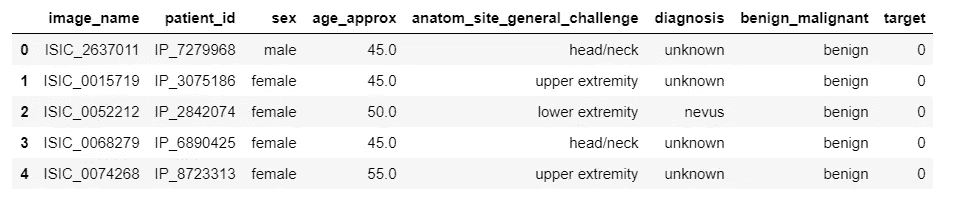

**SIIM-ISIC 黑色素瘤分类数据集**

从上面给出的数据集，我们可以推断黑色素瘤的分类取决于两件事，即**患者的详细信息**和**患者皮肤损伤的图像**。整个过程解释如下。


[源 1](https://www.google.com/url?sa=i&url=https%3A%2F%2Fwww.bbc.com%2Fnews%2Fhealth-29014838&psig=AOvVaw11bK7plKwzkhhqn5fvlne3&ust=1602953848809000&source=images&cd=vfe&ved=0CAIQjRxqFwoTCJDttuvLuewCFQAAAAAdAAAAABAD) 、[源 2](https://www.google.com/url?sa=i&url=https%3A%2F%2Fwww.123rf.com%2Fclipart-vector%2Fhalf_naked.html&psig=AOvVaw3GQHdeMCj0hJAoqnDot1UM&ust=1602953510615000&source=images&cd=vfe&ved=0CAIQjRxqFwoTCMCf6P3LuewCFQAAAAAdAAAAABAD) 、[源 3](https://www.google.com/url?sa=i&url=https%3A%2F%2Fwww.pixtastock.com%2Fillustration%2F14797843&psig=AOvVaw1Q4HP8sPLSKt2VoqmZTA-z&ust=1602954471391000&source=images&cd=vfe&ved=0CAIQjRxqFwoTCPiOqqHNuewCFQAAAAAdAAAAABAD) 、[源 4](https://www.google.com/url?sa=i&url=https%3A%2F%2Fwww.clipartlogo.com%2Fistock%2Fmedical-stethoscope-with-blank-paper-in-clipboard-1610319.html&psig=AOvVaw0yACOpUWz7BEPTtzJd1O8M&ust=1602955442730000&source=images&cd=vfe&ved=0CAIQjRxqFwoTCNDWwcbQuewCFQAAAAAdAAAAABAD)

我们获取患者的详细信息和皮肤病变图像，然后应用机器学习算法来检测此人是否患有癌症。

## 图像分类

让我们从检测数据集中提供的图像中存在的黑色素瘤开始。

黑色素瘤迹象包括:

*   带有深色斑点的褐色大斑点
*   颜色、大小或感觉改变或出血的痣
*   边缘不规则的小病灶，部分呈现红色、粉色、白色、蓝色或蓝黑色
*   发痒或灼烧的疼痛损伤
*   手掌、脚底、指尖或脚趾，或口腔、鼻子、阴道或肛门粘膜上的黑色病变

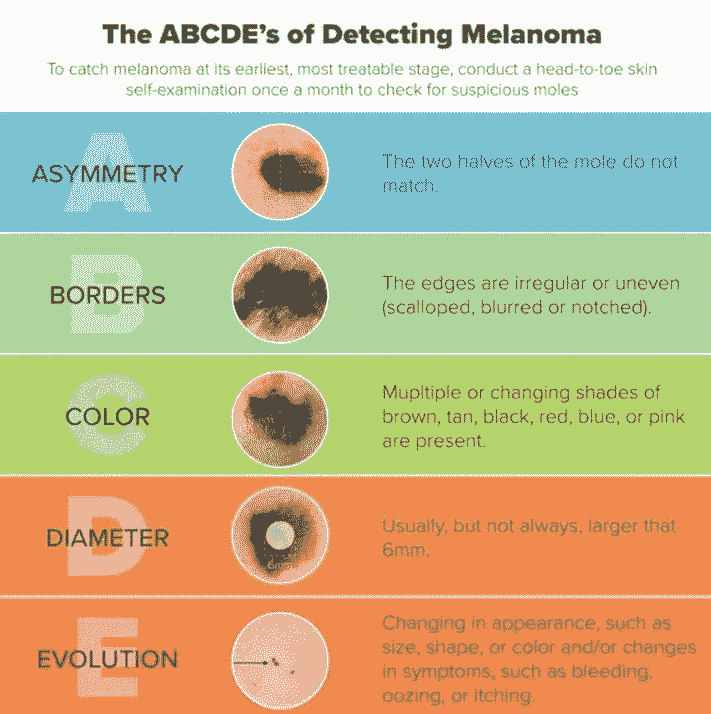

[来源](https://www.facebook.com/SchiffertHealthCenter/photos/a.1055867394532801/2991682010951320/?type=1&theater)

使用这些迹象，机器学习算法将皮肤损伤分类为良性或恶性。

让我们从从整个数据集中抽取一小部分数据样本来开始实现。

```
s0 = df.target[df.target.eq(0)].sample(50).index
s1 = df.target[df.target.eq(1)].sample(60).indexdf = df.loc[s0.union(s1)]
df['target'].value_counts()
```

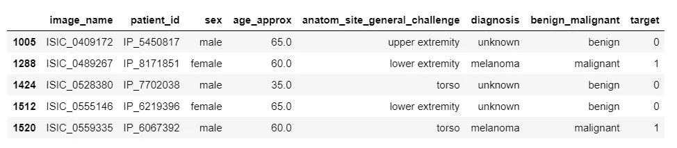

这是我们新生成的数据集，我们将使用它来训练我们的机器学习模型。

现在让我们来看看这些图片。这些图像以 DICOM 格式呈现，因此我们使用由 **pydicom** 库提供的 **dicom.dcmread()** 函数来读取图像。

```
image = '/kaggle/input/siim-isic-melanoma-classification/train/' + df['image_name'][1512] +'.dcm'ds = dicom.dcmread(image)plt.imshow(ds.pixel_array)
```

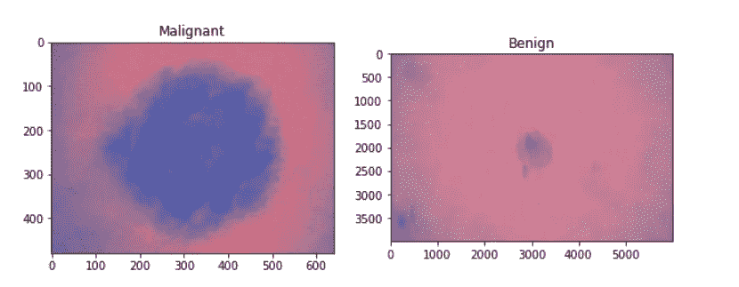

显示恶性和良性癌症区别的图片

下一步是训练我们的机器学习模型。为了做到这一点，图像应该首先以模型能够理解的格式表示。为此，我们需要将图像转换成像素格式。

因此，对于数据集中的每个图像，我们使用 **dicom.dmread()** 读取图像，并使用 **ds.pixel_array** 提取像素。这些像素是多维的，因此我们使用 **flatten** 函数将其转换为一维数组。然后，我们将这些像素格式的图像添加到一个名为 **images 的列表中。**

```
images = []for x in df['image_name']:
    image = '/kaggle/input/siim-isic-melanoma-classification/train/' + x +'.dcm'
    ds = dicom.dcmread(image)
    pixels = ds.pixel_array
    images.append(pixels.flatten())
```

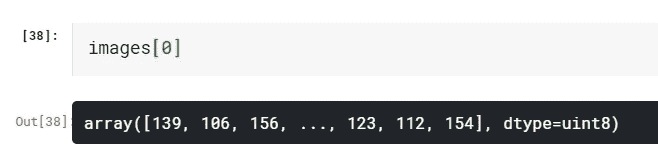

使用像素表示图像

现在，出现的问题是每个图像都有不同数量的像素，因此生成的数组具有不均匀的长度。为了解决这个问题，我们使用填充技术，要么向数组添加额外的值，要么丢弃某些值，以使数组的长度等于指定的最大长度。

```
import tensorflow as tf
images = tf.keras.preprocessing.sequence.pad_sequences(
  images,
  maxlen = 720,
  dtype = "int32",
  padding = "pre",
  truncating = "pre",
  value = 0
)
```

我们还需要一个包含图像的测试数据集来测试我们的模型。我们可以如下生成测试数据集。

```
test = df.tail(50)
test.head()
```

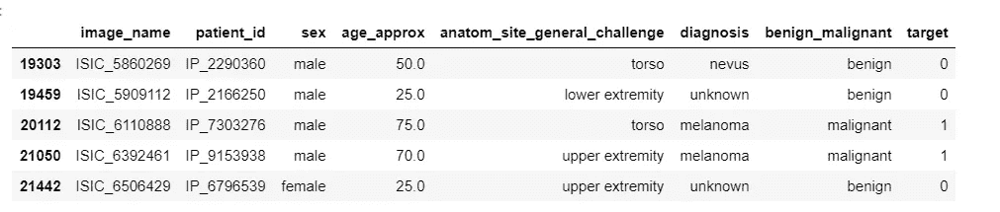

测试数据集

一旦我们准备好数据集，我们就重复上面显示的过程。也就是说，我们首先将图像转换为其像素格式，然后应用填充技术，使图像具有相同数量的像素。

```
test_images = []
count = 0for x in test['image_name']:
    image = '/kaggle/input/siim-isic-melanoma-classification/train/' + x +'.dcm'
    ds = dicom.dcmread(image)
    pixels = ds.pixel_array

    test_images.append(pixels.flatten())
    count +=1
    print(count)test_images = tf.keras.preprocessing.sequence.pad_sequences(
  test_images,
  maxlen = 720,
  dtype = "int32",
  padding = "pre",
  truncating = "pre",
  value = 0
)
```

最后，是时候训练我们的模型了。

我们将使用几种机器学习算法来训练我们的模型，然后测试它以查看准确性得分。

我们将设置的值

**X =图像**(包含像素格式图像的列表)

**y = NP . array(df[' target '])**(表示图像中的病变是良性还是恶性的值)

**1。逻辑回归**

```
from sklearn.linear_model import LogisticRegressionX = images
y = np.array(df['target'])
classifier_lr = LogisticRegression()
classifier_lr.fit(X,y)X_test = test_images
y_test = np.array(test['target'])
y_pred_lr = classifier_lr.predict(X_test)print('Accuracy Score: ',accuracy_score(y_test,y_pred_lr))
print('Confusion Matrix: \n',confusion_matrix(y_test,y_pred_lr))
```

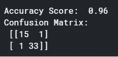

逻辑回归算法给出的精确度

**2。支持向量机**

```
from sklearn import svm
X = images
y = np.array(df['target'])
classifier_svm = svm.SVC()
classifier_svm.fit(X,y)X_test = test_images
y_test = np.array(test['target'])
y_pred_svm = classifier_svm.predict(X_test)print('Accuracy Score: ',accuracy_score(y_test,y_pred_svm))
print('Confusion Matrix: \n',confusion_matrix(y_test,y_pred_svm))
```

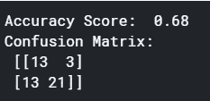

支持向量机算法给出的精度

**3。决策树**

```
from sklearn.tree import DecisionTreeClassifier
X = images
y = np.array(df['target'])
classifier_dt = DecisionTreeClassifier()
classifier_dt.fit(X,y)X_test = test_images
y_test = np.array(test['target'])
y_pred_dt = classifier_dt.predict(X_test)print('Accuracy Score: ',accuracy_score(y_test,y_pred_dt))
print('Confusion Matrix: \n',confusion_matrix(y_test,y_pred_dt))
```

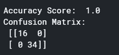

决策树算法给出的精确度

**4。随机森林**

```
from sklearn.ensemble import RandomForestClassifier
X = images
y = np.array(df['target'])
classifier_rf = RandomForestClassifier()
classifier_rf.fit(X,y)X_test = test_images
y_test = np.array(test['target'])
y_pred_rf = classifier_rf.predict(X_test)print('Accuracy Score: ',accuracy_score(y_test,y_pred_rf))
print('Confusion Matrix: \n',confusion_matrix(y_test,y_pred_rf))
```

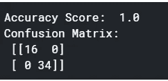

随机森林算法给出的精确度

**5。自适应增压**

```
from sklearn.ensemble import AdaBoostClassifier
X = images
y = np.array(df['target'])
classifier_ab = AdaBoostClassifier()
classifier_ab.fit(X,y)X_test = test_images
y_test = np.array(test['target'])
y_pred_ab = classifier_ab.predict(X_test)print('Accuracy Score: ',accuracy_score(y_test,y_pred_ab))
print('Confusion Matrix: \n',confusion_matrix(y_test,y_pred_ab))
```

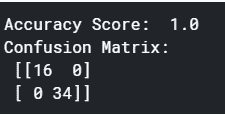

自适应升压算法给出的精度

6。梯度增强

```
from sklearn.ensemble import GradientBoostingClassifier
X = images
y = np.array(df['target'])
classifier_gb = GradientBoostingClassifier()
classifier_gb.fit(X,y)X_test = test_images
y_test = np.array(test['target'])
y_pred_gb = classifier_gb.predict(X_test)print('Accuracy Score: ',accuracy_score(y_test,y_pred_gb))
print('Confusion Matrix: \n',confusion_matrix(y_test,y_pred_gb))
```

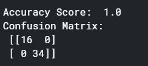

由梯度推进算法给出的精度

在使用几种机器学习算法对图像进行训练和测试后，我们得到了不同的准确度。有些算法会使数据过拟合，而有些算法会使数据欠拟合。因此，我们继续使用**逻辑回归**算法，因为它既不过度拟合也不欠拟合数据，给出 96%的准确度。

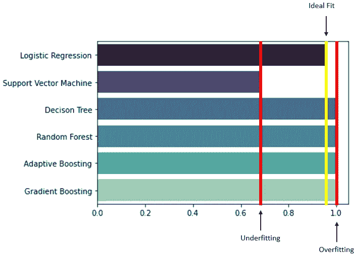

显示使用机器学习算法获得的精确度的条形图

## 使用病历进行分类

为了方便起见，我们先将*“anatom _ site _ general _ challenge”*重命名为*“site”*。

```
df = df.rename(columns = {'anatom_site_general_challenge':'site'})
```

为了开始数据的训练，我们首先需要理解数据。让我们应用一些可视化和数据清理技术来更好地解释我们的数据。

首先，让我们使用以下代码删除数据集中所有缺失的值

```
df = df.dropna(axis=0, how = 'any')
```

考虑到 **age_approx** 并作为一个因素，我们可以使用下面的代码来创建如下所示的图表。

```
age = []
for i in range(df.shape[0]):
    try: 
        if df['target'][i] == 1:
            age.append(df['age_approx'][i]) 
    except:
        passplt.figure(figsize=(15,5))plt.subplot(1,2,1)
sns.distplot(age)
plt.title('Distribution of age of people having malignant cancer')plt.subplot(1,2,2)
sns.countplot(y = age)
plt.ylabel('Age')
plt.title('Count plot of age of people having malignant cancer')
```

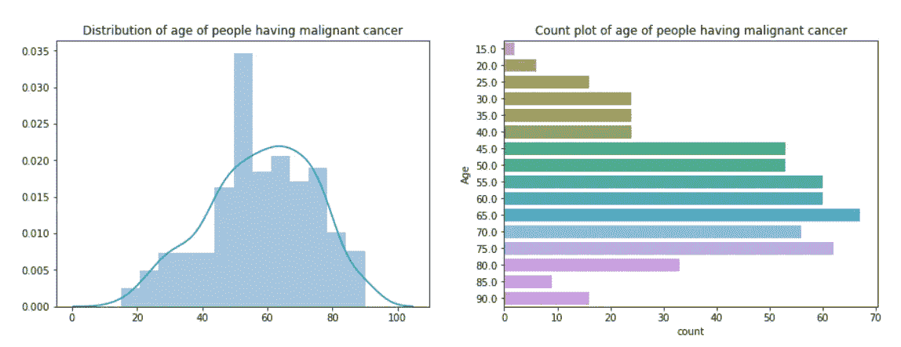

使用 age_approx 作为因子创建的图表

从上面的图表中可以推断出以下几点:

*   大多数恶性肿瘤患者的年龄在 40 至 80 岁之间
*   年龄值大于 60 岁的癌症患者人数最多，其次是年龄值在 55 至 60 岁之间的人。
*   患有癌症且年龄值低于 10 岁的患者数量非常少。

考虑到**站点**，作为一个因素，我们可以使用下面的代码来创建下图。

```
site = []
for i in range(df.shape[0]):
    try: 
        if df['target'][i] == 1:
            site.append(df['site'][i]) 
    except:
        passsns.countplot(y = site)sns.countplot(y = site,palette="rocket")
plt.title('Graph showing count of patients having cancer and the site it is located in')
plt.ylabel('Site')
```

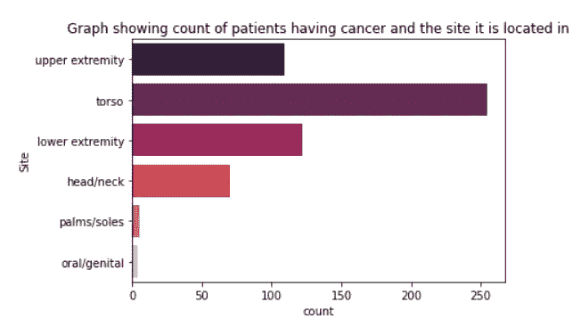

使用站点作为因素创建的图表

从上面的图表中可以推断出以下几点:

*   大多数病人的躯干都有皮肤损伤
*   极少数患者的手掌/溃疡或口腔/生殖器部位出现皮肤损伤。

如您所见，属性**性别、位置**和**诊断**包含分类数据。因此，我们使用 **pandas.get_dummies()** 将分类数据转换为模型可以理解的虚拟变量或指示变量。

我们还删除了不需要的列，**良性 _ 恶性**和**患者 id** 。

这可以通过以下方式完成:

```
df = pd.get_dummies(df, columns = ['sex'],drop_first=True)df = pd.get_dummies(df, columns = ['site'],drop_first=True)df = pd.get_dummies(df, columns = ['diagnosis'],drop_first=True)
df = df.drop('diagnosis_unknown', axis = 1)df = df.drop(['benign_malignant', 'patient_id'], axis = 1)
df.head()
```

我们的数据集现在包含 16 个属性。下一步是选择正确的属性来训练我们的模型。我们可以通过找出属性和目标之间的相关性来做到这一点。为此，让我们使用以下代码生成一个热图:

```
plt.figure(figsize = (10,10))
sns.heatmap(df.corr()[['target']].sort_values('target').tail(16), annot = True)
```

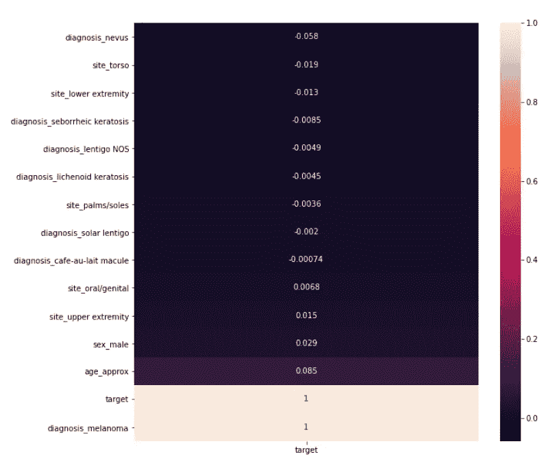

显示属性和目标之间相关性的热图

从上面的热图可以推断出以下几点:

*   **诊断 _ 黑色素瘤**与目标值直接相关。因此，如果一个人被诊断患有黑色素瘤，他就患有癌症，如果一个人没有被诊断患有黑色素瘤，他就没有癌症。
*   **年龄 _ 近似值、性别 _ 男性**和**部位 _ 上肢**与目标正相关。
*   **诊断痣、部位下肢**和**部位躯干**与目标呈负相关。

这也可以从下图中得到解释。

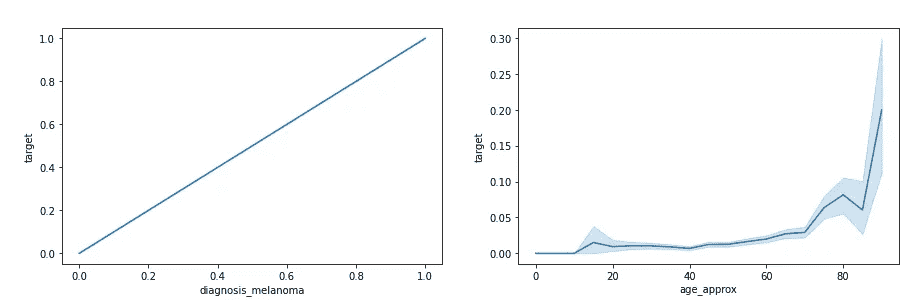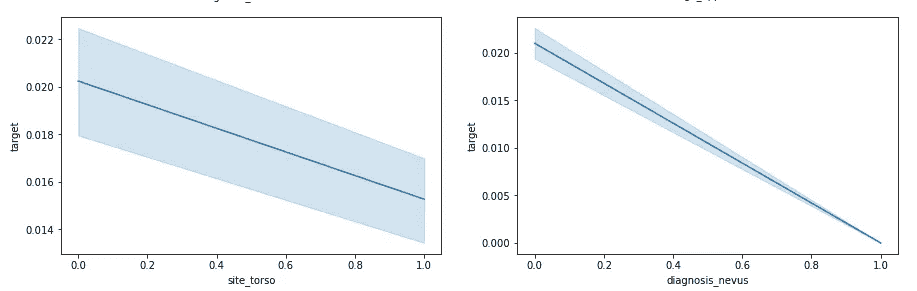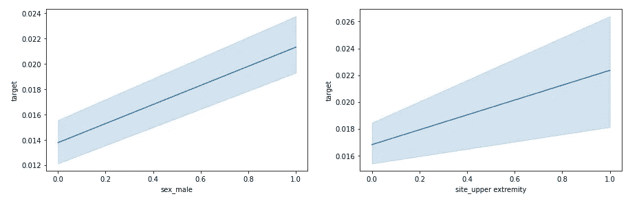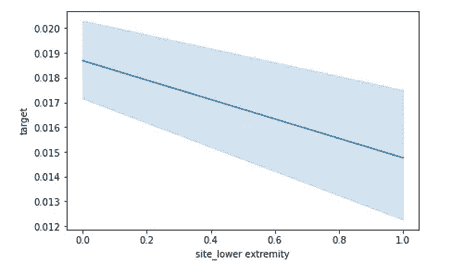

显示属性和目标之间相关性的图形

现在让我们训练我们的机器学习模型。我们将使用几种机器学习算法来训练我们的模型，然后测试它以查看准确性得分。

我们首先创建训练和测试数据集。

```
X = df[['diagnosis_melanoma','site_torso','diagnosis_nevus','site_lower extremity','site_upper extremity', 'sex_male', 'age_approx']]y = df['target']from sklearn.model_selection import train_test_split
X_train, X_test, y_train, y_test = train_test_split(X, y, test_size = 0.3, random_state = 1)
```

现在，我们需要应用分类算法，该算法采用这些属性并根据目标值训练模型。这可以通过使用上面使用的相同算法和程序来训练具有皮肤损伤图像的模型来完成。

在成功训练算法之后，我们获得以下准确度分数:

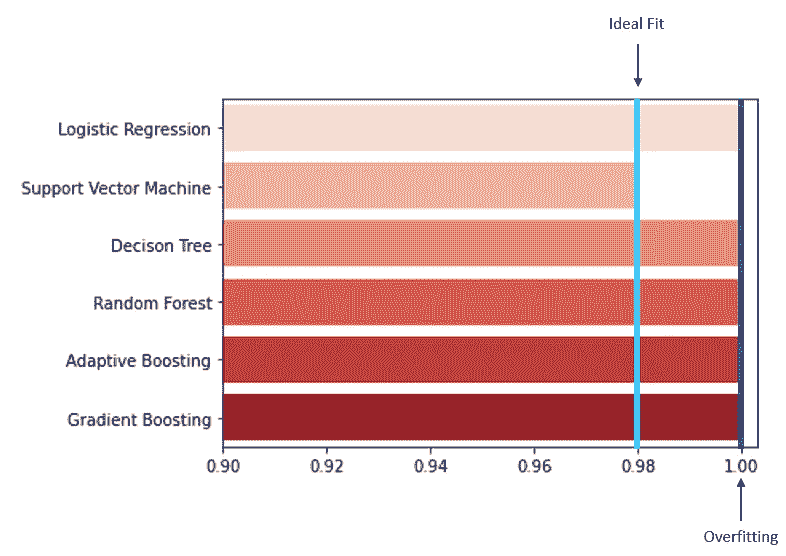

正如你所看到的，支持向量机算法没有过度拟合数据，并给出了 98%的准确率，我们选择它进行进一步处理。

我们选择了**逻辑回归**算法来从图像中预测癌症，我们选择了**支持向量机**来基于患者的医疗细节和诊断来预测癌症。

在我们的下一步也是最后一步，我们测试患者的全部记录，并检测他或她是否患有癌症。

患者记录如下:

image_name = ISIC_0149568

年龄 _ 大约= 55 岁

sex_male = 0

站点 _ 下肢= 0

site_torso = 0

场地 _ 上肢= 1

诊断 _ 黑色素瘤= 1

诊断 _ 痣= 0

```
image_path = '/kaggle/input/siim-isic-melanoma-classification/train/ISIC_0149568.dcm'
details = [[55,0,0,0,1,1,0]]
image_to_test = []
ds = dicom.dcmread(image_path)
pixels = ds.pixel_array
plt.imshow(pixels)
image_to_test.append(pixels.flatten())image_to_test = tf.keras.preprocessing.sequence.pad_sequences(
  image_to_test,
  maxlen = 720,
  dtype = "int32",
  padding = "pre",
  truncating = "pre",
  value = 0
)print(train2.predict(image_to_test))if train1.predict(details) == [1]:

    result1 = 'Malignant'
else:
    result1 = 'Benign'if train2.predict(image_to_test) == [1]:
    result2 = 'Malignant'
else:
    result2 = 'Benign'print('Result from patient details: ', result1)
print('Result from patient image: ', result2)
```

**图像路径**存储图像名称的路径

**详细信息**存储患者记录的详细信息

**训练 1** 是使用患者记录训练的模型。

**train2** 是使用患者皮肤病变图像训练的模型。

执行代码后，我们得到如下结果:

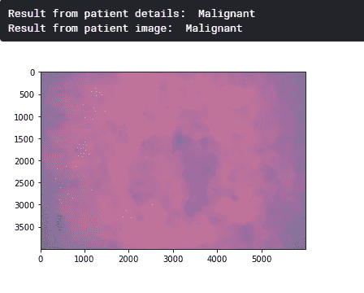

最终测试后的输出

正如你所看到的，算法正确地检测出病人患有癌症。因此，我们可以推断，机器学习算法可以有效地用于医疗保健和医疗领域。

[点击此处查看完整代码。](https://www.kaggle.com/sakshibutala/siim-isic-melanoma-classification)

如果你想知道如何使用神经网络而不是机器学习算法对图像进行分类[点击这里](/building-and-deploying-an-alphabet-recognition-system-7ab59654c676)。

## 参考

[](https://www.kaggle.com/c/siim-isic-melanoma-classification/overview) [## SIIM-国际标准工业分类黑素瘤分类

### 识别病变图像中的黑色素瘤

www.kaggle.com](https://www.kaggle.com/c/siim-isic-melanoma-classification/overview) [](https://www.mayoclinic.org/diseases-conditions/skin-cancer/symptoms-causes/syc-20377605) [## 皮肤癌——症状和原因

### 皮肤癌——皮肤细胞的异常生长——通常发生在暴露在阳光下的皮肤上。但是这种常见的形式…

www.mayoclinic.org](https://www.mayoclinic.org/diseases-conditions/skin-cancer/symptoms-causes/syc-20377605)