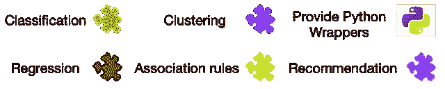
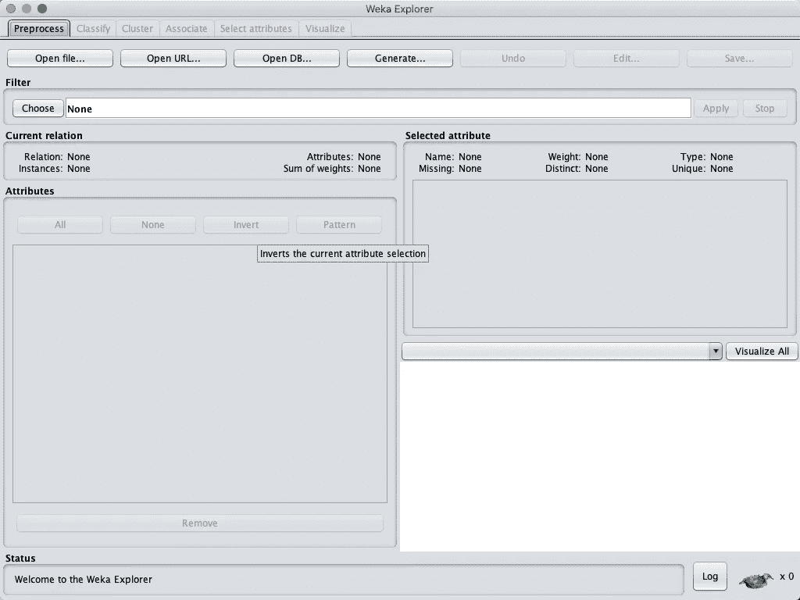

# Java 中的机器学习

> 原文：<https://towardsdatascience.com/machine-learning-in-java-e335b9d80c14?source=collection_archive---------2----------------------->

## 如何在 Java 中构建和部署 ML 模型？


迈克·肯尼利在 [Unsplash](https://unsplash.com/s/photos/java?utm_source=unsplash&utm_medium=referral&utm_content=creditCopyText) 上的照片

机器学习(ML)已经在学术界和工业界的不同领域获得了重大承诺。随着时间的推移，ML 在图像、语音识别、模式识别、优化、自然语言处理和推荐等众多应用领域的参与度不断提高。

> 给计算机编程以从经验中学习，最终将消除对这种细致编程工作的需求。阿瑟·塞缪尔 1959 年。

机器学习可以分为四种主要技术:回归、分类、聚类和强化学习。这些技术主要以两种形式解决不同性质的问题:监督学习和非监督学习。监督学习要求在训练模型之前对数据进行标记和准备。无监督学习可以方便地处理未标记的数据或具有未知特征的数据。本文不描述 ML 的概念，也不深入描述这个领域中使用的术语。如果你是全新的，请看看我以前的[文章](https://medium.com/@moh.alhamid/my-roadmap-to-machine-learning-80eeb292489)开始你的 ML 学习之旅。

# Java 中的机器学习库

这里是一个众所周知的用于 ML 的 Java 库的列表。我们将逐一描述它们，并给出使用其中一些框架的真实例子。

*   [Weka](https://www.cs.waikato.ac.nz/ml/weka/)
*   [阿帕奇看象人](https://mahout.apache.org)
*   [深度学习 4j](https://deeplearning4j.org)
*   [木槌](https://www.google.com/url?sa=t&rct=j&q=&esrc=s&source=web&cd=&cad=rja&uact=8&ved=2ahUKEwi1xbfVs8XrAhXMMd8KHZHoAmAQFjABegQICBAC&url=http%3A%2F%2Fmallet.cs.umass.edu%2F&usg=AOvVaw1PzoHpu0Ge5FT6p5vbGyKj)
*   火花 MLlib
*   [Encog 机器学习框架](https://www.heatonresearch.com/encog/)
*   [金属氧化物避雷器](https://moa.cms.waikato.ac.nz)

在每个库的旁边，下面的图标将指示每个框架中默认提供的算法的主要类别。



## 新西兰黑秧鸡



Weka GUI 工具包的截图。

Weka 是由新西兰怀卡托大学开发的开源图书馆。Weka 是用 Java 编写的，对于通用机器学习来说非常有名。Weka 提供了一种数据文件格式，称为 ARFF。ARFF 分为两部分:报头和实际数据。标题描述了属性及其数据类型。

## 阿帕奇看象人


Apache Mahout 提供了一个可扩展的机器学习库。Mahout 使用 MapReduce 范式，可用于分类、协作过滤和聚类。Mahout 利用 Apache Hadoop 处理多个并行任务。除了分类和聚类之外，Mahout 还提供了推荐算法，比如协作过滤，从而促进了快速构建模型的可伸缩性。

## 深度学习 4j


Deeplearning4j 是另一个专注于深度学习的 java 库。这是一个很棒的 Java 深度学习开源库。它也是用 Scala 和 Java 编写的，可以与 Hadoop 和 Spark 集成，提供高处理能力。当前的版本是测试版，但是有很好的文档和快速入门的例子([点击这里](https://deeplearning4j.org))。

## 木槌


Mallet 代表语言工具包的机器学习。它是少数几个用于自然语言处理的专门工具包之一。它提供了主题建模、文档分类、聚类和信息提取的能力。有了 Mallet，我们可以用 ML 模型来处理文本文档。

## 火花 MLlib


众所周知，Spark 可以提高处理大量数据的可伸缩性和整体性能。Spark MLlib 还拥有高性能算法，可在 Spark 上运行，并嵌入 Hadoop 工作流。

## Encog 机器学习框架


Encog 是一个用于 ML 的 Java 和 C#框架。Envog 有用于构建 SVM、神经网络、贝叶斯网络、HMM 和遗传算法的库。Encog 已经开始作为一个研究项目，并得到了近 1000 个关于谷歌学术的引用。

## 恐鸟


海量在线分析(MOA)提供了用于分类、回归、聚类和推荐的算法。它还提供了异常检测和漂移检测的库。它是为实时处理产生的数据流而设计的。

# Weka 示例:

我们将使用一个小型糖尿病数据集。我们将首先使用 Weka 加载数据:

```
import weka.core.Instances;
import weka.core.converters.ConverterUtils.DataSource;

public class Main {

    public static void main(String[] args) throws Exception {
        // Specifying the datasource
        DataSource dataSource = new DataSource("data.arff");
        // Loading the dataset
        Instances dataInstances = dataSource.getDataSet();
        // Displaying the number of instances
        *log*.info("The number of loaded instances is: " + dataInstances.numInstances());

        *log*.info("data:" + dataInstances.toString());
    }
}
```

数据集中有 768 个实例。我们来看看如何得到属性(特征)的数量，应该是 9。

```
*log*.info("The number of attributes in the dataset: " + dataInstances.numAttributes());
```

在构建任何模型之前，我们希望确定哪一列是目标列，并查看在该列中找到了多少个类:

```
// Identifying the label index
dataInstances.setClassIndex(dataInstances.numAttributes() - 1);
// Getting the number of 
*log*.info("The number of classes: " + dataInstances.numClasses());
```

加载数据集并确定目标属性后，现在是构建模型的时候了。我们来做一个简单的树分类器，J48。

```
// Creating a decision tree classifier
J48 treeClassifier = new J48();
treeClassifier.setOptions(new String[] { "-U" });
treeClassifier.buildClassifier(dataInstances);
```

在上面的三行中，我们指定了一个选项来指示一个未修剪的树，并为模型训练提供了数据实例。如果我们在训练后打印生成的模型的树结构，我们可以遵循模型如何在内部构建它的规则:

```
plas <= 127
|   mass <= 26.4
|   |   preg <= 7: tested_negative (117.0/1.0)
|   |   preg > 7
|   |   |   mass <= 0: tested_positive (2.0)
|   |   |   mass > 0: tested_negative (13.0)
|   mass > 26.4
|   |   age <= 28: tested_negative (180.0/22.0)
|   |   age > 28
|   |   |   plas <= 99: tested_negative (55.0/10.0)
|   |   |   plas > 99
|   |   |   |   pedi <= 0.56: tested_negative (84.0/34.0)
|   |   |   |   pedi > 0.56
|   |   |   |   |   preg <= 6
|   |   |   |   |   |   age <= 30: tested_positive (4.0)
|   |   |   |   |   |   age > 30
|   |   |   |   |   |   |   age <= 34: tested_negative (7.0/1.0)
|   |   |   |   |   |   |   age > 34
|   |   |   |   |   |   |   |   mass <= 33.1: tested_positive (6.0)
|   |   |   |   |   |   |   |   mass > 33.1: tested_negative (4.0/1.0)
|   |   |   |   |   preg > 6: tested_positive (13.0)
plas > 127
|   mass <= 29.9
|   |   plas <= 145: tested_negative (41.0/6.0)
|   |   plas > 145
|   |   |   age <= 25: tested_negative (4.0)
|   |   |   age > 25
|   |   |   |   age <= 61
|   |   |   |   |   mass <= 27.1: tested_positive (12.0/1.0)
|   |   |   |   |   mass > 27.1
|   |   |   |   |   |   pres <= 82
|   |   |   |   |   |   |   pedi <= 0.396: tested_positive (8.0/1.0)
|   |   |   |   |   |   |   pedi > 0.396: tested_negative (3.0)
|   |   |   |   |   |   pres > 82: tested_negative (4.0)
|   |   |   |   age > 61: tested_negative (4.0)
|   mass > 29.9
|   |   plas <= 157
|   |   |   pres <= 61: tested_positive (15.0/1.0)
|   |   |   pres > 61
|   |   |   |   age <= 30: tested_negative (40.0/13.0)
|   |   |   |   age > 30: tested_positive (60.0/17.0)
|   |   plas > 157: tested_positive (92.0/12.0)Number of Leaves  :  22Size of the tree :  43
```

# Deeplearning4j 示例:

此示例将构建一个卷积神经网络(CNN)模型来对 MNIST 图书馆进行分类。如果你不熟悉 MNIST 或者 CNN 是如何对手写数字进行分类的，我推荐你快速浏览一下我之前的帖子，它详细描述了这些方面。

像往常一样，我们将加载数据集并显示其大小。

```
DataSetIterator MNISTTrain = new MnistDataSetIterator(batchSize,true,seed);
DataSetIterator MNISTTest = new MnistDataSetIterator(batchSize,false,seed);
```

让我们仔细检查一下我们是否从数据集中获得了 10 个唯一的标签:

```
*log*.info("The number of total labels found in the training dataset " + MNISTTrain.totalOutcomes());
*log*.info("The number of total labels found in the test dataset " + MNISTTest.totalOutcomes());
```

接下来，让我们配置模型的架构。我们将使用两个卷积层加上一个输出扁平化层。Deeplearning4j 有几个选项可以用来初始化权重方案。

```
// Building the CNN model
MultiLayerConfiguration conf = new NeuralNetConfiguration.Builder()
        .seed(seed) // random seed
        .l2(0.0005) // regularization
        .weightInit(WeightInit.*XAVIER*) // initialization of the weight scheme
        .updater(new Adam(1e-3)) // Setting the optimization algorithm
        .list()
        .layer(new ConvolutionLayer.Builder(5, 5)
                //Setting the stride, the kernel size, and the activation function.
                .nIn(nChannels)
                .stride(1,1)
                .nOut(20)
                .activation(Activation.*IDENTITY*)
                .build())
        .layer(new SubsamplingLayer.Builder(PoolingType.*MAX*) // downsampling the convolution
                .kernelSize(2,2)
                .stride(2,2)
                .build())
        .layer(new ConvolutionLayer.Builder(5, 5)
                // Setting the stride, kernel size, and the activation function.
                .stride(1,1)
                .nOut(50)
                .activation(Activation.*IDENTITY*)
                .build())
        .layer(new SubsamplingLayer.Builder(PoolingType.*MAX*) // downsampling the convolution
                .kernelSize(2,2)
                .stride(2,2)
                .build())
        .layer(new DenseLayer.Builder().activation(Activation.*RELU*)
                .nOut(500).build())
        .layer(new OutputLayer.Builder(LossFunctions.LossFunction.*NEGATIVELOGLIKELIHOOD*)
                .nOut(outputNum)
                .activation(Activation.*SOFTMAX*)
                .build())
        // the final output layer is 28x28 with a depth of 1.
        .setInputType(InputType.*convolutionalFlat*(28,28,1))
        .build();
```

架构设置好之后，我们需要初始化模式，设置训练数据集，触发模型训练。

```
MultiLayerNetwork model = new MultiLayerNetwork(conf);
// initialize the model weights.
model.init();

*log*.info("Step2: start training the model");
//Setting a listener every 10 iterations and evaluate on test set on every epoch
model.setListeners(new ScoreIterationListener(10), new EvaluativeListener(MNISTTest, 1, InvocationType.*EPOCH_END*));
// Training the model
model.fit(MNISTTrain, nEpochs);
```

在训练期间，分数收听者将提供分类准确度的混淆矩阵。让我们看看十次训练后的准确度:

```
=========================Confusion Matrix=========================
    0    1    2    3    4    5    6    7    8    9
---------------------------------------------------
  977    0    0    0    0    0    1    1    1    0 | 0 = 0
    0 1131    0    1    0    1    2    0    0    0 | 1 = 1
    1    2 1019    3    0    0    0    3    4    0 | 2 = 2
    0    0    1 1004    0    1    0    1    3    0 | 3 = 3
    0    0    0    0  977    0    2    0    1    2 | 4 = 4
    1    0    0    9    0  879    1    0    1    1 | 5 = 5
    4    2    0    0    1    1  949    0    1    0 | 6 = 6
    0    4    2    1    1    0    0 1018    1    1 | 7 = 7
    2    0    3    1    0    1    1    2  962    2 | 8 = 8
    0    2    0    2   11    2    0    3    2  987 | 9 = 9
```

# 木槌示例:

如前所述，Mallet 是一个强大的自然语言建模工具包。我们将使用 Mallet 包中的工具 David Blei 提供的样本语料库。Mallet 有一个专门的库，用于为分类标注文本标记。在我们加载数据集之前，Mallet 有管道定义的概念，您定义管道，然后提供要通过的数据集。

```
ArrayList<Pipe> pipeList = new ArrayList<Pipe>();
```

管道被定义为一个“数组列表”，它包含了我们在构建主题模型之前通常要做的步骤。文档中的每个文本都将通过以下步骤:

1.  小写关键字
2.  标记文本
3.  删除停用词
4.  映射到要素

```
pipeList.add( new CharSequenceLowercase() );
pipeList.add( new CharSequence2TokenSequence(Pattern.*compile*("\\p{L}[\\p{L}\\p{P}]+\\p{L}")) );
// Setting the dictionary of the stop words
URL stopWordsFile = getClass().getClassLoader().getResource("stoplists/en.txt");
pipeList.add( new TokenSequenceRemoveStopwords(new File(stopWordsFile.toURI()), "UTF-8", false, false, false) );

pipeList.add( new TokenSequence2FeatureSequence() );
```

一旦定义了管道，我们将传递代表每个文档原始文本的实例。

```
InstanceList instances = new InstanceList (new SerialPipes(pipeList));
```

现在到了传递输入文件来填充实例列表的步骤。

```
URL inputFileURL = getClass().getClassLoader().getResource(inputFile);
Reader fileReader = new InputStreamReader(new FileInputStream(new File(inputFileURL.toURI())), "UTF-8");
instances.addThruPipe(new CsvIterator (fileReader, Pattern.*compile*("^(\\S*)[\\s,]*(\\S*)[\\s,]*(.*)$"),
        3, 2, 1)); // data, label, name fields
```

从最后一个命令行中，您可以注意到我们提供了关于 CSV 文件如何构造的说明。资源文件夹中的源文件大约有 2000 行。每行代表一个原始文档文本，由逗号分隔的三个属性组成(名称、标签和文档内容)。我们可以使用以下命令打印在输入文档中找到的实例数量:

```
*log*.info("The number of instances found in the input file is: " + instances.size());
```

现在，让我们为文档的主题建模。假设我们在 2k 文档中有 100 个不同的主题。Mallet 使我们能够设置两个变量:alpha 和 beta 权重。Alpha 控制主题词分布的集中程度，beta 表示主题词分布上的前词权重。

```
 int numTopics = 100;// defining the model 
ParallelTopicModel model = new ParallelTopicModel(numTopics, 1.0, 0.01);
// adding the instances to the model
model.addInstances(instances);
```

我们在这个例子中选择的模型是 LDA(潜在狄利克雷分配)的实现。该算法使用一组观察到的关键词相似度来分类文档。

我喜欢 Mallet 的一点是它的 API 功能可以很容易地设计并行处理。在这里，我们可以为每个子样本定义多线程处理。

```
model.setNumThreads(2);
```

我们现在只剩下两件事，定义模型训练的迭代次数，并开始训练。

```
model.setNumIterations(50);
model.estimate();
```

关于如何在 github 上的完整示例中显示主题建模结果，我留下了更多的细节。

# 进一步阅读

*   **【书】:**[botjan kalu la 著，O'Reilly 出版的 Java 中的机器学习](https://www.oreilly.com/library/view/machine-learning-in/9781784396589/)。
*   **【书籍】:**机器学习:Java 开发者端到端指南，作者:Richard M. Reese，Jennifer L. Reese，Bostjan Kaluza，Uday Kamath 博士，Krishna Choppella。
*   **【教程】** [Spark MLlib 示例。](http://spark.apache.org/examples.html)
*   **【教程】** [用木槌进行机器学习。](http://mallet.cs.umass.edu/mallet-tutorial.pdf)

***本帖中提供的所有例子都可以在***[***my Github***](https://github.com/malhamid/ml_in_java)***reprasority 上找到。***