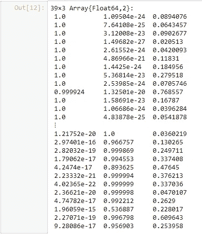
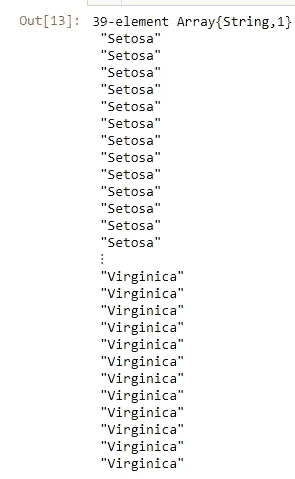

# 朱莉娅的机器学习

> 原文：<https://towardsdatascience.com/machine-learning-in-julia-5bca700e0348?source=collection_archive---------2----------------------->

## Julia 中机器学习入门的完整指南

由[凯文·Ku](https://unsplash.com/@ikukevk?utm_source=unsplash&utm_medium=referral&utm_content=creditCopyText)在 [Unsplash](https://unsplash.com/s/photos/machine-learning?utm_source=unsplash&utm_medium=referral&utm_content=creditCopyText) 上拍摄的照片

# 朱莉娅是什么？

Julia 是一种相对较新的编程语言，它在机器学习领域越来越受欢迎。随着它变得越来越受欢迎，我想写这篇文章来深入概述为什么以及如何在 Julia 中开始机器学习。

由茱莉亚项目—[https://julialang.org](https://julialang.org)，公共领域，[https://commons.wikimedia.org/w/index.php?curid=87405047](https://commons.wikimedia.org/w/index.php?curid=87405047)

# 为什么要用 Julia 做机器学习？

## 速度和编译

Julia 相对于其他机器学习语言的主要优势是速度。Julia 的速度优势有两个主要原因，首先，它是一种编译语言。其次，它是为并行性而设计的。

## 类似脚本的语法

尽管有速度优势，但 Julia 的语法并不是很复杂。它感觉更像一种脚本语言，从 Python 或 R 背景转换到 Julia 相对容易。

## 社区、开发和图书馆

朱莉娅越来越受欢迎，也越来越成熟。随着这种增长，社区也在增长。尽管仍然远远小于 Python 社区，但看到社区和可用库数量的增长是一个好迹象。

## 在 Jupyter 笔记本上运行 Julia

Julia 的另一个优点是，它可以在 Jupyter 笔记本上运行。而且非常容易安装！以下是将 Julia 安装到 Jupyter 笔记本的方法:

1.  从他们的网站下载并安装 Julia
2.  打开 Julia 命令行
3.  运行命令`using Pkg`
4.  运行命令`Pkg.add("IJulia")`
5.  启动一个 Jupiter 笔记本，你可以在笔记本的右上角选择 Julia(参见图片)

# Julia 中虹膜数据集的数据准备

在进入真正的机器学习部分之前，需要把数据导入并准备好。这里我将只介绍三个基本步骤:导入一个 csv 文件，对一个分类变量进行热编码，以及进行训练测试分割。

## 数据准备 1 —在 Julia 中导入 CSV 文件

在 Julia 中入门的第一步是导入数据。在这种情况下，我们使用一个包含虹膜数据的 csv 文件。要将 csv 文件作为数据框导入，您需要添加如下所示的“CSV”和“DataFrames”库。然后，您使用“CSV。File”函数读取 csv 文件，DataFrame 函数将其转换为数据帧。

## 数据准备 2-一个热编码因变量(品种)

对于某些模型，您将需要一个分类变量的热编码。为此，您可以使用“车床”库。它具有 OneHotEncode 函数，可将数据帧转换为 OneHotEncode 数据帧。之后，您可以使用“选择”功能删除原始列。

## 数据准备 3-列车测试分离

对于模型评估，您将需要一个训练测试分割。下面的代码使用库“Random”来实现这一点。基本上，它会选择一个随机的索引子集，并将它们视为训练集，而未选择的索引将作为测试集:

# 朱莉娅的机器学习

Julia 中用于机器学习的资源仍然相对分布在不同的包中。Julia 还不像其他机器学习编程语言那样受欢迎，有时要找到特定的模型可能需要一些工作。寻找(或编写)在 Python 和 r 中容易获得的某些基本数据准备函数也可能需要更多的努力。

好消息是，有人倡议在更大的图书馆中重组机器学习模型。在这一点上，有两个库正在激烈竞争成为 Julia 的首选机器学习库:MLJ 和 Scikit Learn。

这两项倡议是伟大的，但它们尚未完全完成。因此，对于某些模型，它们只是向其他更小的机器学习库提供包装器。正因为如此，我发现涵盖其中两个较小的库也很重要:用于广义线性模型的“GLM”和用于许多基于树的模型的“决策树”。我将从较小的库开始，以较大的项目结束。

# **Julia 使用 GLM 图书馆的逻辑回归**

以下示例使用 GLM 库对 Iris 数据拟合三个逻辑回归模型。GLM 使用“公式”接口，这在面向统计的库中很常见。我们可以指定一个族(在这种情况下为二项式)和一个链接类型(在这种情况下为 Logit 链接),以便创建所需的 GLM 类型。这是在下面代码片段的第一部分完成的。

在该片段的最后，三个模型的预测水平连接，以便为一对所有多类分类的应用做准备。

以下是打印出来的串联预测概率(这是“preds”变量中的内容):

在下面的代码片段中，我们将每行的三个预测概率转换为每行一个类别预测。该决定基于三个预测概率中的每一个之间的最高预测概率:

这是重新分类的“preds_cat”数组的外观:

作为最后一步，下面是如何使用一个简短的 for-loop 来计算我们在测试集上的 GLM 预测的准确性:

# Julia 中的决策树使用 DecisionTree.jl 库

在下面的代码片段中，您将看到如何在 Julia 中构建决策树。首先，它重新导入 Iris 数据，因为决策树支持使用分类变量。如介绍中所述，这是使用 Julia 的一个优势。

然后，该模型被创建为决策树分类器的实例。我们可以给出几个超参数，例如本例中使用的 max_depth。感叹号的 fit 语法非常特殊。

最后两步是使用 predict 函数对测试集进行预测，并计算准确性，与前面的模型一样。

# Julia 中的随机森林使用 DecisionTree.jl 库

正如您将看到的，随机森林模型的应用方式几乎与决策树相同。一开始可能会比较混乱，但是随机森林模型也是决策树库的一部分！

# Julia 中机器学习的主要包

现在我们已经看到了如何在 Julia 中使用两个很大但很小的库来进行机器学习，让我们来看看更大的库。如前所述，有两个主要的软件包在竞争成为 Julia 的首选 ML 库:Scikit Learn 和 MLJ。我们去查查他们俩。

## Julia 中用于机器学习 Scikit Learn

很多人都知道 Scikit 是从 Python 中学习的。它是 Python 中用于机器学习的*包，在 Julia 中拥有它也很棒。如果我们能使用和 Python 一样的语法，那就简单多了！*

让我们看一个在 Julia 中学习 Scikit 的例子。这个代码片段从导入 Scikit 学习库开始。下一步是加载您想要使用的模型(在这种情况下是逻辑回归)。使用“适合！”语法(注意感叹号)，模型训练好了。

之后，使用预测函数用训练好的模型预测测试集。最后，计算精度。

在 Julia 中使用 Scikit Learn 也有它的缺点。例如，我们可以在 Julia 中使用的 Scikit Learn 库的很大一部分实际上只是 Python 的包装。除了一些已经在 Julia 中实现的模型，Julia 模型实际上使用 Pycall 来调用 Python 代码。

但是，如果我们想换成朱丽亚，应该是为了拥有朱丽亚的好处。Julia 的一个主要优势是相对于 Python 的速度优势，调用 Python 代码真的不是我们应该在这里做的。如果只是一个 Python 包装器，我们还不如直接用 Python 学习 Scikit。

另一个缺点是 Scikit Learn 中的 Python 模型不支持分类变量。除了对它们进行编码之外，在 Scikit Learn 中真的没有什么可以做的，这确实是一个缺点(特别是对于基于树的模型)。正如您在整个例子中看到的，Julia 允许我们将分类变量视为一个变量，而不是一组热编码的虚拟变量。所以当我们把 Julia 仅仅作为 Python 包装器时，Julia 的优势也将消失。

## 茱莉亚的机器学习 MLJ

Julia 中机器学习的一个竞争对手是 MLJ 包。它承诺解决分类变量的问题，它是纯粹的-朱莉娅。这使得探索变得非常有趣。它还得到了艾伦图灵基金会的大力支持，这让我相信这个图书馆会一直存在下去。

现在，让我们在下面的代码片段中看看机器学习中 MLJ 的例子。有几件事和平常不一样。特别是，创建机器是一种语法选择，对许多人来说是新的。更不寻常的是必须加载一个模型，而不是导入一个包。

但是在这些语法差异之后，MLJ 库的使用并没有本质上的不同。MLJ 语法很容易学习，在 MLJ 的文档网站上有很好的文档。

# 结论

在这篇文章中，我们看到了 Julia 中的四个机器学习库。其中两个库(MLJ 和 Scikit Learn)似乎是接管 Julia 机器学习领域的真正竞争对手。

Scikit Learn 拥有 Python 实现中熟悉的语法的巨大优势，并获得了社区的信任。另一方面，Scikit Learn 通常只是简单地调用 Python 代码，这首先就剥夺了使用 Julia 的大部分优势。

作为一个真正的朱莉娅项目，MLJ 有很大的优势。它的语法有点新，但是差别似乎很小。对 MLJ 来说，真正的挑战是赢得更大社区的信任和欢迎。

我希望这篇文章已经给了你开始使用 Julia 所需要的一切，我祝你好运！