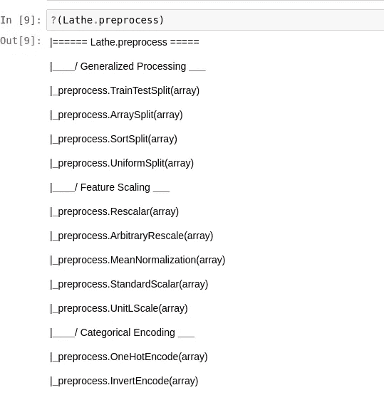
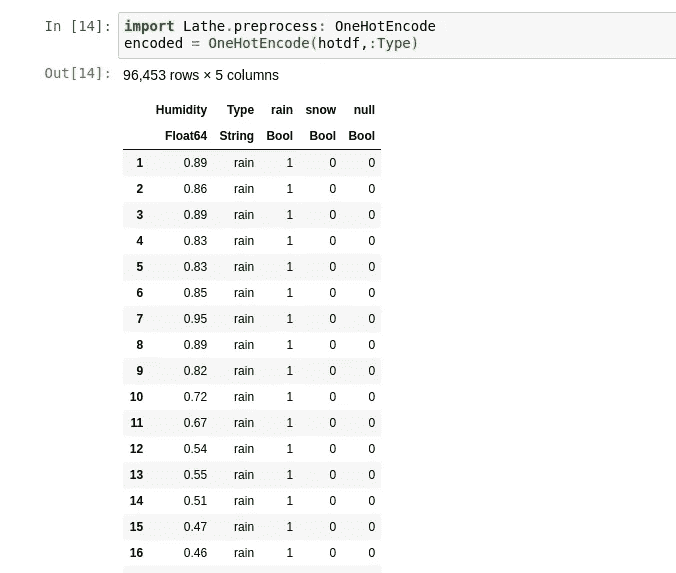
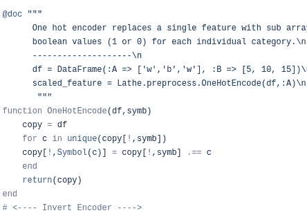
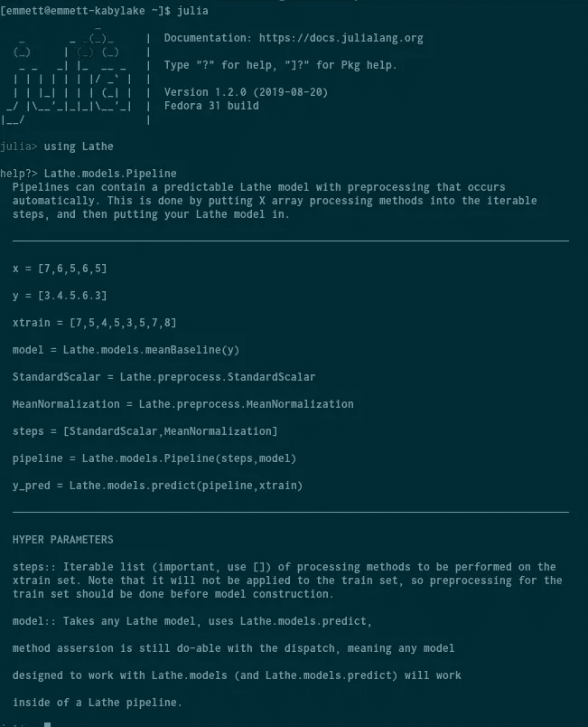

# 朱莉娅的机器学习终于有所进步

> 原文：<https://towardsdatascience.com/machine-learning-in-julia-is-finally-getting-better-ab5cac68015b?source=collection_archive---------14----------------------->

## 最近的软件包开发使数据处理变得切实可行。


(src = julia-lang.org)

自从我第一次开始使用 Julia，我和其他许多来自 Python 和 R 等具有强大生态系统的语言的叛逃者都有一个问题，那就是数据处理。在 Julia 中，数据处理似乎被忽视了，通常用单独的包来解决一个问题，而有些问题则被完全忽略了。有时已经有可用的函数，但是它们非常难以使用，要求您在通过任何预处理算法之前断言类型并转换数据。由于这个原因，不仅训练一个模型很困难，而且将一个模型放入一个管道并部署它也是完全不可能的。

然而，随着 Julia 开发人员所取得的超前和令人兴奋的进步，预处理已经比我原先想象的可能发展得更远。因此，Julia 已经成为机器学习的一个更可行的选择。随着对 Genie 及其相应文档的大量添加，部署 API 已经成为一种

> 蛋糕漫步。

Genie 为您管理所有的虚拟环境，现在文档已经发布，并由出色的开发人员 Essenciary (Adrian Salceanu)不断改进，使 Julia 更适合作为日常 web 框架使用。


(src = http://genieframework.com)

# PyCall

这可能令人惊讶，但 Julia 目前面临的最大挑战之一是 PyCall.jl。这是因为就其现状而言，太多的包依赖于它，反过来又依赖于 Python。虽然我完全理解，Python 的生态系统要比 Julia 的生态系统大得多，但反过来，Julia 失去了所有获得的速度，使用 PyCall 甚至比使用 Python 本身还慢，

> 那为什么还要用朱莉娅呢？

# 训练-测试-拆分

训练-测试-分割是一个基本的工具，对于机器学习的任何延伸都是完全需要的。为了验证一个算法，你必须首先有一个训练集和一个测试集，有些人甚至选择了一个验证集。参考这个线程，

[](https://discourse.julialang.org/t/simple-tool-for-train-test-split/473) [## 用于训练测试拆分简单工具

### 我暗暗希望这个问题至少在一周内不要出现，直到我找到时间写文档…

discourse.julialang.org](https://discourse.julialang.org/t/simple-tool-for-train-test-split/473) 

关于 Julia 的论述，我认为很明显，数据帧的测试序列分割在某种程度上被忽略了。MLDataUtils 可能是大多数人用于训练-测试-分割的包，相信我的话:

> 它当然可以更好。

幸运的是，几个月来，已经有更好的从模块车床。

```
using Lathe.preprocess: TrainTestSplit
train, test = TrainTestSplit(df)
```

我们甚至可以调整我们的分割百分比，就像这样:

```
train, test = TrainTestSplit(df,0.5)
```

这将为我们的测试和训练集把数据分成两半。

# 特征缩放

我认为在 Julia 模块中最常见的是 SkLearn 形式。我不认为我们应该从一个完全独立的语言中，在一个完全独立的范例中，接受或强制这种构造。一个很好的例子是 Julia 中的特征标量。大多数(如果不是全部)特征标量符合 SkLearn 的写作风格，该风格自 2010 年以来一直定义 Python 机器学习模块。但是 SkLearn 的标量如此表现的原因只有一个，那就是 SkLearn 的奇妙管道。

在 Julia 中，我们没有类，反过来我们也不能让方法成为一个对象的子对象。取而代之的是，我们有一些结构，它们可以采用一个方法来对该结构保存的数据执行一个操作。此外，Julia 必须提供的唯一管道是语法管道——这很好，但肯定消除了与 SkLearn 一致的点，因为它们不使用相同的方法。为了正确理解这一点，以下是标准标量(Z 分数规格化器)的公式:


有了这样一个简单的公式，fit 只需要计算样本均值和标准差。以 Julia 的速度，这些计算当然可以在微秒内完成，就像在 Python 中一样。无论如何，这都不是一个困难的计算，只需一个简洁的 for 循环和另外两行代码就可以完成。幸运的是，车床用一种简单的方法再次罢工，采取任何数组:

```
using Lathe.preprocess: StandardScalar
scaledX = StandardScalar(trainX)
```

> 很简单，对吧？

除了标准标量之外，Lathe 还附带了大量其他标量，将来还计划实现一个单位长度标量。到目前为止，用？()方法将显示所有可用的标量:



*   重新标度
*   任意重新标度
*   均值归一化

# 分类编码器

分类编码器是 Julia 生态系统中另一个极度缺乏的领域。只有一个编码器可用，通常通过 Flux 使用，称为 one hot 编码器。为了让你了解复杂的 Flux 的 one hot encoder 有多无聊，你可以看看这里的源代码:

[](https://github.com/FluxML/Flux.jl/blob/master/src/onehot.jl) [## FluxML/Flux.jl

### 放松点。Flux 是不会让你 tensor - FluxML/Flux.jl 的 ML 库

github.com](https://github.com/FluxML/Flux.jl/blob/master/src/onehot.jl) 

该文件中的代码总共有 130 行，在我看来，这个大小根本没有必要。要使用车床的 one hot 编码器，我们只需调用方法“OneHotEncode”:

```
using Lathe.preprocess: OneHotEncode
encoded_df = OneHotEncode(df,:columnname)
```



下面是计算它的代码，总共只有 7 行:



# 管道

ipelines 对于 SkLearn 和机器学习整体来说是一个非常重要的特性。Julia 严重缺乏使用管道的真正好的库。Julia 中的大多数管道不采用构造模型，也不允许任何简单的序列化读写。然而，对于车床，实际上存在使用与车床模型的其余部分相同的预测函数的管道，并且允许一组可迭代的步骤以及用于预测的模型。如果你想阅读一个完整的，虽然过时的车床管道教程，你可以在这里查看:

[](/building-pipelines-with-lathe-0-0-7-unstable-in-julia-f7ba1850bde3) [## 在 Julia 中用车床 0.0.7 构建管道(不稳定)

### 数据科学的很大一部分是数据科学的一个子集，称为数据工程。数据工程(DE)包括…

towardsdatascience.com](/building-pipelines-with-lathe-0-0-7-unstable-in-julia-f7ba1850bde3) 

此外，对于有价值的文档，您可以简单地使用？()方法在车床.模型.管道上



# 结论

我相信很多 Julia 模块都有很多不尽人意的地方。一些不提供任何数据帧兼容性，而另一些通过使简单的算法变得过于复杂而制造了更多的问题。Julia 语言非常灵活，这不仅在笔记本中对我们有利，在模块中也是如此。我认为，正是因为这个原因，Julia 的生态系统让很多新人对这门语言望而却步，这让我很沮丧。事实是，就包而言，现在 Python 轻而易举地做得更好。我认为这很容易改变，展望未来，我对朱莉娅的生态系统，包括车床的未来感到非常兴奋！