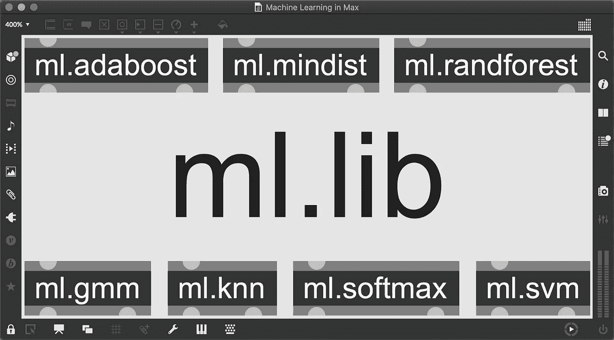
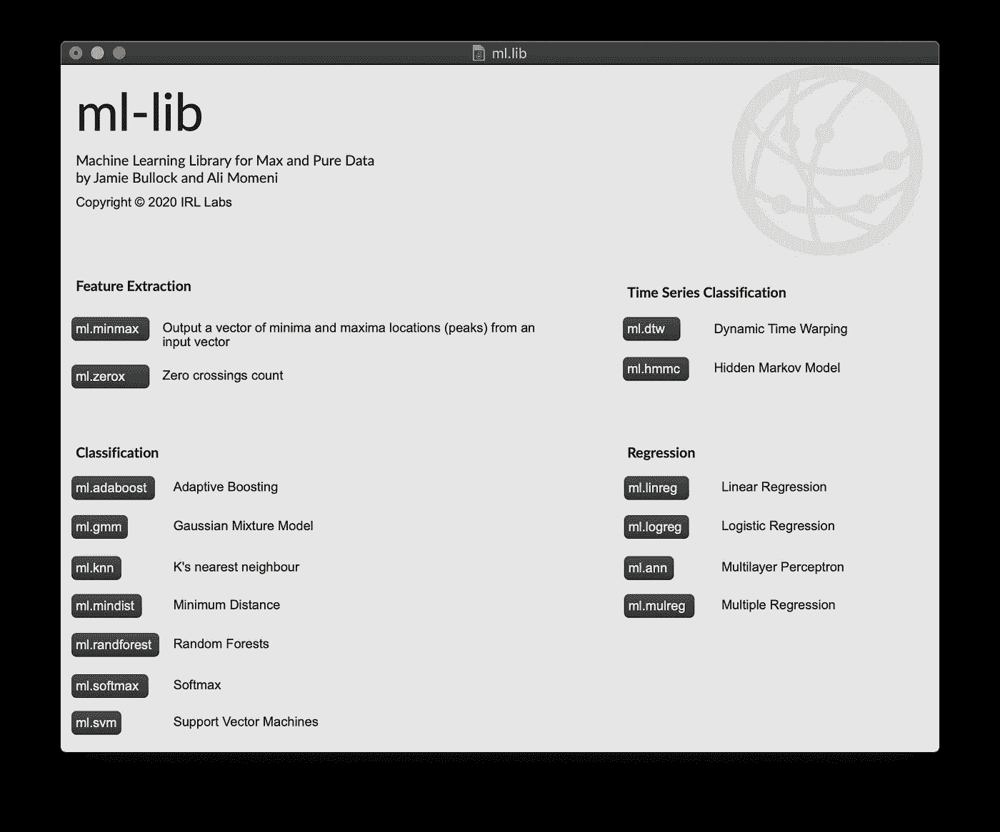
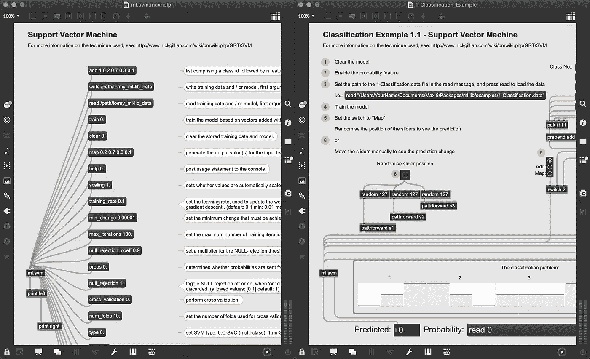
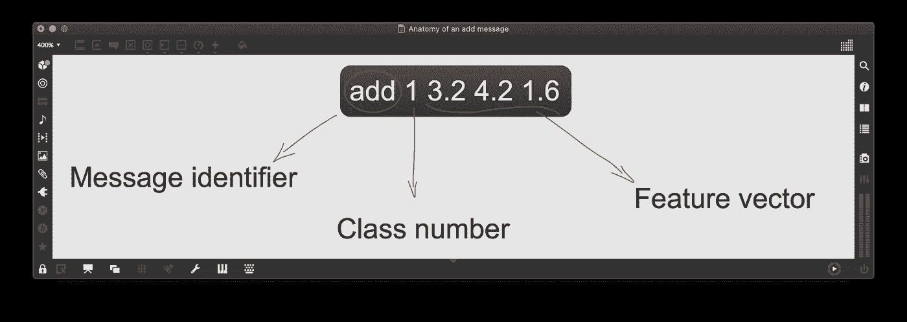
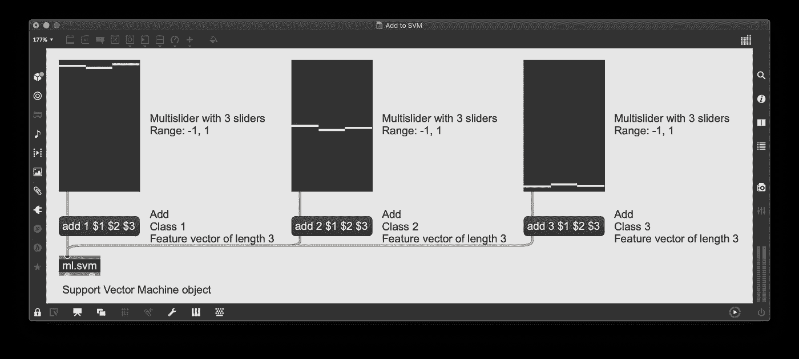
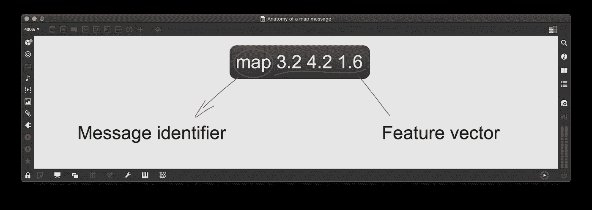
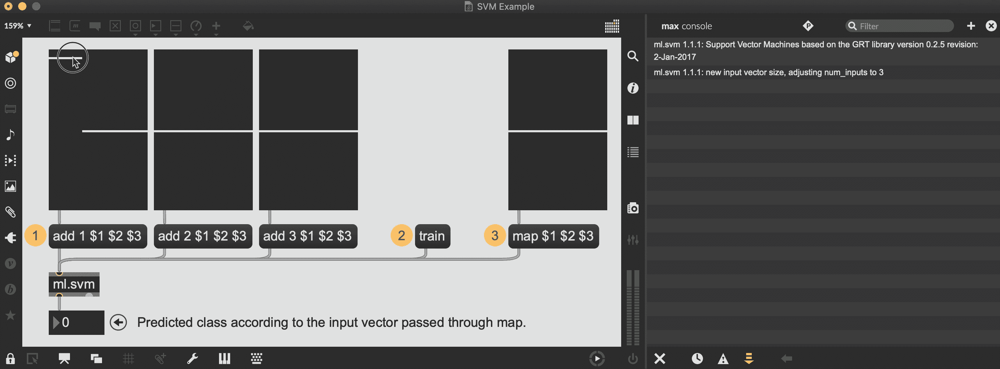

# Max 中的机器学习:分类

> 原文：<https://towardsdatascience.com/machine-learning-in-max-classification-fb8b2bdb3933?source=collection_archive---------54----------------------->

## 如何使用 ml.lib 包在 Max 中执行简单机器学习任务的分步指南。

机器学习已经成为一个热门话题有一段时间了，像“人工智能”、“神经网络”和“深度学习”这样的词在任何地方都被用来描述项目的前沿性质和系统的所谓的智能。这些词的误用并不能抹杀这样一个事实，即机器学习可以成为在我们的系统中实现的一个非常有趣和强大的工具。在这篇文章中，我将概述如何通过 ml.lib 包在 Max 环境中使用机器学习分类算法。我将使用这篇文章的循序渐进的性质来描述和探索机器学习和分析算法的一些基本方面，而不会太专业！最后，尽管本教程将使用 Max 和从 Max 包管理器中获得的 ml.lib 包，但在从 Deken 包管理器中安装 ml.lib 的纯数据上可以遵循相同的步骤。

# ml.lib

ml.lib 启动窗口:提供的所有类型的机器学习算法的概述。

ml.lib 或机器学习库是一个 Max 包，它在 Max 环境中提供了许多机器学习算法。所提供的算法属于不同的类别，即:特征提取、分类、回归和时间序列分类。在这篇文章中，我将把重点放在分类算法上，但是本文中包含的大部分知识也可以应用于大多数其他 ml.lib 对象。

# 分类

分类算法是称为*监督学习*的机器学习分支的一部分。监督学习与*无监督学习*的不同之处在于，它是基于基础事实的。换句话说，在监督学习算法中，我们使用带标签的数据集来训练我们的机器学习算法，给定数据样本和期望的输出，我们要求算法近似输入和输出之间的关系( [David Soni](https://towardsdatascience.com/@devins) 有一篇[很棒的文章](/supervised-vs-unsupervised-learning-14f68e32ea8d)详细介绍了监督学习和非监督学习之间的差异，如果你对这个主题感兴趣，应该去看看)。这些算法可能是最容易理解和使用的，这就是为什么我们要把它们作为我们机器学习之旅的起点。

ml.lib 为我们提供了 7 种不同的分类算法，每种算法都有自己的优缺点。然而，在本文中，我们将只关注 ml.svm 的使用，原因有二:

*   支持向量机(SVM)算法是一个标准的和众所周知的算法，学习它的优点和缺点可能在其他环境中派上用场。
*   由于 ml.lib 的工作方式，所有分类算法都以完全相同的方式工作，并接受相同的数据。因此，通过学习如何使用一个，我们不仅能够使用它们，而且一旦我们创建了模型，我们还能够交换对象，以查看一个是否比另一个执行得更好。

事不宜迟，我们走吧。

# 入门指南

ml.svm.maxhelp 文件概述以及 ml.lib 附带的分类示例。

虽然 ml.lib 附带了一些帮助文件和一组示例，但是密集的补丁可能会吓到您。因此，本教程将从头开始，一步一步地构建一个最小的示例。

## 添加、训练、地图

除了时序分类对象，几乎所有的 ml.lib 对象都遵循相同的三个原则:添加、训练、映射。这些对象要求用户(1)添加一些数据，然后用作(2)训练数据，以便能够(3)将新的输入数据映射到预测的输出。

## 增加

正如我们之前在简介中提到的，ml.svm 是一种分类算法，属于监督学习类别。这意味着对象将期望添加的数据被标记。让我们看看这在 Max 中是什么样子的。

携带属于类别 1 的大小为 3 的特征向量的 add 消息的剖析。

需要传递给 ml 对象的 add 消息需要包含三个元素:

1.  附加字，指定了我们要传递的信息的种类，
2.  类别号，也就是我们给被传递数据的标签，
3.  我们希望机器学习对象将其作为输入并在训练阶段使用以从数据中学习的特征向量或特征列表。

就是这样，这是为了将你的数据添加到 ml 对象中你唯一需要知道的事情。然而，考虑到解释的抽象性，让我们看一个实际的例子，看看这些概念是如何在补丁中转移的。

一个简单的 3 类场景的展示:3 个多滑块设置在 3 个不同的位置，三个 add 消息携带滑块的值，并分别将它们分配给类 1、2 和 3，并全部输入 ml.svm 对象。

在这个实际例子中，我们可以看到*几乎*什么都没有改变。我们向 svm 对象提供 3 条添加消息，每条消息都有不同的类。这些添加消息包含长度为 3 的特征向量，该向量表示与其连接的滑块的 3 个值。在类 1 中，所有滑块都接近其最大值，在类 2 中，它们被放置在 0 值附近，在类 3 中，它们都接近其最小值。这个小例子设置了一个场景，我们的 ml 对象将能够识别三个滑块的位置。

## 火车

现在我们已经将数据添加到 ml 对象中，我们需要训练它。训练是为 ml 对象(在我们的例子中是 ml.svm)提供学习和生成模型所需的数据的行为。模型是作为训练过程的结果而产生的人工制品，并且将负责输入数据的预测。

考虑到我们已经在“添加”阶段添加了数据，我们只需要训练模型。为此，向模型传递一条带有“train”一词的消息，等待一段时间(取决于添加的数据量)然后*瞧！你的模特已经训练好了，准备好了。*

## 地图

现在我们的模型已经准备好了，我们可以通过使用“map”消息来测试它。

携带大小为 3 的特征向量的地图消息的剖析。

map 消息的结构类似于没有类别号的 add 消息。这是因为该类将是 ml 对象在接收到一些输入数据后所要预测的对象。因此，在添加和训练了具有长度为 3 的特征向量的 ml 对象之后，通过 map 消息作为输入传递的任何长度为 3 的特征向量都将被分析，并且类别将被预测。让我们使用上面的滑块例子来看看这在实践中是如何工作的。

# 把所有的放在一起

从开始到结束:添加，训练和映射和 ml.svm 对象。

从上面的 gif 可以看出，这三个步骤正是本文所概述的:添加、训练、映射。一旦创建了模型，通过地图消息输入到 ml 对象中的 3 个滑块的任何位置都将被分析，并且预测的类将被输出。

与简单的查找表不同，这将使您能够预测原始添加数据中没有的滑块位置的类别。如果滑块没有对齐怎么办？机器学习算法将近似并提供给你一个类别预测。

虽然这不一定是最令人印象深刻的机器学习示例，但它展示了 Max 用户在他们的补丁中实现机器学习算法是多么容易。

# 最后一点

考虑到这个复杂的主题，试图让本教程尽可能简单是一个艰难的挑战。出于这个原因，我有目的地在文章的结尾留下了一些次要但重要的东西，以便感兴趣的读者能够获得开始玩机器学习所需的所有信息。

# 使您的模型更加健壮

正如你在最终的 gif 中所看到的，我为每一个类提供了带有许多稍微不同的滑块位置的添加消息。我可以简单地将第一类的所有滑块设置为最大，将第二类的所有滑块设置为中间，将第三类的所有滑块设置为最小，但是我决定提供数据中有一点“噪声”的多个示例。我们不需要深入 ml 概念来理解:

*我们提供给 ml 对象的数据越少，生成的模型就越难正确预测类。*

出于这个原因，提供多个彼此稍有不同的类的例子总是好的，允许 ml 对象从同一个类的多个实例中学习。然而，注意不要给你的 ml 对象太多的数据，因为这可能导致无限的训练时间和糟糕的结果。关键是提供大量的好数据。

# 清除、写入和读取

有一些重要的信息值得一提，尽管它们没有出现在文章的主要部分。清除允许您清除模型中的数据。无论你是搞砸了一条添加信息，还是只想重新开始，这都是你想要记住的信息。

相反，写和读允许您保存和加载您创建的数据和模型。保存和加载数据将使您避免将所有的类重新添加到 ml 对象中，但是更重要的是，保存预先训练的模型将使您避免训练阶段。这对于需要一段时间训练的大型数据集非常有用。

# 把一个模型换成另一个

正如本文开头提到的，ml.lib 捆绑的所有分类算法都以完全相同的方式工作。这意味着，如果您最初选择的算法没有您想象的那么好，您可以保存您已经添加的数据，并将其替换为同一类别中的任何其他算法(即任何其他分类算法)。一旦新算法到位，你需要做的就是读取之前保存的数据，重新训练模型。

# 最后但同样重要的是…

如果您想要复制上面显示的示例 patch，请记住从“检查器”标签中启用您的多滑块上的“鼠标移动时连续数据输出”。

修补愉快！