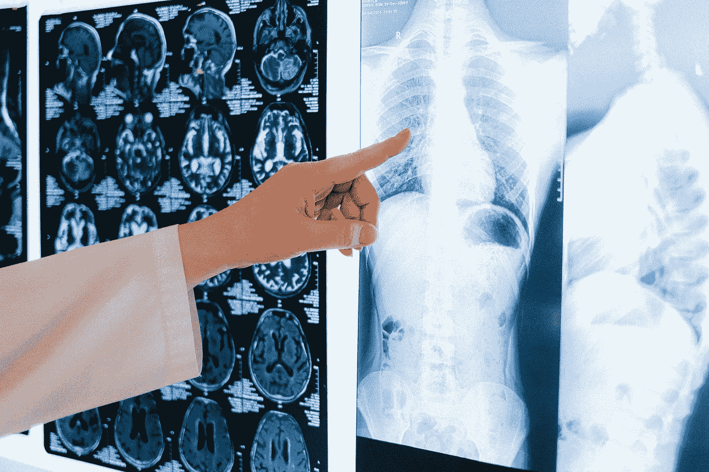
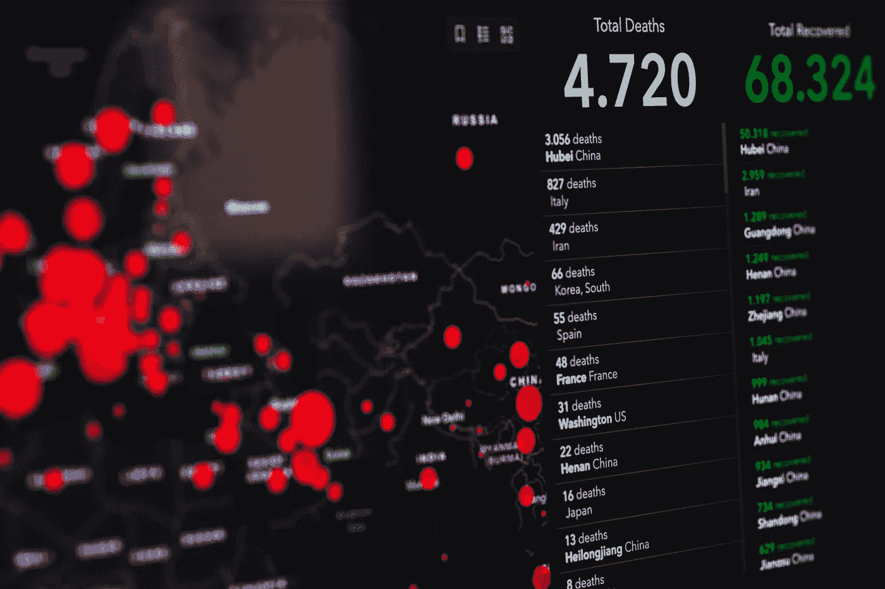

# 医学中的机器学习:学会信任

> 原文：<https://towardsdatascience.com/machine-learning-in-medicine-learning-to-trust-dba42e883b71?source=collection_archive---------67----------------------->

Pexels

机器学习正迅速在[医疗保健行业](https://lionbridge.ai/industries/medical-datasets/)的许多方面发挥主导作用，从诊断到治疗，甚至是人口层面的流行病学。直到最近，医学还是由自学和经验推动的。然而，随着数据库规模的增长和人工智能实施变得更加强大，在医学和医疗保健领域应用机器学习的好处正变得越来越为人所知。

医疗管道的几乎每个方面都受到了 ML 平台涌入的影响。经历显著增长的三个领域是皮肤病诊断、人群水平的疾病爆发预测和种族差异的改善。

Pexels

# 作为医学诊断工具的 ML 算法

机器学习在医学中的第一个应用是用于诊断皮肤肿瘤的图像分析。[发表于 2019 年](https://www.thelancet.com/journals/lanonc/article/PIIS1470-2045(19)30333-X/fulltext)，该研究使用了一组由专家医生人工标记的超过 10，000 张图像来训练算法。在某些情况下，训练有素的算法甚至可以以比当前执业医生更高的准确率诊断皮肤癌病变。

在这项研究中专门测试的前三种算法能够区分七种预定义的疾病，包括基底细胞癌，一种常见的皮肤癌。然而，重要的是要注意，分类器对于分布外图像的性能有所下降，并且仍然需要有经验的医生的专业知识。然而，随着标记数据集在更广泛的疾病中变得更加可用，在这些边缘情况下，人和机器之间的当前差异可能会减少。

有趣的是，尽管许多诊所没有在诊断中积极使用机器学习预测算法，但 ML 的原则仍被引入医学院课程。一种特殊类型的皮肤病称为色素性光化性角化病，其特征是鳞状斑块。这是算法比训练有素的医生更擅长诊断的疾病之一，事实证明，算法比平时更关注瑕疵周围的皮肤，而不是瑕疵本身。

在指导学生在他们自己的诊断程序中关注相似的区域后，准确率提高了三分之一以上。这个例子和其他例子展示了医生和 ML 平台如何能够[一起优化诊断](https://www.nature.com/articles/s41591-020-0942-0)。

Pexels

# 人口水平的疫情预测

ML 在医疗保健中的另一个日益增长的应用是监控人群水平的健康，特别是用于跟踪和预测疫情和流行病。这可以从最近世界各地公共卫生部门部署的众多新冠肺炎预测模型中看出。

这些模型既有回顾性的作用，也有前瞻性的作用。利用过去的数据，这些模型可以帮助研究人员了解疾病的起源(通常被称为零号病人)，以及它是如何在人与人之间传播的。然后，它可以帮助预测疾病将如何继续传播，以及哪些人群最容易受到感染。在群体水平上，这些问题的复杂性和所涉及的变量的数量使得没有 ML 的帮助很难完成。

然而，早在新冠肺炎疫情爆发之前，用于人口层面健康监测的机器学习就已投入使用。神经网络已经被用于[预测寨卡](https://bmcmedicine.biomedcentral.com/articles/10.1186/s12916-019-1389-3)的传播，以协助政府有效分配监控资源。对于这个特定的模型，疾病地理扩张的准确性超过 85%，即使有 12 周的扩展预测窗口。

甚至早在 2016 年，机器学习就被用来预测印度的[疟疾疫情。支持向量机和神经网络允许研究人员纳入天气、相关案例和社会经济数据等广泛的参数，以提前 20 天预测传播。](https://www.researchgate.net/publication/291084731_Malaria_Outbreak_Prediction_Model_Using_Machine_Learning)

# 机器学习在医学中对抗种族差异的应用

在公共卫生领域，一个越来越重要的考虑因素是卫生保健资源对所有人群的可用性。最近，华盛顿特区乔治华盛顿大学的米尔肯公共卫生学院[开始开发一个机器学习管道](https://publichealth.gwu.edu/content/researchers-aim-create-machine-learning-method-better-understand-racial-disparities-health)来理解和预测医疗保健中普遍存在的种族差异。

不幸的是，在护理方面存在许多差距，这意味着某些种族或社会经济背景的人得不到同等水平或可用性的护理。例如，临床试验通常排除某些种族、性别或社会经济群体，这意味着结果并不像预期的那样广泛适用。因此，这个新研究小组的目标是探索这些健康的社会决定因素，并确定哪些环境因素影响健康风险和结果。这将有助于回答持续的研究问题，如为什么美国黑人更容易患癌症等慢性病。

然而，这个项目的最大障碍是缺乏正确标记和组织的数据。例如，大型国家数据库缺少关于患者种族的信息，这被认为是差异的一个重要指标。

无论如何，研究小组的第一个目标是了解与全关节置换术相关的死亡率，这是美国最常见的外科手术之一。这种方法是骨质疏松症的一种常见治疗方法，预计在未来几年需求将会增长。如果成功，该模型可以扩展到其他常见的程序，以预测种族和社会经济因素对结果的影响。

Pexels

# 在医学中应用机器学习的危险和弱点

很明显，ML 在医疗保健中扮演着越来越重要的角色。但是，在引入这项技术时，仍然需要记住一些复杂的问题。首先，当然是医疗数据的隐私。根据健康保险流通与责任法案(HIPAA ),对于什么样的健康数据可以共享以及数据的匿名程度有严格的指导原则。这可能会限制研究的应用范围。

对算法的过度依赖也应该被阻止，特别是当它们仍然容易出错的时候。例如，在一个为预测皮肤癌而开发的初步算法中，输入训练数据集的不正确甚至恶意操作被证明会导致[完全误诊](https://doi.org/10.1126%2Fscience.aaw4399)。不幸的是，这可能被用于欺诈利益，因此医疗团队和患者必须注意这种危险。

然而，为了应对这些风险，一些算法正在建立一个制衡系统，以尊重人类专家的意见。事实上，在某些情况下，人类-人工智能混合诊断工具的性能比单独使用任何一种工具都要好。很明显，医疗保健的未来取决于训练有素的人类专家和经验与机器学习算法的预测能力的集成。

*这个故事最初发表在 Lionbridge.ai，你可以在这里* *阅读故事原文，了解更多关于 Lionbridge* [*。*](https://lionbridge.ai/articles/machine-learning-in-medicine-learning-to-trust/)