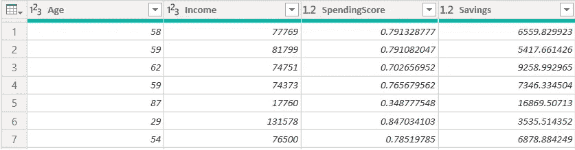
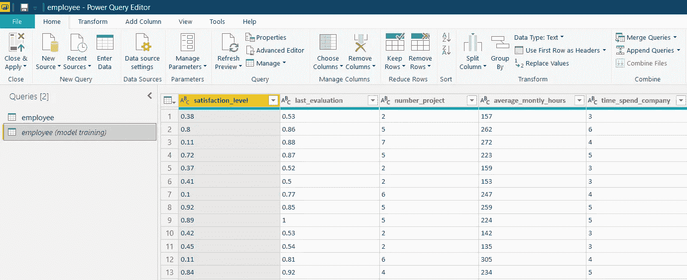
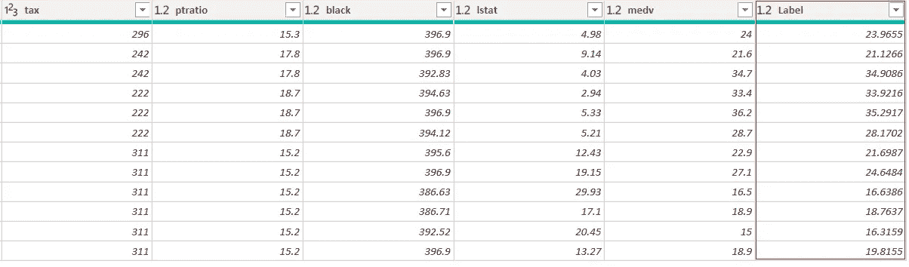

# 使用 PyCaret 实现 Power BI 中的机器学习

> 原文：<https://towardsdatascience.com/machine-learning-in-power-bi-using-pycaret-34307f09394a?source=collection_archive---------2----------------------->

## 几分钟内在 Power BI 中实现机器学习的分步教程


机器学习遇上商业智能

# **PyCaret 1.0.0**

上周我们宣布了 [PyCaret](https://www.pycaret.org) ，这是一个用 Python 编写的开源机器学习库，它在**低代码**环境中训练和部署机器学习模型。在我们之前的[帖子](/announcing-pycaret-an-open-source-low-code-machine-learning-library-in-python-4a1f1aad8d46)中，我们演示了如何在 Jupyter Notebook 中使用 PyCaret 来训练和部署 Python 中的机器学习模型。

在本帖中，我们展示了一个关于如何将 PyCaret 集成到 Power BI 中的逐步教程，从而允许分析师和数据科学家在他们的仪表板和报告中添加一层机器学习，而无需任何额外的许可或软件成本。PyCaret 是一个开源的**免费使用的** Python 库，它提供了一系列专门为 Power BI 构建的函数。

在本文结束时，您将了解如何在 Power BI 中实现以下内容:

*   **聚类** —对具有相似特征的数据点进行分组。
*   **异常检测** —识别数据中罕见的观察值/异常值。
*   **自然语言处理** —通过主题建模分析文本数据*。*
*   **关联规则挖掘** —在数据中发现有趣的关系。
*   **分类** —预测二进制(1 或 0)的分类类标签。
*   **回归** —预测连续值，如销售额、价格等

> “PyCaret 通过为业务分析师、领域专家、公民数据科学家和经验丰富的数据科学家提供免费、开源和低代码的机器学习解决方案，使机器学习和高级分析的使用民主化”。

# Microsoft Power BI

Power BI 是一种业务分析解决方案，可让您在整个组织中可视化数据和共享见解，或将它们嵌入到您的应用程序或网站中。在本教程中，我们将通过将 PyCaret 库导入 Power BI 来使用 [Power BI 桌面](https://powerbi.microsoft.com/en-us/downloads/)进行机器学习。

# 开始之前

如果您以前使用过 Python，很可能您的计算机上已经安装了 Anaconda 发行版。如果没有，[单击此处](https://www.anaconda.com/distribution/)下载 Python 3.7 或更高版本的 Anaconda 发行版。


https://www.anaconda.com/distribution/

# 设置环境

在我们开始在 Power BI 中使用 PyCaret 的机器学习功能之前，我们必须创建一个虚拟环境并安装 pycaret。这是一个三步走的过程:

[✅](https://fsymbols.com/signs/tick/) **步骤 1——创建一个蟒蛇环境**

从开始菜单打开 **Anaconda 提示符**并运行以下代码:

```
conda create --name **myenv** python=3.6
```


Anaconda 提示符—创建环境

[✅](https://fsymbols.com/signs/tick/) **步骤 2 —安装 PyCaret**

在 Anaconda 提示符下运行以下代码:

```
conda activate **myenv**
pip install pycaret
```

安装可能需要 10-15 分钟。

[✅](https://fsymbols.com/signs/tick/)t16】第三步——在 Power BI 中设置 Python 目录

创建的虚拟环境必须与 Power BI 链接。这可以使用 Power BI Desktop 中的全局设置来完成(文件→选项→全局→ Python 脚本)。默认情况下，Anaconda 环境安装在以下位置:

C:\Users\ ***用户名***\ AppData \ Local \ Continuum \ anaconda 3 \ envs \ myenv


文件→选项→全局→ Python 脚本

# 📘示例 Power BI 中的集群

聚类是一种机器学习技术，它将具有相似特征的数据点分组。这些分组对于探索数据、识别模式和分析数据子集非常有用。集群的一些常见业务用例有:

以营销为目的的✔客户细分。

促销和折扣的✔顾客购买行为分析。

✔在诸如新冠肺炎的流行病爆发中识别地理群集。

在本教程中，我们将使用 PyCaret 的 [github 资源库](https://github.com/pycaret/pycaret/blob/master/datasets/jewellery.csv)中的**' jewellery . CSV’**文件。您可以使用 web 连接器加载数据。(Power BI 桌面→获取数据→来自 Web)。

**链接到 csv 文件:**[https://raw . githubusercontent . com/py caret/py caret/master/datasets/jewellery . CSV](https://raw.githubusercontent.com/pycaret/pycaret/master/datasets/jewellery.csv)


Power BI 桌面→获取数据→其他→ Web



*来自 jewellery.csv 的样本数据点*

## **K-均值聚类**

为了训练聚类模型，我们将在 Power Query Editor 中执行 Python 脚本(Power Query Editor→Transform→Run Python script)。


超级查询编辑器中的功能区

将以下代码作为 Python 脚本运行:

```
from **pycaret.clustering** import *****
dataset = **get_clusters**(data = dataset)
```


超级查询编辑器(转换→运行 python 脚本)

## **输出:**


聚类结果(代码执行后)


最终输出(点击表格后)

包含标签的新列**‘集群’**被附加到原始表格。

一旦您应用了查询(Power Query Editor→Home→Close & Apply)，以下是您如何在 Power BI 中可视化集群:


默认情况下，PyCaret 训练一个具有 4 个聚类的 **K-Means** 聚类模型(*即表中的所有数据点都被分为 4 组*)。默认值可以很容易地更改:

*   要更改聚类数，您可以使用 **get_clusters( )** 函数中的***num _ clusters****参数。*
*   *要更改模型类型，使用 **get_clusters( )** 内的 ***模型*** 参数。*

*请参见下面的示例代码，该代码用于训练具有 6 个群集的 K-Modes 模型:*

```
*from **pycaret.clustering** import *
dataset = **get_clusters**(dataset, model = 'kmodes', num_clusters = 6)*
```

*PyCaret 中有 9 种现成可用的聚类算法:*

**

*训练一个聚类模型所需的所有预处理任务，如[缺失值插补](https://pycaret.org/missing-values/)(如果表中有任何缺失值或*空值*)，或[归一化](https://www.pycaret.org/normalization)，或[一次热编码](https://pycaret.org/one-hot-encoding/)，都是在训练一个聚类模型之前自动执行的。[单击此处](https://www.pycaret.org/preprocessing)了解更多关于 PyCaret 预处理功能的信息。*

*💡在这个例子中，我们使用了 **get_clusters( )** 函数来分配原始表中的分类标签。每次刷新查询时，都会重新计算分类。实现这一点的另一种方法是使用 **predict_model( )** 函数，使用 Python 或 Power BI 中的**预训练模型**来预测聚类标签(*参见下面的示例 5，以了解如何在 Power BI 环境中训练机器学习模型*)。*

*💡如果你想学习如何使用 Jupyter 笔记本在 Python 中训练一个聚类模型，请参见我们的[聚类 101 初学者教程](https://www.pycaret.org/clu101)。*(不需要编码背景)。**

# *📘示例 2 —电力 BI 中的异常检测*

*异常检测是一种机器学习技术，用于通过检查表中与大多数行明显不同的行来识别**稀有项目**、**事件、**、或观察值。通常，异常项目会转化为某种问题，如银行欺诈、结构缺陷、医疗问题或错误。异常检测的一些常见业务用例有:*

*✔欺诈检测(信用卡、保险等。)使用财务数据。*

*✔入侵检测(系统安全、恶意软件)或监控网络流量的起伏。*

*✔识别数据集中的多元异常值。*

*在本教程中，我们将使用 PyCaret 的 [github 资源库](https://github.com/pycaret/pycaret/blob/master/datasets/anomaly.csv)中的**anomaly . CSV’**文件。您可以使用 web 连接器加载数据。(Power BI 桌面→获取数据→来自 Web)。*

***链接到 csv 文件:**[https://raw . githubusercontent . com/py caret/py caret/master/datasets/anomaly . CSV](https://raw.githubusercontent.com/pycaret/pycaret/master/datasets/anomaly.csv)*

**

**来自 anomaly.csv 的样本数据点**

## *k 近邻异常检测器*

*与聚类类似，我们将从 Power Query Editor 运行 python 脚本(转换→运行 Python 脚本)来训练异常检测模型。将以下代码作为 Python 脚本运行:*

```
*from **pycaret.anomaly** import *****
dataset = **get_outliers**(data = dataset)*
```

**

*超级查询编辑器(转换→运行 python 脚本)*

## ***输出:***

**

*异常检测结果(代码执行后)*

**

*最终输出(点击表格后)*

*两个新列附加到原始表。标签(1 =异常值，0 =内部值)和分数(具有高分数的数据点被归类为异常值)。*

*应用查询后，以下是如何在 Power BI 中可视化异常检测的结果:*

**

*默认情况下，PyCaret 用 5%的分数训练一个**K-最近邻异常检测器**(即表中总行数的 5%将被标记为异常值)。默认值可以很容易地更改:*

*   *要更改分数值，您可以使用 **get_outliers( )** 函数中的 ***分数*** 参数。*
*   *要更改模型类型，使用 **get_outliers( )** 内的 ***模型*** 参数。*

*请参见以下代码，用于训练分数为 0.1 的**隔离林**模型:*

```
*from **pycaret.anomaly** import *
dataset = **get_outliers**(dataset, model = 'iforest', fraction = 0.1)*
```

*PyCaret 中有超过 10 种现成的异常检测算法:*

**

*训练异常检测模型所需的所有预处理任务，例如[缺失值插补](https://pycaret.org/missing-values/)(如果表中有任何缺失值或*空值*)，或[归一化](https://www.pycaret.org/normalization)，或[一热编码](https://pycaret.org/one-hot-encoding/)，它们都在训练异常检测模型之前自动执行。[单击此处](https://www.pycaret.org/preprocessing)了解更多关于 PyCaret 预处理功能的信息。*

*💡在本例中，我们使用了 **get_outliers( )** 函数来分配离群值标签和分数以进行分析。每次刷新查询时，都会重新计算离群值。实现这一点的另一种方法是使用 **predict_model( )** 函数，使用 Python 或 Power BI 中预训练的模型来预测异常值(*参见下面的示例 5，了解如何在 Power BI 环境中训练机器学习模型*)。*

*💡如果你想学习如何使用 Jupyter 笔记本在 Python 中训练一个异常检测器，请参见我们的[异常检测 101 初学者教程](https://www.pycaret.org/ano101)。*(不需要编码背景)。**

# *📘示例 3 —自然语言处理*

*有几种技术被用来分析文本数据，其中**主题建模**是一种流行的技术。主题模型是一种用于在文档集合中发现抽象主题的统计模型。主题建模是一种常用的文本挖掘工具，用于发现文本数据中隐藏的语义结构。*

*在本教程中，我们将使用 PyCaret 的 [github 资源库](https://github.com/pycaret/pycaret/blob/master/datasets/kiva.csv)中的**‘kiva . CSV’**文件。您可以使用 web 连接器加载数据。(Power BI 桌面→获取数据→来自 Web)。*

***链接到 csv 文件:**[https://raw . githubusercontent . com/py caret/py caret/master/datasets/kiva . CSV](https://raw.githubusercontent.com/pycaret/pycaret/master/datasets/kiva.csv)*

## ***潜在狄利克雷分配***

*在超级查询编辑器中以 Python 脚本的形式运行以下代码:*

```
*from **pycaret.nlp** import *****
dataset = **get_topics**(data = dataset, text = 'en')*
```

**

*超级查询编辑器(转换→运行 python 脚本)*

***‘en’**是表格**‘kiva’**中包含文本的列的名称。*

## *输出:*

**

*主题建模结果(代码执行后)*

**

*最终输出(点击表格后)*

*一旦代码被执行，带有主题权重和主导主题的新列被附加到原始表。在 Power BI 中，有许多方法可以可视化主题模型的输出。请参见下面的示例:*

**

*默认情况下，PyCaret 使用 4 个主题训练一个潜在的 Dirichlet 分配模型。默认值可以很容易地更改:*

*   *要更改主题数量，您可以使用 **get_topics( )** 函数中的 ***num_topics*** 参数。*
*   *要更改模型类型，使用 **get_topics( )** 中的 ***模型*** 参数。*

*参见训练具有 10 个主题的**非负矩阵分解模型**的示例代码:*

```
*from **pycaret.nlp** import *
dataset = **get_topics**(dataset, 'en', model = 'nmf', num_topics = 10)*
```

*PyCaret 有以下现成的主题建模算法:*

**

# *📘示例 Power BI 中的关联规则挖掘*

*关联规则挖掘是一种**基于规则的机器学习**技术，用于发现数据库中变量之间的有趣关系。它旨在使用兴趣度来识别强规则。关联规则挖掘的一些常见业务用例有:*

*✔购物篮分析，了解经常一起购买的项目。*

*✔医学诊断，用于帮助医生确定给定因素和症状下疾病的发生概率。*

*在本教程中，我们将使用 PyCaret 的 [github 库](https://github.com/pycaret/pycaret/blob/master/datasets/france.csv)中的**‘France . CSV’**文件。您可以使用 web 连接器加载数据。(Power BI 桌面→获取数据→来自 Web)。*

***链接到 csv 文件:**[https://raw . githubusercontent . com/py caret/py caret/master/datasets/France . CSV](https://raw.githubusercontent.com/pycaret/pycaret/master/datasets/france.csv)*

**

**来自法国的样本数据点. csv**

## *Apriori 算法*

*现在应该清楚了，所有 PyCaret 函数都是作为 python 脚本在 Power 查询编辑器中执行的(转换→运行 Python 脚本)。运行以下代码，使用 Apriori 算法为关联规则模型定型:*

```
*from **pycaret.arules** import *
dataset = **get_rules**(dataset, transaction_id = 'InvoiceNo', item_id = 'Description')*
```

**

*超级查询编辑器(转换→运行 python 脚本)*

***‘invoice no’**是包含交易 id 的列，**‘Description’**包含感兴趣的变量，即产品名称。*

## ***输出:***

**

*关联规则挖掘结果(代码执行后)*

**

*最终输出(点击表格后)*

*它返回一个包含前因和后果的表格，以及相关的指标，如支持度、信心、提升等。[点击这里](https://www.pycaret.org/association-rule)了解更多关于 PyCaret 中的关联规则挖掘。*

# *📘示例 5 —功率 BI 的分类*

*分类是一种受监督的机器学习技术，用于预测分类**类别标签**(也称为二元变量)。分类的一些常见业务用例有:*

*✔预测客户贷款/信用卡违约。*

*✔预测客户流失(客户会留下还是离开)*

*✔预测患者结果(无论患者是否患有疾病)*

*在本教程中，我们将使用 PyCaret 的 [github 资源库](https://github.com/pycaret/pycaret/blob/master/datasets/employee.csv)中的**‘employee . CSV’**文件。您可以使用 web 连接器加载数据。(Power BI 桌面→获取数据→来自 Web)。*

***链接到 csv 文件:**[https://raw . githubusercontent . com/py caret/py caret/master/datasets/employee . CSV](https://raw.githubusercontent.com/pycaret/pycaret/master/datasets/employee.csv)*

***目标:**表格**‘员工’**包含一家公司中 15，000 名在职员工的信息，如在该公司工作的时间、每月平均工作时间、晋升历史、部门等。基于所有这些列(在机器学习术语中也称为*特征*，目标是预测员工是否会离开公司，由列**‘left’**表示(1 表示是，0 表示否)。*

*与聚类、异常检测和非监督机器学习下的 NLP 示例不同，分类是一种**监督的**技术，因此它分两部分实现:*

## ***第 1 部分:在 Power BI 中训练分类模型***

*第一步是在 Power Query Editor 中创建一个表**‘employee’**的副本，用于训练模型。*

**

*超级查询编辑器→右键单击“员工”→复制*

*在新创建的复制表**' employee(model training)'**中运行下面的代码来训练一个分类模型:*

```
*# import classification module and setup environmentfrom **pycaret.classification** import *****
clf1 = **setup**(dataset, target = 'left', silent = True)# train and save xgboost modelxgboost = **create_model**('xgboost', verbose = False)
final_xgboost = **finalize_model**(xgboost)
**save_model**(final_xgboost, 'C:/Users/*username*/xgboost_powerbi')*
```

**

*超级查询编辑器(转换→运行 python 脚本)*

## *输出:*

*该脚本的输出将是一个保存在指定位置的 **pickle 文件**。pickle 文件包含整个数据转换管道以及经过训练的模型对象。*

*💡另一种方法是在 Jupyter 笔记本电脑中训练模型，而不是 Power BI。在这种情况下，Power BI 将仅用于使用 Jupyter notebook 中预训练的模型在前端生成预测，该模型将作为 pickle 文件导入 Power BI(遵循下面的第 2 部分)。要了解更多关于在 Python 中使用 PyCaret 的信息，[点击这里](https://www.pycaret.org/tutorial)。*

*💡如果你想学习如何使用 Jupyter Notebook 在 Python 中训练一个分类模型，请看我们的[二进制分类 101 入门教程](https://www.pycaret.org/clf101)。*(不需要编码背景)。**

*PyCaret 中有 18 种现成可用的分类算法:*

**

## *第 2 部分:使用训练好的模型生成预测*

*我们现在可以使用原始**‘employee’**表上的训练模型来预测该员工是否会离开公司(1 或 0)以及概率%。以 python 脚本的形式运行以下代码来生成预测:*

```
*from **pycaret.classification** import *****
xgboost = **load_model**('c:/users/*username*/xgboost_powerbi')
dataset = **predict_model**(xgboost, data = dataset)*
```

## *输出:*

**

*分类预测(代码执行后)*

**

*最终输出(点击表格后)*

*两个新列附加到原始表。**‘Label’**列表示预测，**‘Score’**列表示结果的概率。*

*在本例中，我们预测的数据与我们用于训练模型的数据相同，但仅用于演示目的。在实际设置中，**‘左’**列是实际结果，在预测时未知。*

*在本教程中，我们已经训练了一个**极端梯度推进** **('xgboost')** 模型，并使用它来生成预测。我们这样做只是为了简单。实际上，您可以使用 PyCaret 来预测任何类型的模型或模型链。*

*PyCaret 的 **predict_model( )** 函数可以与使用 PyCaret 创建的 pickle 文件无缝协作，因为它包含整个转换管道以及经过训练的模型对象。点击这里了解更多关于**预测 _ 模型**功能的信息。*

*💡训练分类模型所需的所有预处理任务，如[缺失值插补](https://pycaret.org/missing-values/)(如果表中有任何缺失值或*空值*)，或[一键编码](https://pycaret.org/one-hot-encoding/)，或[目标编码](https://www.pycaret.org/one-hot-encoding)，它们都在训练模型之前自动执行。[单击此处](https://www.pycaret.org/preprocessing)了解更多关于 PyCaret 预处理功能的信息。*

# *📘示例 6—功率 BI 的回归*

***回归**是一种受监督的机器学习技术，用于在给定过去数据及其相应的过去结果的情况下，以最佳可能的方式预测连续结果。与用于预测二元结果(如是或否(1 或 0))的分类不同，回归用于预测连续值，如销售额、价格、数量等。*

*在本教程中，我们将使用 pycaret 的 [github 资源库](https://github.com/pycaret/pycaret/blob/master/datasets/boston.csv)中的**‘Boston . CSV’**文件。您可以使用 web 连接器加载数据。(Power BI 桌面→获取数据→来自 Web)。*

***链接到 csv 文件:** [https://raw . githubusercontent . com/py caret/py caret/master/datasets/Boston . CSV](https://raw.githubusercontent.com/pycaret/pycaret/master/datasets/boston.csv)*

***目标:**表格**【波士顿】**包含波士顿 506 所房屋的信息，如平均房间数、财产税税率、人口等。基于这些列(在机器学习术语中也称为*特征*，目标是预测由列**‘medv’**表示的房屋的中值。*

## *第 1 部分:在 Power BI 中训练回归模型*

*第一步是在 Power Query Editor 中创建一个**‘Boston’**表的副本，用于训练模型。*

*以 python 脚本的形式在新的重复表中运行以下代码:*

```
*# import regression module and setup environmentfrom **pycaret.regression** import *****
clf1 = **setup**(dataset, target = 'medv', silent = True)# train and save catboost modelcatboost = **create_model**('catboost', verbose = False)
final_catboost = **finalize_model**(catboost)
**save_model**(final_catboost, 'C:/Users/*username*/catboost_powerbi')*
```

## *输出:*

*该脚本的输出将是保存在指定位置的 **pickle 文件**。pickle 文件包含整个数据转换管道以及经过训练的模型对象。*

*PyCaret 中提供了 20 多种现成的回归算法:*

**

## *第 2 部分:使用训练好的模型生成预测*

*我们现在可以使用训练好的模型来预测房屋的中值。在原始表**【波士顿】**中运行以下代码作为 python 脚本:*

```
*from **pycaret.classification** import *****
xgboost = **load_model**('c:/users/*username*/xgboost_powerbi')
dataset = **predict_model**(xgboost, data = dataset)*
```

## *输出:*

**

*回归预测(代码执行后)*

**

*最终输出(点击表格后)*

*包含预测的新列**‘标签’**被附加到原始表。*

*在本例中，我们预测的数据与我们用于训练模型的数据相同，但仅用于演示目的。在实际设置中，**‘medv’**列是实际结果，在预测时是未知的。*

*💡训练回归模型所需的所有预处理任务，如[缺失值插补](https://pycaret.org/missing-values/)(如果表格中有任何缺失值或*空值*)，或[一键编码](https://pycaret.org/one-hot-encoding/)，或[目标转换](https://pycaret.org/transform-target/)，它们都在训练模型之前自动执行。[单击此处](https://www.pycaret.org/preprocessing)了解更多关于 PyCaret 预处理功能的信息。*

# *下一个教程*

*在使用 PyCaret 系列的 Power BI 中的**机器学习的下一篇教程中，我们将更深入地探讨 PyCaret 中的高级预处理特性。我们还将看到如何在 Power BI 中生产机器学习解决方案，并在 Power BI 的前端利用 [PyCaret](https://www.pycaret.org) 的力量。***

*如果你想了解更多，请保持联系。*

*在我们的 Linkedin 页面上关注我们，订阅我们的 Youtube 频道。*

# *另请参见:*

*初级 Python 笔记本:*

*[聚类](https://www.pycaret.org/clu101)
异常检测 自然语言处理
[关联规则挖掘](https://www.pycaret.org/arul101)
[回归](https://www.pycaret.org/reg101)
[分类](https://www.pycaret.org/clf101)*

# *开发管道中有什么？*

*我们正在积极改进 PyCaret。我们未来的开发管道包括一个新的**时间序列预测**模块，与 **TensorFlow、**的集成，以及对 PyCaret 可扩展性的重大改进。如果您想分享您的反馈并帮助我们进一步改进，您可以[在网站上填写这张表格](https://www.pycaret.org/feedback)或者在我们的 [Github](https://www.github.com/pycaret/) 或 [LinkedIn](https://www.linkedin.com/company/pycaret/) 页面上发表评论。*

# *想了解某个特定模块？*

*从第一个版本 1.0.0 开始，PyCaret 有以下模块可供使用。点击下面的链接，查看 Python 中的文档和工作示例。*

*[分类](https://www.pycaret.org/classification)
[回归](https://www.pycaret.org/regression) [聚类](https://www.pycaret.org/clustering)
[异常检测](https://www.pycaret.org/anomaly-detection) [自然语言处理](https://www.pycaret.org/nlp)
[关联规则挖掘](https://www.pycaret.org/association-rules)*

# *重要链接*

*[用户指南/文档](https://www.pycaret.org/guide)
[Github 资源库](https://www.github.com/pycaret/pycaret) [安装 PyCaret](https://www.pycaret.org/install)
[笔记本教程](https://www.pycaret.org/tutorial)
[贡献于 PyCaret](https://www.pycaret.org/contribute)*

*如果你喜欢 PyCaret，请给我们 github 回购的⭐️。*

*在媒介上跟随我:[https://medium.com/@moez_62905/](https://medium.com/@moez_62905/machine-learning-in-power-bi-using-pycaret-34307f09394a)*