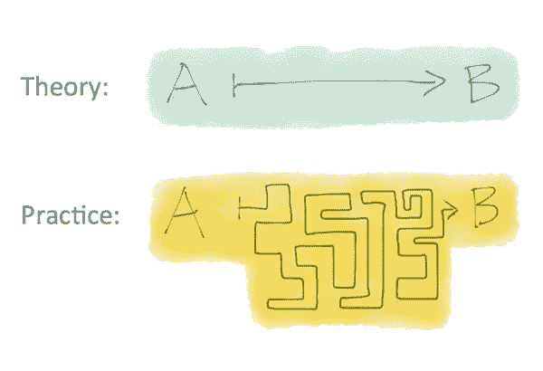
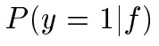
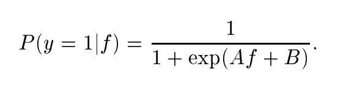
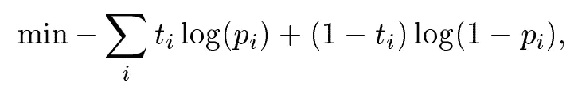

# 生产中的机器学习

> 原文：<https://towardsdatascience.com/machine-learning-in-production-79e02a43b273?source=collection_archive---------55----------------------->

## *从生产分类模型中学到的有用技巧*


照片由 [Wojciech 然后](https://unsplash.com/@wthen?utm_source=unsplash&utm_medium=referral&utm_content=creditCopyText)在 [Unsplash](https://unsplash.com/s/photos/adventure?utm_source=unsplash&utm_medium=referral&utm_content=creditCopyText) 上拍摄

在生产中，风险很高。人们将会阅读模型的输出。输出更有意义。

最近，我和我的团队创建了一个 NLP 分类器，并在一个大型保险数据集上投入使用。它使用 TfidfVectorizer 和 LinearSVC 对自由文本进行分类。

但我很快意识到，把东西投入生产与理论是如此不同。



图片由 [Juan C. Antúnez](https://www.flprobatelitigation.com/about/) 在 [flprobatelitigation](https://www.flprobatelitigation.com/2013/11/articles/white-papers-rpptl-comm/why-fiduciary-law-is-equitable/) 上拍摄

我认为，在生产中，获得模型预测的概率非常重要。例如，如果您的模型以 50%的概率对某件事情进行分类，那么应该有人对该预测进行调查。如果他们发现一个错误，你阻止了模型破坏公司的一个关键系统。

但是获得一个预测的概率并不总是那么简单。

在本文中，我将介绍一种从 scikit-learn 的 SVM 分类器中提取概率的方法。

这对于将我们的模型投入生产至关重要。

# 概率校准

我们不仅想要预测的类别标签，还想要预测的概率。Scikit-learn 在他们的文档中有一个关于这个主题的有趣章节。

我们需要创建一个回归器(或校准器)，将分类器的输出映射到一个介于`0`和`1`之间的值。这个校准器会给我们每次预测的概率。

本质上，校准器将试图预测:



其中`f`是分类器的输出。

或者更直白地说:给定我们的分类器的输出，我们对这个输出 100%确定的概率是多少？

约翰·普拉特的这篇[论文](https://www.researchgate.net/publication/2594015_Probabilistic_Outputs_for_Support_Vector_Machines_and_Comparisons_to_Regularized_Likelihood_Methods)指出，sigmoid 函数可以用作回归变量。我们得到以下结果:



为了找到 A 和 B，我们可以使用[最大似然估计](https://en.wikipedia.org/wiki/Maximum_likelihood_estimation)。这将涉及最小化负对数可能性:



其中`ti`是目标概率。

# 给我看看代码

代码非常简单。Scikit-learn 隐藏了抽象层背后的大部分复杂性。

你需要做的就是这个:

```
# from: https://stackoverflow.com/questions/26478000/converting-linearsvcs-decision-function-to-probabilities-scikit-learn-pythonsvm = LinearSVC()
clf = CalibratedClassifierCV(svm) 
clf.fit(X_train, y_train)
```

CalibratedClassifierCV 将使用 k 重交叉验证方法来拟合训练数据。默认值为 5 倍。点击查看更多信息[。](https://scikit-learn.org/stable/modules/generated/sklearn.calibration.CalibratedClassifierCV.html#sklearn.calibration.CalibratedClassifierCV)

然后，我们将提取所有 k 倍预测类的平均概率。`predict_proba`是我们这里需要的函数。虽然函数本身看起来像一个未完成的句子，但它非常有用。

```
y_proba = clf.predict_proba(X_test)
```

要得到预测的类，我们可以简单地使用预测函数。

```
clf.predict(X_test)
```

# 评估校准品

校准器与数据的吻合程度如何？我们怎么知道？

为此，我们可以使用`sklearn.metrics.brier_score_loss`。更多信息可在[这里](https://scikit-learn.org/stable/modules/generated/sklearn.metrics.brier_score_loss.html#sklearn.metrics.brier_score_loss)找到。

如果这个分数非常高，那么我们就不能查看校准器的概率输出——它们是无用的。相反，我们需要寻找更好的方法来安装校准器。这篇[文章](https://machinelearningmastery.com/calibrated-classification-model-in-scikit-learn/)提供了一些安装校准器的好方法。

# 结束

真的就是这样！

我相信，随着我们继续保持这种模式，我会有更多的内容要添加。我想分享这个帮助我们有效地将模型投入生产的小技巧。希望有人会觉得它有用。

如果我犯了一个错误，或者你有兴趣寻求帮助，请随时通过推特[联系我。](https://twitter.com/neeliyer11)

*原载于 2020 年 9 月 30 日*[*https://spiyer 99 . github . io*](https://spiyer99.github.io/Production-vs-Theory/)*。*