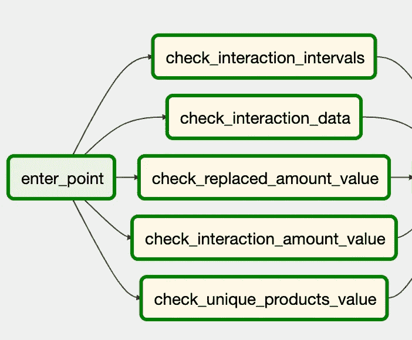
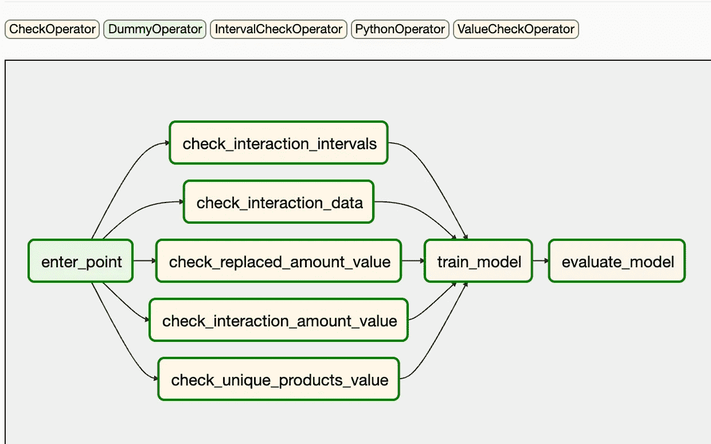

# 使用 Apache Airflow 在生产中进行机器学习

> 原文：<https://towardsdatascience.com/machine-learning-in-production-using-apache-airflow-91d25a4d8152?source=collection_archive---------21----------------------->

## 如何使机器学习项目在生产中具有健壮性和可解释性的实际案例

[田宽](https://unsplash.com/@realaxer?utm_source=unsplash&utm_medium=referral&utm_content=creditCopyText)在 [Unsplash](https://unsplash.com/?utm_source=unsplash&utm_medium=referral&utm_content=creditCopyText) 上拍照

# 目录:

1.  [简介](#2d67)
2.  [数据验证](#82b7)
3.  [模型验证](#ba74)
4.  [总结](#034c)

# **1。简介**

“所有的模型都是错的，但有些是有用的。”—乔治·博克斯。

使用机器学习(ML)来构建解决方案本身就是一项复杂的任务。虽然学术 ML 源于 20 世纪 80 年代的研究，但机器学习系统在生产中的实际实现仍然相对较新。

今天，我想分享一些关于如何使用 [Apache Airflow](https://airflow.apache.org/docs/stable/) 使您的 ML 管道健壮且可解释的想法。整个项目可以在 Github 上找到。代码被 [dockerized](https://github.com/DanilBaibak/ml-in-production/tree/master/docker) ，所以即使你不熟悉这项技术，使用它也很简单。

这个题目是复杂的，多方面的。在本文中，我将只关注任何 ML 项目的两个部分——数据验证和模型评估。目标是分享实用的想法，你可以在你的项目中相对简单地引入，但仍然可以获得很大的好处。

这个主题非常广泛，所以我们来介绍几个限制条件:

*   我们将使用 Apache Airflow 作为管道编排工具；
*   我们将考虑一个 ML 培训管道。
*   我们将关注大多数项目中常见的实际问题。

如果您不熟悉 Airflow，它是一个以编程方式创作、调度和监控工作流的平台[1]。气流工作流被构建为任务的有向无环图(Dag)。Airflow scheduler 在遵循指定依赖关系的同时，对一组工作线程执行您的任务。命令行实用程序使在 Dag 上执行复杂的手术变得轻而易举。用户界面使得可视化生产中运行的管道、监控进度以及在需要时解决问题变得容易。

# 2.数据有效性

数据验证是确保数据存在、正确和有意义的过程。在任何组织中，通过自动验证检查来确保数据质量是构建数据管道的关键步骤。

在模型训练之前需要数据验证步骤，以决定是否可以训练模型或停止管道的执行。如果管道识别出以下情况，则自动做出该决定[2]:

*   **数据模式偏差**:这些偏差被认为是输入数据中的异常，这意味着下游管道步骤，包括数据处理和模型训练，接收到不符合预期模式的数据。模式偏差包括接收到意外的功能、没有接收到所有预期的功能或接收到具有意外值的功能。
*   **数据值偏斜**:这些偏斜是数据统计属性的显著变化，这意味着数据模式发生了显著变化，您需要检查这些变化的性质。

数据验证的重要性:

*   模型的质量取决于数据的质量。
*   通过量化数据质量增加对数据质量的信心。
*   校正训练好的 ML 模型可能是昂贵的——预防胜于治疗。
*   如果数据无效，则停止训练新的 ML 模型。

Airflow 提供了一组检查操作符，使我们能够轻松验证数据质量。让我们看看如何在实际例子中使用这样的操作符。

# 2.1 检查操作员

[CheckOperator](https://airflow.apache.org/docs/stable/_api/airflow/operators/check_operator/index.html?highlight=intervalcheckoperator#airflow.operators.check_operator.CheckOperator) 期望一个返回单行的 SQL 查询。第一行中的每个值都使用 python bool 转换进行计算。如果任何值返回 False，则检查失败，并显示错误。因此，只需在管道中添加一个任务，我们就可以检查特定日期的数据是否存在。

# 2.2 IntervalCheckOperator

对于更复杂的检查，气流有[间隔检查操作器](https://airflow.apache.org/docs/stable/_api/airflow/operators/check_operator/index.html?highlight=intervalcheckoperator#airflow.operators.check_operator.IntervalCheckOperator)。检查以 SQL 表达式形式给出的度量值是否在之前“ *days_back* ”中度量值的特定容差范围内。

这项检查的一个关键点是比率公式——使用哪个公式来计算两个指标之间的比率。你可以从两种可能中选择:

***max _ over _ min:****max(cur，ref) / min(cur，ref)*

***relative _ diff****:计算 abs(cur-ref) / ref*

IntervalCheckOperator 允许您同时检查一些特定表的不同比率的不同指标。

# 2.3 ValueCheckOperator

一个简单而强大的操作符。它使用 SQL 代码执行纯值检查。您可以使用任何复杂度的 SQL 查询来获取任何值。如果计算值等于传递值，且有一定的容差，则检查通过。

使用来自 Airflow 的检查操作符，当您看到检查失败时，更容易理解问题出在哪里，而不是处理代码中的错误。

管道开始处的数据检查列表

在当前示例中，我使用所有检查来测试输入数据。但是您也可以检查任何输出值。此外，将检查添加到 ETL 管道中也很有用。

# 3.模型验证

给定新数据，成功训练模型后，会发生此步骤。在推广到生产之前，我们会对模型进行评估和验证。理想情况下，离线模型验证步骤应该包括[2]:

*   使用测试数据集上的训练模型产生评估度量值，以评估模型的预测质量。
*   将新训练的模型与当前模型(例如，生产模型、基线模型或其他业务需求模型)生成的评估度量值进行比较。在将其推广到生产之前，您要确保新模型比当前模型产生更好的性能。
*   确保模型的性能与数据的各个部分一致。

# 3.1 现实中的模型验证

实际上，保留代表性的测试数据集可能很难，而且成本很高。但是我们仍然要监控重新训练的模型的质量。

我们能做的最简单的事情就是使用训练数据集计算指标。这个想法是，研究人员知道原型制作最后一步的训练集和测试集的误差度量值。如果下一次训练后的误差值变得更高或更低，我们不应在生产中使用该模型。另外，如果你观察到误差值的上升趋势，可能意味着模型的退化。

# 3.2 模型的元数据监控

想法是一样的。您希望能够对您的模型进行快速诊断，这将持续很长时间。模型的元数据可以让您看到模型生命周期的一些关键时刻。

我们希望有一些简单但有用的解决方案，我们甚至可以为现有的项目快速实现。您可以开始监视这些属性:

*   训练数据的数量；
*   范畴特征的多样性；
*   数字特征的标度、平均值、最小值、最大值；
*   算法的学习属性。例如:SGDClassifier[3]的“*coef _”*或 RandomForestRegressor [4]的“*feature _ importances _”*；

这里有一个使用 [sklearn](https://scikit-learn.org/stable/) 的例子:

例如，根据您公司的技术堆栈，您可以将值存储到数据库并构建 Grafana 仪表板，或者如果您使用 Datadog，只需记录值并构建仪表板。

# 4.摘要

在投产新项目时，您应该记住的主要观点是:

1.  数据验证步骤非常重要。校正已训练的 ML 模型可能是昂贵的——如果数据无效，则停止训练新的 ML 模型。
2.  Airflow 是一个强大的工具，它允许我们用最少的实现工作来检查数据。
3.  分配代表性的测试数据集既困难又昂贵。监控训练数据集上的误差值仍然是一个很好的替代方案。
4.  存储模型的元数据可以帮助我们看到模型本质的关键变化。

您可以在资源库[DanilBaibak/ml-in-production](https://github.com/DanilBaibak/ml-in-production)中找到该项目的代码。

## 参考资料:

1.  [阿帕奇气流文档](https://airflow.apache.org/docs/stable/)
2.  [MLOps:机器学习中的连续交付和自动化管道](https://cloud.google.com/solutions/machine-learning/mlops-continuous-delivery-and-automation-pipelines-in-machine-learning)
3.  [SGD 分类器](https://scikit-learn.org/stable/modules/generated/sklearn.linear_model.SGDClassifier.html)
4.  [RandomForestRegressor](https://scikit-learn.org/stable/modules/generated/sklearn.ensemble.RandomForestRegressor.html)
5.  [气流检查操作员](https://airflow.apache.org/docs/stable/_api/airflow/operators/check_operator/index.html)

## 关于生产中的机器学习主题的其他有用参考:

1.  [ML 测试分数:ML 生产准备和技术债务削减的指标](https://ai.google/research/pubs/pub46555) (2017) Breck *等*。(谷歌)
2.  [机器学习的软件工程:案例研究](https://www.microsoft.com/en-us/research/uploads/prod/2019/03/amershi-icse-2019_Software_Engineering_for_Machine_Learning.pdf) (2019) Amershi *等*。(微软)
3.  [监控生产中的机器学习模型](https://christophergs.com/machine%20learning/2020/03/14/how-to-monitor-machine-learning-models/)
4.  [气流最佳实践](https://airflow.apache.org/docs/stable/best-practices.html)