# 使用 PyCaret 在 SQL 中进行机器学习

> 原文：<https://towardsdatascience.com/machine-learning-in-sql-using-pycaret-87aff377d90c?source=collection_archive---------37----------------------->

## 通过在 SQL Server 中集成 PyCaret 将您的 ML 代码发送到数据


这篇文章是一个关于如何使用[**【py caret】**](https://pycaret.org/)(Python 中的一个低代码 ML 库)**在 SQL Server 中训练和部署无监督机器学习聚类模型的**分步教程。****

**我们将在本文中讨论的内容:**

1.如何免费下载并安装 SQL Server

2.如何创建新数据库并将数据导入数据库

3.如何在数据库中启用和使用 Python 脚本

4.如何训练聚类分析算法，以便为数据集中的每个观察值分配分类标签

# **一、将代码带入数据——ML 使用数据库的案例**

执行 ML 实验的首选工具/环境是命令行、ide 或笔记本。然而，当数据变得非常大时，或者当需要将 ML 模型投入生产时，这样的工具/环境可能会造成限制。迫切需要能够对数据所在的模型进行编程和训练。MS SQL Server 在其 SQL Server 2019 版中引入了这一功能。使用 SQL Server 进行机器学习的独特优势在于:

I .从系统中提取大量数据既繁琐又耗时。在服务器上进行 ML 实验将代码转化为数据，而不是将数据转化为代码

二。ML 实验大多在计算机/cpu 内存中执行。在大型数据集上训练 ML 算法时，大多数机器都遇到了性能上限。SQL Server 数据库上的 ML 避免了这种情况

三。很容易将 ML 管道与其他 ETL 过程集成和部署在一起

# **二。SQL 服务器**

SQL Server 是一个微软关系数据库管理系统。作为数据库服务器，它执行存储和检索不同应用程序请求的数据的主要功能。在本教程中，我们将通过在 SQL Server 中导入 PyCaret 库，使用[**SQL Server 2019****Developer**](https://www.microsoft.com/en-ca/sql-server/sql-server-downloads)进行机器学习。

# **三。下载软件**

如果您以前使用过 SQL Server，很可能您已经安装了它，并且可以访问数据库。如果没有， [**点击此处**](https://www.microsoft.com/en-ca/sql-server/sql-server-downloads) 下载 SQL Server 2019 Developer 或其他版本。

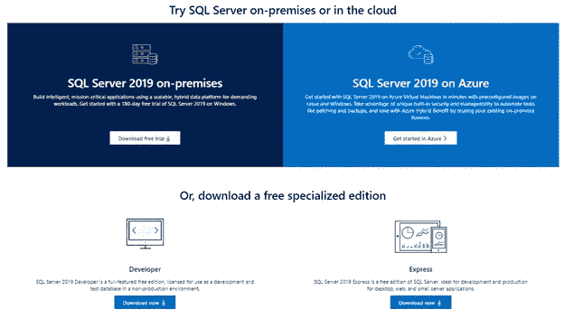

# **四。设置环境**

在 SQL Server 中使用 PyCaret 功能之前，您需要安装 SQL Server 和 PyCaret。这是一个多步骤的过程:

## 步骤 1 —安装 SQL Server

下载 SQL Server 2019 开发者版文件“**SQL2019-SSEI-Dev.exe**

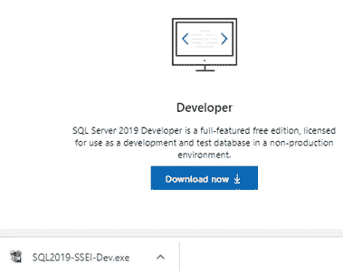

打开文件并按照说明进行安装(建议使用自定义安装选项)

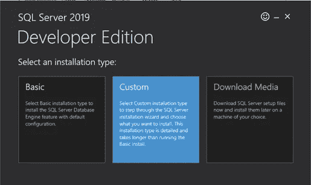

选择新的 SQL Server 独立安装

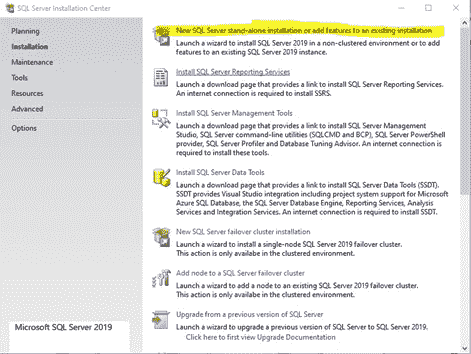

在实例特性选项中，选择包括**机器学习服务和语言扩展**和**机器学习服务器(单机版)**下的 **Python** 在内的特性

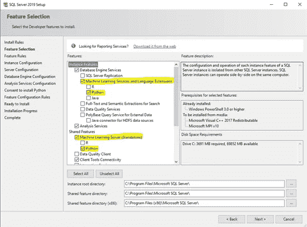

点击**接受**，同意安装 Python

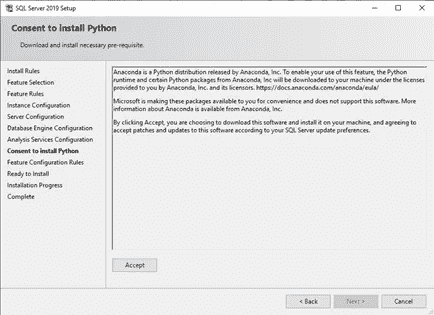

安装可能需要 15-20 分钟

## 步骤 2 —安装 Microsoft SQL Server Management Studio(SSMS)

[**点击这里**](https://docs.microsoft.com/en-us/sql/ssms/download-sql-server-management-studio-ssms?redirectedfrom=MSDN&view=sql-server-ver15) 或者打开 SQL Server 安装中心下载“SQL Server 管理工具”文件**SSMS-Setup-ENU.exe**

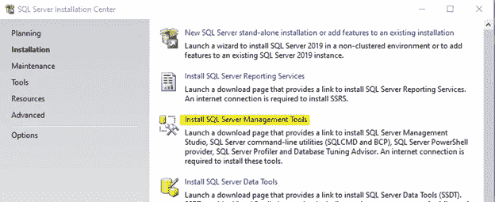

打开“**SSMS-Setup-ENU.exe**文件开始安装

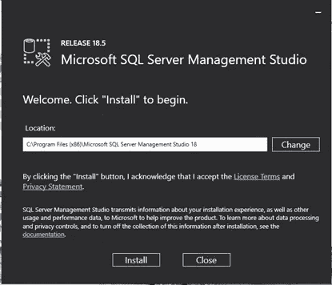

安装可能需要 5-10 分钟

## 步骤 3-为机器学习创建一个数据库

一旦您安装了所有的东西，您将需要启动服务器的一个实例。为此，请启动 SSMS。在登录阶段，会要求您输入 SQL Server 的名称，您可以从下拉菜单中选择。一旦建立了连接，您就可以看到服务器上的所有对象。如果您是第一次下载 SQL Server，并且没有可以使用的数据库，则需要先创建一个新数据库。

在对象资源管理器面板中，右键单击数据库，然后选择新建数据库

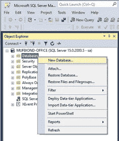

输入数据库名称和其他信息

设置可能需要 2-3 分钟，包括创建数据库、用户和设置所有权

## 步骤 4 —导入 CSV 文件

现在，您必须使用 SQL Server Management Studio 将 CSV 文件导入数据库。

在数据库中创建一个表"**珠宝**"

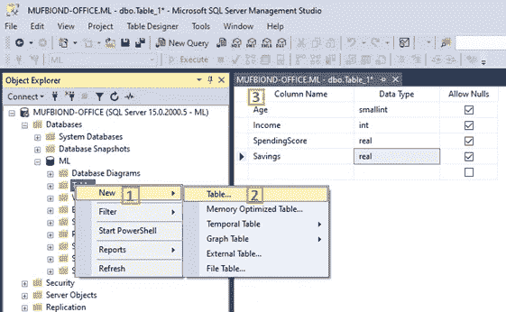

右击数据库，选择**任务** **- >** **导入数据**

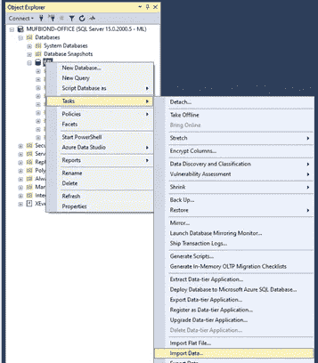

对于数据源，选择**平面文件源**。然后使用**浏览**按钮选择 CSV 文件。在点击**下一个**按钮之前，花一些时间配置数据导入。

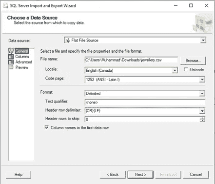

对于目标，请选择正确的数据库提供程序(例如 SQL Server Native Client 11.0)。输入**服务器名称**；勾选**使用 SQL Server 认证**，输入**用户名**、**密码**，以及**数据库**，然后点击**下一步**按钮。

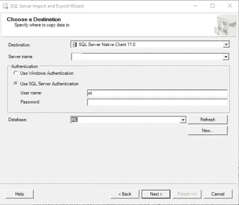

在选择源表和视图窗口中，您可以在单击下一个按钮之前编辑映射。

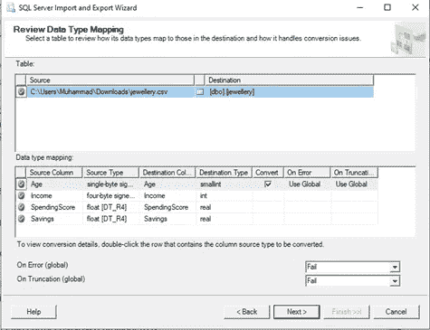

检查立即运行并点击**下一个**按钮

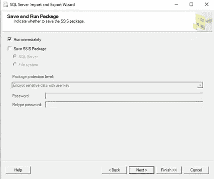

单击“完成”按钮运行包

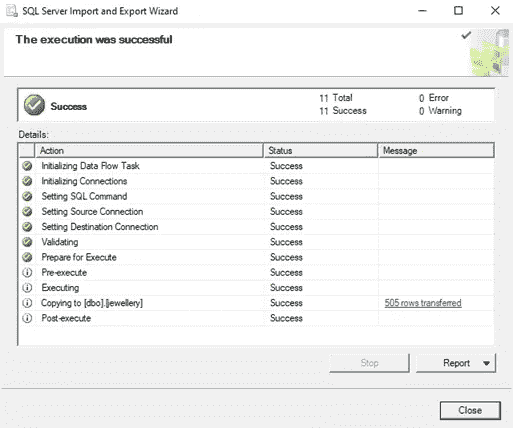

数据加载结果

## 步骤 5-为 Python 脚本启用 SQL Server

我们将通过使用**sp _ execute _ external _ script**系统存储过程在 SQL Server“内部”运行 Python。首先，您需要打开一个'**新查询**'。在实例中执行以下查询，以启用远程脚本执行过程:

```
EXEC sp_configure ‘external scripts enabled’, 1RECONFIGURE WITH OVERRIDE
```

**注意:**在继续下一步之前，重新启动实例。

可以执行以下 SQL 语句来检查 Python 路径并列出已安装的包。

检查 Python 路径:

```
EXECUTE sp_execute_external_script@language =N’Python’,@script=N’import sys; print(“\n”.join(sys.path))’
```

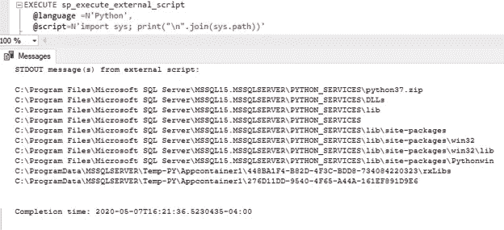

脚本执行结果

列出已安装的软件包:

```
EXECUTE sp_execute_external_script@language = N’Python’,@script = N’import pkg_resourcesimport pandas as pdinstalled_packages = pkg_resources.working_setinstalled_packages_list = sorted([“%s==%s” % (i.key, i.version) for i in installed_packages])df = pd.DataFrame(installed_packages_list)OutputDataSet = df’WITH RESULT SETS (( PackageVersion nvarchar (150) ))
```

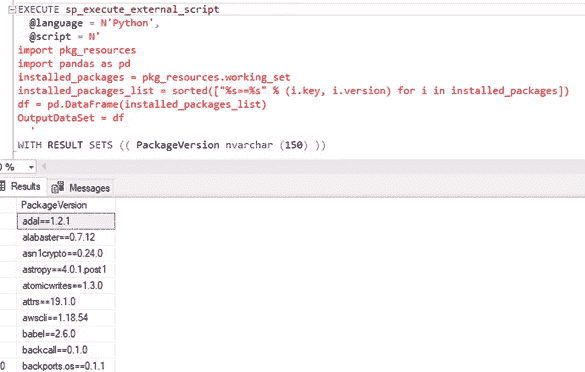

脚本执行结果

## 步骤 6-将 PyCaret Python 包添加到 SQL Server

要安装 PyCaret 包，请打开命令提示符并浏览到安装 SQL Server 的 Python 包的位置。默认位置是:

```
C:\Program Files\Microsoft SQL Server\MSSQL15.MSSQLSERVER\PYTHON_SERVICES
```

导航到“**脚本**目录，使用 pip 命令安装 **PyCaret** 包

```
pip.exe install pycaret
```

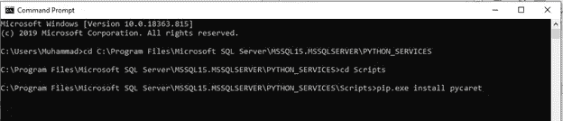

命令提示符— PyCaret 安装

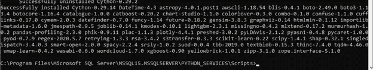

命令提示符— PyCaret 安装结束

**注意**:确保您有权访问 SQL Server 目录以安装软件包和/或更改配置。否则，软件包安装将会失败。

安装可能需要 5-10 分钟

**注意:**万一运行 SQL 脚本时遇到“ *lightgbm* ”模块丢失的问题。请遵循以下说明:

一、卸载“ *lightgbm*

```
pip.exe uninstall lightgbm
```

二。重新安装“*灯 gbm*

```
pip.exe install lightgbm
```

执行以下 SQL 以从 SQL Server 验证 PyCaret 安装:

```
EXECUTE sp_execute_external_script@language = N’Python’,@script = N’import pkg_resourcespckg_name = “pycaret”pckgs = pandas.DataFrame([(i.key) for i in pkg_resources.working_set], columns = [“key”])installed_pckg = pckgs.query(‘’key == @pckg_name’’)print(“Package”, pckg_name, “is”, “not” if installed_pckg.empty else “”, “installed”) ’
```

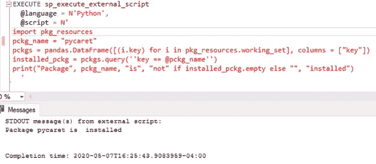

脚本执行结果

# 动词 （verb 的缩写）ML 实验示例 SQL Server 中的集群

聚类是一种机器学习技术，它将具有相似特征的数据点分组。这些分组对于探索数据、识别模式和分析数据子集非常有用。集群的一些常见业务用例有:

以营销为目的的✔客户细分。

促销和折扣的✔顾客购买行为分析。

✔在诸如新冠肺炎的流行病爆发中识别地理群集。

在本教程中，我们将使用 PyCaret 的 [Github 存储库](https://raw.githubusercontent.com/pycaret/pycaret/master/datasets/jewellery.csv)中的“**jewellery . CSV”**文件。


珠宝数据集中的样本数据点

## 1.k 均值聚类

在 SQL Server 中运行以下 SQL 代码:

```
EXECUTE sp_execute_external_script@language = N’Python’,@script = N’dataset = InputDataSetimport pycaret.clustering as pcdataset = pc.get_clusters(data = dataset)OutputDataSet = dataset’,@input_data_1 = N’SELECT [Age], [Income], [SpendingScore], [Savings] FROM [jewellery]’WITH RESULT SETS(([Age] INT, [Income] INT, [SpendingScore] FLOAT, [Savings] FLOAT, [Cluster] varchar(15)));
```

## 2.输出

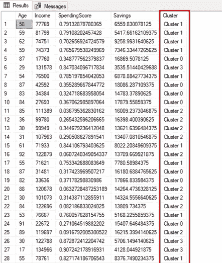

SQL 语句结果

包含标签的新列' **Cluster'** '被附加到原始表。

默认情况下，PyCaret 训练一个具有 4 个聚类*的 **K-Means** 聚类模型(即表中的所有数据点都被分为 4 组*)。默认值可以很容易地更改:

要更改聚类数，可以使用 **get_** clusters()函数中的 **num_clusters** 参数。

要更改模型类型，请使用 **get_clusters()中的**模型**参数。**

## **3。k 模式**

使用 **6 个集群**训练 **K-Modes** 模型参见以下代码:

```
EXECUTE sp_execute_external_script@language = N’Python’,@script = N’dataset = InputDataSetimport pycaret.clustering as pcdataset = pc.get_clusters(data = dataset, model=”kmodes”, num_clusters = 6)OutputDataSet = dataset’,@input_data_1 = N’SELECT [Age], [Income], [SpendingScore], [Savings] FROM [jewellery]’WITH RESULT SETS(([Age] INT, [Income] INT, [SpendingScore] FLOAT, [Savings] FLOAT, [Cluster] varchar(15)));
```

按照这些步骤，您可以为珠宝数据集中的每个观测点分配聚类值。您也可以对其他数据集使用类似的步骤，对它们执行聚类。

# 不及物动词结论

在这篇文章中，我们学习了如何在 SQL Server 中运行 Python 库(PyCaret)来构建集群模型。类似地，根据业务问题的需要，您可以构建和运行其他类型的监督和非监督 ML 模型。

您可以进一步查看 [PyCaret](http://pycaret.org/) 网站，获取关于其他监督和非监督实验的文档，这些实验可以在 SQL Server 中以类似的方式实现。

我以后的帖子将是在 SQL Server 中使用 Python 和 Pycaret 探索监督学习技术(回归/分类)的教程。

# 七。重要链接

PyCaret

[PyCaret:用户指南和文档](https://pycaret.org/guide/)

PyCaret:教程

[我的 LinkedIn 个人资料](https://www.linkedin.com/in/umarfarooque/)