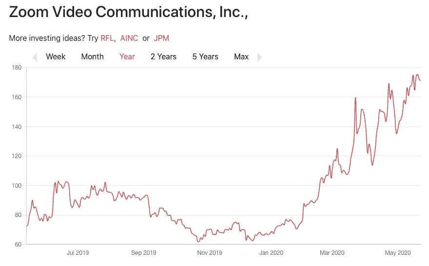
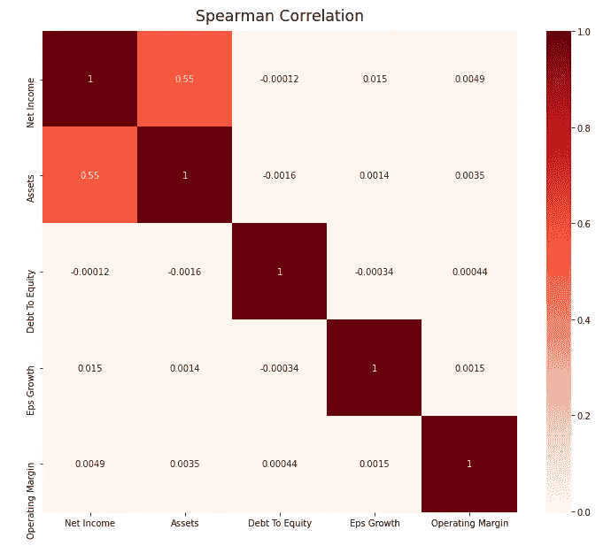

# 股票中的机器学习。重新定义公司集团。

> 原文：<https://towardsdatascience.com/machine-learning-in-stocks-re-defining-company-groups-1b4872459458?source=collection_archive---------76----------------------->

## 亨尼投资

## 应用聚类开发识别可比公司的新方法

[图片](https://stock.adobe.com/ca/images/group-of-paper-planes-in-one-direction-and-with-one-individual-pointing-in-the-different-way-business-concept-for-innovative-solution/190622134)作者[文字](https://stock.adobe.com/ca/contributor/207159640/worawut?load_type=author&prev_url=detail)

在**投资界**的一个普遍信念是，被低估的公司提供了一个巨大的**机会**来获得高于平均水平的利润。我们这个时代最成功的投资者，包括沃伦·巴菲特、霍华德·马克斯和菲尔·费舍尔，都非常依赖这种方法为自己和客户创造财富。

识别被低估的公司非常具有挑战性，因为这涉及到进行**定量预测**预测未来 5-10 年的情况。幸运的是，对许多人来说，情况并不总是如此。霍华德·马克斯将这一概念与市场周期的概念联系起来。有些时候所有东西都很便宜。你只需要买些东西，除非你的判断非常错误，否则你会做得很好。

避免大错特错的一个方法是了解哪种公司不太可能是好的投资选择。

# 产业作为群体是没有用的

目前，我们按照[公司做什么](/how-many-industries-are-there-74890132581b)来给公司分组。我们认为科技股，如苹果公司(T16)、谷歌公司(T19)、微软公司(T20)、T21 公司()是一个群体，石油公司(T30)和天然气公司(如雪佛龙公司(T22)、埃克森美孚公司(T25)或西方石油公司(T27)是一个群体，以及许多其他基于行业的群体。

这些分组对于将一家公司与商业活动联系起来是有意义的，但在根据其规模、结构和种类来确定类似的公司时，它们也是相当无用的。

例如，在新冠肺炎危机中，一个诱人的问题是:

> **哪些公司****在**价格**下降**最多？
> 
> **哪些** **公司****不太可能**破产**？**
> 
> ****商业中被低估的**和**？这是一个**好的**机会**吗**？****

****很好地理解行业分类不太可能在回答这些问题时提供切实的价值。我们已经观察到航空公司和游轮公司的股票价格遭受了巨大的损失，而像 [Zoom](https://www.vhinny.com/display/ZM) 这样的“远程工作”技术却使它们的价格翻了一番。****

********

****[https://www.vhinny.com/display/ZM](https://www.vhinny.com/display/ZM)****

****虽然这些都是激动人心的机会，但现在**和**要问的一个重要问题是:****

*   ****处于底部的公司可能非常便宜。在它们回升之前，我应该买哪些？****
*   ****处于顶端的公司可能被高估。在价格回落之前，我应该卖出哪些股票来固定利润？****

****为了回答这些问题，作为一名**数据科学家**，我建议开发一种更好的方法，根据公司的业务表现而不是业务活动来定义公司集团。****

****价值**【10 b+】**美元的公司很可能与那些价值低于**【500】**美元的公司截然不同。拥有高比例**有形资产**的公司不同于根本没有**有形资产**的公司。与负债少的公司相比，负债多的公司面临更大的风险。这些属性的各种组合呢？****

****在这项研究中，我将特别使用**机器学习**和**无监督聚类**来定义这些属性，并开发一种新的股票分组方法。****

# ****选择维度****

****有了 [Vhinny 的财务数据](https://www.vhinny.com/download)，我有~100 个功能可以选择。不像[之前的研究](/predicting-the-stock-market-with-machine-learning-drivers-295d85d406e7)，我用它们来预测明年的收入，聚类要求我从一开始就有选择性。更不用说处理许多功能的**计算** **复杂性**了，两位数的功能很难评估。****

****首先，我根据自己的投资直觉选择了几个特征，来捕捉最能让公司与众不同的主要方面。看完完整的清单后，我的选择落在了:****

*   ****净收入—获取盈利能力****
*   ****总资产—获取规模****
*   ****负债权益比——捕捉融资结构****
*   ****营业利润——捕捉盈利的难度****
*   ****每股收益增长(EPS) —捕捉逐年增长****

****让我们来看看这些功能是如何相互关联的:****

********

****这个斯皮尔曼相关图表明，除了**资产**和**净收入**之外，大多数特征都不相关。这在直觉上是有道理的，因为赚很多钱通常需要大量资产来维持这种收入水平。****

****拥有相关特征不太可能帮助我提高聚类提供的洞察力。为了减轻这一点，我将删除**净收入**。没有它，我的公司简介就无法了解公司的盈利能力。让我们将净收入转换成盈利能力，盈利能力简单地定义为公司当年的收入是正还是负。****

****这是新的相关矩阵:****

********

****看起来不错。用**盈利能力**代替**净收入**后，我得到了包含独立特征的数据集，同时代表了所有感兴趣的维度。****

****这是一个煮咖啡或绕着街区转一圈的好时机。在下一篇[文章](/machine-learning-is-stocks-pre-processing-for-unsupervised-company-classification-8f35ce8343f)中，我将研究这些特性之间的分布，并做简单的预处理，为集群做好准备。****

****顺便说一下…****

# ****我们连线吧！****

****我很高兴和那些和我一样走向财务独立的人联系。如果你也在寻求经济独立，或者你想合作、交流想法，请联系我们！以下是一些可以找到我的地方:****

*   ****[www.vhinny.com](http://www.vhinny.com/)—投资研究平台，为您自己的分析提供金融数据****
*   ****https://www.linkedin.com/company/vhinny——加入我们 LinkedIn 上的社区，在那里我和其他贡献者分享与投资相关的内容****

****干杯！****