# 用 PyCaret 实现 Tableau 中的机器学习

> 原文：<https://towardsdatascience.com/machine-learning-in-tableau-with-pycaret-166ffac9b22e?source=collection_archive---------23----------------------->

## 在几分钟内设置 ML 管道的逐步集成指南

[PyCaret](https://www.pycaret.org/) 是最近发布的 Python 开源机器学习库，它在**低代码**环境中训练和部署机器学习模型。要了解更多关于 PyCaret 的信息，请阅读这个[公告](/announcing-pycaret-an-open-source-low-code-machine-learning-library-in-python-4a1f1aad8d46)。

本文将展示 PyCaret 如何与 Tableau Desktop 和 Tableau Prep 集成，这为分析师和数据科学家向其仪表板、报告和可视化添加一层机器学习开辟了新途径。通过减少编码所需的时间以及购买额外软件的需求，快速原型制作现在可以在整个组织的分析师已经熟悉和可用的环境中实现。

# 学习目标

*   训练有监督的机器学习模型，并在 PyCaret 中创建 ML 管道
*   将经过培训的 ML 管道加载到 Tableau 桌面和 Tableau 准备中
*   创建一个仪表板，传达来自模型的见解
*   了解如何使用 Tableau 将模型部署到生产中

# 直销业务背景

此处的示例将重点介绍如何建立一个基本的直接营销倾向模型，该模型使用分类算法来预测哪些客户在通过文本或电子邮件收到要约后最有可能主动拜访。

然后将创建一个仪表板，它可以采用经过训练的模型，并预测新活动可能会有多成功，这对设计促销计划的营销人员来说是有价值的。

通过使用 PyCaret 和 Tableau，企业可以快速设置报告产品，使用现有软件和最少的前期开发时间持续生成预测视图。

# 开始之前

需要遵循的软件:

**1 — Tableau 桌面**

[Tableau Desktop](https://www.tableau.com/products/desktop) 是一款可视化分析工具，用于连接数据、构建交互式仪表盘以及在整个组织内分享见解。

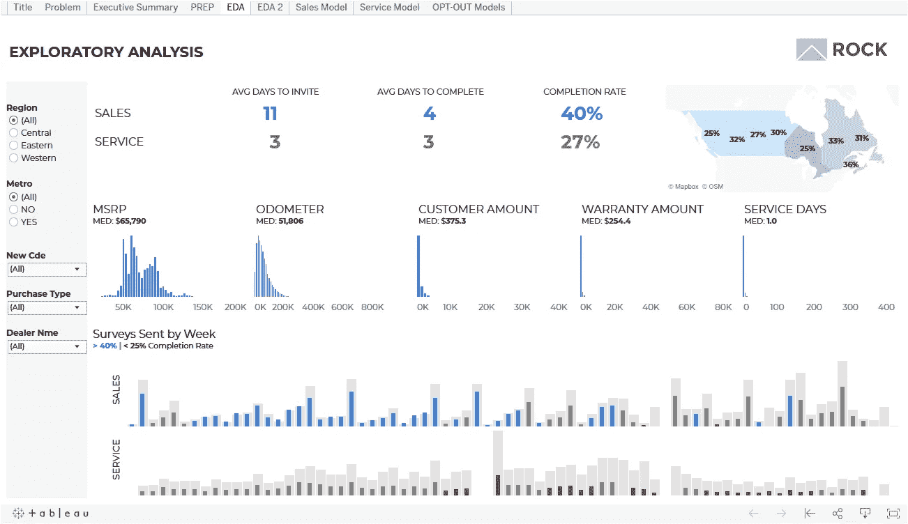

**2 —表格准备**

[Tableau Prep](https://www.tableau.com/products/prep) 提供可视化界面，通过设置流程和时间表来组合、清理和调整数据。

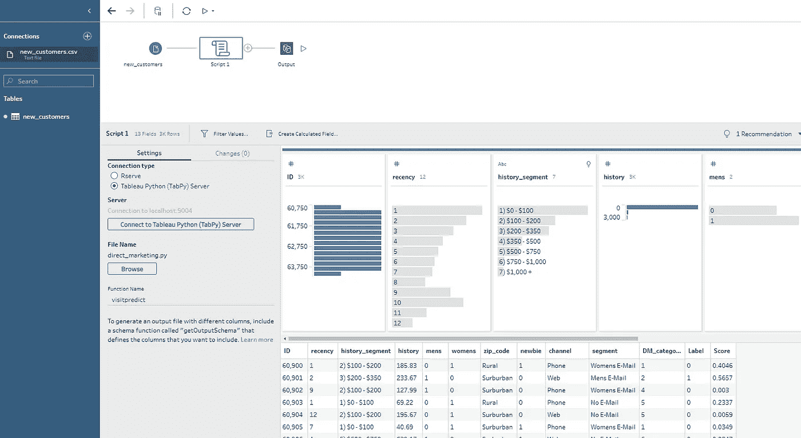

**3 — Python 3.7 或更高版本**

Anaconda 是用于数据科学的 Python 编程语言的免费开源发行版。如果你以前没用过，可以在这里下载[。](https://www.anaconda.com/products/individual)


[https://www.anaconda.com/distribution/](https://www.anaconda.com/distribution/)

**4 — PyCaret Python 库**

要安装 [PyCaret](http://pycaret.org) 库，请在 Jupyter notebook 或 Anaconda 提示符下使用以下代码。

```
pip install pycaret
```

这可能需要 15 分钟。如果遇到任何问题，请查看 project [GitHub](https://www.github.com/pycaret/pycaret) 页面了解已知问题。

**5—tabby Python 库**

TabPy 是运行 python 脚本所需的 Tableau 支持的库。

从 [GitHub](https://github.com/tableau/TabPy) 页面:

> tabby(Tableau Python 服务器)是一个分析扩展实现，它通过允许用户执行 Python 脚本和通过 Tableau 的表计算保存的函数来扩展 Tableau 的功能。

要安装 TabPy，请在 Anaconda 提示符或终端中使用以下代码。

```
pip install tabpy
```

安装后，使用下面的代码启动一个使用默认设置的本地服务器。

```
tabpy
```

要将 Tableau 连接到 TabPy 服务器，请转到“帮助”>“设置和性能”>“管理分析扩展连接”。选择 TabPy 并输入 localhost、端口 9004(默认)并测试连接。

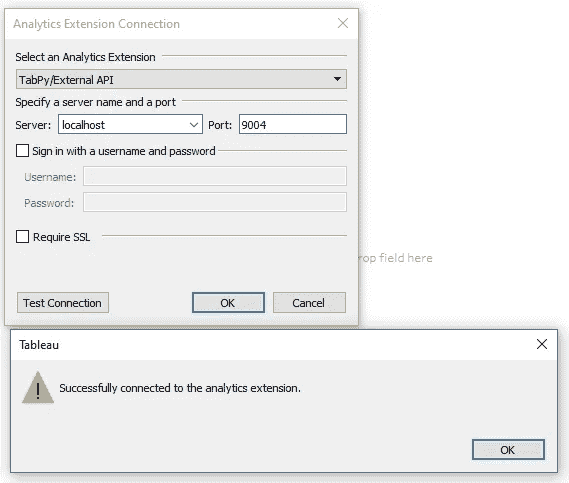

Python 脚本现在可以通过输出为表计算的计算字段在 Tableau 中运行。

有关自定义服务器选项，请参考 TabPy [GitHub](https://github.com/tableau/TabPy) 页面。在外部服务器和/或云上运行 TabPy 和配置 Tableau 服务器将不会在这篇文章中讨论，但是请看[这里](https://help.tableau.com/current/server/en-us/config_r_tabpy.htm)了解更多信息。

# 直接营销数据

将使用的数据集包含通过文本和电子邮件发送给客户的各种营销优惠信息。它包含组织成 ID 列的 64000 条记录、与客户或发送的消息相关的 10 个特征以及指示是否有访问发生的二进制目标。数据可以在这里[下载。](https://github.com/andrewcowannagora/PyCaret-Tableau/blob/master/direct_marketing.csv)

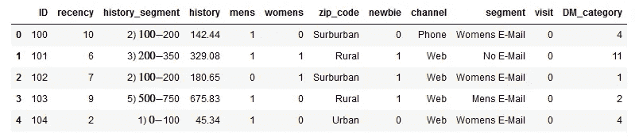

# **预先训练一个模型**

虽然可以在 Tableau 中执行模型训练过程，但这通常不是首选方法，因为每次刷新数据或用户与视图交互时，脚本都会重新运行。这是有问题的，因为:

*   当用新数据重新训练模型时，预测可能会发生意外变化。
*   不断重新运行脚本会影响仪表板的性能。

更合适的方法是在 Tableau 中使用预训练模型来生成对新数据的预测。在这个例子中，我们将使用 Jupyter notebook 来演示如何使用 PyCaret 来直接完成这个过程。

# 在 PyCaret 中构建模型

在 Jupyter Notebook 中运行以下代码将训练一个朴素贝叶斯分类模型，并创建一个保存为 pickle 文件的 ML 管道。

注意，建立和保存模型只用了 4 行代码。完整的笔记本可以在这里下载[。](https://github.com/andrewcowannagora/PyCaret-Tableau/blob/master/TabPy%20Direct%20Marketing.ipynb)

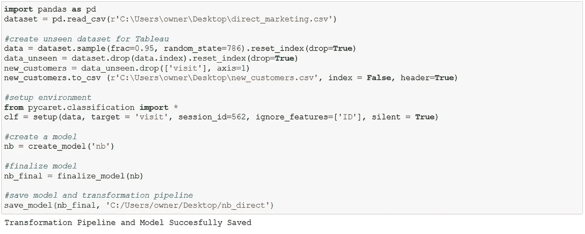

包含训练模型和管道的 Pickle 文件

看不见的数据将用于模拟尚未收到报价的新客户列表。当仪表板部署到生产环境中时，它将连接到包含新客户信息的数据库。

请注意，在设置阶段，PyCaret 执行自动预处理，在这种情况下，通过一次热编码将功能数量从 10 个扩展到 39 个。

这只是 PyCaret 内置功能的皮毛，因此强烈建议查看 PyCaret 网站上的分类[模块](https://pycaret.org/classification/)和[教程](https://pycaret.org/clf101/)。这里不涉及所选型号的具体细节。

# 将模型加载到 Tableau 桌面

现在，看不见的数据将被传递给训练好的模型，并在 Tableau 桌面中进行标记。

说明:

1)打开 Tableau 并连接到在上面的代码中创建的文本文件 new_customer.csv。这只是一个例子，但理想情况下，新的或未标记的客户数据将驻留在数据库中。

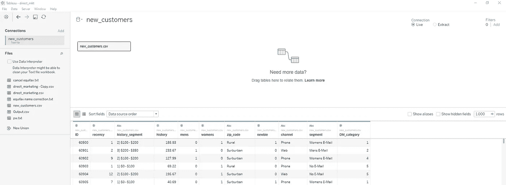

2)在新的工作表中，选择分析>创建计算字段，或在数据窗格中单击鼠标右键。输入以下代码:

```
SCRIPT_INT("
import pandas as pd
import pycaret.classificationnb = pycaret.classification.load_model('C:/Users/owner/Desktop/nb_direct')X_pred = pd.DataFrame({'recency':_arg1, 'history_segment':_arg2, 'history':_arg3, 'mens':_arg4, 'womens':_arg5,'zip_code':_arg6, 'newbie':_arg7, 'channel':_arg8, 'segment':_arg9, 'DM_category':_arg10})

pred = pycaret.classification.predict_model(nb, X_pred)
return pred['Label'].tolist()",
SUM([recency]),
ATTR([history_segment]),
SUM([history]),
SUM([mens]),
SUM([womens]),
ATTR([zip_code]),
SUM([newbie]),
ATTR([channel]),
ATTR([segment]),
SUM([DM_category])
)
```

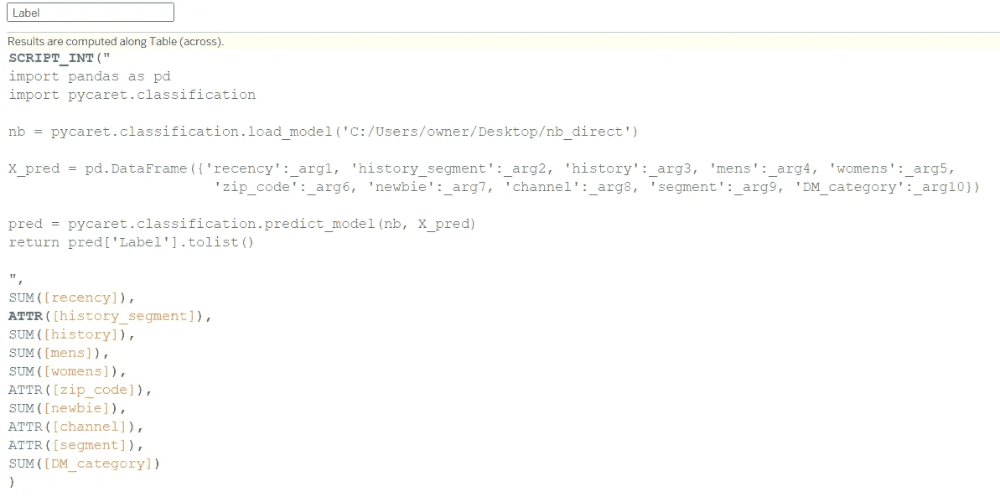

*   脚本函数指定将从计算中返回的数据类型。在这种情况下，它是访问的二元预测标签。
*   PyCaret 中的 load_model()函数加载先前保存的模型和转换管道，该管道被保存为 pickle 文件。
*   X_pred 是一个 dataframe，它将通过 _arg1、_arg2、_arg3…符号将连接到 Tableau 的数据映射为输入。这些字段列在脚本的末尾。
*   predict_model()采用定型模型并根据新的数据输入进行预测。注意，新数据是通过 PyCaret 设置阶段(编码)创建的转换管道传递的。
*   然后，标签以列表的形式返回，可以在 Tableau 中查看。

3)通过将 ID 和标签列拖动到视图中，可以看到模型预测。

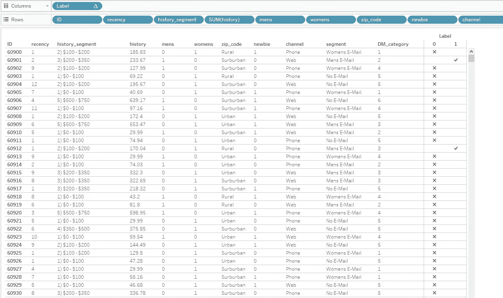

重要的是要理解输出是一个有一些限制的表格计算:

*   该脚本只有在拖到视图中时才会运行。
*   除非两者都在视图中，否则不能用作进一步计算的基础。
*   python 生成的数据不能追加到 Tableau 提取中。
*   每次视图更改时都会运行该脚本，这可能会导致长时间的等待。

这些缺点非常明显，因为当每个记录都必须包含在视图中时，仪表板选项变得有限，在这种情况下，脚本运行 3200 条记录需要大约 4 分钟。

可行的应用包括生成可以导出的评分列表或如下所示的摘要视图。

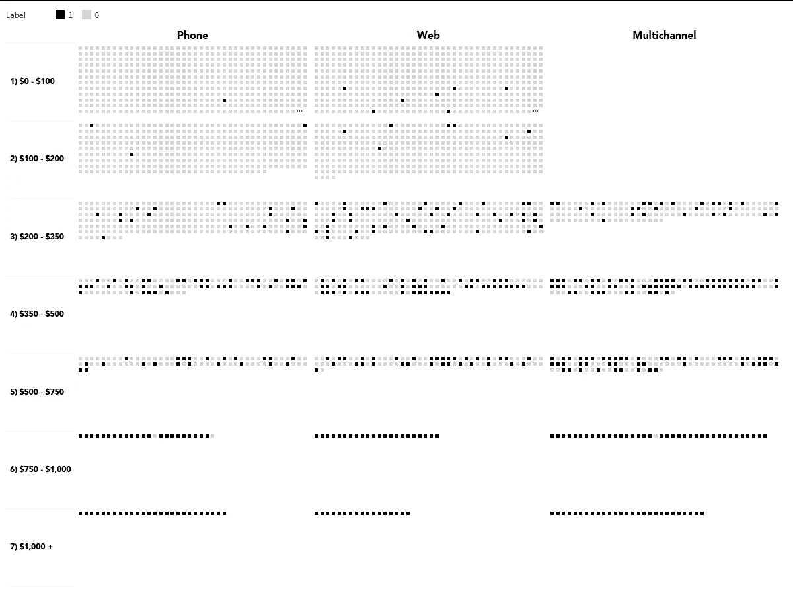

由此得出的一个例子是，高消费客户最有可能光顾，这在商业上是有道理的，但也可能是不必要折扣的一个指标。

# 将模型加载到 Tableau 准备中

绕过在 Tableau Desktop 中直接运行脚本的限制的一个很好的替代方法是使用 Tableau Prep。可以连接新数据，然后将其传递给模型，不同的是，这一次预测的标签被附加到输出中。当连接到 Tableau 时，新列可以正常使用，而不是作为表计算。

说明:

1)打开 Tableau Prep 并连接到在上述代码中创建的文本文件 new_customer.csv。

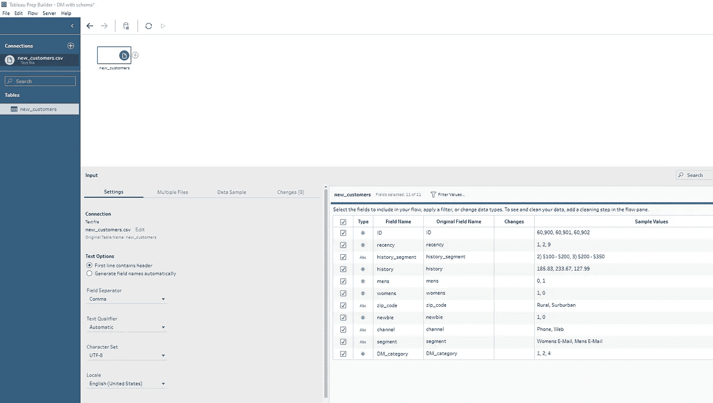

2)在流窗格中选择文件旁边的“+”按钮，并添加脚本选项。像在 Tableau Desktop 中一样，使用 localhost 和 9004 连接到应该还在后台运行的 TabPy 服务器。

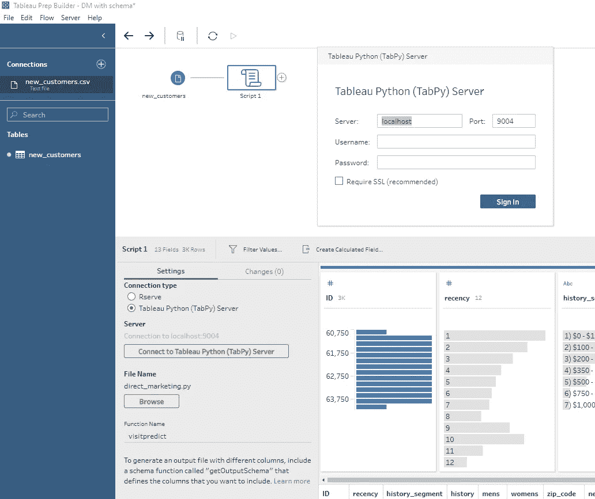

3)接下来，需要创建以下 python 脚本，并使用浏览选项连接到 prep。可以在这里下载[。](https://github.com/andrewcowannagora/PyCaret-Tableau/blob/master/direct_marketing_prep.py)

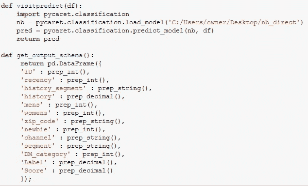

创建一个加载 pickle 文件的函数，该文件包含保存的模型和转换管道。装载到 prep 中的数据自动保存在 df 对象中，并传递给模型。

PyCaret 输出将返回初始数据集和两个新追加的列；标签(预测)和分数(预测的概率)。输出模式确保将列和数据类型正确读入 prep。

然后必须将函数名输入到 prep 中。

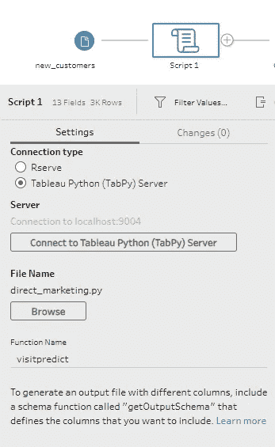

4)选择脚本图标旁边的“+”号，然后选择输出。可以发布为. tde 或。将 hyper 文件发送到 Tableau 服务器，这是生产环境中的首选方法，但在本例中，会将. csv 文件发送到桌面。

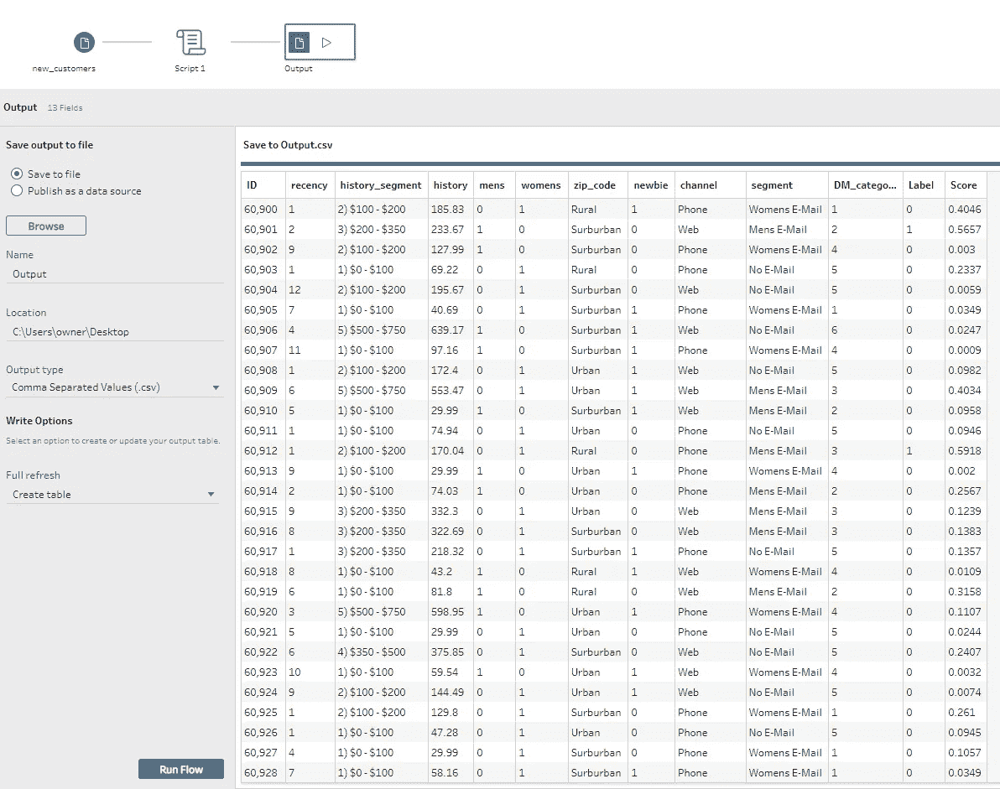

请注意 label 和 score 列现在是如何追加到原始数据集的。选择“运行流程”以生成输出。此处可以下载[的流量文件。](https://github.com/andrewcowannagora/PyCaret-Tableau/blob/master/DM_Model_Flow.tflx)

在服务器环境中，可以安排流运行的时间，并在数据到达实际的 Tableau 仪表板之前自动完成评分过程。

# 将流输出加载到 Tableau 中

新标记的数据现在可以连接到 Tableau Desktop，而没有表计算限制和变慢。

可以创建聚合和任何其他所需的计算，以设计显示各种预测指标的摘要仪表板:

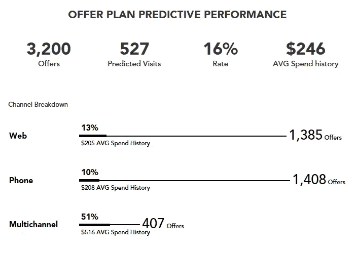

一旦数据和 ML 管道建立，营销人员和高管将能够快速跟踪即将到来的活动可能如何进行，只需最少的干预。包含示例仪表板和早期脚本的 Tableau 文件可以从[这里](https://github.com/andrewcowannagora/PyCaret-Tableau/blob/master/DM_Dashboard.twbx)下载。

# 结束语

本文展示了 PyCaret 如何与 Tableau Desktop 和 Tableau Prep 集成，以便在现有工作流中快速添加一层机器学习。

通过使用组织和 PyCaret 库熟悉的工具，可以在几分钟内建立完整的 ML 管道，从而使预测分析原型快速启动。

# 有用的链接

[PyCaret](https://pycaret.org/)

[PyCaret:用户指南和文档](https://pycaret.org/guide/)

[PyCaret:教程](https://pycaret.org/tutorial/)

PyCaret: Youtube

[领英](http://www.linkedin.com/in/andrewcowannagora)