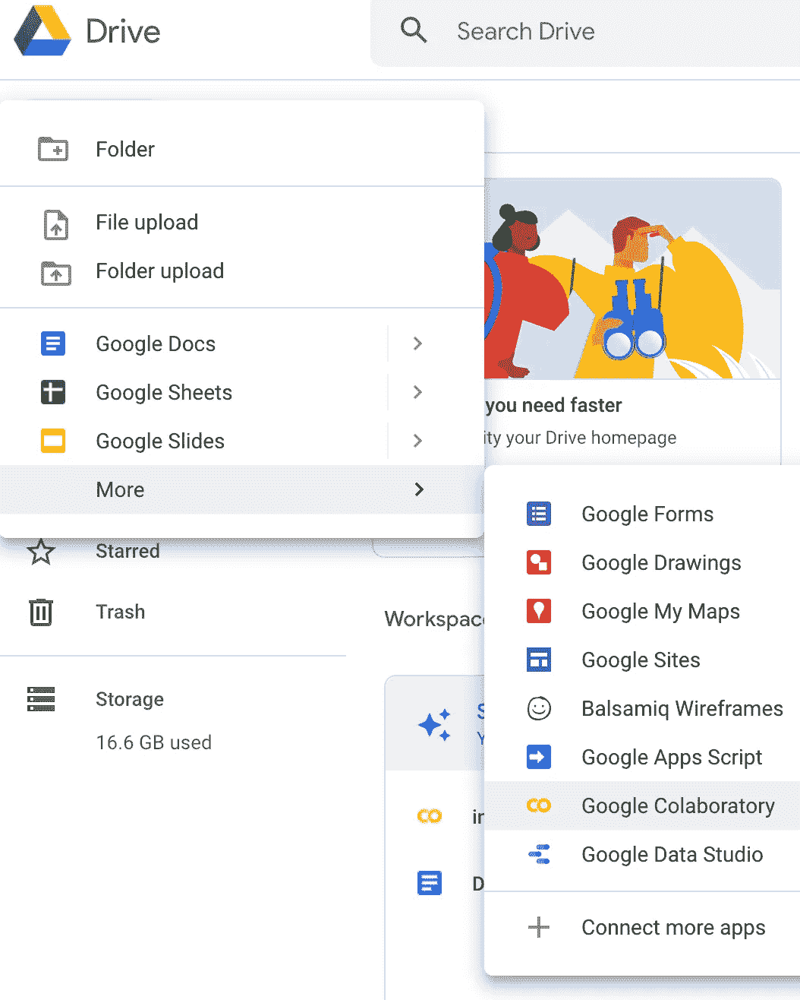
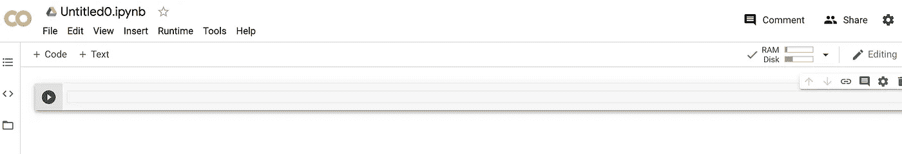
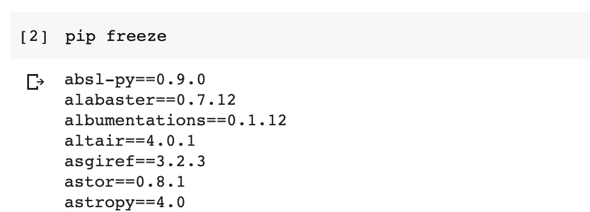
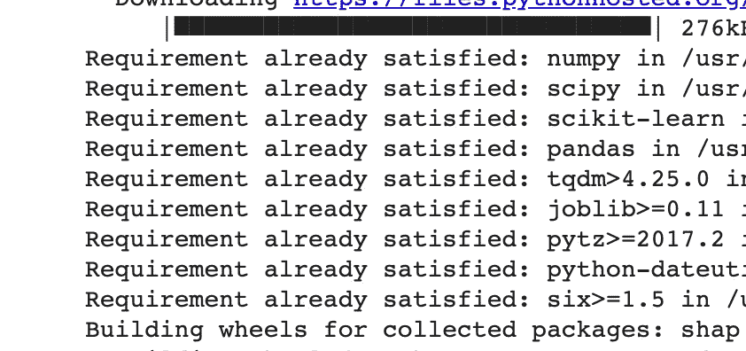
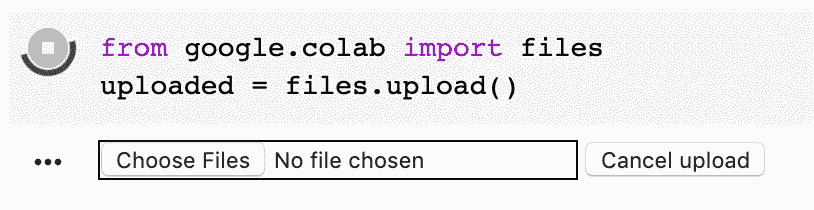
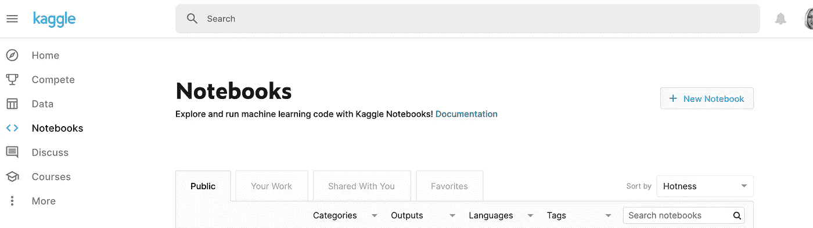
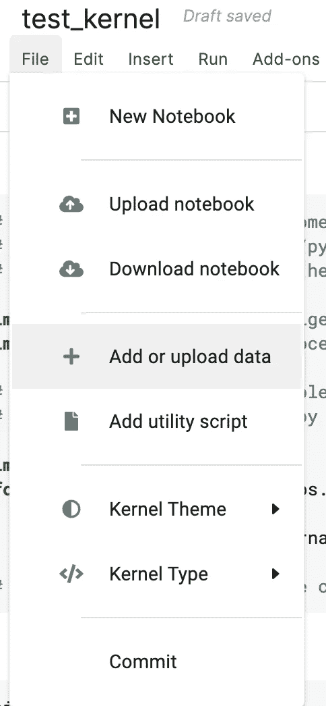
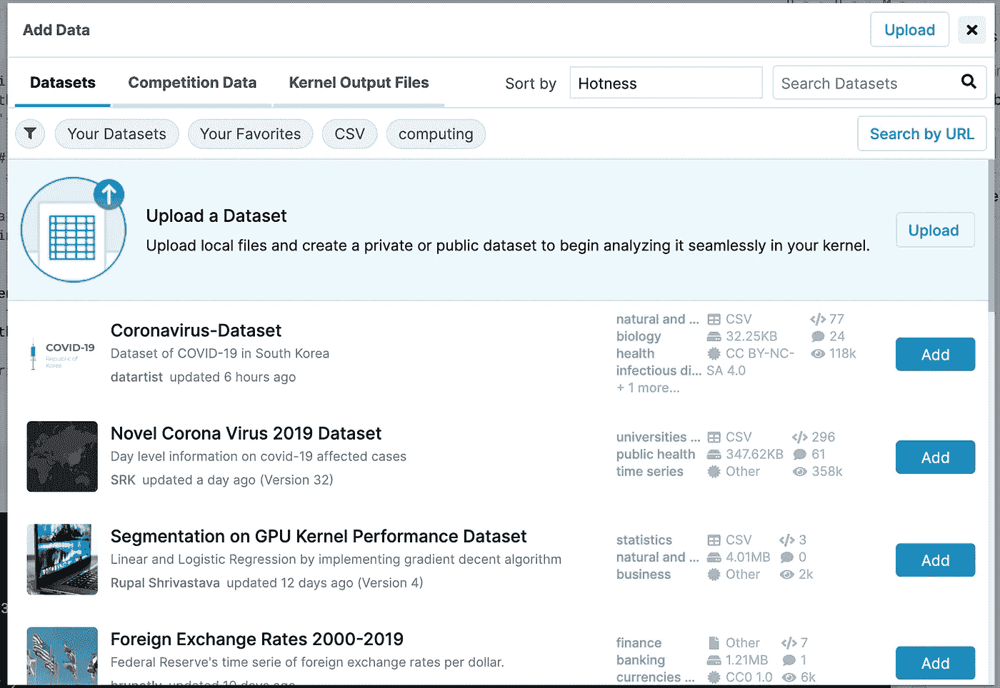
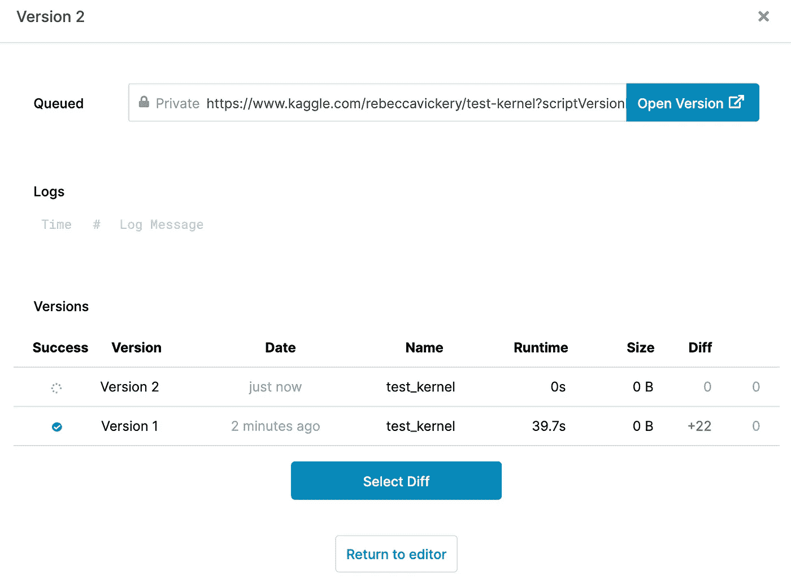

# 浏览器中的机器学习

> 原文：<https://towardsdatascience.com/machine-learning-in-the-browser-7fc08858640?source=collection_archive---------20----------------------->


由[安妮·斯普拉特](https://unsplash.com/@anniespratt?utm_source=unsplash&utm_medium=referral&utm_content=creditCopyText)在 [Unsplash](https://unsplash.com/s/photos/collaboration?utm_source=unsplash&utm_medium=referral&utm_content=creditCopyText) 上拍摄

## 在线构建可共享的机器学习模型

Jupyter 笔记本是用于构建机器学习模型的最常见的环境之一。然而，它们也有一些缺点。Jupyter 笔记本非常适合在本地开发机器学习模型，但很难分享和协作使用该工具生成的代码。

此外，还需要合理的设置，尤其是如果您不是 python 的当前用户。您需要设置一个 python 环境，安装 Jupyter 及其依赖项，以及您可能需要的任何其他 python 包。

幸运的是，有一些工具可以让您在笔记本上直接在浏览器中运行和开发 python 代码，而不需要任何设置。在这篇文章中，我将简要介绍其中的两个工具；

1.  谷歌联合实验室
2.  Kaggle 内核

**谷歌合作实验室**


Google [Colaboratory](https://research.google.com/colaboratory/faq.html) ，通常被称为 colab，是 Google 创建的一个产品，允许任何人在浏览器中创建和运行 python 代码。它有许多内置的标准机器和数据科学库，包括 pandas 和 scikit-learn。您还可以在每个笔记本中安装几乎任何其他 python 库。

要访问 colab，你需要注册一个谷歌账户，然后你就可以免费访问笔记本环境和包括 GPU 在内的计算资源。

让我们快速演示一下。

登录到您的 Google 帐户后，转到 drive 并选择新的 Google 协作室。



这将打开一个新的空笔记本。



您可以通过运行`pip freeze`来查看预安装的软件包。



如果你需要安装任何还没有的包，你可以通过运行`pip install package`来完成。



有多种方法可以导入数据，包括直接从 Google drive 加载文件。让我们看一个从本地 CSV 文件导入数据的例子。

首先，我们运行这段代码。

```
from google.colab import filesuploaded = files.upload()
```

然后，您会看到一个按钮，用于选择存储在本地系统上任何位置的文件。



您现在可以自由地编写代码来创建您的机器学习模型。

Google colab 笔记本可以通过链接共享，就像你可以共享任何 Google 文档一样。链接的接收者可以运行和编辑您的代码。

## Kaggle 内核

Kaggle 内核需要一个 Kaggle 帐户，但也可以完全免费使用。它们与 Google colab 笔记本非常相似，但一个优点是它们包括版本控制。

一旦你创建了一个帐户，你可以导航到网站的[内核](https://www.kaggle.com/kernels)部分，并选择**新笔记本**。



和 colab 一样，Kaggle 内核提供了许多标准的 python 库，你可以用`pip freeze`查看。导入其他库使用与 colab 完全相同的方法，安装包也是如此。

加载数据非常简单。首先选择**文件**，然后**添加或上传数据**。



现在你有很多选择。您可以使用 Kaggle 数据集、内核输出文件或上传您自己的本地 CSV 文件。



正如我提到的，Kaggle 内置了版本控制。这意味着您可以将更改提交到您的内核或其他人的内核，并在需要时跟踪和恢复到以前的版本。这有助于合作。



这是对这些工具中可用选项和功能的简要介绍。这两者的功能都值得进一步研究。我经常使用浏览器内笔记本向他人提供我的工作演示，尤其是那些可能不会使用 Jupyter 笔记本或 python 的非数据科学家。这两个工具也可以成为学习机器学习和数据科学的好方法，而无需在本地设置 python 和笔记本环境的开销。

感谢阅读！

我每月发送一份时事通讯，如果你想加入，请点击此链接注册。期待成为您学习旅程的一部分！