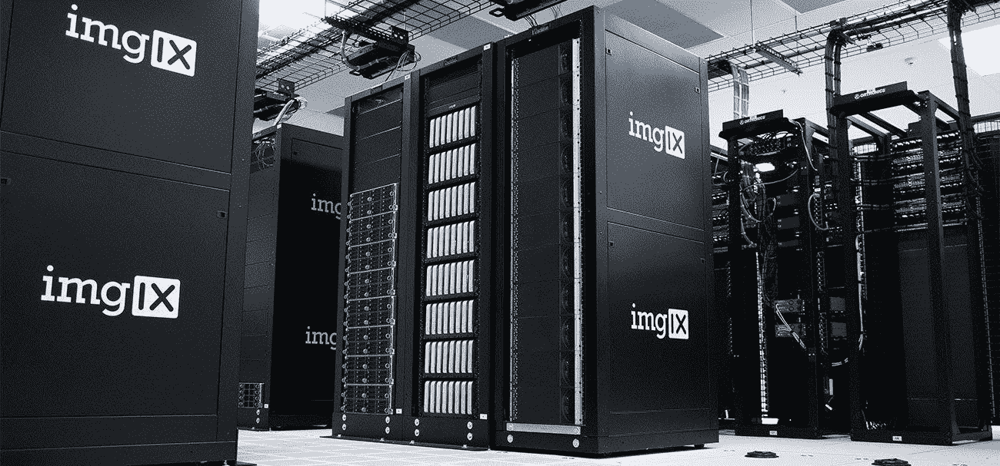

# 云中的机器学习与内部部署

> 原文：<https://towardsdatascience.com/machine-learning-in-the-cloud-vs-on-premises-452c9c34e6fd?source=collection_archive---------31----------------------->

# 云只是别人的电脑

开发人员之间流传着一个笑话，云只是别人电脑的一个词。但事实是，通过利用云，您可以获得使用本地服务器场无法实现的优势。

超级云提供商(AWS、Azure、GCP)能够提供更低的总拥有成本，同时提供从可扩展性到安全性的卓越功能。当你只能在需要的时候从货架上拿下来的时候，在内部构建所有东西是没有经济意义的。云供应商不断创新解决方案，例如只按使用时间计费的服务器，而不是按运行和等待请求的时间计费的服务器。他们还能够吸引可扩展性和安全性等方面的专业人才，这是其他所有供应商无法做到的。

# 云和机器学习

大多数机器学习实验都是从理解你笔记本电脑上的数据开始的，不需要那么多计算能力。但是很快你就会遇到超出你的本地 CPU 所能提供的需求。云是迄今为止更具可扩展性的进行机器学习的地方。您将获得最新的 GPU，甚至是您自己无法负担和维护的 TPU。

但是，当您的需求满足以下一些标准时，本地服务器场是一种有效的替代方案:

1.  您需要 24/7 的计算能力(例如，由于大型团队或大型模型)
2.  出于合规性或其他原因，您拥有不能离开数据中心的敏感数据

在许多情况下，混合解决方案也可能是可行的，其中初步模型测试在内部完成，生产就绪模型在更强大的云机器上开发，或者通过在推断之前尝试数百个不同的模型来开发。在大多数情况下，使用正确的工具，云是进行原型开发和生产就绪机器学习的最快方式。

在云中进行机器学习的三个主要原因:

1.  灵活的资源使用以应对尖锐的硬件资源需求
2.  只需点击一个按钮，即可访问最新的硬件
3.  不受限于特定硬件的解耦架构

# ML 云实施的最佳实践

在与数百家从事机器学习的公司合作后，我们已经看到了内部硬件和云计算的好处。关键要点如下:

*   云提供商之间存在差异，尤其是对于寻求数据隐私的企业而言，找到最适合您的提供商
*   确保您的数据与您要使用的计算位于同一个云数据中心。如果您的数据需要从世界各地的本地数据存储进行传输以进行计算，则大型数据集上的训练模型会变得很慢。如果您使用 AWS EC2 来最小化延迟等，请将您的数据存储在 S3。
*   对于结构化数据(数据库或 Spark 集群中的表格数据)，使用预处理步骤，首先将数据转储到平面文件中。文件为数据库查询提供了持久层，从而在训练模型时提高了版本控制和可重用性。遵循“提取一次，无限训练”的黄金原则。
*   混合解决方案是一种最佳实践:如果你已经有本地硬件，不管是一个 Tesla V100 还是一个 Titan RTXs 的服务器群，都可以使用它们。向云的过渡不会一蹴而就，这很好。
*   获得一个机器学习平台，将硬件从数据科学家那里抽象出来。
*   让您的数据科学家专注于数据科学，而不是 DevOps 或 MLOps，无论他们使用哪种云或本地硬件。

*最初发表于*[*【https://blog.valohai.com】*](https://blog.valohai.com/machine-learning-in-the-cloud-vs-on-premises)*。*