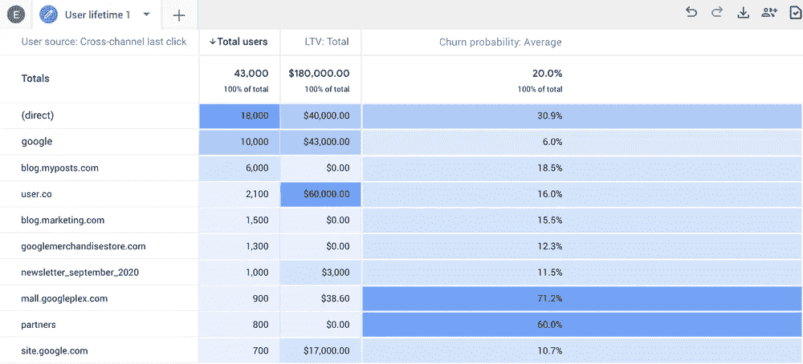
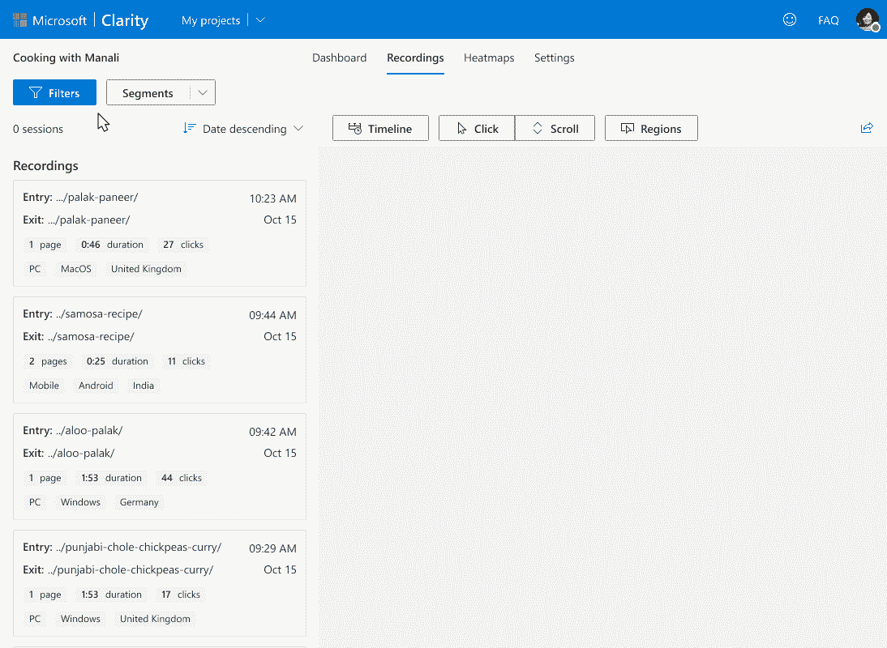

# 网络分析中的机器学习——谷歌分析变得更好了吗？

> 原文：<https://towardsdatascience.com/machine-learning-in-web-analytics-has-google-analytics-changed-for-better-1419e187042f?source=collection_archive---------18----------------------->

## 谷歌分析 4 最近推出，它具有先进的机器学习能力。未来 5 年，ML 会统治网络分析的世界吗？

图片由 [janjf93](https://pixabay.com/users/janjf93-3084263/?utm_source=link-attribution&utm_medium=referral&utm_campaign=image&utm_content=3614766) 来自 [Pixabay](https://pixabay.com/?utm_source=link-attribution&utm_medium=referral&utm_campaign=image&utm_content=3614766)

企业一直试图以更好的方式了解客户及其买家的旅程，以推动更好的转化率和[**增加终身价值**](https://www.resourcifi.com/blog/increase-customer-lifetime-value-clv/?utm_source=Towards%20Data%20Science) 。而且，在当今世界，当买家的大部分旅程都在网上时，网络分析变得比以往任何时候都更加重要。

网络分析与机器学习能力结合在一起，对企业来说确实非常了不起。谷歌分析 4 已经在这条路上走了一英里。

在这篇文章中，我将谈论谷歌分析 4 以及新引入的机器学习功能如何更好地改变分析。

但在我们开始之前，让我们回顾一下机器学习是如何改变网络分析的！

# 网络分析中的机器学习

除非能够分离和处理，否则收集的数据毫无用处。随着网络用户数量的不断增加，网站间的平均流量也在不断增加。

在使用机器学习的大数据分析(BDA)出现之前，分析这些庞大的数据集是一件痛苦的事情。

## 大数据分析(BDA)

一篇名为《 [**关于将大数据分析整合到大洞察以创造价值的调查**](https://www.researchgate.net/figure/The-timeline-of-the-big-data-processing-and-technologies_fig3_323047768) 》的研究论文提到了大数据分析的七个特征，具体如下:

> BDA 的七个特征包括“量”(支持非常大的数据量)、“速度”(快速分析数据流)、“多样性”(支持不同种类的数据)、“准确性”(支持高数据质量)、“价值”(洞察和利益的价值)、“可变性”(支持不断变化)和“价”(支持数据的连通性)。

说到这里，我们大多数人都知道，两种最常见的数据分析算法是有监督的 ML 算法和无监督的 ML 算法。

对于一些不知道这两者之间区别的人来说，简单地说，这里有监督 ML 和非监督 ML 算法。

无监督方法/算法是自我学习模型，主要用于发现未检测到的信息/模式。

另一方面，监督 ML 算法采用已知的输入数据&该数据的已知输出，并使用该信息来训练模型，以便为全新的数据集生成合理的预测。

这两者结合在一起，已经完全改变了企业使用网络分析的方式，并且变得更好。

大数据分析在企业决策方面使用网络分析的重要性与日俱增。这相应地增加了机器学习算法在网络分析中的应用的紧迫性，用于价值创造和 [**有机业务增长**](https://userp.io/organic-business-growth/) 。

# 谷歌分析和机器学习

谷歌分析是网络分析领域的领导者，分析收集的两种主要数据类型是——用户属性/维度和事件。

企业一直在使用这些数据，通过更好地了解用户来优化网站数据。

在用户维度类别中，Google Analytics 收集的一些数据类型有— **年龄、性别、国家、设备型号/类别**等。Google Analytics 收集的一些事件类型有— **搜索、选择内容、注册、点击、文件下载、首次访问**等。

数以百万计的小型和大型企业使用谷歌分析以更好的方式了解他们的客户，并为他们创造更好的用户体验。

在网络分析中使用机器学习绝对不是一件新鲜事，但是在谷歌分析 4 中使用机器学习的方式是全新的！

多年来，人们已经在网络分析中使用机器学习功能，以更好的方式理解网络流量。

例如，我们之前已经了解过数据科学— [**将 Google Analytics 命中级别数据发送到 BigQuery**](/send-google-analytics-hit-level-data-to-bigquery-5093e2db481b) 和 [**自动将数据导入到 Google Analytics**](/automate-data-import-to-google-analytics-471de2c3fc76) 。

除此之外，我们已经看到监督或无监督聚类如何帮助我们以更全面的方式理解 web 流量。

如果你不熟悉如何使用聚类——一种理解网络流量的机器学习技术，这里有一篇 Russ Thompson 的[文章，可以帮助你获得基本的想法。](https://blog.alexa.com/data-science-101-clustering/)

但当我们谈论在网络分析中使用机器学习时，你应该知道每个机器学习模型都需要几个元素来实现最大影响:

*   **你需要你的 ML 模型来回答的问题**。
*   **准备数据**馈入你的模型。人们更喜欢使用 R 从 Google Analytics 或任何其他来源收集网络分析数据。
*   **评估您的 ML 模型的产出**。虽然你可能理解 web analytics 中的机器学习模型产生的数据，但你必须实现数据可视化，以便管理层和非技术团队成员都能理解。
*   **利用数据获得更好的投资回报。**提高商业投资回报率是在网络分析中使用机器学习的核心原因之一。

但是，如果谷歌分析自己开始使用 [**机器学习**](https://www.resourcifi.com/hire-machine-learning-developer/) 并通过以比以往任何时候都更容易理解的格式使用数据来展示见解，从而帮助你最大限度地利用它，会怎么样呢？好消息是——谷歌分析 4 正在这么做！

# 谷歌分析 4:机器学习如何改变谷歌分析？

2020 年 10 月，谷歌使 [**谷歌分析 4 在公共领域**](https://blog.google/products/marketingplatform/analytics/new_google_analytics/) 可用。然而，类似的东西的测试版于 2019 年 7 月发布。

最初的想法是将应用和网络分析结合起来，从总体上激发 [**更好的营销**](https://www.resourcifi.com/resources/ebooks/marketing/scale-business-budget/?utm_source=Towards%20Data%20Science) 和业务投资回报率。

[**来源**](https://blog.google/products/marketingplatform/analytics/new-way-unify-app-and-website-measurement-google-analytics/)

在 Google Analytics 中测试机器学习的可用性 1 年多之后，Google 终于在测试期推出了 Google Analytics 4，即所谓的 App+Web Properties。

在 Analytics 4 之前，你可以问这样的问题:“上个月哪些产品的购买量超过了 100 次？”分析智能将使用其 ML 功能生成结果。

但下面是引入机器学习后，Google Analytics 4 的新功能。

## **实时监控流量**

您现在可以用所有支持的语言提问，以实时生成结果。您可以使用属性“实时”来获取过去 30 分钟的分析数据。例如，你可以监控一天促销活动的网站/应用流量。

您还可以监控您正在开展的活动的即时效果，或者最近在您的网站或应用程序上所做的更改对其有何影响。

## **搜索即时答案**

你可以用自然语言询问分析数据，以在谷歌分析 4 中获得即时答案。您可以指定属性、指标、时间范围或维度。

例如，您可以搜索 ***“亚利桑那州上周转化率”*** 或 ***“美国上周移动用户”*** 以获得报告、数据、见解等。

## **跨平台分析**

“应用+网络属性”和现在的谷歌分析 4 的一个关键亮点是它能够通过结合你的网络和应用用户的数据向你展示洞察力。使用机器学习功能，Google Analytics 4 可以根据您选择的任何属性(指标、维度等)为您提供即时数据可视化。

您可以使用 Google Analytics 4 在您的用户漏斗中定义多达 10 个步骤，并清晰地可视化您的用户在每个步骤中是如何进入或退出的。这将帮助你找到对你的网络或 [**移动应用**](https://www.resourcifi.com/blog/start-app-business/) 用户来说什么有用，什么没用的答案！

## **智能提醒**

如果您的网站或应用程序使用机器学习功能看到用户的显著增加/减少或您的网络/应用程序数据的变化趋势，新的 Google Analytics 4 会提醒您。

这些智能警报将帮助您在用户数量突然增加或突然减少时采取任何即时措施。此外，新的 Analytics 4 可以帮助您提前预测您的用户行为。例如，它可以让你预测特定用户群的收入——流失概率。

[来源](https://blog.google/products/marketingplatform/analytics/new_google_analytics/)

## 谷歌信号

虽然谷歌信号并不新鲜，但在谷歌分析 4 中打开谷歌信号确实可以帮助你提高营销投资回报率，并采取措施进行 [**实时线索生成**](https://limecall.com/blog/real-time-lead-generation/) 。

例如，使用来自打开广告个性化的用户的谷歌数据，Analytics 4 在谷歌信号打开时生成更准确的用户计数报告。

这些只是在引入机器学习功能后，新的谷歌分析 4 中引入/改变的一些东西。话虽如此，Google Analytics 引入 ML 只是一个开始。

总的来说，机器学习在谷歌分析以及网络分析的未来中扮演着重要的角色。

# 机器学习在未来网络分析中的作用

*你知道吗* [***微软 Clarity——微软***](https://blogs.bing.com/webmaster/october-2020/Microsoft-Clarity-is-now-Generally-Available) *的网络分析工具将于 2020 年 10 月公开发售。*

[**来源**](https://blogs.bing.com/BingBlogs/media/WebmasterBlog/Clarity-filters.gif)

虽然谷歌分析 4 和微软 Clarity 的全面比较尚未公布，但可以肯定地说，鉴于其分析应用数据的能力，分析 4 也优于 Clarity。

话虽如此，甚至微软 Clarity 也增加了机器学习功能，允许其用户使用“过量记录”、“死点击”等参数来过滤网站数据和会话记录。

网络分析中的机器学习绝对是未来，而且前景光明。随着自然语言处理的新进展，如谷歌的大鸟，机器学习肯定会彻底改变我们今天看待和使用网络分析的方式。

 [## 理解大鸟——它是 NLP 的另一个重要里程碑吗？

### 谷歌研究人员最近在 arXiv 上发表了一篇题为《大鸟:更长序列的变形金刚》的论文。

towardsdatascience.com](/understanding-bigbird-is-it-another-big-milestone-in-nlp-e7546b2c9643) 

谷歌和微软正式将先进的机器学习和人工智能纳入网络分析的好处是，它将使营销人员和企业更容易执行和衡量活动。

此外，它还将帮助 [**降低企业的营销成本**](https://www.resourcifi.com/blog/reduce-marketing-costs/?utm_source=TowardsDataScience) ，通过实时优化投资回报率，以及消除使用第三方人工智能/人工智能工具进行更智能的网络分析的需求。

 [## 新发现的友谊的故事:艾、曼梯·里和疫情

### 这篇文章讲述了这个疫情如何给了人工智能-ML 阿朵急需的推动，以及这个新发现的…

towardsdatascience.com](/the-story-of-newly-found-friendship-ai-ml-and-the-pandemic-6ceb02376ebd)