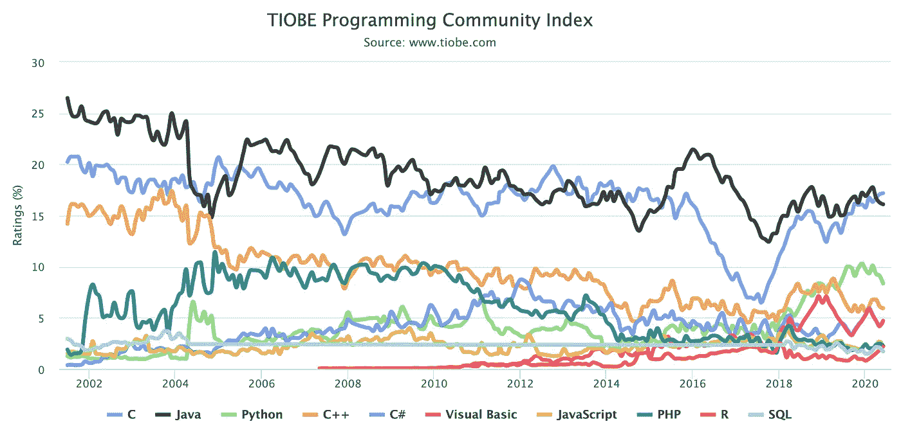
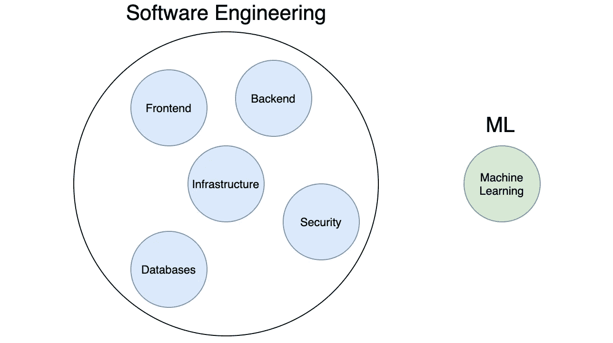

# 机器学习变得越来越容易。软件工程仍然很难

> 原文：<https://towardsdatascience.com/machine-learning-is-getting-easier-software-engineering-is-still-hard-d4e8320bc046?source=collection_archive---------6----------------------->

## 意见

## 为什么这对软件工程师有利，对 ML 工程师不利

来自 [Pexels](https://www.pexels.com/photo/woman-in-pink-crew-neck-top-and-jeans-sitting-down-on-the-floor-using-laptop-3885676/?utm_content=attributionCopyText&utm_medium=referral&utm_source=pexels) 的 Andrea Piacquadio 的照片

*免责声明:这是一篇观点文章。也有失偏颇。我认为，如果有更多的多面手和创造者(而不是专家)来制造东西和解决问题，这个世界会变得更好。*

在过去的 5 年里，机器学习变得更加容易。同时，软件工程比以往更加复杂。

这对软件工程师来说是一件好事。但不适合 ML 专家。

这是 ML 向软件工程和数据科学向数据分析的进展。

# 机器学习工具变得越来越平易近人

谷歌很乐意让每个人都可以接触到训练 ML 模型，不管他们的技术知识如何(见:[技术民主化](https://en.wikipedia.org/wiki/Democratization_of_technology))。

随着 ML 变得触手可及，云服务的市场也在增长，而理解算法的价值却在侵蚀。

从前，我们手工编写算法。然后 Sklearn 允许用几行代码做同样的事情。

最初的张量流很难使用。Keras 使它变得容易。

谷歌、微软和亚马逊现在都在云中提供选择、训练和调整模型的服务，然后立即在 API 后面提供模型。

要有人能训练人工智能还需要一段时间。但是随着复杂性的降低，它变成了经验丰富的软件工程师放在口袋里的另一个工具。

# 机器学习的发展集中在几种语言中

语言是一条护城河。句号。

你知道 COBOL 吗？如果是的话，[你有一份终身工作](https://www.reuters.com/article/us-usa-banks-cobol/banks-scramble-to-fix-old-systems-as-it-cowboys-ride-into-sunset-idUSKBN17C0D8)。世界金融体系有赖于此。没有人再学习 COBOL 了。

大多数机器学习都是用 Python 实现的[，而软件开发则分散在大量语言中。](https://www.techrepublic.com/article/github-the-top-10-programming-languages-for-machine-learning/)

[https://www.tiobe.com/tiobe-index/](https://www.tiobe.com/tiobe-index/)

如果每个 ML 工程师都有 Python 经验，那么你就是在和每个 ML 工程师竞争。在软件方面，你只与使用相同技术的工程师竞争。

我总是惊讶地看到许多高薪的 Ruby on Rails 工作。它几年前就过时了，但是许多大公司(Shopify、Instacart、Kickstarter 等)因为传统原因还在使用它。

你完全可以也应该学习多种语言。成为一名优秀的软件工程师就靠它了。

# 软件工程包含更大范围的技能

我们期望软件工程师至少对所有的事情都有一些了解。

速写

后端工程师仍然知道浏览器是如何工作的。一个前端工程师有一些数据库的概念。两者都可以防止像 SQL 注入那样的安全漏洞。

对软件有一个整体的理解，更容易改变专业。它还让您能够构建端到端的解决方案。

广泛的技能组合使软件工程师更适合模糊的环境。随着需求的增加，软件工程师通常会转向数据科学。相比之下，数据科学家不太可能开发软件。

随着人们开始将 ML 视为硬编码条件逻辑的替代方案，我们将会看到更多的软件工程师从事 ML 工作。

# 成为一名合格的全栈开发人员需要数年时间

并且包含许多独立的技能。

优化数据库、构建 API 微服务和打造响应性前端毫无共同之处。它们可能用三种不同的语言实现。

我们在这些领域很少看到自动化。

相比之下，全栈 ML 工程师现在正在完成日益强大的 AutoML，为此我可以写一个 SOP，并委托一个实习生训练分类器。

软件工程技能组合中的所有部分自动化消失还需要一段时间。

# 机器学习是对产品的补充，而不是产品本身(通常)

少数公司将人工智能作为其核心产品，但大多数公司使用它来补充现有产品。

Medium 可能会使用机器学习进行文章推荐，但核心产品是写作/发布平台。

有趣的是，大多数公司将 ML 用于简单和相似的用例。这使得单个公司很容易将所述用例作为 SaaS 产品来提供。突然之间，创业公司不再需要在内部构建它了。

相比之下，像基础设施这样的问题就非常复杂和定制化。AWS 上没有现成的解决方案可以很快处理 [Medium 的基础设施](https://medium.engineering/tagged/infrastructure)。

# 基础设施变得异常复杂

AWS 已经扩展到 200 多种不同的云服务。

Heroku 在云中运行应用程序的 PaaS 方法非常棒。但是在任何大规模下都变得非常昂贵。

因此，现在我们有一个全新的云堆栈需要管理(网络、数据库、服务器)，其中的一个小失误就可能导致巨大的安全漏洞。

有一个完整的开发子集叫做“云工程”，其工作是让软件在 AWS、GCP 或 Azure 上工作。

在较小的公司中，基础设施通常落在高级开发人员的肩上。

这是复杂的东西。但这也意味着工作和难以复制的技能。

# 前端开发是不断发展的

独自站在前端开发的顶端是一种技能。

当我开始开发时，用 jQuery 构建响应性前端是可以的。然后公司开始转向 Angular 或 React。Angular 变成 Angular 2(带有突变)。React 从类转移到功能组件，并增加了挂钩。

所有上述框架/库的工作方式完全不同。

有几家公司正在研究基于实体模型的自动生成前端。但同事们一致认为，他们离生产质量还有很长的路要走。

前端开发中的技术能力，加上对完美的感觉，令人惊讶地感觉暂时是合理的。

# 结论

软件开发是复杂的，包含各种各样的问题。这种复杂性有利于就业。

但更重要的是，广泛的技能组合赋予了端到端解决实际问题的能力。

为了建立一个典型的人能够解决他们自己社区中的问题的社会，软件工程是一个很好的起点。

机器学习有一席之地吗？绝对的。但是解决问题不仅仅是训练一个模型

学软件工程。制造东西。解决问题。