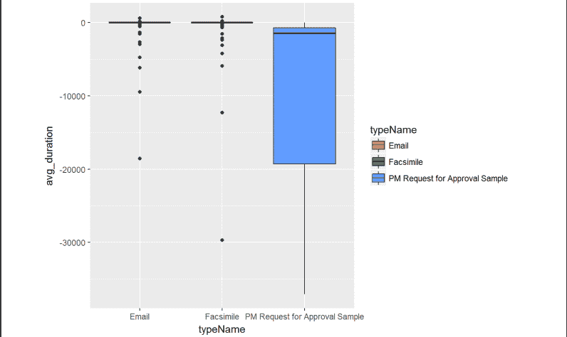
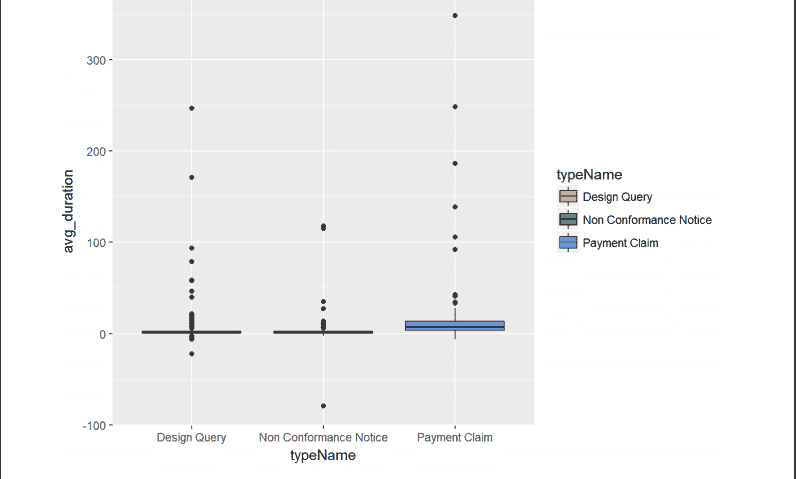

# 机器学习并不总是数据问题的解决方案

> 原文：<https://towardsdatascience.com/machine-learning-is-not-always-the-solution-to-a-data-problem-7f07c000f15?source=collection_archive---------48----------------------->

## 大数据和机器学习

# 概观

有人给了我一个很大的文件数据集，有人称之为大数据，并让我想出一个数据问题的解决方案。人们经常将大数据与机器学习联系在一起，并自动跳转到机器学习解决方案。然而，在处理了这个数据集之后，我意识到机器学习不是解决方案。这个数据集是作为一个案例研究提供给我的，我必须完成这个案例研究，这是一个 4 步面试过程的一部分。

## 任务描述

该数据集由一组跟踪多个建筑项目中的电子邮件活动的文件组成。所有数据都被匿名了。任务是探索数据集，并报告任何见解。我被告知，客户关心的是项目的持续时间和现场说明的数量，以及在项目中看到的变化，因为这些通常都要花钱。

# 数据 ETL

首先，通信数据被读入并附加在一起。对数据进行了重复检查。未找到重复项。

由于客户关心项目的持续时间，要求响应的日期和发送日期之间的差异是以天计算的。但是，有相当多的“要求响应日期”和“发送日期”值缺失。这些记录被排除在外；因此，数据集从 7 个变量的 20，006，768 条记录减少到 3，895，037 条。然后，将通信数据与邮件类型文件相结合，以确定通信类型是否对持续时间有影响。最后，合并一个包含每个项目记录数量的文件。

通常，在没有正当理由的情况下排除数据不是好的做法；然而，由于该数据集是作为工作申请流程的一部分分配给我的，我没有机会更好地理解该数据集以估算日期。

正如您可以从下面导入数据集的代码中看到的，除了项目 ID、记录数、类型 ID 和类型名之外，我们没有太多关于电子邮件的信息。

作为大量的。csv 文件必须从单个目录读入，我使用 *lapply* 和 *fread* 函数读入文件，并使用 *rbindlist* 追加文件列表。

将统一数据集对象保存为 R 对象是一种很好的做法，这样可以避免以后必须重新运行导入代码，因为根据文件的数量，此过程可能会非常耗时。

# 特征工程

创建了新的变量来理解项目持续时间。这些是以天为单位的持续时间，以及项目是否在日期要求的响应后提交。如果是，那么就是晚了，否则就是早了或者准时了。

然后将唯一的通信数据集连接到通信类型 ID(主键)上的邮件类型文件。这后来被加入到项目 ID 的主文件中。

加入后，我的初步见解如下:

*   通信 id 是唯一的，因此不需要汇总，也不会有助于分析。
*   有太多的组织 id，没有合理的方法对它们进行分组，因此将排除作为预测器。
*   有太多的用户标识——不是一个有用的预测器，尤其是一些只有 1 的频率计数。也被排除在预测因素之外。

为了为每个通信 ID、项目 ID 和类型名创建一个唯一的行，我需要聚集其他特性。我通过计算延迟提交的次数或计数、早期提交的次数以及计算汇总统计数据(如最大值、最小值和平均持续天数)来实现这一点。

# 系统模型化

对数据进行分组将 7 个变量的数据集大小减少到 51，156 个观察值。目前的样本量太小，但是，由于错过了回复日期，大部分数据都减少了，包括每个项目 ID 的每条记录将是每个组织和用户 ID 的比较。客户似乎对现场说明和变更感兴趣，这可能在通信类型 ID 和类型名称中找到，而项目 ID 中的数据对于任务要求来说太细了。

我们确实有一个问题，我们不知道每个 ID 代表什么，以及它是否重要。

运行两种类型的模型:

GLM(高斯)用于确定可能对平均持续天数的增加或减少产生影响的最佳预测值的线性组合。

运行 GBM(高斯)来再次确定最佳预测值以及它们与平均项目持续时间(天数)的关系

*运行多个模型是一种良好的做法，以确保选择具有更高准确性和可解释性的模型。*

我首先使用随机拆分将数据集划分为训练集(70%)和测试集(30%)。回想起来，我可以按日期分割模型，以确定我的模型在预测未来平均持续时间方面的表现。

由于我的笔记本电脑速度很慢，我使用了 H2O 软件包中的 *glm* 和 *gbm* 函数来利用该软件包提供的并行处理云服务器。我对我的训练集进行了五重交叉验证。在这种方法中，训练集被分成 5 个等价集。在每一轮中，一组用作测试组，所有其他组用于训练。然后在剩余的四组上训练该模型。在下一轮中，另一组被用作测试组，剩余的组被用于训练。然后，该模型计算测试集上五个模型中每个模型的准确性，并提供平均模型准确性度量。

*glm* 模型的输出如下所示。对于连续的目标变量，RMSE 和 R 平方通常用作精度度量。我们希望 RMSE 尽可能接近 0，R 平方值尽可能接近 1。在我们的例子中，我们可以看到，对于这两个指标，我们的模型精度都很糟糕。

现在，让我们看看 gbm 的输出。这个模型的结果稍微好一点，但没有什么值得夸耀的。

结果显示，在模型中输入的 1500 个预测因子(1500 个是由于分类变量的二元化)中，有 672 个预测因子具有一定程度的影响。尽管模型可以选择多次运行以产生最佳输出，但只运行了 2 次迭代。这样做的原因是因为在两次迭代后达到了*λ*的最佳值，给出了 0.38% R 平方的差模型准确度分数(拟合优度分数)。

虽然平均记录数在 glm 中不是一个重要的预测因子，但在 gbm 中它似乎是最重要的，其次是通信类型和类型名称。

由于两个模型的低精度，我不想从输出中做任何扣除。

我决定通过绘制最佳预测值来进一步研究输出。从下面的方框图中，我们可以看到，与持续时间通常接近于零的电子邮件和传真相比，PM 审批请求样本的平均持续时间最长，变化也最大。

在下面的方框图中，我们可以看到付款索赔的平均持续时间比设计查询和不符合项通知的平均持续时间长。

# 结论

模型的质量取决于数据质量及其特征。在这种情况下，我们从非常少的要素开始，并且对数据集的理解非常差，这导致尽管进行了一些要素工程，但还是移除了大部分数据集和较差的模型准确性。

在本例中，我们发现，仅仅探索数据集就可以回答企业提出的问题，即什么影响项目持续时间，付款持续时间和 PM 审批请求示例会导致持续时间增加。

每个项目的站点说明和变化的数量可以通过项目 ID 和类型名计算频率来再次探索。

这是一个不需要预测模型的例子。为了构建精度更高的模型，需要额外的要素/数据集以及对数据集的更好理解。

我很想听听你的想法，以及我是否可以用不同的方式处理这个问题！:)

所有代码都可以在这里找到:[https://github . com/shedoedatascience/email _ analysis/blob/master/email _ analysis _ documentation。Rmd](https://github.com/shedoesdatascience/email_analysis/blob/master/email_analysis_documentation.Rmd)